# AWCMS-Mini Project Skills

Skill Claude Code tingkat-proyek untuk AWCMS-Mini. Setiap skill meng-encode standar dari `docs/awcms-mini/` sehingga coding agent menerapkannya secara konsisten. Skill dipanggil otomatis oleh model saat relevan, atau manual via `/<nama-skill>`.

> Baca [`../../AGENTS.md`](../../AGENTS.md) lebih dulu untuk aturan wajib & alur kerja.

## Katalog

| Skill                                                  | Kapan dipakai                                                                                                                                                                                                                 | Sumber docs                                                       |
| ------------------------------------------------------ | ----------------------------------------------------------------------------------------------------------------------------------------------------------------------------------------------------------------------------- | ----------------------------------------------------------------- |
| `awcms-mini-implement-issue`                           | Orkestrator: kerjakan satu issue/sprint atomic end-to-end                                                                                                                                                                     | 06, 11, 12                                                        |
| `awcms-mini-new-module`                                | Scaffold modul baru di `src/modules/`                                                                                                                                                                                         | 10, 11                                                            |
| `awcms-mini-module-management`                         | Kelola/konsumsi sistem Module Management (registry, lifecycle, settings, health)                                                                                                                                              | module-management/README.md                                       |
| `awcms-mini-new-migration`                             | Buat/ubah migration SQL (tabel, index, RLS)                                                                                                                                                                                   | 04, 10                                                            |
| `awcms-mini-new-endpoint`                              | Tambah/ubah endpoint REST + OpenAPI                                                                                                                                                                                           | 05, 10                                                            |
| `awcms-mini-new-event`                                 | Tambah/ubah domain event + AsyncAPI                                                                                                                                                                                           | 05                                                                |
| `awcms-mini-idempotency`                               | Mutation high-risk anti double-submit                                                                                                                                                                                         | 10                                                                |
| `awcms-mini-abac-guard`                                | Kontrol akses default-deny + RLS                                                                                                                                                                                              | 03, 10                                                            |
| `awcms-mini-audit-log`                                 | Audit aksi high-risk + redaction                                                                                                                                                                                              | 03, 10                                                            |
| `awcms-mini-observability`                             | Correlation ID otomatis, retensi/purge audit log, extension point log/audit                                                                                                                                                   | 10, 16, 20                                                        |
| `awcms-mini-new-migration` + `awcms-mini-new-endpoint` | Soft delete/restore/purge resource deletable                                                                                                                                                                                  | 04, 05, 10, 16                                                    |
| `awcms-mini-sensitive-data`                            | Normalize/hash/mask identifier sensitif                                                                                                                                                                                       | 04                                                                |
| `awcms-mini-sync-hmac`                                 | Sync push/pull bertanda HMAC + anti-replay                                                                                                                                                                                    | 08, 10                                                            |
| `awcms-mini-security-review`                           | Review keamanan modul                                                                                                                                                                                                         | 12, 13                                                            |
| `awcms-mini-codeql-triage`                             | Triase & perbaiki temuan CodeQL code scanning (termasuk katalog false-positive)                                                                                                                                               | 20                                                                |
| `awcms-mini-pr-review`                                 | Review pull request terhadap DoD                                                                                                                                                                                              | 09, 10, 12                                                        |
| `awcms-mini-testing`                                   | Tulis test berlapis (unit→security)                                                                                                                                                                                           | 07                                                                |
| `awcms-mini-browser-test`                              | E2E browser sungguhan (Playwright + Bun) — puncak piramida testing                                                                                                                                                            | 07, browser-test/SKILL.md                                         |
| `awcms-mini-production-preflight`                      | Preflight & go-live readiness                                                                                                                                                                                                 | 07, 12                                                            |
| `awcms-mini-deploy`                                    | Pilih & jalankan profil deployment (LAN-first vs registry/Coolify)                                                                                                                                                            | 18, deploy-coolify.md                                             |
| `awcms-mini-ui-screen`                                 | Implementasi layar/komponen UI sesuai design system                                                                                                                                                                           | 14, 15                                                            |
| `awcms-mini-wizard-form`                               | Form multi-step (reusable wizard pattern)                                                                                                                                                                                     | wizard-form-pattern.md                                            |
| `awcms-mini-form-drafts`                               | Server-side draft persistence (resume lintas sesi/perangkat)                                                                                                                                                                  | form-drafts/README.md                                             |
| `awcms-mini-email`                                     | Kirim email transaksional (provider-neutral, template management, outbox)                                                                                                                                                     | email/README.md                                                   |
| `awcms-mini-i18n`                                      | String UI `.po` gettext & konten multi-bahasa                                                                                                                                                                                 | 14, 04, 19                                                        |
| `awcms-mini-release`                                   | Rilis versi via Changesets (bump, CHANGELOG, tag)                                                                                                                                                                             | 09                                                                |
| `awcms-mini-legacy-migration`                          | Migrasi data legacy aman (dry-run, backfill)                                                                                                                                                                                  | 07, 06                                                            |
| `awcms-mini-blog-content`                              | Kerjakan bagian mana pun epic blog_content (Issue #537-#543)                                                                                                                                                                  | blog-content/README.md                                            |
| `awcms-mini-tenant-domain-routing`                     | Kerjakan bagian mana pun epic online public routing & tenant domain (Issue #556-#567)                                                                                                                                         | tenant-domain-routing/SKILL.md                                    |
| `awcms-mini-auth-online-hardening`                     | Kerjakan bagian mana pun epic full-online auth security hardening (Issue #587-#593)                                                                                                                                           | auth-online-hardening/SKILL.md                                    |
| `awcms-mini-visitor-analytics`                         | Kerjakan bagian mana pun epic visitor analytics (Issue #617-#624)                                                                                                                                                             | visitor-analytics/SKILL.md                                        |
| `awcms-mini-news-portal`                               | Kerjakan bagian mana pun epic news_portal full-online R2-only media (Issue #631-#642, #649)                                                                                                                                   | news-portal/SKILL.md                                              |
| `awcms-mini-idn-admin-regions`                         | Kerjakan bagian mana pun epic master data wilayah administratif Indonesia (Issue #655-#664)                                                                                                                                   | idn-admin-regions/SKILL.md                                        |
| `awcms-mini-social-publishing`                         | Kerjakan bagian mana pun epic social_publishing auto-posting outbox foundation (Issue #643-#647)                                                                                                                              | social-publishing/SKILL.md                                        |
| `awcms-mini-data-lifecycle`                            | Daftarkan tabel bervolume tinggi ke registry retensi/partisi/arsip/legal hold/purge (Issue #745)                                                                                                                              | data-lifecycle/README.md, data-lifecycle.md                       |
| `awcms-mini-erp-extension-readiness`                   | Konsumsi/evolusikan kontrak kesiapan ekstensi ERP — business transaction, posting, period-lock, item/currency/UoM, inventory movement, reconciliation, reporting projection (Issue #755)                                      | erp-extension-readiness/SKILL.md, erp-extension-contracts.md      |
| `awcms-mini-document-infrastructure`                   | Kerjakan bagian mana pun modul document_infrastructure — registry dokumen generik, versioning, classification, numbering (Issue #751)                                                                                         | document-infrastructure/SKILL.md                                  |
| `awcms-mini-integration-hub`                           | Kerjakan bagian mana pun modul integration_hub — inbound webhook, outbound subscription, adapter health, SSRF guard (Issue #754)                                                                                              | integration-hub/SKILL.md                                          |
| `awcms-mini-workflow-approval`                         | Kerjakan bagian mana pun modul workflow_approval — graph engine, quorum, delegation, escalation (Issue 11.1, evolved #747)                                                                                                    | workflow-approval/SKILL.md                                        |
| `awcms-mini-profile-identity`                          | Kerjakan bagian mana pun modul profile_identity — party CRUD, dedup, merge workflow, cross-tenant guard (Issue 2.2, dilengkapi #748)                                                                                          | profile-identity/SKILL.md                                         |
| `awcms-mini-data-exchange`                             | Kerjakan bagian mana pun modul data_exchange — import/export staged CSV/JSON, descriptor+adapter modul pemilik, formula injection, masking `sensitiveFields` (Issue #752)                                                     | data-exchange/README.md, data-exchange/SKILL.md                   |
| `awcms-mini-reference-data`                            | Kerjakan bagian mana pun modul reference_data — value set, tenant override/extension, import dry-run/commit/rollback, PATCH parsial (Issue #750)                                                                              | reference-data/README.md, reference-data/SKILL.md                 |
| `awcms-mini-service-catalog`                           | Kerjakan bagian mana pun modul service_catalog — plan/offer SaaS berversi control-plane, default-disabled, offer immutable, published projection, fail-closed key registry (Issue #870)                                       | service-catalog/README.md, service-catalog/SKILL.md               |
| `awcms-mini-tenant-entitlement`                        | Kerjakan bagian mana pun modul tenant_entitlement — entitlement efektif fitur/modul/kuota, kontrak fail-closed effective_entitlement, tenant-scoped RLS FORCE, override reason/time-bound (Issue #871)                        | tenant-entitlement/README.md, tenant-entitlement/SKILL.md         |
| `awcms-mini-saas-contracts`                            | Registry kontrak SaaS build-time (feature/quota/meter/commercial-event) single source of truth untuk service_catalog/tenant_entitlement/usage, validasi fail-closed, gate konformans, versioning (Issue #874)                 | saas-contract-registry.md, \_shared/saas-contract-registry.ts     |
| `awcms-mini-usage-metering`                            | Kerjakan bagian mana pun modul usage_metering — event append-only numeric-only, idempotency dihitung sekali, aggregation deterministik (rebuild=reproduksi), koreksi bertanda, quota fail-closed, reconciliation (Issue #875) | usage-metering/README.md, usage-metering/SKILL.md                 |
| `awcms-mini-domain-event-runtime`                      | Kerjakan bagian mana pun modul domain_event_runtime — outbox transaksional, consumer registry, ordering, retry/dead-letter/replay (Issue #742)                                                                                | domain-event-runtime/README.md, domain-event-runtime/SKILL.md     |
| `awcms-mini-organization-structure`                    | Kerjakan bagian mana pun modul organization_structure — legal entity, hierarki unit effective-dated, `BusinessScopeHierarchyPort` (Issue #749)                                                                                | organization-structure/README.md, organization-structure/SKILL.md |
| `awcms-mini-reporting`                                 | Kerjakan bagian mana pun modul reporting — lima view live, projection descriptor, freshness/rebuild/reconciliation, scheduled export (Issue 9.1, #753)                                                                        | reporting/README.md, reporting/SKILL.md                           |

## Katalog peningkatan (improvement/hardening)

Skill di bawah bersifat **peningkatan** — menilai & menaikkan mutu artefak yang sudah ada, bukan membangunnya dari nol. Pakai setelah fitur jalan, saat audit, atau menjelang go-live.

| Skill                           | Kapan dipakai                                                           | Sumber docs |
| ------------------------------- | ----------------------------------------------------------------------- | ----------- |
| `awcms-mini-ux-review`          | Audit & naikkan mutu UI/UX yang sudah ada (usability, a11y AA, i18n)    | 14, 15, 19  |
| `awcms-mini-performance`        | Tuning performa aplikasi & database (query, index, pagination, pool)    | 16, 07      |
| `awcms-mini-integration`        | Kerasan backend & integrasi eksternal (outbox, retry, webhook, kontrak) | 16, 05, 10  |
| `awcms-mini-security-hardening` | Audit keamanan berbasis standar (OWASP Top 10, ASVS, ISO 27001)         | 20, 10, 13  |

## Katalog maintenance/tooling

Skill di bawah bukan build fitur maupun audit — murni menjaga artefak
mekanis (docs snapshot, dsb.) tetap sinkron dengan state eksternal.

| Skill                        | Kapan dipakai                                                                                    | Sumber docs             |
| ---------------------------- | ------------------------------------------------------------------------------------------------ | ----------------------- |
| `awcms-mini-github-snapshot` | Refresh `docs/awcms-mini/github/` setelah issue/label/milestone/security alert berubah di GitHub | github/README.md        |
| `awcms-mini-repo-inventory`  | Regenerate `docs/awcms-mini/repo-inventory.md` setelah menambah modul/migration/tabel/test/route | repo-inventory/SKILL.md |

## Peta pemakaian

```mermaid
flowchart TD
  II[awcms-mini-implement-issue] --> NM[awcms-mini-new-module]
  NM --> MM[awcms-mini-module-management]
  MM --> ABAC
  II --> MIG[awcms-mini-new-migration]
  II --> EP[awcms-mini-new-endpoint]
  II --> EV[awcms-mini-new-event]
  II --> TST[awcms-mini-testing]
  TST --> BRT[awcms-mini-browser-test]
  EP --> ABAC[awcms-mini-abac-guard]
  EP --> IDEM[awcms-mini-idempotency]
  ABAC --> AUD[awcms-mini-audit-log]
  AUD --> OBS[awcms-mini-observability]
  EP --> OBS
  EP --> SD[awcms-mini-sensitive-data]
  EV --> SYNC[awcms-mini-sync-hmac]
  II --> UI[awcms-mini-ui-screen]
  UI --> I18N[awcms-mini-i18n]
  UI --> WIZ[awcms-mini-wizard-form]
  WIZ --> IDEM
  WIZ --> I18N
  WIZ --> DRAFT[awcms-mini-form-drafts]
  DRAFT --> IDEM
  DRAFT --> ABAC
  II --> LEG[awcms-mini-legacy-migration]
  II --> BLOG[awcms-mini-blog-content]
  BLOG --> EP
  BLOG --> MIG
  II --> TDR[awcms-mini-tenant-domain-routing]
  TDR --> EP
  TDR --> MIG
  TDR --> NM
  TDR --> BLOG
  TDR --> MM[awcms-mini-module-management]
  II --> AOH[awcms-mini-auth-online-hardening]
  AOH --> EP
  AOH --> IDEM
  AOH --> ABAC
  AOH --> AUD
  AOH --> SD
  II --> VA[awcms-mini-visitor-analytics]
  VA --> MIG
  VA --> NM
  VA --> EP
  VA --> UI
  VA --> SD
  II --> PR[awcms-mini-pr-review]
  PR --> SEC[awcms-mini-security-review]
  PR --> CQ[awcms-mini-codeql-triage]
  SEC --> PF[awcms-mini-production-preflight]
  PF --> DEP[awcms-mini-deploy]
  DEP --> REL[awcms-mini-release]

  UI --> UXR[awcms-mini-ux-review]
  EP --> PERF[awcms-mini-performance]
  EP --> INT[awcms-mini-integration]
  INT --> OBS
  SEC --> HARD[awcms-mini-security-hardening]
  HARD --> OBS
  PERF --> PF
  HARD --> PF
  EP --> EMAIL[awcms-mini-email]
  EMAIL --> INT
  EMAIL --> SD
  II --> DL[awcms-mini-data-lifecycle]
  DL --> MIG
  DL --> NM
  DL --> EP
  DL --> ABAC
  DL --> AUD
  DL --> IDEM
  II --> ERPX[awcms-mini-erp-extension-readiness]
  ERPX --> IDEM
  ERPX --> EV
  II --> DOCI[awcms-mini-document-infrastructure]
  DOCI --> MIG
  DOCI --> EP
  DOCI --> ABAC
  DOCI --> AUD
  DOCI --> IDEM
  II --> IH[awcms-mini-integration-hub]
  IH --> MIG
  IH --> EP
  IH --> ABAC
  IH --> AUD
  IH --> INT
  II --> WF[awcms-mini-workflow-approval]
  WF --> MIG
  WF --> EP
  WF --> ABAC
  WF --> AUD
  WF --> IDEM
  WF --> EV
  II --> PI[awcms-mini-profile-identity]
  PI --> MIG
  PI --> EP
  PI --> ABAC
  PI --> AUD
  PI --> SD
  II --> DEX[awcms-mini-data-exchange]
  DEX --> EP
  DEX --> IDEM
  DEX --> ABAC
  DEX --> AUD
  DEX --> SD
  II --> RD[awcms-mini-reference-data]
  RD --> MIG
  RD --> EP
  RD --> IDEM
  RD --> ABAC
  RD --> AUD
  II --> DER[awcms-mini-domain-event-runtime]
  DER --> EV
  DER --> IDEM
  DER --> ABAC
  DER --> SD
  II --> OS[awcms-mini-organization-structure]
  OS --> MIG
  OS --> EP
  OS --> ABAC
  OS --> AUD
  OS --> IDEM
  OS --> EV
  II --> REP[awcms-mini-reporting]
  REP --> EP
  REP --> ABAC
  REP --> IDEM
  REP --> PERF
  DEX --> DER
  RD --> DER
  OS --> DER
  REP --> DER
```

## Subagents (`.claude/agents/`)

Selain skill, tersedia **subagent** untuk delegasi kerja penuh:

| Agent                         | Peran                                               | Tools     |
| ----------------------------- | --------------------------------------------------- | --------- |
| `awcms-mini-coder`            | Implementasi issue end-to-end (Prompt Induk doc 12) | Semua     |
| `awcms-mini-reviewer`         | Review PR/diff terhadap DoD (read-only)             | Read-only |
| `awcms-mini-security-auditor` | Audit keamanan modul, verdict go-live (read-only)   | Read-only |

Pola pakai: `awcms-mini-coder` mengerjakan issue → `awcms-mini-reviewer` mereview → modul sensitif diaudit `awcms-mini-security-auditor`.

## Konvensi

- Nama skill: `awcms-mini-<area>`; folder `<nama>/SKILL.md`.
- Frontmatter `description` memuat pemicu (kapan dipakai) agar model memilih dengan tepat.
- Skill merujuk ke `docs/awcms-mini/*` sebagai sumber kebenaran, bukan menduplikasi seluruh isinya.
