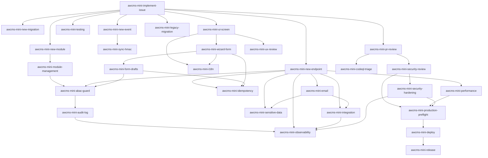

# AWCMS-Mini Project Skills

Skill Claude Code tingkat-proyek untuk AWCMS-Mini. Setiap skill meng-encode standar dari `docs/awcms-mini/` sehingga coding agent menerapkannya secara konsisten. Skill dipanggil otomatis oleh model saat relevan, atau manual via `/<nama-skill>`.

> Baca [`../../AGENTS.md`](../../AGENTS.md) lebih dulu untuk aturan wajib & alur kerja.

## Katalog

| Skill                                                  | Kapan dipakai                                                                    | Sumber docs                 |
| ------------------------------------------------------ | -------------------------------------------------------------------------------- | --------------------------- |
| `awcms-mini-implement-issue`                           | Orkestrator: kerjakan satu issue/sprint atomic end-to-end                        | 06, 11, 12                  |
| `awcms-mini-new-module`                                | Scaffold modul baru di `src/modules/`                                            | 10, 11                      |
| `awcms-mini-module-management`                         | Kelola/konsumsi sistem Module Management (registry, lifecycle, settings, health) | module-management/README.md |
| `awcms-mini-new-migration`                             | Buat/ubah migration SQL (tabel, index, RLS)                                      | 04, 10                      |
| `awcms-mini-new-endpoint`                              | Tambah/ubah endpoint REST + OpenAPI                                              | 05, 10                      |
| `awcms-mini-new-event`                                 | Tambah/ubah domain event + AsyncAPI                                              | 05                          |
| `awcms-mini-idempotency`                               | Mutation high-risk anti double-submit                                            | 10                          |
| `awcms-mini-abac-guard`                                | Kontrol akses default-deny + RLS                                                 | 03, 10                      |
| `awcms-mini-audit-log`                                 | Audit aksi high-risk + redaction                                                 | 03, 10                      |
| `awcms-mini-observability`                             | Correlation ID otomatis, retensi/purge audit log, extension point log/audit      | 10, 16, 20                  |
| `awcms-mini-new-migration` + `awcms-mini-new-endpoint` | Soft delete/restore/purge resource deletable                                     | 04, 05, 10, 16              |
| `awcms-mini-sensitive-data`                            | Normalize/hash/mask identifier sensitif                                          | 04                          |
| `awcms-mini-sync-hmac`                                 | Sync push/pull bertanda HMAC + anti-replay                                       | 08, 10                      |
| `awcms-mini-security-review`                           | Review keamanan modul                                                            | 12, 13                      |
| `awcms-mini-codeql-triage`                             | Triase & perbaiki temuan CodeQL code scanning (termasuk katalog false-positive)  | 20                          |
| `awcms-mini-pr-review`                                 | Review pull request terhadap DoD                                                 | 09, 10, 12                  |
| `awcms-mini-testing`                                   | Tulis test berlapis (unit→security)                                              | 07                          |
| `awcms-mini-production-preflight`                      | Preflight & go-live readiness                                                    | 07, 12                      |
| `awcms-mini-deploy`                                    | Pilih & jalankan profil deployment (LAN-first vs registry/Coolify)               | 18, deploy-coolify.md       |
| `awcms-mini-ui-screen`                                 | Implementasi layar/komponen UI sesuai design system                              | 14, 15                      |
| `awcms-mini-wizard-form`                               | Form multi-step (reusable wizard pattern)                                        | wizard-form-pattern.md      |
| `awcms-mini-form-drafts`                               | Server-side draft persistence (resume lintas sesi/perangkat)                     | form-drafts/README.md       |
| `awcms-mini-email`                                     | Kirim email transaksional (provider-neutral, template management, outbox)        | email/README.md             |
| `awcms-mini-i18n`                                      | String UI `.po` gettext & konten multi-bahasa                                    | 14, 04, 19                  |
| `awcms-mini-release`                                   | Rilis versi via Changesets (bump, CHANGELOG, tag)                                | 09                          |
| `awcms-mini-legacy-migration`                          | Migrasi data legacy aman (dry-run, backfill)                                     | 07, 06                      |

## Katalog peningkatan (improvement/hardening)

Skill di bawah bersifat **peningkatan** — menilai & menaikkan mutu artefak yang sudah ada, bukan membangunnya dari nol. Pakai setelah fitur jalan, saat audit, atau menjelang go-live.

| Skill                           | Kapan dipakai                                                           | Sumber docs |
| ------------------------------- | ----------------------------------------------------------------------- | ----------- |
| `awcms-mini-ux-review`          | Audit & naikkan mutu UI/UX yang sudah ada (usability, a11y AA, i18n)    | 14, 15, 19  |
| `awcms-mini-performance`        | Tuning performa aplikasi & database (query, index, pagination, pool)    | 16, 07      |
| `awcms-mini-integration`        | Kerasan backend & integrasi eksternal (outbox, retry, webhook, kontrak) | 16, 05, 10  |
| `awcms-mini-security-hardening` | Audit keamanan berbasis standar (OWASP Top 10, ASVS, ISO 27001)         | 20, 10, 13  |

## Katalog maintenance/tooling

Skill di bawah bukan build fitur maupun audit — murni menjaga artefak
mekanis (docs snapshot, dsb.) tetap sinkron dengan state eksternal.

| Skill                        | Kapan dipakai                                                                                    | Sumber docs      |
| ---------------------------- | ------------------------------------------------------------------------------------------------ | ---------------- |
| `awcms-mini-github-snapshot` | Refresh `docs/awcms-mini/github/` setelah issue/label/milestone/security alert berubah di GitHub | github/README.md |

## Peta pemakaian

## Subagents (`.claude/agents/`)

Selain skill, tersedia **subagent** untuk delegasi kerja penuh:

| Agent                         | Peran                                               | Tools     |
| ----------------------------- | --------------------------------------------------- | --------- |
| `awcms-mini-coder`            | Implementasi issue end-to-end (Prompt Induk doc 12) | Semua     |
| `awcms-mini-reviewer`         | Review PR/diff terhadap DoD (read-only)             | Read-only |
| `awcms-mini-security-auditor` | Audit keamanan modul, verdict go-live (read-only)   | Read-only |

Pola pakai: `awcms-mini-coder` mengerjakan issue → `awcms-mini-reviewer` mereview → modul sensitif diaudit `awcms-mini-security-auditor`.

## Konvensi

- Nama skill: `awcms-mini-<area>`; folder `<nama>/SKILL.md`.
- Frontmatter `description` memuat pemicu (kapan dipakai) agar model memilih dengan tepat.
- Skill merujuk ke `docs/awcms-mini/*` sebagai sumber kebenaran, bukan menduplikasi seluruh isinya.
