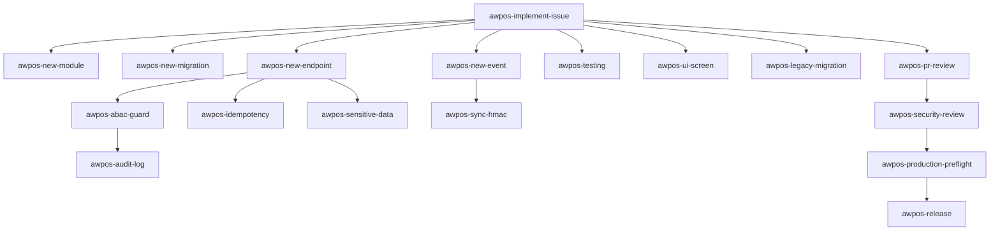

# AWPOS Project Skills

Skill Claude Code tingkat-proyek untuk AWPOS. Setiap skill meng-encode standar dari `docs/awpos/` sehingga coding agent menerapkannya secara konsisten. Skill dipanggil otomatis oleh model saat relevan, atau manual via `/<nama-skill>`.

> Baca [`../../AGENTS.md`](../../AGENTS.md) lebih dulu untuk aturan wajib & alur kerja.

## Katalog

| Skill                        | Kapan dipakai                                             | Sumber docs |
| ---------------------------- | --------------------------------------------------------- | ----------- |
| `awpos-implement-issue`      | Orkestrator: kerjakan satu issue/sprint atomic end-to-end | 06, 11, 12  |
| `awpos-new-module`           | Scaffold modul baru di `src/modules/`                     | 10, 11      |
| `awpos-new-migration`        | Buat/ubah migration SQL (tabel, index, RLS)               | 04, 10      |
| `awpos-new-endpoint`         | Tambah/ubah endpoint REST + OpenAPI                       | 05, 10      |
| `awpos-new-event`            | Tambah/ubah domain event + AsyncAPI                       | 05          |
| `awpos-idempotency`          | Mutation high-risk anti double-submit                     | 10          |
| `awpos-abac-guard`           | Kontrol akses default-deny + RLS                          | 03, 10      |
| `awpos-audit-log`            | Audit aksi high-risk + redaction                          | 03, 10      |
| `awpos-sensitive-data`       | Normalize/hash/mask identifier sensitif                   | 04          |
| `awpos-sync-hmac`            | Sync push/pull bertanda HMAC + anti-replay                | 08, 10      |
| `awpos-security-review`      | Review keamanan modul                                     | 12, 13      |
| `awpos-pr-review`            | Review pull request terhadap DoD                          | 09, 10, 12  |
| `awpos-testing`              | Tulis test berlapis (unit→security)                       | 07          |
| `awpos-production-preflight` | Preflight & go-live readiness                             | 07, 12      |
| `awpos-ui-screen`            | Implementasi layar/komponen UI sesuai design system       | 14, 15      |
| `awpos-release`              | Rilis versi via Changesets (bump, CHANGELOG, tag)         | 09          |
| `awpos-legacy-migration`     | Migrasi data legacy aman (dry-run, backfill)              | 07, 06      |

## Peta pemakaian

## Subagents (`.claude/agents/`)

Selain skill, tersedia **subagent** untuk delegasi kerja penuh:

| Agent                    | Peran                                               | Tools     |
| ------------------------ | --------------------------------------------------- | --------- |
| `awpos-coder`            | Implementasi issue end-to-end (Prompt Induk doc 12) | Semua     |
| `awpos-reviewer`         | Review PR/diff terhadap DoD (read-only)             | Read-only |
| `awpos-security-auditor` | Audit keamanan modul, verdict go-live (read-only)   | Read-only |

Pola pakai: `awpos-coder` mengerjakan issue → `awpos-reviewer` mereview → modul sensitif diaudit `awpos-security-auditor`.

## Konvensi

- Nama skill: `awpos-<area>`; folder `<nama>/SKILL.md`.
- Frontmatter `description` memuat pemicu (kapan dipakai) agar model memilih dengan tepat.
- Skill merujuk ke `docs/awpos/*` sebagai sumber kebenaran, bukan menduplikasi seluruh isinya.
