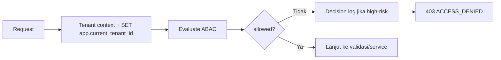

# AWCMS-Mini — ABAC Guard & Tenant Isolation

Ikuti `docs/awcms-mini/03_srs_detail_per_modul.md`, `docs/awcms-mini/10_template_kode_coding_standard.md`, dan **`docs/awcms-mini/17_default_seed_rbac_abac.md`** (matriks role→permission & default ABAC policy). Mekanisme RLS/tenant context konkret: `docs/awcms-mini/16_backend_data_access_integration.md`.

## Prinsip

1. **Default deny** — tidak ada policy yang mengizinkan = tolak.
2. **Deny overrides allow** — satu deny mengalahkan semua allow.
3. **RLS tetap wajib** walau ABAC sudah cek (defense in depth).
4. Akses ditolak yang high-risk → catat di decision log.
5. UI hiding **bukan** kontrol utama; backend tetap validasi.
6. Archive/restore/purge soft delete default deny sampai permission eksplisit tersedia.

## Bentuk request/decision

```ts
type AccessRequest = {
  moduleKey: string;
  activityCode: string;
  action:
    | "read"
    | "create"
    | "update"
    | "delete"
    | "post"
    | "cancel"
    | "approve"
    | "export"
    | "send"
    | "configure"
    | "analyze"
    | "assign"
    | "restore"
    | "purge"
    | "retry"
    | "sync"
    | "enable"
    | "disable"
    | "check";
  resourceType?: string;
  resourceId?: string;
  resourceAttributes?: Record<string, unknown>;
  environmentAttributes?: Record<string, unknown>;
};
type AccessDecision = {
  allowed: boolean;
  reason: string;
  decisionId?: string;
  matchedPolicy?: string;
};
```

## Prosedur



## Aturan implementasi

- Set tenant context di **awal** transaction: `SET app.current_tenant_id = ...`.
- Query tenant-scoped **wajib** filter `tenant_id` (jangan hanya andalkan RLS).
- Query resource soft-deletable default `deleted_at IS NULL`; `includeDeleted`, `restore`, dan `purge` wajib ABAC eksplisit.
- Contoh batas peran: operator ditolak akses pajak/export/assign role; cross-tenant selalu blocked.
- `tenantUserId`/`identityId` berasal dari auth middleware, **bukan** header public mentah.

## Verifikasi (test)

- default deny; deny overrides allow; cashier limit; tax officer access; cross-tenant blocked; archive/restore denied tanpa permission; decision log tercatat.
