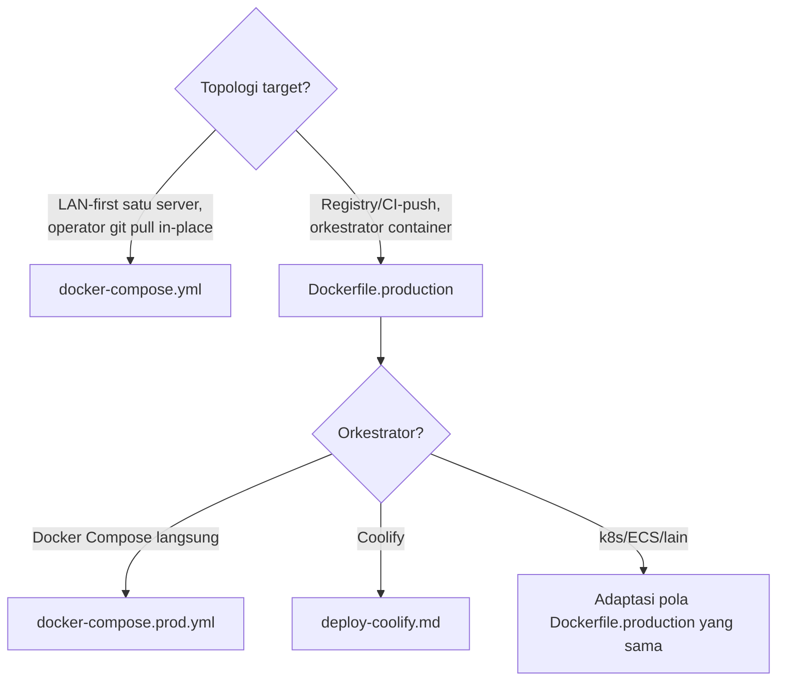

# AWCMS-Mini — Deployment Profile & Execution

Ikuti `docs/awcms-mini/deployment-profiles.md` (peta profil ke berkas
`deploy/*`) dan `docs/awcms-mini/deploy-coolify.md` (khusus Coolify).

## Pilih jalur



`docker-compose.yml` tetap jalur yang **direkomendasikan** untuk
LAN-first/offline satu server — jangan beralih ke `Dockerfile.production`
kecuali orkestrator memang mengharapkan image siap-pakai (build-saat-startup
tidak diinginkan). Untuk registry-based via Compose (bukan Coolify/k8s),
pakai `docker-compose.prod.yml` (Issue #682) — standalone, bukan override
`docker-compose.yml`.

**Container hardening (Issue #682, berlaku di kedua compose file)**:
`db`/`pgbouncer` tidak publish port host secara default (salin
`docker-compose.override.yml.example` untuk akses lokal opsional);
`cap_drop: [ALL]` di semua service (`db` dapat `cap_add` minimal untuk
entrypoint-nya sendiri); image Bun/Postgres/PgBouncer dipin ke versi
eksplisit, bukan tag mengambang; healthcheck di `db`/`app` (`migrate`
one-shot dan `pgbouncer` opsional sengaja tanpa healthcheck — lihat
komentar masing-masing service);
`docker-compose.prod.yml`'s `app` jalan `read_only: true` (image
registry-based tidak pernah menulis ke filesystem-nya sendiri saat
runtime). PgBouncer's `deploy/pgbouncer/pgbouncer.ini.example` memakai
`auth_type = scram-sha-256` (bukan `md5`) — lihat berkas itu untuk
perintah generate `userlist.txt` dari `pg_authid`. CI
(`.github/workflows/ci.yml`) menjalankan `docker compose config -q` untuk
kedua compose file di setiap PR — jangan biarkan salah satu file punya
syntax error/env var yang tidak resolve sampai lolos ke deploy.

## Command inti (semua profil)

```bash
bun run config:validate      # wajib pertama — konfigurasi valid sebelum apa pun
bun run db:migrate           # migrasi sebagai role privileged, sebelum container app pertama
bun run production:preflight # orkestrasi migrate -> api:spec:check -> test -> build -> db:pool:health -> security:readiness
```

## Checklist per topologi

**LAN-first (`docker-compose.yml`)**: `export APP_UID=$(id -u) APP_GID=$(id -g)`
sebelum `docker compose up --build` (wajib — tanpanya container jadi root
dan menulis `node_modules/`/`dist/` sebagai root di bind mount host);
health check `curl http://localhost:4321/api/v1/health`.

**Registry-based/Coolify (`Dockerfile.production`)**: migration one-shot
**terpisah** (image tidak menjalankannya — role runtime least-privilege
tidak punya hak DDL); role app selalu `awcms_mini_app` atau setara, tidak
pernah superuser; database tidak perlu public port bila app+DB satu
internal network; secret selalu via env var/orkestrator, tidak pernah
dibakar ke image (`.dockerignore` mengecualikan `.env`).

**Multi-aplikasi dalam satu VPS/Coolify**: setiap aplikasi wajib
domain/secret/database (atau minimal schema+role) terpisah — jangan reuse
`AUTH_JWT_SECRET`/HMAC/kredensial R2 antar aplikasi; lihat
`deploy-coolify.md` §Opsi PostgreSQL untuk perbandingan satu cluster vs
satu container per aplikasi vs managed database eksternal.

## Model dua-peran basis data (wajib di semua profil)

Migrasi = role privileged (DDL/GRANT). Runtime app = `awcms_mini_app`
least-privilege, `FORCE ROW LEVEL SECURITY` ditegakkan untuknya. Jangan
pernah menjalankan aplikasi sebagai superuser/owner — `bun run
security:readiness` memblokir go-live bila terdeteksi.

## Rollback

Image immutable (Pola registry) → redeploy tag sebelumnya. **Migration
caution**: rollback image tidak membatalkan migrasi skema yang sudah
diterapkan — uji migrasi backward-compatible (expand-first) sebelum
deploy, atau siapkan restore dari backup (`deploy/backup/restore-postgres.sh`)
sebagai jalur rollback skema.

## Output

Laporan: profil dipilih + alasan, checklist yang terpenuhi, health check
hasil, dan (bila registry-based) rencana rollback singkat.
