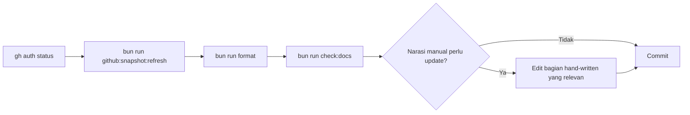

# AWCMS-Mini — GitHub Snapshot Refresh

Ikuti `docs/awcms-mini/github/README.md`. Snapshot ini adalah salinan
faktual state GitHub (issue, label, milestone, security alert) — bukan
backlog rencana (itu tetap `docs/awcms-mini/06_github_issues_detail.md`).

## Sebelum refresh: cek issue yang PR-nya sudah merge tapi belum ke-close

**Recurring, sudah terjadi dua kali** (epic `blog_content` #537-#540;
epic online public tenant routing #556-#560): PR di repo ini kadang tidak
menyertakan kata kunci `Closes #NNN` di body-nya, jadi merge PR **tidak**
otomatis menutup issue terkait — issue-nya tertinggal `open` di GitHub
walau kodenya sudah live di `main`. `gh issue list --state open` saja
**tidak cukup** untuk tahu backlog nyata (lihat memori
`pr-body-missing-closes-keyword`). Sebelum menjalankan refresh:

```bash
gh issue list --state open --limit 50 --json number,title
gh pr list --state merged --limit 30 --json number,title,mergedAt
```

Cocokkan tiap issue open dengan judul PR yang menyebut nomor issue itu
(pola judul di repo ini: `... (Issue #NNN)`). Untuk setiap match yang
PR-nya sudah `mergedAt` terisi, tutup issue-nya manual dengan komentar
yang menyebut PR penutupnya, baru lanjut ke command refresh di bawah —
jangan biarkan refresh berjalan dengan open-issue count yang sebenarnya
sudah salah.

## Command

```bash
gh auth status
bun run github:snapshot:refresh   # default repo ahliweb/awcms-mini
```

`scripts/github-snapshot-refresh.ts` (Issue #464) meregenerasi bagian
mekanis lewat `gh` CLI (tidak pernah membaca/menyimpan token sendiri):

- **Tabel metadata** (snapshot timestamp, jumlah issue/label/milestone,
  latest CodeQL run, alert count) di `README.md`, `issues-open-001.md`,
  `issues-closed-001.md`, `labels-milestones.md`, `security.md` —
  diganti utuh per baris.
- **Dua tabel daftar issue yang tumbuh** (open issues; closed issues
  pasca-doc06, `>= #433`) diregenerasi penuh di antara marker
  `<!-- github-snapshot:NAME:start/end -->`.

## Yang TIDAK disentuh script (tetap manual)

- Narasi hand-written (bagian "### ... completed" di `README.md`).
- Tabel historis 38-issue doc06 asli di `issues-closed-001.md`.
- Tabel klasifikasi detail label/milestone di `labels-milestones.md`.
- Tabel "Ringkasan state saat snapshot" di `README.md` (kolom Catatan
  prose-heavy) — perbarui manual bila OPEN/CLOSED count berubah.

Tinjau bagian-bagian ini manual setelah menjalankan script bila ada
issue/label/milestone baru yang butuh konteks naratif.

**Catatan (Issue #475):** bila CodeQL run terbaru untuk `main` masih
`in_progress`/`queued` (mis. baru saja push/merge), baris "Latest CodeQL
run" di `security.md` **sengaja tidak diperbarui** — script mencetak
peringatan di console dan membiarkan nilai lama, bukan menebak status
run yang belum selesai sebagai `Failure`. Jalankan ulang script beberapa
menit kemudian bila baris itu perlu nilai terbaru.

## Alur



## Output

Ringkasan: file yang diperbarui, angka open/closed/label/milestone baru,
dan daftar bagian manual yang perlu ditinjau (bila ada issue/label baru
sejak snapshot terakhir).
