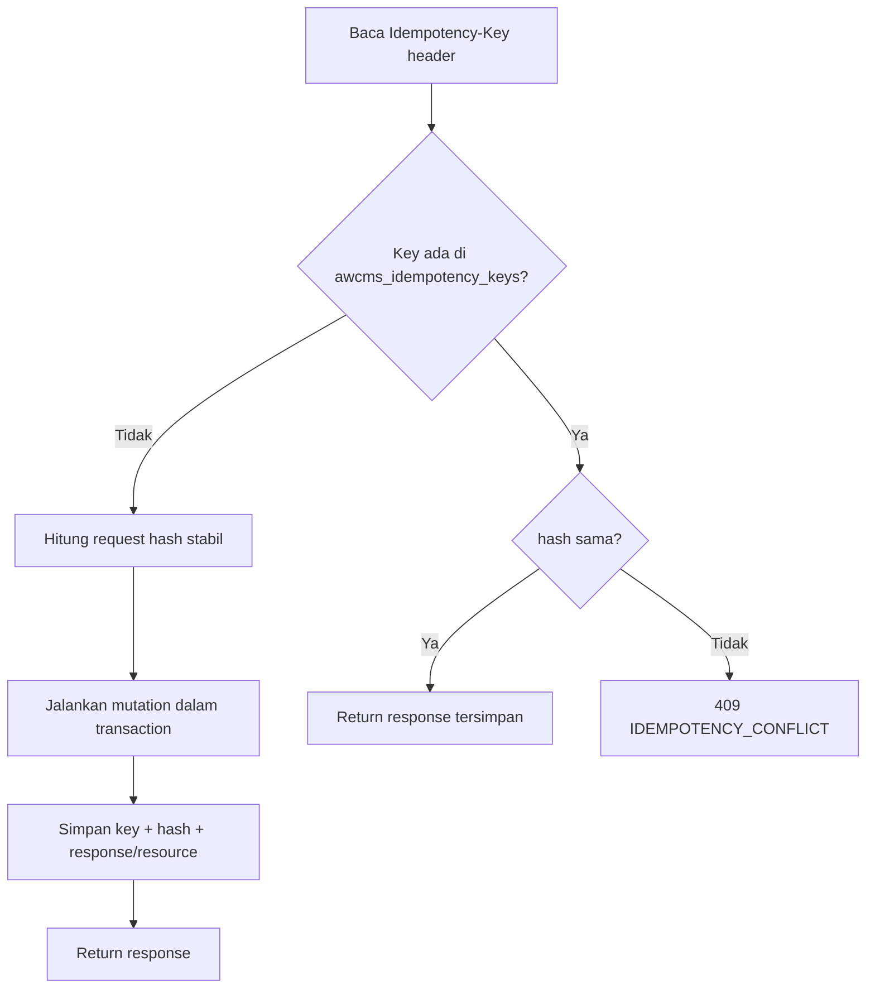

# AWCMS-Mini — Idempotent High-Risk Mutation

Ikuti `docs/awcms-mini/10_template_kode_coding_standard.md`.

## Alur

## Aturan

1. Header `Idempotency-Key` **wajib**; jika kosong → `400 IDEMPOTENCY_REQUIRED`.
2. Request hash stabil dari body ternormalisasi (urutan field konsisten).
3. Key sama + hash sama → replay response tersimpan (aman).
4. Key sama + hash beda → `409 IDEMPOTENCY_CONFLICT`.
5. Simpan status/resource hasil mutation di `awcms_idempotency_keys`.
6. Kombinasikan dengan row lock (`SELECT ... FOR UPDATE`) & transaction wrapper (`withTenant`). Helper tersedia: `_shared/idempotency.ts` + `lib/database/idempotency-store.ts`.
7. Deadlock retry harus aman karena idempotency.
8. Retention key: 7–30 hari.

## Endpoint wajib idempotency

Base: `setup/initialize`, `profiles/resolve|links|merge-requests`, `access/assignments`, `workflow/tasks/{id}/decision`, `sync/push`. Aplikasi domain menambah daftarnya (mis. AWPOS: posting, cancel/return, transfer, VAT/Coretax, receipt send).

## Verifikasi (test)

- Same key + same request → satu resource, response konsisten.
- Same key + different request → `409`.
- Double submit paralel → tidak dobel.
- Rollback saat error → tidak ada partial state.
