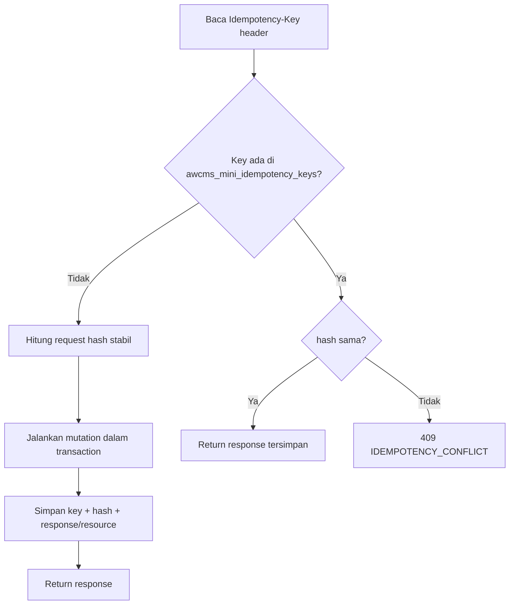

# AWCMS-Mini — Idempotent High-Risk Mutation

Ikuti `docs/awcms-mini/10_template_kode_coding_standard.md`.

## Alur

## Aturan

1. Header `Idempotency-Key` **wajib**; jika kosong → `400 IDEMPOTENCY_REQUIRED`.
2. Request hash stabil dari body ternormalisasi (urutan field konsisten).
3. Key sama + hash sama → replay response tersimpan (aman).
4. Key sama + hash beda → `409 IDEMPOTENCY_CONFLICT`.
5. Simpan status/resource hasil mutation di `awcms_mini_idempotency_keys`.
6. Kombinasikan dengan stock lock (`SELECT ... FOR UPDATE`) & transaction wrapper.
7. Deadlock retry harus aman karena idempotency.
8. Retention key: 7–30 hari.

## Endpoint wajib idempotency

POS posting, cancel/return, `profiles/resolve|links|merge-requests`, warehouse transfer approve/ship/receive, cycle-count, stock-adjustment, VAT invoice generate, Coretax batch, receipt send, sync push, workflow decision, blog post lifecycle actions (`blog_post_publish`/`_schedule`/`_archive`/`_restore`/`_purge`, `blog_revision_restore` — Issue #538/#541), `POST /api/v1/email/announcements` (Issue #497). Daftar ini tumbuh per modul baru — cek skill modul terkait (mis. `awcms-mini-blog-content`, `awcms-mini-email`) untuk endpoint idempotency-gated terbaru, jangan asumsikan daftar di atas lengkap.

## Verifikasi (test)

- Same key + same request → satu resource, response konsisten.
- Same key + different request → `409`.
- Double submit paralel → tidak dobel.
- Rollback saat error → tidak ada partial state.
- Double submit paralel dengan Idempotency-Key **sama persis** (retry jaringan client) → satu pemenang (200), satu `409 IDEMPOTENCY_CONFLICT` bersih (bukan raw constraint error/500). Ditegakkan sekali di helper bersama, bukan per-endpoint: `saveIdempotencyRecord` (`src/modules/_shared/idempotency.ts`) `INSERT ... ON CONFLICT DO NOTHING RETURNING id`, lempar `IdempotencyRaceLostError` kalau kalah; `withTenant` (`src/lib/database/tenant-context.ts`) menangkapnya, rollback, dan translate ke 409 — otomatis berlaku untuk semua konsumen tabel `awcms_mini_idempotency_keys` tanpa ubah route masing-masing. Contoh test: `tests/integration/tenant-domain-api.integration.test.ts`'s "set-primary under concurrent SAME Idempotency-Key" (memverifikasi tepat satu audit event + tepat satu row idempotency key tersimpan).
