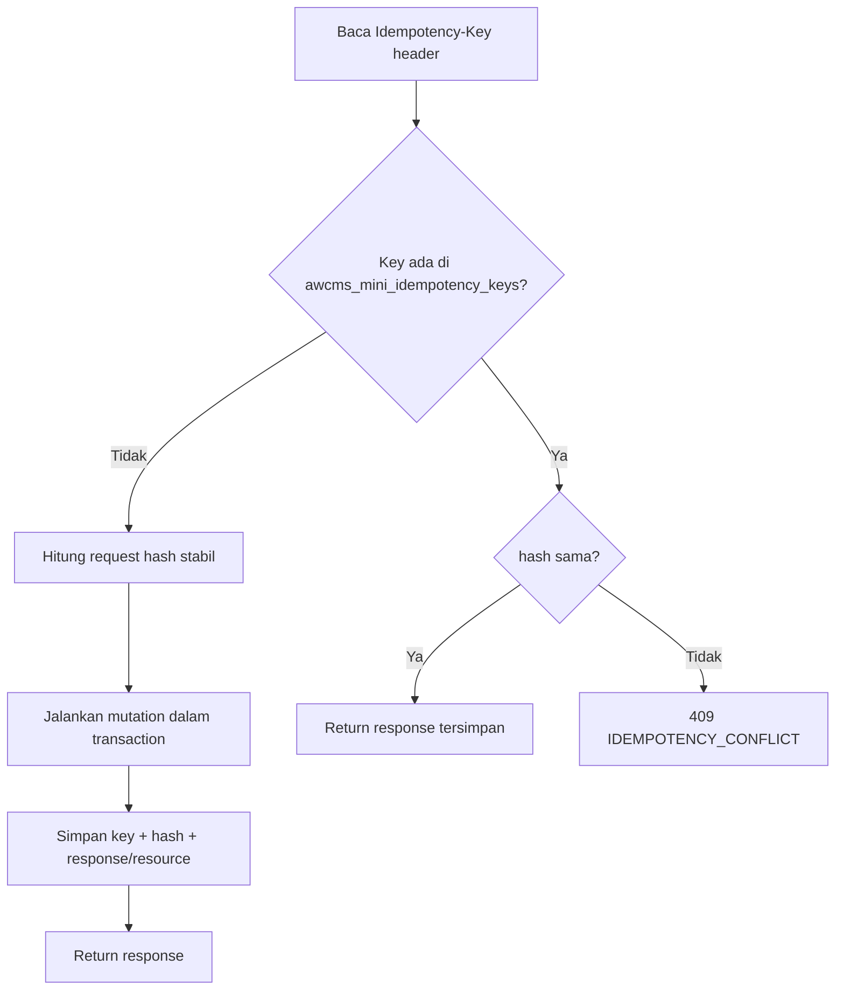

# AWCMS-Mini — Idempotent High-Risk Mutation

Ikuti `docs/awcms-mini/10_template_kode_coding_standard.md`.

## Alur



## Aturan

1. Header `Idempotency-Key` **wajib**; jika kosong → `400 IDEMPOTENCY_REQUIRED`.
2. Request hash stabil dari body ternormalisasi (urutan field konsisten).
3. Key sama + hash sama → replay response tersimpan (aman).
4. Key sama + hash beda → `409 IDEMPOTENCY_CONFLICT`.
5. Simpan status/resource hasil mutation di `awcms_mini_idempotency_keys`.
6. Kombinasikan dengan stock lock (`SELECT ... FOR UPDATE`) & transaction wrapper.
7. Deadlock retry harus aman karena idempotency.
8. Retention key: 7–30 hari.
9. **Hash WAJIB terikat ke identitas resource** — lihat §"Bind hash ke resource id" di bawah, ini bukan opsional dan sudah menyebabkan bug nyata berulang kali.

## CRITICAL — bind request hash ke resource id (Issue #750, #795 — recurring 4x)

`computeRequestHash(payload: unknown)` (`src/modules/_shared/idempotency.ts:36`) **tidak menegakkan apa pun sendiri** — ia cuma SHA-256 dari JSON body yang key-nya sudah diurutkan. Ia TIDAK tahu resource mana yang sedang dimutasi. Store key di `awcms_mini_idempotency_keys` adalah `(tenant_id, request_scope, idempotency_key)`, dan `request_scope` itu **dibagi rata di seluruh resource bertipe sama dalam satu tenant** (bukan per-resource) — jadi kalau `computeRequestHash` hanya di-hash dari `body` mentah (atau body kosong `{}` untuk endpoint `restore`/`cancel`/`commit` yang tidak punya field lain), maka `Idempotency-Key` yang sama dipakai ulang klien untuk DUA resource berbeda dengan tipe endpoint sama akan mereplay respons resource pertama untuk request yang seharusnya memutasi resource kedua — **silent no-op yang terlihat seperti sukses (200 dengan body resource A), padahal resource B tidak pernah termutasi.**

Bug class ini muncul 4 kali di repo ini: Issue #750 (reference-data, PR #783, 3 ronde perbaikan), lalu Issue #795 menemukan pola yang sama BELUM diperbaiki di modul lain (document-infrastructure PR #798, business-scope/organization-structure PR #801, identity-access/data-lifecycle/reports PR lain) lewat `grep -rn "computeRequestHash(" src/pages/api/` menyeluruh — audit pertama yang hanya menyasar endpoint yang "kelihatan jelas" (body kosong) melewatkan endpoint `PATCH`/action lain yang body-nya ADA tapi tidak menyertakan `id` dari path param.

### Pola BENAR

Selalu sertakan identitas resource (biasanya `id`/`[key]`/`relationId` dari path param) DAN literal `action` string eksplisit di payload yang di-hash — jangan hash `body` mentah begitu saja, dan jangan hash `{}` untuk endpoint yang path-nya sudah membawa id:

```ts
// src/pages/api/v1/tenant/domains/[id]/set-primary.ts:68 — body kosong, id dari path
const requestHash = computeRequestHash({ domainId, action: "set_primary" });

// src/pages/api/v1/data-lifecycle/legal-holds/[id]/release.ts:69-73 — body ADA tapi
// tidak membawa id sendiri, jadi id dari path harus ditambahkan manual
const requestHash = computeRequestHash({
  ...body,
  id: holdId,
  action: "release"
});
```

Aturan praktis: kalau endpoint punya path param `[id]`/`[key]`/`[relationId]`, path param itu **wajib** masuk ke object yang di-hash (spread body dulu lalu override/tambahkan `id`, supaya field `id` di body — kalau ada — tidak diam-diam menang). `action` literal wajib ada supaya dua endpoint berbeda pada resource yang sama (mis. `restore` vs `delete`) tidak collide walau kebetulan body-nya identik (`{}`).

### Checklist verifikasi sebelum PR

- Grep **seluruh tree yang di-assign**, bukan cuma daftar endpoint yang "kelihatan mencurigakan": `grep -rn "computeRequestHash(" src/pages/api/v1/<module>/`. Jangan percaya daftar endpoint bernama sebagai lengkap — Issue #795 sendiri butuh re-grep independen karena pass pertama hanya menyasar 7 dari 11 endpoint yang rentan.
- Untuk tiap hit: apakah payload yang di-hash sudah menyertakan resource id dari path DAN literal `action`? Endpoint create murni (tidak ada resource pra-eksisting untuk diikat, mis. `POST /documents`) TIDAK rentan — tidak perlu `id`.
- Endpoint index-level yang mengidentifikasi resource lewat kombinasi field yang SUDAH ada di body mentah (mis. `scopeType`+`scopeId`+`sequenceKey` pada `sequences/revise`) tidak perlu perubahan — tapi verifikasi ini secara eksplisit per endpoint, jangan asumsikan.
- Test adversarial: dua resource berbeda, `Idempotency-Key` yang SAMA dipakai ulang pada keduanya secara berurutan → request kedua harus benar-benar memutasi resource kedua (bukan replay respons resource pertama). Contoh nyata: `tests/integration/document-infrastructure.integration.test.ts`.

Lihat `src/modules/document-infrastructure/README.md` §"Catatan idempotency-key resource binding" untuk worked example lengkap lintas 11 endpoint satu modul.

## Endpoint wajib idempotency

POS posting, cancel/return, `profiles/resolve|links|merge-requests`, warehouse transfer approve/ship/receive, cycle-count, stock-adjustment, VAT invoice generate, Coretax batch, receipt send, sync push, workflow decision, blog post lifecycle actions (`blog_post_publish`/`_schedule`/`_archive`/`_restore`/`_purge`, `blog_revision_restore` — Issue #538/#541), `POST /api/v1/email/announcements` (Issue #497). Daftar ini tumbuh per modul baru — cek skill modul terkait (mis. `awcms-mini-blog-content`, `awcms-mini-email`) untuk endpoint idempotency-gated terbaru, jangan asumsikan daftar di atas lengkap.

## Verifikasi (test)

- Same key + same request → satu resource, response konsisten.
- Same key + different request → `409`.
- Double submit paralel → tidak dobel.
- Rollback saat error → tidak ada partial state.
- Double submit paralel dengan Idempotency-Key **sama persis + payload sama** (retry jaringan client) → **kedua** request 200 dengan response identik (replay), bukan salah satunya 409 — aturan 3 di atas ("hash sama → replay") tetap tegak walau kalah race. Double submit paralel dengan key sama tapi **payload beda** → satu pemenang (200), satu `409 IDEMPOTENCY_CONFLICT` bersih (bukan raw constraint error/500), sesuai aturan 4. Ditegakkan sekali di helper bersama, bukan per-endpoint: `saveIdempotencyRecord` (`src/modules/_shared/idempotency.ts`) `INSERT ... ON CONFLICT DO NOTHING RETURNING id`; kalau kalah, `SELECT` ulang row pemenang (dijamin sudah committed — `ON CONFLICT` hanya trigger melawan row yang sudah commit) dan bandingkan `request_hash`-nya dengan punya kita sebelum melempar `IdempotencyRaceLostError` (bawa `replay` kalau hash sama, `null` kalau beda). `withTenant` (`src/lib/database/tenant-context.ts`) menangkapnya di satu titik, rollback transaksi loser, log `idempotency.race_lost` (key di-hash SHA-256, bukan raw — doc 10 masking), lalu replay response pemenang atau 409 — otomatis berlaku untuk semua konsumen tabel `awcms_mini_idempotency_keys` tanpa ubah route masing-masing. Contoh test: `tests/integration/tenant-domain-api.integration.test.ts`'s "set-primary under concurrent SAME Idempotency-Key + SAME payload" (replay, tepat satu audit event + satu row idempotency key) dan "verify under concurrent SAME Idempotency-Key + DIFFERENT payload" (409 bersih, domain berbeda dipakai justru untuk menghindari race index primary-dedup `set-primary` sendiri yang tidak terkait).
