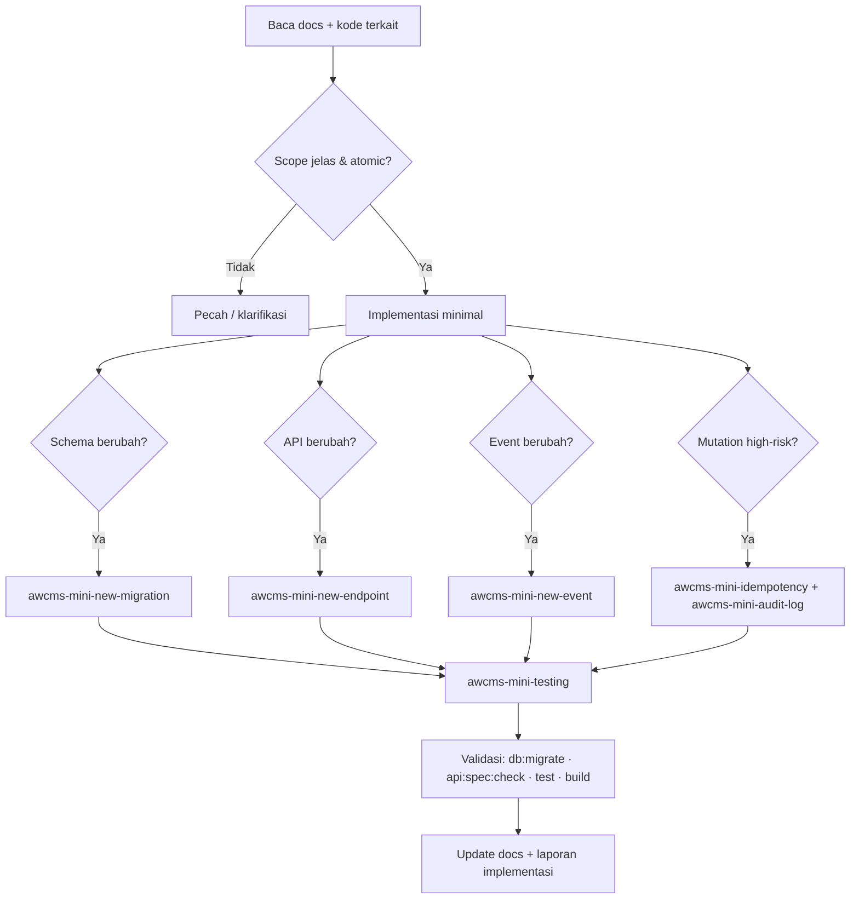

# AWCMS-Mini — Implement Issue / Sprint (Atomic)

Skill orkestrator untuk mengeksekusi satu unit kerja AWCMS-Mini end-to-end sesuai kontrak di `AGENTS.md` dan `docs/awcms-mini/12_generator_prompt.md`.

## Prasyarat baca (WAJIB sebelum edit)

1. `AGENTS.md` — aturan wajib & guardrail.
2. `docs/awcms-mini/06_github_issues_detail.md` — detail issue.
3. `docs/awcms-mini/11_implementation_blueprint.md` — folder/file target sprint.
4. Modul, SQL, OpenAPI, AsyncAPI, dan docs yang terkait scope.

## Prosedur


```mermaid
flowchart TD
  A[Baca docs + kode terkait] --> B{Scope jelas & atomic?}
  B -- Tidak --> C[Pecah / klarifikasi]
  B -- Ya --> D[Implementasi minimal]
  D --> E{Schema berubah?} -->|Ya| M[awcms-mini-new-migration]
  D --> F{API berubah?} -->|Ya| P[awcms-mini-new-endpoint]
  D --> G{Event berubah?} -->|Ya| V[awcms-mini-new-event]
  D --> H{Mutation high-risk?} -->|Ya| I[awcms-mini-idempotency + awcms-mini-audit-log]
  M & P & V & I --> T[awcms-mini-testing]
  T --> Q[Validasi: db:migrate · api:spec:check · test · build]
  Q --> R[Update docs + laporan implementasi]
```

## Aturan atomic

- Kerjakan hanya scope issue; **jangan** sentuh file unrelated.
- Data tenant-scoped: tenant context + `awcms-mini-abac-guard` + RLS.
- Data sensitif: `awcms-mini-sensitive-data`.
- High-risk action: `awcms-mini-audit-log`; high-risk mutation: `awcms-mini-idempotency`.
- Resource deletable: soft delete + restore/purge policy; jangan hapus posted/append-only entity.
- Provider eksternal lewat outbox/queue, **tidak** di dalam DB transaction.
- Backend/tooling wajib Bun-only. Jangan menambah Node.js/npm/npx/pnpm/yarn atau adapter server Node.js kecuali Bun belum mendukung capability tersebut, maintainer sudah memberi izin eksplisit, dan pengecualian dicatat di docs/audit.

## Validasi wajib

```bash
bun run db:migrate
bun run api:spec:check
bun test
bun run build
```

Sebelum menganggap selesai, jalankan **`bun run check` PENUH** (bukan cuma empat
perintah di atas) di database **terisolasi**, dengan `DATABASE_URL` diset supaya
integration test benar-benar jalan — tanpanya `*.integration.test.ts` cuma
dilewati diam-diam.

### Regenerasi artefak turunan (urut — sering terlupa, dan gate-nya keras)

```bash
bun run repo:inventory:generate
bun run modules:composition:inventory:generate
bun run db:work-class:generate          # setiap route/job baru
bun run saas-contracts:inventory:generate
bun run openapi:bundle && bun run api:docs:generate   # EDIT openapi/modules/*.yaml, JANGAN file bundle
bun run i18n:extract                     # TERAKHIR — line-ref bergeser tiap kali src/ direformat
bun run format
```

### Yang paling sering bikin gate merah di akhir

- **Gate baru harus didaftarkan di `.github/workflows/ci.yml`** sebagai step
  tersendiri, bukan cuma ditambahkan ke script `check` di `package.json`. Ada
  test yang gagal dengan `ci.yml tidak menjalankan langkah check berikut: ...`.
- **Migration baru** → tambahkan ke daftar di `tests/foundation.test.ts` DAN ke
  tabel "Matrix Modul vs Migration" doc 13 (migration lintas-modul masuk baris
  `_(Foundation, lintas-modul)_`, dan hitungan prosanya ikut naik).
- **Job baru (`bun run x:y`)** → descriptor `jobs` di `module.ts` pemiliknya +
  entri `JOB_WORK_CLASS_REGISTRY` + daftar di `tests/module-management-job-registry.test.ts`
  dan `tests/integration/module-job-registry.integration.test.ts`.
- **Changeset**: jalankan `bun run changesets:policy:check` **SETELAH commit** —
  sebelum commit ia tidak melihat file untracked dan lolos palsu.

## Definition of Done

Ikuti checklist DoD di `AGENTS.md`. Tutup dengan **laporan implementasi**:

```text
Summary:
Files changed:
Commands run:
Test results:
Security notes:
Documentation updates:
Remaining limitations:
Next recommended step:
```

## Skill terkait

`awcms-mini-new-module`, `awcms-mini-new-migration`, `awcms-mini-new-endpoint`, `awcms-mini-new-event`, `awcms-mini-idempotency`, `awcms-mini-abac-guard`, `awcms-mini-audit-log`, `awcms-mini-sensitive-data`, `awcms-mini-testing`, `awcms-mini-security-review`, `awcms-mini-pr-review`.
