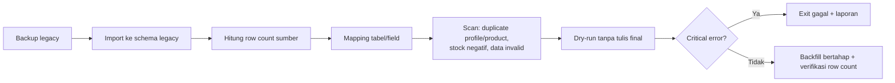

# AWCMS-Mini — Legacy Data Migration

Ikuti `docs/awcms-mini/07_sprint_testing_production_readiness.md` §Legacy migration checklist dan Issue 1.1–1.2 (doc 06 / GitHub #4–#5).

## Alur

## Aturan wajib

1. **Backup legacy dulu**; verifikasi restore sebelum menyentuh data.
2. Import mentah ke schema **`legacy`** terpisah — jangan langsung ke tabel `awcms_mini_*`.
3. Semua run tercatat di `awcms_mini_legacy_migration_runs` (+ mappings, row counts, validation errors, backfill tasks).
4. **Password legacy tidak pernah digunakan ulang** — user diberi reset flow; hash lama tidak diimpor.
5. Identifier (email/phone/NPWP/NIK) dinormalisasi lalu hash+mask via aturan `awcms-mini-sensitive-data`; duplikat di-resolve ke satu profile (bukan buat baru).
6. Dry-run **tidak menulis data final**; critical error → exit code gagal (`legacy:preflight`).
7. Backfill idempotent — bisa diulang tanpa duplikasi; verifikasi row count source vs target per tabel.
8. Stock hasil migrasi masuk sebagai movement `opening_balance` (append-only), bukan update langsung.
9. Data customer asli tidak boleh masuk fixture/test/commit.

## Verifikasi

- `bun run legacy:preflight` pass tanpa critical error.
- Row count source vs target cocok (atau selisih terjelaskan di laporan).
- Duplicate scan & stock negative scan terlampir di laporan run.
- Login user hasil migrasi memaksa reset password.

## Skill terkait

`awcms-mini-new-migration` (schema toolkit), `awcms-mini-sensitive-data`, `awcms-mini-testing`.
