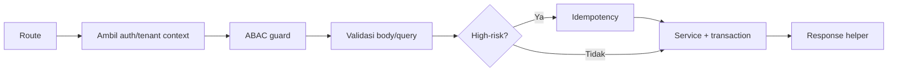

# AWCMS-Mini — New / Changed API Endpoint

Ikuti `docs/awcms-mini/05_openapi_asyncapi_detail.md` dan `docs/awcms-mini/10_template_kode_coding_standard.md`. Integrasi frontend: `docs/awcms-mini/15_frontend_architecture_integration.md`; akses data/RLS: `docs/awcms-mini/16_backend_data_access_integration.md`.

## Urutan handler (route tipis)



## Aturan

1. Route hanya orkestrasi; business logic di service, query di repository.
2. Base path `/api/v1`. Auth wajib kecuali endpoint public eksplisit.
3. Tenant-scoped → wajib header `X-AWCMS-Mini-Tenant-ID` + tenant context + RLS.
   **Rute publik tenant-scoped** (tanpa sesi/header — mis. halaman blog publik, RSS, sitemap) resolve tenant lewat segmen path `tenantCode` (`/<prefix>/{tenantCode}/...`), **bukan** subdomain — lihat ADR-0009 (`docs/adr/0009-public-tenant-scoped-routes.md`) untuk alasan lengkap (subdomain butuh wildcard DNS/TLS, bertentangan dengan topologi LAN-first default). Belum ada implementasi contoh di base ini — Issue #540 (epic #536, `blog_content`) adalah konsumen pertama.
4. Cek akses dengan `awcms-mini-abac-guard` (default deny).
5. Validasi semua input (UUID, enum, length, numeric range, unknown field).
   Baca body lewat `readJsonBody`/`readTextBody`/`readFormBody`
   (`src/lib/security/request-body-limit.ts`, Issue #686) —
   **jangan pernah** panggil `request.json()`/`.text()`/`.formData()`
   langsung, endpoint ini menegakkan batas ukuran body level aplikasi
   (bukan hanya reverse-proxy). Pola drop-in:
   ```ts
   const bodyRead = await readJsonBody<XBody>(
     request /* , "large" bila konten berat */
   );
   if (bodyRead.tooLarge) return bodyTooLargeResponse(bodyRead.limitBytes);
   const validation = validateXInput(bodyRead.value); // sama seperti sebelumnya
   ```
   Tier `default` (128 KiB) untuk mayoritas endpoint; `large` (5 MiB)
   hanya untuk endpoint konten-berat (HTML/rich content, batch sync).
   Jangan menambah tier baru tanpa memperbarui plafon keras
   `BODY_SIZE_HARD_CEILING_BYTES` DAN invariant test-nya
   (`tests/unit/request-body-limit.test.ts`).
6. Mutation high-risk → `awcms-mini-idempotency` (`Idempotency-Key`).
7. Data sensitif keluar lewat mapper (`awcms-mini-sensitive-data`); jangan return row mentah.
8. DELETE resource deletable berarti soft delete; restore/purge butuh ABAC, audit, OpenAPI, dan idempotency bila high-risk.
9. **Update OpenAPI** (`openapi/`) untuk setiap perubahan; jalankan `api:spec:check`.
10. Endpoint publik/mahal (tanpa auth, atau operasi berat) → pertimbangkan rate limiting sumber (`checkRateLimit`, `src/lib/security/rate-limit.ts`, reuse — jangan bikin limiter baru), lihat `awcms-mini-integration`.

## Response helper

Sukses `{ success:true, data, meta }`; error `{ success:false, error:{ code, message, details }, meta }`. Gunakan `ok()` dan `fail()` (`src/modules/_shared/api-response.ts`) — tidak ada helper `created()` terpisah untuk 201; endpoint create yang sudah ada (mis. `POST /api/v1/blog/posts`) memakai `ok()` yang sama dengan implicit 200, jangan asumsikan/panggil `created()`. `meta.correlationId` **otomatis** terisi oleh middleware sejak Issue #447 untuk setiap response JSON `/api/*` — jangan set `correlationId` di dalam `error`, dan jangan wiring manual `meta.correlationId` kecuali butuh nilai eksplisit lebih awal (baca `context.locals.correlationId`, jangan generate UUID baru), lihat `awcms-mini-observability`.

## Error code standar

`VALIDATION_ERROR`(400), `AUTH_REQUIRED`(401), `TOKEN_EXPIRED`(401), `ACCESS_DENIED`(403), `TENANT_REQUIRED`(400), `RESOURCE_NOT_FOUND`(404), `RESOURCE_DELETED`(410), `IDEMPOTENCY_REQUIRED`(400), `IDEMPOTENCY_CONFLICT`(409), `WORKFLOW_APPROVAL_REQUIRED`(409), `STOCK_NOT_AVAILABLE`(409), `SYNC_CONFLICT`(409), `PAYLOAD_TOO_LARGE`(413), `DATABASE_BUSY`(503), `PROVIDER_ERROR`(502), `INTERNAL_ERROR`(500). Jangan expose stack trace.

## Header standar

`Authorization`, `X-AWCMS-Mini-Tenant-ID`, `Idempotency-Key`, `X-Correlation-ID`, `Accept-Language`; sync: `X-AWCMS-Mini-Node-ID`, `X-AWCMS-Mini-Timestamp`, `X-AWCMS-Mini-Signature`.

## Verifikasi

```bash
bun run api:spec:check
bun test
```

(`api:contract:test` sempat direncanakan di blueprint awal, doc 11 — belum pernah dibangun; `bun test` mencakup unit+integration termasuk kontrak API hari ini, lihat `awcms-mini-testing`.)

Endpoint mutation high-risk (post, cancel, resolve, link, merge, delete/restore/purge master data, transfer approve/ship/receive, cycle-count, adjustment, vat generate, coretax batch, receipt send, sync push, workflow decision) **wajib** idempotency.
