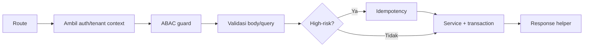

# AWCMS-Mini — New / Changed API Endpoint

Ikuti `docs/awcms-mini/05_openapi_asyncapi_detail.md` dan `docs/awcms-mini/10_template_kode_coding_standard.md`. Integrasi frontend: `docs/awcms-mini/15_frontend_architecture_integration.md`; akses data/RLS: `docs/awcms-mini/16_backend_data_access_integration.md`.

## Urutan handler (route tipis)



## Aturan

1. Route hanya orkestrasi; business logic di service, query di repository.
2. Base path `/api/v1`. Auth wajib kecuali endpoint public eksplisit.
3. Tenant-scoped → wajib header `X-AWCMS-Mini-Tenant-ID` + tenant context + RLS.
4. Cek akses dengan `awcms-mini-abac-guard` (default deny).
5. Validasi semua input (UUID, enum, length, numeric range, unknown field).
6. Mutation high-risk → `awcms-mini-idempotency` (`Idempotency-Key`).
7. Data sensitif keluar lewat mapper (`awcms-mini-sensitive-data`); jangan return row mentah.
8. DELETE resource deletable berarti soft delete; restore/purge butuh ABAC, audit, OpenAPI, dan idempotency bila high-risk.
9. **Update OpenAPI** (`openapi/`) untuk setiap perubahan; jalankan `api:spec:check`.

## Response helper

Sukses `{ success:true, data, meta }`; error `{ success:false, error:{ code, message, details, correlationId } }`. Gunakan `ok()`, `created()`, `fail()`.

## Error code standar

`VALIDATION_ERROR`(400), `AUTH_REQUIRED`(401), `TOKEN_EXPIRED`(401), `ACCESS_DENIED`(403), `TENANT_REQUIRED`(400), `RESOURCE_NOT_FOUND`(404), `RESOURCE_DELETED`(410), `IDEMPOTENCY_REQUIRED`(400), `IDEMPOTENCY_CONFLICT`(409), `WORKFLOW_APPROVAL_REQUIRED`(409), `STOCK_NOT_AVAILABLE`(409), `SYNC_CONFLICT`(409), `DATABASE_BUSY`(503), `PROVIDER_ERROR`(502), `INTERNAL_ERROR`(500). Jangan expose stack trace.

## Header standar

`Authorization`, `X-AWCMS-Mini-Tenant-ID`, `Idempotency-Key`, `X-Correlation-ID`, `Accept-Language`; sync: `X-AWCMS-Mini-Node-ID`, `X-AWCMS-Mini-Timestamp`, `X-AWCMS-Mini-Signature`.

## Verifikasi

```bash
bun run api:spec:check
bun run api:contract:test
```

Endpoint mutation high-risk (post, cancel, resolve, link, merge, delete/restore/purge master data, transfer approve/ship/receive, cycle-count, adjustment, vat generate, coretax batch, receipt send, sync push, workflow decision) **wajib** idempotency.
