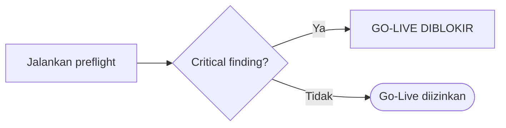

# AWPOS — Production Preflight & Go-Live

Ikuti `docs/awpos/07_sprint_testing_production_readiness.md` dan `docs/awpos/12_generator_prompt.md`.

## Command preflight

```bash
bun install
bun run db:migrate
bun run api:spec:check
bun test
bun run build
bun run db:pool:health
bun run security:readiness
bun run production:preflight
```

## Checklist go-live

**Application:** build pass · migration pass · OpenAPI valid · setup wizard locked · role default ada · ABAC default deny tested · RLS tested · logging aktif.

**Database:** versi sesuai target · PostgreSQL tidak public · least-privilege user · backup aktif · restore tested · index utama ada · pool sehat · slow query monitoring.

**Security:** no hardcoded secret · `.env` aman & tidak dikomit · password hash modern · login lockout · RLS aktif · ABAC aktif · audit aktif · tax data masked · CRM opt-out respected · AI read-only · sync HMAC bila hybrid · error tanpa stack trace · **no critical finding**.

## Gate



## Backup & restore (wajib teruji)

```bash
pg_dump --format=custom --file=/backup/awpos_$(date +%Y%m%d_%H%M%S).dump "$DATABASE_URL"
createdb awpos_restore_test
pg_restore --dbname=awpos_restore_test --clean --if-exists /backup/awpos_YYYYMMDD_HHMMSS.dump
```

Validasi restore: tenant/user/produk/stok/transaksi terbaca · login test · POS smoke test · report smoke test.

## Output

Laporan production readiness: status tiap gate, temuan (severity), rollback plan, keputusan go/no-go. Critical control fail **memblokir** go-live.
