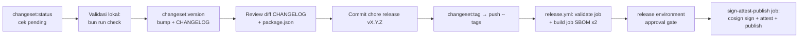

# AWCMS-Mini — Release (Changesets)

> ## ℹ️ Status trigger rilis (#825) — alur sudah diperbaiki, sisa satu langkah owner
>
> Trigger rilis dulu **saling meniadakan** (changeset memancarkan `awcms-mini@X.Y.Z`, tapi `release.yml` memicu `v*.*.*`) sehingga jalur otomatis mati dan **belum pernah menghasilkan satu rilis pun**. **Sudah diperbaiki** (Issue #825, kode merged PR #854):
>
> | Sisi                            | Nilai final                                                                                                        |
> | ------------------------------- | ------------------------------------------------------------------------------------------------------------------ |
> | `.changeset/config.json:11`     | `"privatePackages": { "version": true, "tag": true }` → `bun run changeset:tag` memancarkan **`awcms-mini@X.Y.Z`** |
> | `.github/workflows/release.yml` | trigger `push: tags: awcms-mini@*` — **sumber kebenaran yang sama** dengan tag generator; tak ada `vX.Y.Z` manual  |
>
> Jadi **langkah 6 di bawah kini BENAR**: `changeset:tag` → `git push --tags` **memicu** `release.yml`. `scripts/release-verify.ts` (`normalizeTagVersion`) sudah strip prefix `awcms-mini@` agar job `validate` tidak menolak tag rilis nyata pertama.
>
> **Yang masih tersisa — owner-only (bukan langkah lokal skill ini):** tahap `sign + attest + publish` **belum terbukti end-to-end**. Rehearsal `29461398291` menggantung >26 jam menunggu `required_reviewers` environment `release`. Sebelum rilis production pertama, owner harus: (1) set/tinjau `required_reviewers` env `release`, (2) approve satu rehearsal (`workflow_dispatch`) menembus cosign/provenance/publish. Lihat `release-process.md` §Dry-run/rehearsal & §Environment approval.

Ikuti `docs/awcms-mini/09_roadmap_repository_commit.md` §Versioning dan `.changeset/README.md`. Sejak Issue #692 (epic #679, platform-hardening), langkah dari "push tag" sampai "GitHub Release + image + SBOM + signature + provenance" **sudah otomatis** lewat `.github/workflows/release.yml` — lihat [`docs/awcms-mini/release-process.md`](../../../docs/awcms-mini/release-process.md) untuk detail lengkap (SBOM tool, keyless signing, attestation, environment approval, dry-run/rehearsal, verifikasi konsumen, rollback/yank). Skill ini tetap mendokumentasikan langkah lokal (changeset → version bump → tag) yang masih manual.

## Alur rilis

## Prosedur

1. `bun run changeset:status` — pastikan ada changeset pending dan tingkat bump sesuai SemVer (MAJOR breaking / MINOR fitur / PATCH fix). Bila kosong tapi ada perubahan perilaku → minta changeset dulu, jangan rilis. Setiap PR yang membutuhkan changeset sudah ditegakkan otomatis oleh `.github/workflows/changesets.yml` (`bun run changesets:policy:check`) — pending changeset di titik ini seharusnya sudah lengkap, bukan ditemukan baru saat rilis.
2. Validasi lokal: `bun run check` (lint, docs, contracts, typecheck, test, build — `release.yml`'s `validate` job re-runs persis perintah yang sama, dan sebenarnya lebih ketat dari `ci.yml`'s `quality` job hari ini karena `quality` belum menjalankan `i18n:pot:check`/`config:docs:check`/`logging:lint:check`, lihat `release-process.md` §validate job); untuk rilis production tambah `bun run production:preflight` (gate doc 07 — critical finding memblokir). `bun run check` juga menjalankan `extension:check` (Issue #741/ADR-0015) — bila repo turunan Anda mem-fork pipeline rilis ini dan sudah mempublikasikan `extension.manifest.json`, langkah ini memverifikasi manifest itu tetap kompatibel dengan versi/kontrak/checksum migration rilis yang sedang di-tag, tanpa gerbang terpisah untuk dikonfigurasi.
3. `bun run changeset:version` — konsumsi changeset → bump `package.json` + entri `CHANGELOG.md`.
4. Review diff; pastikan versi cocok peta doc 09 (0.1.0 Foundation … 1.0.0 production MVP).
5. Commit: `chore(release): vX.Y.Z` (sertakan CHANGELOG + package.json + penghapusan file changeset), push ke `main`.
6. `bun run changeset:tag` lalu `git push --tags` — ini memancarkan tag `awcms-mini@X.Y.Z` yang **memicu** `.github/workflows/release.yml` (#825, PR #854): guard ancestor-of-`main`, `bun run release:verify` (versi/CHANGELOG/changeset tersisa harus konsisten), full quality gate, lalu — setelah disetujui lewat `release` environment (lihat doc `release-process.md` §Environment approval) — build image, dua SBOM CycloneDX (source + image), checksums, `cosign sign` keyless, `actions/attest-build-provenance`/`attest-sbom`, push `ghcr.io/ahliweb/awcms-mini` (image tag **`X.Y.Z` polos** + `:sha-<commit>` + `:latest`, bukan `v`-prefixed), dan `gh release create` dengan asset terlampir. Catatan: sebelum rilis production pertama, tahap `sign + attest + publish` perlu satu rehearsal owner yang benar-benar disetujui (lihat kotak status di atas).
7. **Jangan** lagi menjalankan `gh release create` manual — itu sekarang bagian dari `release.yml`; menjalankannya manual sebelum workflow selesai akan bentrok dengan asset yang coba di-attach otomatis.

## Aturan

- Jangan rilis dari branch selain `main` (atau `release/vX.Y.Z` sesuai doc 09) — `release.yml` menolak tag yang bukan ancestor `origin/main`.
- Jangan edit CHANGELOG entri lama; koreksi lewat entri baru.
- Pra-1.0.0: minor boleh memuat penyesuaian belum stabil; tetap catat breaking di ringkasan changeset.
- Tag `awcms-mini@X.Y.Z` (format yang dipancarkan `changeset:tag`) harus menunjuk commit rilis, bukan commit sesudahnya — `bun run release:verify` menolak bila `package.json`/CHANGELOG tidak cocok dengan tag.
- Sebelum tag rilis production pertama, jalankan rehearsal (`gh workflow run release.yml --ref main`) minimal sekali dan pastikan reviewer benar-benar approve gerbang environment `release` — lihat doc `release-process.md` §Dry-run/rehearsal.

## Verifikasi

- `git tag --points-at HEAD` menunjukkan tag baru; CHANGELOG punya seksi versi; `package.json` versi sama dengan tag.
- Setelah `release.yml` selesai: `gh attestation verify oci://ghcr.io/ahliweb/awcms-mini:X.Y.Z --owner ahliweb` (image tag polos, bukan `v`-prefixed) dan `cosign verify ...` (perintah lengkap di `release-process.md` §Verification) — tidak butuh akses repo secret.
