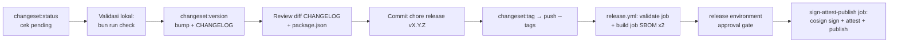

# AWCMS-Mini — Release (Changesets)

> ## ⚠️ RUSAK per 2026-07-17 — jangan percaya alur di bawah sampai #825 selesai
>
> **Pipeline rilis ini belum pernah menghasilkan satu rilis pun.** `package.json` ada di **v0.24.0**; repo **tidak punya satu pun tag `v*`** (`git tag` → hanya `awcms-mini@0.0.1..0.0.3`).
>
> **Akarnya — dua mekanisme saling meniadakan:**
>
> | Sisi                                  | Nilai                                                                                                       |
> | ------------------------------------- | ----------------------------------------------------------------------------------------------------------- |
> | `.changeset/config.json:11`           | `"privatePackages": { "version": true, "tag": true }` → `changeset tag` memancarkan **`awcms-mini@0.24.0`** |
> | `.github/workflows/release.yml:31-33` | trigger `push: tags: ["v*.*.*"]`                                                                            |
>
> `awcms-mini@0.24.0` **tidak akan pernah** cocok `v*.*.*`. Jadi **langkah 6 di bawah salah**: `changeset:tag` **tidak** memicu `release.yml`. Hanya `git tag vX.Y.Z` manual (`release-process.md:22`) yang memicunya.
>
> **Akibat kedua**: tahap `sign + attest + publish` **belum pernah dieksekusi end-to-end** — satu-satunya rehearsal (`29461398291`) menggantung >26 jam menunggu `required_reviewers` environment `release`. Jadi cosign/provenance/publish di langkah 6 adalah **klaim yang belum terbukti**, bukan fakta.
>
> Sebelum merilis apa pun: selesaikan **#825**, lalu perbarui skill ini + `release-process.md` sesuai mekanisme final.

Ikuti `docs/awcms-mini/09_roadmap_repository_commit.md` §Versioning dan `.changeset/README.md`. Sejak Issue #692 (epic #679, platform-hardening), langkah dari "push tag" sampai "GitHub Release + image + SBOM + signature + provenance" **sudah otomatis** lewat `.github/workflows/release.yml` — lihat [`docs/awcms-mini/release-process.md`](../../../docs/awcms-mini/release-process.md) untuk detail lengkap (SBOM tool, keyless signing, attestation, environment approval, dry-run/rehearsal, verifikasi konsumen, rollback/yank). Skill ini tetap mendokumentasikan langkah lokal (changeset → version bump → tag) yang masih manual.

## Alur rilis

## Prosedur

1. `bun run changeset:status` — pastikan ada changeset pending dan tingkat bump sesuai SemVer (MAJOR breaking / MINOR fitur / PATCH fix). Bila kosong tapi ada perubahan perilaku → minta changeset dulu, jangan rilis. Setiap PR yang membutuhkan changeset sudah ditegakkan otomatis oleh `.github/workflows/changesets.yml` (`bun run changesets:policy:check`) — pending changeset di titik ini seharusnya sudah lengkap, bukan ditemukan baru saat rilis.
2. Validasi lokal: `bun run check` (lint, docs, contracts, typecheck, test, build — `release.yml`'s `validate` job re-runs persis perintah yang sama, dan sebenarnya lebih ketat dari `ci.yml`'s `quality` job hari ini karena `quality` belum menjalankan `i18n:pot:check`/`config:docs:check`/`logging:lint:check`, lihat `release-process.md` §validate job); untuk rilis production tambah `bun run production:preflight` (gate doc 07 — critical finding memblokir). `bun run check` juga menjalankan `extension:check` (Issue #741/ADR-0015) — bila repo turunan Anda mem-fork pipeline rilis ini dan sudah mempublikasikan `extension.manifest.json`, langkah ini memverifikasi manifest itu tetap kompatibel dengan versi/kontrak/checksum migration rilis yang sedang di-tag, tanpa gerbang terpisah untuk dikonfigurasi.
3. `bun run changeset:version` — konsumsi changeset → bump `package.json` + entri `CHANGELOG.md`.
4. Review diff; pastikan versi cocok peta doc 09 (0.1.0 Foundation … 1.0.0 production MVP).
5. Commit: `chore(release): vX.Y.Z` (sertakan CHANGELOG + package.json + penghapusan file changeset), push ke `main`.
6. `bun run changeset:tag` lalu `git push --tags`. **⚠️ Lihat peringatan di atas — langkah ini TIDAK memicu `release.yml` hari ini** (format tag tidak cocok, #825). Setelah #825 selesai, ini seharusnya **memicu** `.github/workflows/release.yml`: guard ancestor-of-`main`, `bun run release:verify` (versi/CHANGELOG/changeset tersisa harus konsisten), full quality gate, lalu — setelah disetujui lewat `release` environment (lihat doc `release-process.md` §Environment approval) — build image, dua SBOM CycloneDX (source + image), checksums, `cosign sign` keyless, `actions/attest-build-provenance`/`attest-sbom`, push `ghcr.io/ahliweb/awcms-mini`, dan `gh release create` dengan asset terlampir.
7. **Jangan** lagi menjalankan `gh release create` manual — itu sekarang bagian dari `release.yml`; menjalankannya manual sebelum workflow selesai akan bentrok dengan asset yang coba di-attach otomatis.

## Aturan

- Jangan rilis dari branch selain `main` (atau `release/vX.Y.Z` sesuai doc 09) — `release.yml` menolak tag yang bukan ancestor `origin/main`.
- Jangan edit CHANGELOG entri lama; koreksi lewat entri baru.
- Pra-1.0.0: minor boleh memuat penyesuaian belum stabil; tetap catat breaking di ringkasan changeset.
- Tag `vX.Y.Z` harus menunjuk commit rilis, bukan commit sesudahnya — `bun run release:verify` menolak bila `package.json`/CHANGELOG tidak cocok dengan tag.
- Sebelum tag rilis production pertama, jalankan rehearsal (`gh workflow run release.yml --ref main`) minimal sekali dan pastikan reviewer benar-benar approve gerbang environment `release` — lihat doc `release-process.md` §Dry-run/rehearsal.

## Verifikasi

- `git tag --points-at HEAD` menunjukkan tag baru; CHANGELOG punya seksi versi; `package.json` versi sama dengan tag.
- Setelah `release.yml` selesai: `gh attestation verify oci://ghcr.io/ahliweb/awcms-mini:vX.Y.Z --owner ahliweb` dan `cosign verify ...` (perintah lengkap di `release-process.md` §Verification) — tidak butuh akses repo secret.
