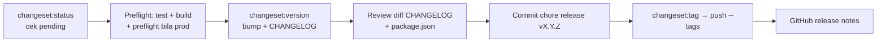

# AWPOS — Release (Changesets)

Ikuti `docs/awpos/09_roadmap_repository_commit.md` §Versioning dan `.changeset/README.md`.

## Alur rilis

## Prosedur

1. `bun run changeset:status` — pastikan ada changeset pending dan tingkat bump sesuai SemVer (MAJOR breaking / MINOR fitur / PATCH fix). Bila kosong tapi ada perubahan perilaku → minta changeset dulu, jangan rilis.
2. Validasi: `bun test` + `bun run build`; untuk rilis production tambah `bun run production:preflight` (gate doc 07 — critical finding memblokir).
3. `bun run changeset:version` — konsumsi changeset → bump `package.json` + entri `CHANGELOG.md`.
4. Review diff; pastikan versi cocok peta doc 09 (0.1.0 Foundation … 1.0.0 production MVP).
5. Commit: `chore(release): vX.Y.Z` (sertakan CHANGELOG + package.json + penghapusan file changeset).
6. `bun run changeset:tag` lalu `git push && git push --tags`.
7. Buat GitHub release dari tag dengan isi entri CHANGELOG versi tsb (`gh release create`).

## Aturan

- Jangan rilis dari branch selain `main` (atau `release/vX.Y.Z` sesuai doc 09).
- Jangan edit CHANGELOG entri lama; koreksi lewat entri baru.
- Pra-1.0.0: minor boleh memuat penyesuaian belum stabil; tetap catat breaking di ringkasan changeset.
- Tag `vX.Y.Z` harus menunjuk commit rilis, bukan commit sesudahnya.

## Verifikasi

- `git tag --points-at HEAD` menunjukkan tag baru; CHANGELOG punya seksi versi; `package.json` versi sama dengan tag.
