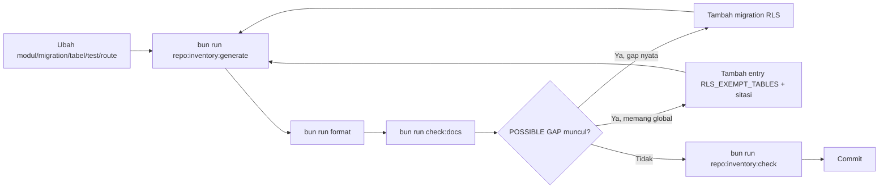

# AWCMS-Mini — Repo Inventory Regenerate

`docs/awcms-mini/repo-inventory.md` adalah dokumen **GENERATED** — jangan
diedit langsung. Ia meregenerasi, dari repo itu sendiri (bukan dari
ingatan/asumsi), lima inventori yang sebelumnya mudah drift dari
kenyataan (Issue #688, epic #679 — audit 2026-07-11 menemukan GitHub
snapshot yang mengklaim 6 open issue padahal 33+ nyata terbuka, dan nama
modul basi di `AGENTS.md`):

- **Modules** — dari `listModules()` (`src/modules/index.ts`).
- **Migrations** — seluruh `sql/*.sql`, terurut nomor.
- **Tables & Row-Level Security** — tabel hasil parsing `CREATE TABLE` +
  status `ENABLE ROW LEVEL SECURITY`, dicocokkan dengan allow-list
  RLS-exempt yang di-review (`RLS_EXEMPT_TABLES` di
  `scripts/repo-inventory-generate.ts`).
- **Tests** — jumlah file test per subdirektori `tests/`.
- **Routes/Operations** — ringkasan jumlah path/operation dari kontrak
  OpenAPI ter-bundle (parity sendiri sudah ditegakkan terpisah oleh
  `bun run api:spec:check`, dokumen ini hanya menampilkan angkanya).

GitHub issue/label/milestone snapshot **tidak** diregenerasi script ini —
itu tetap tanggung jawab skill `awcms-mini-github-snapshot` (live network
call ke `gh`, sengaja di luar `bun run check`).

## Kapan menjalankan

Jalankan `bun run repo:inventory:generate` di PR yang sama setiap kali:

- Menambah/menghapus modul di `src/modules/index.ts`.
- Menambah migration baru di `sql/`.
- Menambah/menghapus tabel, atau mengubah `ENABLE ROW LEVEL SECURITY`.
- Menambah/menghapus file test di `tests/`.
- Menambah/menghapus path/operation di kontrak OpenAPI ter-bundle.

`bun run repo:inventory:check` (bagian dari `bun run check`) meregenerasi
ulang di memori dan diff terhadap file yang di-commit — gagal loud bila
ketinggalan salah satu perubahan di atas.

## Command

```bash
bun run repo:inventory:generate
bun run format
bun run check:docs
bun run repo:inventory:check   # harus OK sebelum commit
```

## Bila muncul "POSSIBLE GAP" pada bagian Tables & Row-Level Security

Ini heuristik STATIS (parsing `sql/*.sql`), bukan pengganti enforcement
RLS nyata (ADR-0003, migration `013` `FORCE ROW LEVEL SECURITY` + role
least-privilege, atau `bun run security:readiness`). Dua kemungkinan:

1. **Gap nyata** — tabel tenant-scoped baru belum punya `ALTER TABLE ...
ENABLE ROW LEVEL SECURITY` di migration manapun. Tambahkan migration
   RLS (skill `awcms-mini-new-migration`), lalu regenerasi.
2. **Tabel memang global** (registry/catalog, bukan data tenant) — tambah
   entry baru di `RLS_EXEMPT_TABLES` (`scripts/repo-inventory-generate.ts`)
   dengan sitasi dokumen yang menjelaskan kenapa (pola yang sama seperti
   `ROUTE_PARITY_EXEMPTIONS`/`CONFIG_EXEMPTIONS`) — jangan menambah entry
   tanpa alasan tertulis.

## Alur



## Output

Ringkasan: bagian yang berubah (modul/migration/tabel/test/route count),
dan apakah ada "POSSIBLE GAP" RLS baru yang perlu ditinjau.
