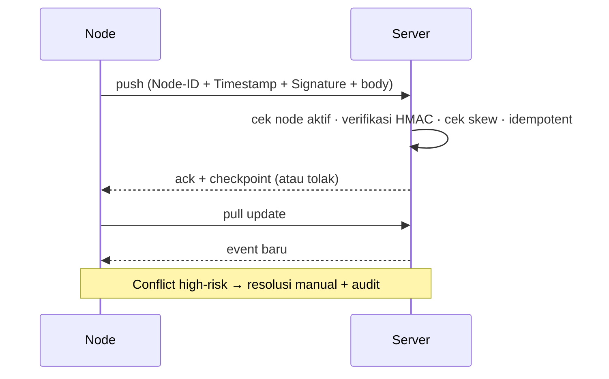

# AWCMS-Mini — Sync HMAC & Offline Sync

Ikuti `docs/awcms-mini/08_sop_operasional_user_guide.md` dan `docs/awcms-mini/10_template_kode_coding_standard.md`.

## Signature

```text
signature = HMAC(secret, "<timestamp>.<body>")
```

Header: `X-AWCMS-Mini-Node-ID`, `X-AWCMS-Mini-Timestamp`, `X-AWCMS-Mini-Signature`.

## Aturan validasi

1. Signature **wajib** ada; tolak jika kosong.
2. Timestamp valid; **max skew default 300 detik** (anti replay).
3. **Timing-safe compare** untuk signature.
4. Node inactive ditolak.
5. Duplicate event idempotent (tidak dobel) — lihat `awcms-mini-idempotency`.
6. Posted transaction **immutable**; sync tidak menimpa transaksi posted.
7. HMAC secret & R2 credential hanya dari **environment**.

## Alur



## R2 object queue (opsional)

- File lokal disimpan dulu, masuk `awcms-mini_object_sync_queue`.
- Upload saat online; **checksum diverifikasi**; retry aman.

## Verifikasi (test)

- HMAC valid diterima; invalid/expired ditolak.
- Duplicate batch idempotent; checkpoint updated.
- Conflict tercatat immutable + audit.
