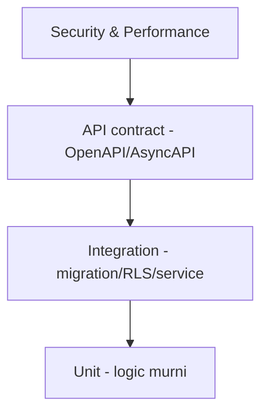

# AWCMS-Mini — Testing Strategy

Ikuti `docs/awcms-mini/07_sprint_testing_production_readiness.md`. Jalankan dengan `bun test`.

## Piramida



## Target unit test

ABAC evaluator · profile resolver · idempotency (hash/replay/conflict) · validasi input · redaction · config fail-fast · module registry · plan migration · HMAC signature. (Contoh nyata: `tests/` di repo ini.)

## Target integration test

Migration dari DB kosong (apply/rerun/status) · setup wizard · login + lockout · profile resolve · assignment · ABAC & isolasi RLS dengan role non-superuser (pola doc 07).

## API contract test

OpenAPI valid · success/error schema standar · tenant header ada · idempotency header ada · pagination konsisten · sensitive data tidak tampil penuh.

## Security test

Tenant A tidak baca Tenant B · Staff tidak assign role · self-approval ditolak · password/token/API key tidak di response/log · NPWP/NIK/phone/email masked · sync HMAC invalid ditolak.

## Performance target awal

Health < 100ms · login < 500ms · evaluasi ABAC < 100ms · pool acquire critical < 500ms · sync push small batch < 2s. Aplikasi domain menetapkan budget layarnya sendiri.

## Lokasi

```text
tests/{shared,lib,modules} (base) + tests/<modul-domain> per aplikasi
```

## Aturan

- Setiap fitur baru minimal punya unit test logic + satu integration/contract test.
- Test tenant-scoped memakai tenant context; jangan bergantung data global.
