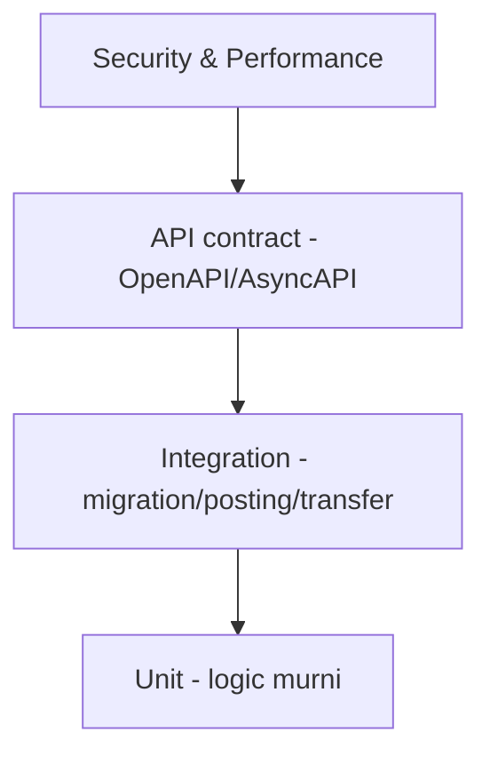

# AWCMS-Mini — Testing Strategy

Ikuti `docs/awcms-mini/07_sprint_testing_production_readiness.md`. Jalankan dengan `bun test`.

## Piramida

## Target unit test

ABAC evaluator · profile resolver · soft delete/restore guard · product price selection · stock movement calc · checkout total · idempotency service · posting guard · VAT calc · warehouse transfer state machine · cycle count variance · HMAC signature · AI tool policy.

## Target integration test

Migration dari DB kosong · setup wizard · login owner/operator · product create/soft-delete/restore · opening stock · checkout/posting · stok berkurang · receipt PDF · sync outbox event · VAT draft · warehouse transfer · ABAC & RLS.

## API contract test

OpenAPI valid · success/error schema standar · tenant header ada · idempotency header ada · pagination konsisten · includeDeleted/restore/purge contract konsisten · sensitive data tidak tampil penuh.

## Security test

Tenant A tidak baca Tenant B · archive view butuh permission · operator tidak export Coretax · operator tidak assign role · customer hanya receipt miliknya · password/token/API key tidak di response/log · NPWP/NIK/phone/email masked · sync HMAC invalid ditolak · AI raw PII/SQL ditolak · **rute publik/tanpa-sesi tidak pernah membocorkan konten non-publik** (draft/review/scheduled-future/archived/private/unlisted/deleted) — reusable untuk modul apa pun yang punya split visibilitas publik vs privat (mis. `blog_content`, epic #536, Issue #540): sentralisasi satu predicate visibilitas dan tes predicate itu sendiri secara exhaustive, jangan andalkan filter query yang tersebar per-endpoint.

## Content sanitization test (modul dengan rich/structured content)

Untuk modul yang menyimpan konten terstruktur milik pengguna yang di-render ke HTML (mis. blog post body) — bukan sekadar string biasa: reject/strip `<script>`, inline `on*=` handler, `javascript:` URL, `<iframe>`/embed tak tepercaya saat validasi input **dan** saat render (dua lapis, jangan andalkan salah satu saja). Simpan JSON terstruktur (blok konten bertipe) sebagai sumber kebenaran, bukan HTML mentah dari klien.

## Performance target awal

Product search < 300ms · add item < 300ms · post transaksi < 1.5s · receipt PDF < 3s · sales daily report < 2s · pool acquire critical < 500ms · sync push small batch < 2s.

## Lokasi

Konvensi nyata repo ini (bukan sub-folder per domain): file **flat** langsung di `tests/`, satu file per area — `<area>.test.ts` (unit, tanpa DB) dan `tests/integration/<area>.integration.test.ts` (butuh `DATABASE_URL`, di-skip otomatis tanpanya — **jangan asumsikan `bun test` tanpa `DATABASE_URL` berarti semua test lulus**, integration test-nya cuma dilewati diam-diam). Contoh: `tests/access-control.test.ts`, `tests/module-management-tenant-lifecycle.test.ts`, `tests/integration/module-tenant-lifecycle.integration.test.ts`.

Gating skip itu bukan otomatis — setiap file integration mendeklarasikan helper `const suite = integrationEnabled ? describe : describe.skip;` dan **setiap blok top-level WAJIB memakai `suite(...)`** (atau `describe.skipIf(!integrationEnabled)(...)`). Blok top-level `describe(...)` telanjang berjalan tanpa syarat dan menggagalkan `bun run check`/`bun test` saat `DATABASE_URL` kosong (kelas bug Issue #858; CI tak menangkapnya karena job Quality selalu menyetel `DATABASE_URL`). Gate `tests/unit/integration-suite-gating.test.ts` (unit murni, jalan justru tanpa DB) menegakkan ini — memindai semua `tests/integration/*.integration.test.ts` dengan pendekatan **allow-list default-deny**: SETIAP `describe...` di kolom-0 dianggap pelanggaran KECUALI dua bentuk terdokumentasi — `describe.skip(` (tanpa syarat) dan `describe.skipIf(!integrationEnabled)(` (kondisi PERSIS ini). Jadi `describe(`, `describe.only(`, `describe.each(`, `describe.todo(`, serta `describe.skipIf(...)` berkondisi lain (mis. terbalik `describe.skipIf(integrationEnabled)(` atau `describe.skipIf(process.env.CI)(` yang tetap menjalankan suite DB tanpa `DATABASE_URL`) semuanya tertangkap; `suite(` aman karena tak diawali `describe`.

## Aturan

- Setiap fitur baru minimal punya unit test logic + satu integration/contract test.
- Test tenant-scoped memakai tenant context; jangan bergantung data global.
