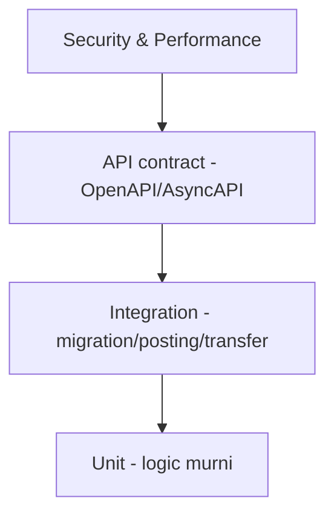

# AWPOS — Testing Strategy

Ikuti `docs/awpos/07_sprint_testing_production_readiness.md`. Jalankan dengan `bun test`.

## Piramida



## Target unit test

ABAC evaluator · profile resolver · product price selection · stock movement calc · checkout total · idempotency service · posting guard · VAT calc · warehouse transfer state machine · cycle count variance · HMAC signature · AI tool policy.

## Target integration test

Migration dari DB kosong · setup wizard · login owner/kasir · product create · opening stock · checkout/posting · stok berkurang · receipt PDF · sync outbox event · VAT draft · warehouse transfer · ABAC & RLS.

## API contract test

OpenAPI valid · success/error schema standar · tenant header ada · idempotency header ada · pagination konsisten · sensitive data tidak tampil penuh.

## Security test

Tenant A tidak baca Tenant B · kasir tidak export Coretax · kasir tidak assign role · customer hanya receipt miliknya · password/token/API key tidak di response/log · NPWP/NIK/phone/email masked · sync HMAC invalid ditolak · AI raw PII/SQL ditolak.

## Performance target awal

Product search < 300ms · add item < 300ms · post transaksi < 1.5s · receipt PDF < 3s · sales daily report < 2s · pool acquire critical < 500ms · sync push small batch < 2s.

## Lokasi

```text
tests/{access,auth,profile,inventory,pos,sync,warehouse,tax,crm,security}
```

## Aturan

- Setiap fitur baru minimal punya unit test logic + satu integration/contract test.
- Test tenant-scoped memakai tenant context; jangan bergantung data global.
