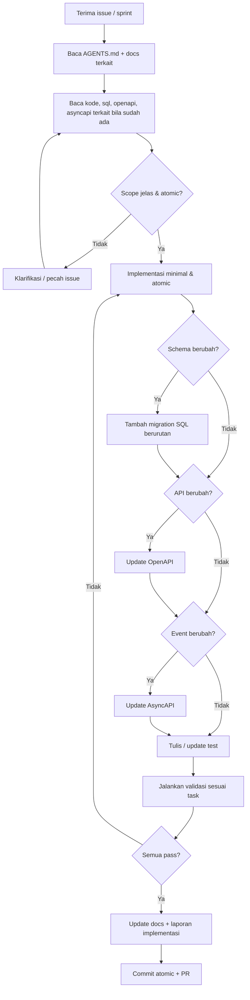
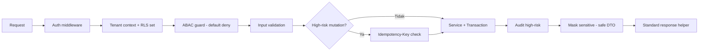

# AGENTS.md — Panduan Agent & Kontributor AWCMS-Mini

Dokumen ini adalah kontrak kerja untuk coding agent (Claude Code, Codex, dsb.) maupun developer manusia yang mengimplementasikan AWCMS-Mini. Setiap sesi implementasi wajib membaca file ini terlebih dahulu, lalu dokumen terkait di `docs/awcms-mini/`.

> AWCMS-Mini pada branch ini adalah baseline docs-only yang disejajarkan dengan repo referensi `ahliweb/awpos`. Belum ada kode runtime aplikasi di branch ini. Implementasi dimulai ulang dari **Issue 0.1 — Initialize AWCMS-Mini Modular Monolith Repository Structure**.

## Ringkasan Proyek

| Aspek | Keputusan |
| --- | --- |
| Produk | Standar modular monolith untuk aplikasi AhliWeb |
| Runtime target | Bun |
| Web framework target | Astro 7 |
| Database target | PostgreSQL |
| Arsitektur target | Modular monolith, microservice-ready |
| Security baseline | RBAC + ABAC + PostgreSQL RLS + Audit Log |
| API contract | OpenAPI |
| Event contract | AsyncAPI |
| Bahasa dokumen | Indonesia teknis |

## Alur Kerja Wajib Setiap Task



## Aturan Wajib

1. Baca README, `docs/awcms-mini/`, `package.json`, dan file implementasi terkait sebelum mengedit.
2. Kerjakan satu issue/sprint secara atomic; jangan ubah file yang tidak berkaitan.
3. Setiap perubahan schema harus migration SQL baru yang berurutan.
4. Setiap API baru/berubah harus memperbarui OpenAPI.
5. Setiap domain event baru/berubah harus memperbarui AsyncAPI.
6. Mutation high-risk wajib memakai `Idempotency-Key`.
7. Data tenant-scoped wajib tenant context + ABAC + RLS.
8. High-risk action wajib audit log.
9. Data sensitif seperti password, token, NPWP, NIK, phone, email, dan receipt token wajib dimask/redact; jangan masuk response/log/audit mentah.
10. Jangan commit `.env`, token, dump DB, backup, atau data customer asli.
11. Provider eksternal tidak boleh menjadi dependency transaksi kritikal dan tidak boleh dipanggil di dalam DB transaction.
12. Dokumen, migration, API contract, test, dan SOP harus mengikuti implementasi nyata.

## Guardrail Keamanan



- Default deny, deny overrides allow.
- RLS tetap wajib walau ABAC sudah cek.
- Error response standard, tidak expose stack trace.
- Provider secret hanya dari environment variable.

## Skill Proyek

Skill proyek berada di [`.claude/skills/`](.claude/skills/README.md). Skill merujuk `docs/awcms-mini/*` sebagai sumber kebenaran; bila standar berubah, perbarui dokumen dan skill terkait.

| Butuh... | Skill |
| --- | --- |
| Kerjakan issue/sprint atomic | `awcms-mini-implement-issue` |
| Scaffold modul baru | `awcms-mini-new-module` |
| Migration SQL | `awcms-mini-new-migration` |
| Endpoint REST + OpenAPI | `awcms-mini-new-endpoint` |
| Domain event + AsyncAPI | `awcms-mini-new-event` |
| Idempotency mutation high-risk | `awcms-mini-idempotency` |
| ABAC default-deny + RLS | `awcms-mini-abac-guard` |
| Audit high-risk + redaction | `awcms-mini-audit-log` |
| Masking data sensitif | `awcms-mini-sensitive-data` |
| Sync HMAC + anti-replay | `awcms-mini-sync-hmac` |
| Review keamanan modul | `awcms-mini-security-review` |
| Review pull request | `awcms-mini-pr-review` |
| Tulis test berlapis | `awcms-mini-testing` |
| Preflight & go-live | `awcms-mini-production-preflight` |
| Layar/komponen UI | `awcms-mini-ui-screen` |
| Rilis versi | `awcms-mini-release` |
| Migrasi data legacy | `awcms-mini-legacy-migration` |

## Subagents

Subagent proyek berada di [`.claude/agents/`](.claude/agents/).

| Agent | Peran | Tools |
| --- | --- | --- |
| `awcms-mini-coder` | Implementasi issue end-to-end | Semua |
| `awcms-mini-reviewer` | Review PR/diff terhadap DoD | Read-only |
| `awcms-mini-security-auditor` | Audit keamanan modul + verdict go-live | Read-only |

Reviewer dan auditor bersifat read-only; temuan dikembalikan ke coder. Critical finding berarti BLOCKED.

## Perintah Standar Saat Ini

```bash
bun install
bun run changeset
bun run changeset:status
bun run changeset:version
bun run changeset:tag
```

Perintah runtime seperti `dev`, `build`, `db:migrate`, `api:spec:check`, `test`, dan `production:preflight` ditambahkan kembali saat Issue 0.1 membuat struktur aplikasi.

## Struktur Repository Target

```text
awcms-mini/
├── AGENTS.md
├── CHANGELOG.md
├── .changeset/
├── .claude/skills/
├── .claude/agents/
├── README.md
├── package.json
├── astro.config.mjs
├── tsconfig.json
├── .env.example
├── .gitignore
├── docker-compose.yml
├── src/
├── sql/
├── scripts/
├── openapi/
├── asyncapi/
├── docs/awcms-mini/
├── deploy/
├── tests/
└── fixtures/
```

Struktur target di atas belum ada seluruhnya pada branch docs-only ini. Tambahkan kembali secara bertahap sesuai issue dan dokumen Bagian 9-12.

## Konvensi Commit

```text
<type>(<scope>): <summary>
```

Types: `feat`, `fix`, `docs`, `test`, `refactor`, `chore`, `security`, `perf`, `ci`, `build`.

Branch: `feature/<issue>-<name>`, `fix/<issue>-<name>`, `release/vX.Y.Z`, `hotfix/vX.Y.Z-<name>`.

## Definition of Done

- Scope sesuai issue, tidak ada unrelated change.
- Migration jika schema berubah; OpenAPI jika API berubah; AsyncAPI jika event berubah.
- Input validation, Auth/ABAC/RLS, audit high-risk, sensitive masking.
- Test relevan pass; build pass bila runtime sudah tersedia.
- Docs diperbarui.
- Changeset ditambahkan bila perubahan mempengaruhi perilaku.
- Laporan implementasi disertakan.

## Peta Dokumen

| Butuh memahami... | Baca |
| --- | --- |
| Arsitektur & fase | `docs/awcms-mini/01_canvas_induk.md` |
| Kebutuhan produk | `docs/awcms-mini/02_prd_detail_per_modul.md` |
| Spesifikasi teknis | `docs/awcms-mini/03_srs_detail_per_modul.md` |
| Database/ERD/RLS | `docs/awcms-mini/04_erd_data_dictionary.md` |
| Kontrak API/event | `docs/awcms-mini/05_openapi_asyncapi_detail.md` |
| Issue atomic | `docs/awcms-mini/06_github_issues_detail.md` |
| Sprint/testing/go-live | `docs/awcms-mini/07_sprint_testing_production_readiness.md` |
| SOP operasional | `docs/awcms-mini/08_sop_operasional_user_guide.md` |
| Roadmap repo/commit | `docs/awcms-mini/09_roadmap_repository_commit.md` |
| Coding standard | `docs/awcms-mini/10_template_kode_coding_standard.md` |
| Blueprint skeleton | `docs/awcms-mini/11_implementation_blueprint.md` |
| Prompt eksekusi | `docs/awcms-mini/12_generator_prompt.md` |
| Master index/traceability | `docs/awcms-mini/13_final_master_index_traceability.md` |
| UI/UX dan design token | `docs/awcms-mini/14_ui_ux_design_system.md` |
| Frontend & integrasi | `docs/awcms-mini/15_frontend_architecture_integration.md` |
| Data access, pooling, RLS, outbox | `docs/awcms-mini/16_backend_data_access_integration.md` |
| Role default, permission, ABAC seed | `docs/awcms-mini/17_default_seed_rbac_abac.md` |
| Env, feature flag, deployment | `docs/awcms-mini/18_configuration_env_reference.md` |
| Glossary & terminologi | `docs/awcms-mini/19_glossary_terminology.md` |

## Mulai Dari Sini

```text
Kerjakan Issue 0.1 — Initialize AWCMS-Mini Modular Monolith Repository Structure.
Lanjutkan sesuai urutan di doc 09 dan doc 12.
```
