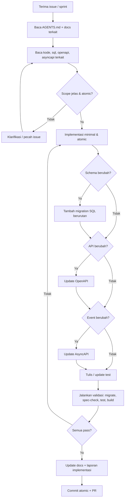
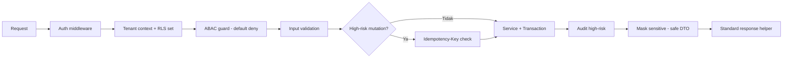
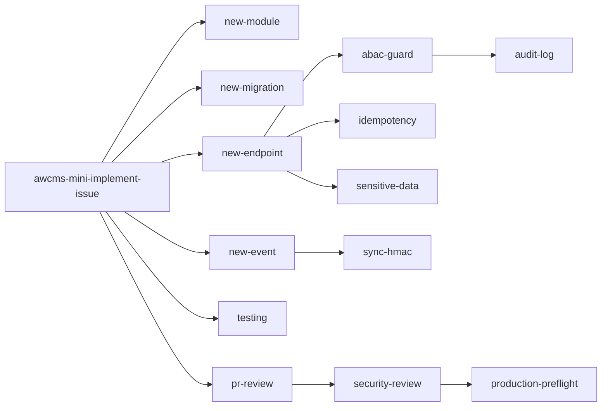
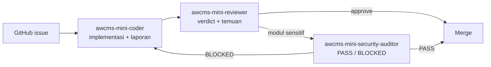

# AGENTS.md — Panduan Agent & Kontributor AWCMS-Mini

Dokumen ini adalah **kontrak kerja** untuk coding agent (Claude Code, Codex, dsb.) maupun developer manusia yang mengimplementasikan AWCMS-Mini. Setiap sesi implementasi **wajib membaca file ini terlebih dahulu**, lalu dokumen terkait di `docs/awcms-mini/`.

> AWCMS-Mini saat ini masih berupa **paket perencanaan (docs-only)**. Belum ada kode aplikasi. Implementasi dimulai dari **Issue 0.1 — Initialize AWCMS-Mini Modular Monolith Repository Structure**.

## Ringkasan proyek

| Aspek             | Keputusan                                                          |
| ----------------- | ------------------------------------------------------------------ |
| Produk            | standar modular monolith berbasis AWCMS-Mini                       |
| Runtime           | Bun                                                                |
| Backend platform  | **Bun-only**; Node.js dilarang kecuali pengecualian terdokumentasi |
| Web framework     | Astro 7                                                            |
| Database          | PostgreSQL                                                         |
| Arsitektur        | Modular monolith, microservice-ready                               |
| Mode operasi      | Offline-first / LAN-first, optional online sync                    |
| Security baseline | RBAC + ABAC + PostgreSQL RLS + Audit Log                           |
| API contract      | OpenAPI                                                            |
| Event contract    | AsyncAPI                                                           |
| Bahasa dokumen    | Indonesia (teknis)                                                 |

## Alur kerja wajib setiap task



## Aturan wajib (non-negotiable)

1. **Baca dulu** README, `docs/awcms-mini/`, `package.json`, `sql/`, `src/modules/`, `openapi/`, `asyncapi/` sebelum mengedit.
2. **Atomic** — kerjakan satu issue/sprint; jangan ubah file yang tidak berkaitan.
3. **Migration** — setiap perubahan schema harus migration SQL baru yang berurutan (tidak me-rename migration lama yang sudah rilis).
4. **OpenAPI** — setiap API baru/berubah harus diperbarui di `openapi/`.
5. **AsyncAPI** — setiap domain event baru/berubah harus diperbarui di `asyncapi/`.
6. **Idempotency** — mutation high-risk wajib `Idempotency-Key` (lihat daftar di doc 05 & 10).
7. **Tenant safety** — data tenant-scoped wajib tenant context + ABAC + RLS.
8. **Audit** — high-risk action wajib audit log.
9. **Masking** — data sensitif (password, token, NPWP, NIK, phone, email, receipt token) wajib dimask/redact; jangan pernah masuk response/log/audit mentah.
10. **No secret** — jangan commit `.env`, token, dump DB, backup, atau data customer asli.
11. **Provider eksternal** (R2, WhatsApp, email, AI) **tidak boleh** jadi dependency transaksi operasional dan **tidak boleh** dipanggil di dalam DB transaction.
12. **Immutable** — dokumen/data yang sudah posted (bila aplikasi turunan memilikinya, mis. transaksi domain) bersifat append-only; koreksi lewat reversal/adjustment, bukan overwrite/delete.
13. **Soft delete** — master/config/draft tenant-scoped yang bisa dihapus wajib memakai soft delete (`deleted_at`, `deleted_by`, `delete_reason`) dengan filter default `deleted_at IS NULL`; restore/purge hanya untuk role berizin, diaudit, dan tidak berlaku untuk dokumen posted immutable.
14. **Backend Bun-only** — backend, scripts, test, migration, build, dan tooling repository wajib memakai `bun`. Dilarang menambah runtime/tooling Node.js (`node`, `npm`, `npx`, `pnpm`, `yarn`, server adapter Node.js, atau package yang memaksa runtime Node.js) kecuali Bun belum mendukung kebutuhan teknis tersebut. Pengecualian wajib mendapat izin eksplisit dari maintainer, mencatat alasan/masa berlaku/alternatif Bun yang dicoba di docs terkait, dan menambahkan entry di `docs/awcms-mini/AUDIT_STANDAR_PENGEMBANGAN_2026-07-04.md`.

## Guardrail keamanan (ringkas dari doc 10 & 13)



- **Default deny**, deny overrides allow.
- RLS tetap wajib walau ABAC sudah cek (defense in depth).
- Query list/detail default menyembunyikan soft-deleted record; akses arsip/restore/purge butuh permission eksplisit.
- Error response standard, tidak expose stack trace.
- Provider secret hanya dari environment variable.

## Skill proyek (`.claude/skills/`)

AWCMS-Mini menyediakan **skill Claude Code tingkat-proyek** yang meng-encode standar dokumen agar diterapkan konsisten. Model memanggilnya otomatis saat relevan, atau kamu panggil manual via `/<nama-skill>`. Katalog lengkap: [`.claude/skills/README.md`](.claude/skills/README.md).

| Butuh…                                     | Skill                             |
| ------------------------------------------ | --------------------------------- |
| Kerjakan issue/sprint atomic (orkestrator) | `awcms-mini-implement-issue`      |
| Scaffold modul baru                        | `awcms-mini-new-module`           |
| Migration SQL (tabel/index/RLS)            | `awcms-mini-new-migration`        |
| Endpoint REST + OpenAPI                    | `awcms-mini-new-endpoint`         |
| Domain event + AsyncAPI                    | `awcms-mini-new-event`            |
| Idempotency mutation high-risk             | `awcms-mini-idempotency`          |
| ABAC default-deny + RLS                    | `awcms-mini-abac-guard`           |
| Audit high-risk + redaction                | `awcms-mini-audit-log`            |
| Masking data sensitif                      | `awcms-mini-sensitive-data`       |
| Sync HMAC + anti-replay                    | `awcms-mini-sync-hmac`            |
| Review keamanan modul                      | `awcms-mini-security-review`      |
| Review pull request                        | `awcms-mini-pr-review`            |
| Tulis test berlapis                        | `awcms-mini-testing`              |
| Preflight & go-live                        | `awcms-mini-production-preflight` |
| Layar/komponen UI sesuai design system     | `awcms-mini-ui-screen`            |
| Rilis versi (Changesets, tag, CHANGELOG)   | `awcms-mini-release`              |
| Migrasi data legacy (dry-run, backfill)    | `awcms-mini-legacy-migration`     |



Skill merujuk `docs/awcms-mini/*` sebagai sumber kebenaran; bila standar berubah, perbarui doc **dan** skill terkait.

## Subagents (`.claude/agents/`)

Untuk delegasi kerja penuh, tersedia subagent yang memetakan prompt di doc 12:

| Agent                         | Peran                                  | Prompt asal (doc 12)     | Tools     |
| ----------------------------- | -------------------------------------- | ------------------------ | --------- |
| `awcms-mini-coder`            | Implementasi issue end-to-end          | Prompt Induk / Per Issue | Semua     |
| `awcms-mini-reviewer`         | Review PR/diff terhadap DoD            | Prompt Review PR         | Read-only |
| `awcms-mini-security-auditor` | Audit keamanan modul + verdict go-live | Prompt Security Review   | Read-only |



Aturan: reviewer & auditor **read-only** (temuan dikembalikan ke coder); auditor memberi verdict go-live — critical finding = BLOCKED (gate doc 07).

## Perintah standar (target)

Skrip berikut menjadi target repository (lihat doc 11). Sebelum Issue 0.1 selesai, sebagian belum tersedia.

```bash
bun install
bun run dev                 # bun --bun astro dev
bun run build               # bun --bun astro build
bun run start               # bun ./dist/server/entry.mjs (SSR di atas Bun)
bun run db:migrate          # jalankan migration berurutan
bun run api:spec:check      # validasi OpenAPI/AsyncAPI
bun run api:contract:test   # contract test API
bun test                    # unit + integration test
bun run db:pool:health      # cek kesehatan pool DB
bun run security:readiness  # cek security readiness
bun run production:preflight # preflight sebelum go-live
bun run changeset           # tambah changeset (versioning)
bun run changeset:version   # konsumsi changeset -> bump versi + CHANGELOG
```

## Struktur repository (target)

```text
awcms-mini/
├── AGENTS.md                # file ini
├── CHANGELOG.md             # versioning (Changesets)
├── .changeset/              # config + changeset entries
├── .claude/skills/          # 17 skill proyek (implement-issue, new-migration, dst.)
├── .claude/agents/          # subagents (coder, reviewer, security-auditor)
├── README.md
├── package.json
├── astro.config.mjs
├── tsconfig.json
├── .env.example
├── .gitignore
├── docker-compose.yml
├── src/
│   ├── lib/                 # db, logging, auth, files, errors, i18n
│   ├── modules/             # modular monolith (lihat daftar modul)
│   └── pages/               # api/v1, admin
├── sql/                     # migration NNN_awcms_mini_<area>_<desc>.sql
├── scripts/                 # db-migrate, api-spec-check, dst.
├── openapi/                 # kontrak REST
├── asyncapi/                # kontrak event
├── docs/awcms-mini/         # paket dokumen 01–20
├── docs/adr/                # architecture decision records
├── deploy/                  # systemd, nginx, pgbouncer, backup
├── tests/
└── fixtures/
```

## Peta modul

`_shared`, `tenant-admin`, `identity-access`, `profile-identity`, `sync-storage`, `localization-ui`, `observability-logging`, `database-connectivity`, `workflow-approval`, `management-reporting`, `ui-experience`, `production-security-readiness`.

Ini adalah modul **base generik** milik AWCMS-Mini sendiri. Modul domain (mis. katalog produk, POS, gudang, pajak, CRM, AI analyst) **bukan bagian repo ini** — itu ditambahkan di aplikasi turunan contoh (mis. AWPOS) di atas base ini; lihat `docs/awcms-mini/README.md` §Reusable vs domain turunan.

Struktur tiap modul: `module.ts`, `domain/`, `application/`, `infrastructure/`, `api/`, `README.md`.

## Urutan implementasi (jangan dilompati)

```mermaid
flowchart LR
  F[Foundation 0.1-0.3] --> S[Setup Wizard 12.1]
  S --> T[Tenant/Office 2.1]
  T --> P[Profile 2.2]
  P --> A[Identity 2.3]
  A --> R[RBAC/ABAC 2.4]
  R --> OBS[Logging/Pooling/Security 10.1-10.3]
  OBS --> SY[Sync Storage 6.1-6.3]
  SY --> UI[UI Shell/Reporting 8.1 . 9.1]
  UI --> WF[Workflow Approval 11.1]
  WF --> DEP[Deployment 12.2]
```



Alasan urutan: aplikasi turunan tidak aman tanpa tenant/auth/profile/access; observability/pooling/security readiness disiapkan sebelum modul lain bergantung padanya; provider eksternal (sync/R2) menyusul; production diaktifkan hanya setelah security readiness pass.

## Konvensi commit

```text
<type>(<scope>): <summary>
```

Types: `feat`, `fix`, `docs`, `test`, `refactor`, `chore`, `security`, `perf`, `ci`, `build`.
Scopes: `foundation`, `db`, `api`, `auth`, `access`, `profile`, `tenant`, `sync`, `ui`, `logging`, `pooling`, `workflow`, `reporting`, `security`, `docs`. Aplikasi turunan menambah scope domainnya sendiri (mis. `pos`, `inventory`, `warehouse`, `tax`, `crm`).

Branch: `feature/<issue>-<name>`, `fix/<issue>-<name>`, `release/vX.Y.Z`, `hotfix/vX.Y.Z-<name>`.

## Definition of Done

- Scope sesuai issue, tidak ada unrelated change.
- Migration jika schema berubah; OpenAPI jika API berubah; AsyncAPI jika event berubah.
- Input validation, Auth/ABAC/RLS, audit high-risk, sensitive masking.
- Soft delete diterapkan untuk resource yang deletable; dokumen posted tetap immutable dan tidak di-soft-delete.
- Test relevan pass; build pass.
- Docs diperbarui.
- **Changeset** ditambahkan (`bun run changeset`) bila perubahan mempengaruhi perilaku; docs-only/chore boleh tanpa.
- Laporan implementasi disertakan.

## Template laporan implementasi

```text
Summary:
Files changed:
Commands run:
Test results:
Security notes:
Documentation updates:
Remaining limitations:
Next recommended step:
```

## Peta dokumen (baca sesuai kebutuhan task)

| Butuh memahami…                                                    | Baca                                                        |
| ------------------------------------------------------------------ | ----------------------------------------------------------- |
| Arsitektur & fase                                                  | `docs/awcms-mini/01_canvas_induk.md`                        |
| Kebutuhan produk                                                   | `docs/awcms-mini/02_prd_detail_per_modul.md`                |
| Spesifikasi teknis                                                 | `docs/awcms-mini/03_srs_detail_per_modul.md`                |
| Database/ERD/RLS                                                   | `docs/awcms-mini/04_erd_data_dictionary.md`                 |
| Kontrak API/event                                                  | `docs/awcms-mini/05_openapi_asyncapi_detail.md`             |
| Issue atomic                                                       | `docs/awcms-mini/06_github_issues_detail.md`                |
| Sprint/testing/go-live                                             | `docs/awcms-mini/07_sprint_testing_production_readiness.md` |
| SOP operasional                                                    | `docs/awcms-mini/08_sop_operasional_user_guide.md`          |
| Roadmap repo/commit                                                | `docs/awcms-mini/09_roadmap_repository_commit.md`           |
| Coding standard                                                    | `docs/awcms-mini/10_template_kode_coding_standard.md`       |
| Blueprint skeleton                                                 | `docs/awcms-mini/11_implementation_blueprint.md`            |
| Prompt eksekusi                                                    | `docs/awcms-mini/12_generator_prompt.md`                    |
| Master index/traceability                                          | `docs/awcms-mini/13_final_master_index_traceability.md`     |
| UI/UX, design token, layar                                         | `docs/awcms-mini/14_ui_ux_design_system.md`                 |
| Frontend & integrasi, offline-first                                | `docs/awcms-mini/15_frontend_architecture_integration.md`   |
| Data access, pooling, RLS, outbox                                  | `docs/awcms-mini/16_backend_data_access_integration.md`     |
| Role default, permission, ABAC seed                                | `docs/awcms-mini/17_default_seed_rbac_abac.md`              |
| Env, feature flag, deployment                                      | `docs/awcms-mini/18_configuration_env_reference.md`         |
| Glossary & terminologi                                             | `docs/awcms-mini/19_glossary_terminology.md`                |
| Threat model & arsitektur keamanan                                 | `docs/awcms-mini/20_threat_model_security_architecture.md`  |
| Keputusan arsitektural (ADR)                                       | `docs/adr/README.md`                                        |
| Tata kelola, kontribusi, keamanan repo                             | `GOVERNANCE.md`, `CONTRIBUTING.md`, `SECURITY.md`           |
| Snapshot GitHub issue aktual, label, milestone, dan proses refresh | `docs/awcms-mini/github/README.md`                          |

## Mulai dari sini

```text
Kerjakan Issue 0.1 — Initialize AWCMS-Mini Modular Monolith Repository Structure.
Lanjutkan sesuai urutan di doc 09 dan doc 12.
```
