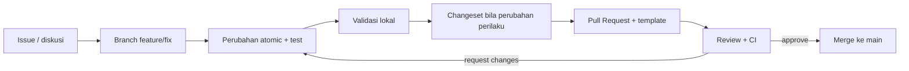

# Berkontribusi ke AWCMS-Mini

Terima kasih sudah tertarik berkontribusi. Dokumen ini menjelaskan cara berkontribusi ke AWCMS-Mini secara aman, konsisten, dan sesuai standar proyek.

> **Wajib dibaca lebih dulu:** [`AGENTS.md`](AGENTS.md) adalah kontrak kerja teknis (aturan wajib, guardrail keamanan, alur task). Dokumen ini melengkapinya dengan sisi proses kontribusi.

## Prinsip singkat

1. **Atomic** — satu Pull Request = satu perubahan yang jelas dan terisolasi.
2. **Aman by default** — jangan pernah commit secret, kredensial, dump database, atau data pengguna asli (lihat [`SECURITY.md`](SECURITY.md)).
3. **Konsisten** — ikuti coding standard (`docs/awcms-mini/10_template_kode_coding_standard.md`) dan konvensi commit di bawah.
4. **Terdokumentasi** — perubahan perilaku wajib menyertakan update dokumen dan changeset.

## Alur kontribusi



1. **Mulai dari issue.** Cek [`docs/awcms-mini/06_github_issues_detail.md`](docs/awcms-mini/06_github_issues_detail.md) dan snapshot di [`docs/awcms-mini/github/`](docs/awcms-mini/github/README.md). Bila belum ada issue, buat lebih dulu memakai template.
2. **Buat branch** dari `main`: `feature/<issue>-<nama>`, `fix/<issue>-<nama>`, atau `docs/<topik>`.
3. **Kerjakan atomic.** Ikuti aturan wajib di `AGENTS.md`: migration bila schema berubah, OpenAPI bila API berubah, AsyncAPI bila event berubah, idempotency untuk mutation high-risk, ABAC + RLS untuk data tenant-scoped, audit untuk aksi high-risk, masking untuk data sensitif.
4. **Validasi lokal** (lihat di bawah) — jangan buka PR bila validasi gagal.
5. **Tambahkan changeset** bila perubahan mempengaruhi perilaku: `bun run changeset`. Perubahan docs-only/chore boleh tanpa changeset.
6. **Buka Pull Request** dengan mengisi template PR. Kaitkan issue terkait (`Closes #NNN`).

## Setup pengembangan

```bash
bun install
# foundation skeleton sudah tersedia; jalankan gate penuh:
# docker compose up -d db
# cp .env.example .env
# bun run db:migrate && bun run dev
```

Prasyarat: **Bun** (versi terkunci di `package.json` `packageManager`/`engines`). Repositori ini **Bun-only** — jangan menambahkan `node`/`npm`/`npx`/`pnpm`/`yarn` atau tooling yang memaksa runtime Node.js (lihat `AGENTS.md` aturan 14 dan `docs/awcms-mini/10_template_kode_coding_standard.md`).

## Validasi sebelum PR

Jalankan yang relevan dengan perubahan Anda:

```bash
bun run check                # gate CI utama: lint + check:docs + api:spec:check + api:docs:check + repo:inventory:check + modules:dag:check + modules:compose:check + modules:composition:inventory:check + extension:check + i18n:pot:check + i18n:parity:check + config:docs:check + logging:lint:check + typecheck + test + build
bun run lint                 # prettier check dokumen
bun run typecheck            # tsc --noEmit
bun test                     # unit + integration test (bun:test) di tests/
bun run api:spec:check       # bila mengubah OpenAPI/AsyncAPI
bun run db:migrate           # bila menambah migration
bun run extension:check      # bila mengubah manifest kompatibilitas aplikasi turunan (extension.manifest.json, Issue #741)
bun run build                # Astro foundation build
bun run production:preflight  # cek gabungan pra-deploy
bun run performance:query-plan:check  # bila mengubah query kritikal (RLS/pagination/search/outbox-claim/retention-purge/reporting) — lihat docs/awcms-mini/performance-suite.md
```

Untuk perubahan docs-only, pastikan minimal format Markdown lolos (`bunx prettier --check`) dan tautan internal tidak rusak.

## Menulis test

- Test runner = **`bun test`** (`bun:test`, kompatibel `node:test`). Berkas test di `tests/`, pola nama `*.test.mjs` / `*.test.ts`.
- Pisahkan **logika murni** (mudah di-unit-test, tanpa I/O) dari **I/O/orkestrasi**. Contoh acuan: `scripts/lib/docs-checks.mjs` (murni, diuji unit) vs `scripts/check-docs.mjs` (I/O + CLI, diuji integration). Guard eksekusi CLI dengan `if (import.meta.main)` agar bisa diimpor test tanpa efek samping.
- Setiap perubahan perilaku wajib disertai test yang gagal sebelum fix dan lulus sesudahnya. Lihat doc 07 §Testing Strategy untuk lapisan test (unit → integration → contract → security).

## Konvensi commit

Format [Conventional Commits](https://www.conventionalcommits.org/):

```text
<type>(<scope>): <ringkasan singkat, imperative>
```

- **Types:** `feat`, `fix`, `docs`, `test`, `refactor`, `chore`, `security`, `perf`, `ci`, `build`.
- **Scopes base:** `foundation`, `db`, `api`, `auth`, `access`, `profile`, `tenant`, `sync`, `ui`, `logging`, `pooling`, `workflow`, `reporting`, `security`, `docs`. Aplikasi turunan menambah scope domainnya sendiri.
- Baris badan menjelaskan **alasan** perubahan; footer memakai `Closes #NNN`.

## Definition of Done

Sebuah PR dianggap selesai jika:

- Scope sesuai issue, tanpa perubahan unrelated.
- Migration/OpenAPI/AsyncAPI diperbarui bila schema/API/event berubah.
- Input validation, Auth/ABAC/RLS, audit high-risk, masking data sensitif diterapkan.
- Soft delete diterapkan untuk resource yang deletable; data posted tetap immutable.
- Test relevan lulus; build lulus; CI hijau.
- Dokumentasi diperbarui; changeset ditambahkan bila perilaku berubah.
- Tidak ada secret/data sensitif dalam diff.

## Review

- Reviewer memakai kriteria di [`docs/awcms-mini/09_roadmap_repository_commit.md`](docs/awcms-mini/09_roadmap_repository_commit.md) dan skill `awcms-mini-pr-review`.
- Modul sensitif (auth, access, profile, sync) memerlukan review keamanan tambahan (`awcms-mini-security-review`).
- Maintainer yang tercantum di [`.github/CODEOWNERS`](.github/CODEOWNERS) otomatis diminta review.

## Lisensi kontribusi

Dengan mengirim kontribusi, Anda setuju bahwa kontribusi tersebut dilisensikan di bawah [lisensi MIT](LICENSE) proyek ini.

## Pertanyaan

Lihat [`SUPPORT.md`](SUPPORT.md) untuk kanal bantuan. Untuk laporan keamanan, ikuti [`SECURITY.md`](SECURITY.md) — **jangan** buka issue publik untuk kerentanan.
