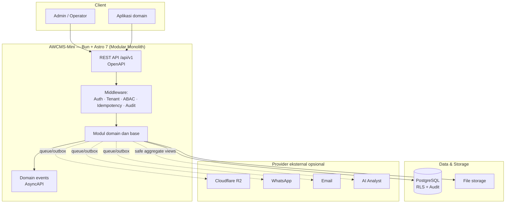

# AWCMS-Mini — Standar Modular Monolith

AWCMS-Mini adalah baseline standar pengembangan aplikasi AhliWeb yang mengikuti paket arsitektur dan proses dari repo referensi **AWPOS**. Repo ini dipertahankan sebagai baseline dokumen, agent, skill, versioning, dan roadmap sebelum kode aplikasi dibuat ulang secara bertahap.

> **Status:** repository ini kembali ke baseline **docs-only** agar konteksnya sejajar dengan `ahliweb/awpos`. Kode runtime aplikasi belum ada di branch ini. Implementasi dimulai ulang dari **Issue 0.1** sesuai dokumen roadmap. Coding agent dan kontributor wajib membaca [`AGENTS.md`](AGENTS.md) terlebih dahulu.

## Target Arsitektur



Provider eksternal terhubung lewat outbox/queue dan tidak menjadi dependency transaksi kritikal.

## Stack Target

- Runtime: **Bun**
- Web framework: **Astro 7**
- Database: **PostgreSQL**
- Arsitektur: **Modular monolith, microservice-ready**
- Security baseline: **RBAC + ABAC + PostgreSQL RLS + Audit Log**
- API contract: **OpenAPI**
- Event contract: **AsyncAPI**
- Versioning: **Semantic Versioning + Changesets**

## Paket Dokumen

Dokumen lengkap berada di:

```text
docs/awcms-mini/
```

Urutan dokumen:

1. `01_canvas_induk.md`
2. `02_prd_detail_per_modul.md`
3. `03_srs_detail_per_modul.md`
4. `04_erd_data_dictionary.md`
5. `05_openapi_asyncapi_detail.md`
6. `06_github_issues_detail.md`
7. `07_sprint_testing_production_readiness.md`
8. `08_sop_operasional_user_guide.md`
9. `09_roadmap_repository_commit.md`
10. `10_template_kode_coding_standard.md`
11. `11_implementation_blueprint.md`
12. `12_generator_prompt.md`
13. `13_final_master_index_traceability.md`
14. `14_ui_ux_design_system.md`
15. `15_frontend_architecture_integration.md`
16. `16_backend_data_access_integration.md`
17. `17_default_seed_rbac_abac.md`
18. `18_configuration_env_reference.md`
19. `19_glossary_terminology.md`

## Untuk Kontributor dan Coding Agent

1. Baca [`AGENTS.md`](AGENTS.md).
2. Baca dokumen di `docs/awcms-mini/` sesuai task.
3. Gunakan skill proyek di [`.claude/skills/`](.claude/skills/README.md).
4. Kerjakan atomic per issue; migration, OpenAPI, AsyncAPI, test, dan SOP ditambahkan saat implementasi runtime dimulai.
5. Sertakan laporan implementasi dan validasi sesuai Definition of Done.

## Versioning

Proyek memakai Semantic Versioning dengan [Changesets](.changeset/README.md). Riwayat rilis ada di [`CHANGELOG.md`](CHANGELOG.md). Setiap PR yang mengubah perilaku wajib menyertakan changeset.

## Status Repository

Repo ini telah dibersihkan agar hanya menyimpan konteks yang punya padanan di `ahliweb/awpos` dengan adaptasi nama AWCMS-Mini. Struktur runtime sebelumnya sudah dihapus dari branch ini dan dapat dibuat ulang mengikuti dokumen Bagian 9-12 serta aturan di `AGENTS.md`.
