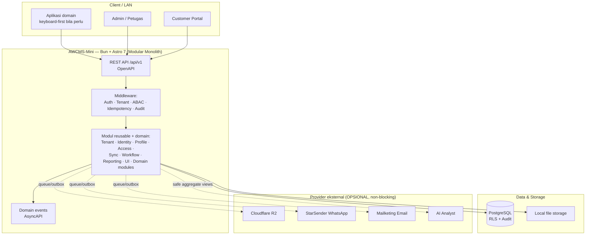
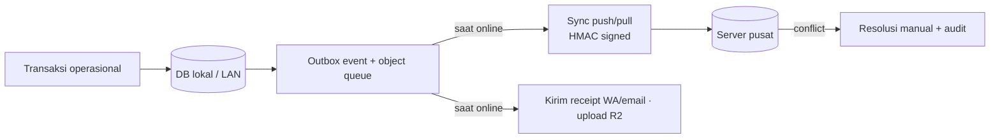
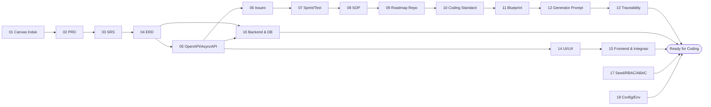

# AWCMS-Mini — Modular Monolith Standard

AWCMS-Mini adalah baseline standar pengembangan aplikasi AhliWeb berbasis **Bun + Astro 7 + PostgreSQL**. Struktur repo, dokumen, skill, dan proses mengikuti repo referensi AWPOS, tetapi konteksnya disesuaikan menjadi base modular monolith yang bisa dipakai untuk aplikasi domain berikutnya.

> **Status:** repository ini masih berupa **paket perencanaan (docs-only)**. Belum ada kode aplikasi. Implementasi dimulai dari **Issue 0.1**. Coding agent & kontributor **wajib membaca [`AGENTS.md`](AGENTS.md) lebih dulu**.

## Arsitektur tingkat tinggi



Provider eksternal terhubung lewat **outbox/queue**, bukan jalur langsung transaksi — sehingga aplikasi tetap dapat menjalankan alur kritikal saat koneksi eksternal bermasalah.

## Prinsip offline-first



## Stack final

- Runtime: **Bun**
- Web framework: **Astro 7**
- Database: **PostgreSQL**
- Arsitektur: **Modular monolith, microservice-ready**
- Mode operasi: **Offline-first / LAN-first**, optional online sync
- Storage file optional: **Cloudflare R2**
- Bot/security optional untuk public form: Cloudflare Turnstile jika dibutuhkan
- Security baseline: **RBAC + ABAC + PostgreSQL RLS + Audit Log**
- API contract: **OpenAPI**
- Event contract: **AsyncAPI**

## Prinsip utama

1. Alur operasional kritikal harus tetap berjalan tanpa internet bila mode offline/LAN diaktifkan.
2. Provider eksternal seperti R2, WhatsApp, email, dan AI tidak boleh menjadi dependency transaksi operasional.
3. Transaksi posted harus immutable, idempotent, atomic, dan audit-ready.
4. Stok harus dikelola dengan stock movement append-only dan locking saat mutation.
5. Multi-tenant wajib memakai `tenant_id`, RLS, tenant context, dan ABAC.
6. Data sensitif seperti password, token, NPWP, NIK, email, nomor HP, dan receipt token wajib dilindungi.
7. Master/config/draft yang bisa dihapus memakai **soft delete**; list default menyembunyikan `deleted_at`, restore/purge harus berizin dan diaudit.
8. Dokumentasi, migration, API contract, test, dan SOP harus mengikuti implementasi nyata.

## Paket dokumen

Dokumen lengkap berada di folder:

```text
docs/awcms-mini/
```

Rantai dokumen dari kebutuhan bisnis sampai siap coding:



Urutan dokumen:

1. `01_canvas_induk.md`
2. `02_prd_detail_per_modul.md`
3. `03_srs_detail_per_modul.md`
4. `04_erd_data_dictionary.md`
5. `05_openapi_asyncapi_detail.md`
6. `06_github_issues_detail.md`
7. `07_sprint_testing_production_readiness.md`
8. `08_sop_operasional_user_guide.md`
9. `09_roadmap_repository_commit.md`
10. `10_template_kode_coding_standard.md`
11. `11_implementation_blueprint.md`
12. `12_generator_prompt.md`
13. `13_final_master_index_traceability.md`
14. `14_ui_ux_design_system.md`
15. `15_frontend_architecture_integration.md`
16. `16_backend_data_access_integration.md`
17. `17_default_seed_rbac_abac.md`
18. `18_configuration_env_reference.md`
19. `19_glossary_terminology.md`

Dokumen 14–18 adalah **desain teknis implementasi** (UI/UX, frontend, backend, database, seed/RBAC/ABAC, konfigurasi) yang melengkapi 01–13 agar siap dikoding; dokumen 19 adalah **glossary** rujukan istilah.

Snapshot GitHub issue aktual dicatat terpisah di [`docs/awcms-mini/github/`](docs/awcms-mini/github/). Folder tersebut memisahkan issue `OPEN` dan `CLOSED`, maksimal 100 issue per file, serta menyertakan proses refresh snapshot, label, dan milestone.

Mulai implementasi dari **Issue 0.1 — Initialize AWCMS-Mini Modular Monolith Repository Structure**.

## Urutan implementasi awal

```text
Issue 0.1 — Initialize repository structure
Issue 0.2 — Add SQL migration runner
Issue 0.3 — Add OpenAPI and AsyncAPI baseline
Issue 12.1 — Add initial setup wizard API
Issue 2.1 — Add tenant and office schema
Issue 2.2 — Add central profile schema
Issue 2.3 — Add identity login
Issue 2.4 — Add RBAC and ABAC
Issue 3.1 — Add product catalog MVP
Issue 3.2 — Add stock balance and stock movement
Issue 3.3 — Add checkout session and cart
Issue 3.4 — Add idempotent atomic transaction posting
```

## Untuk kontributor & coding agent

1. Baca [`AGENTS.md`](AGENTS.md) — kontrak kerja, aturan wajib, guardrail keamanan, alur task.
2. Baca dokumen di `docs/awcms-mini/` sesuai kebutuhan task (lihat peta dokumen di `AGENTS.md`).
3. Gunakan **skill proyek** di [`.claude/skills/`](.claude/skills/README.md) — mis. `awcms-mini-implement-issue`, `awcms-mini-new-migration`, `awcms-mini-new-endpoint` — agar standar dokumen diterapkan konsisten.
4. Kerjakan **atomic** per issue; migration bila schema berubah, OpenAPI bila API berubah, AsyncAPI bila event berubah.
5. Sertakan laporan implementasi dan pastikan validasi (`db:migrate`, `api:spec:check`, `test`, `build`) pass.

### Skill proyek tersedia

`awcms-mini-implement-issue` · `awcms-mini-new-module` · `awcms-mini-new-migration` · `awcms-mini-new-endpoint` · `awcms-mini-new-event` · `awcms-mini-idempotency` · `awcms-mini-abac-guard` · `awcms-mini-audit-log` · `awcms-mini-sensitive-data` · `awcms-mini-sync-hmac` · `awcms-mini-security-review` · `awcms-mini-pr-review` · `awcms-mini-testing` · `awcms-mini-production-preflight` · `awcms-mini-ui-screen` · `awcms-mini-release` · `awcms-mini-legacy-migration`. Detail: [`.claude/skills/README.md`](.claude/skills/README.md).

### Subagents tersedia

`awcms-mini-coder` (implementasi issue) · `awcms-mini-reviewer` (review PR, read-only) · `awcms-mini-security-auditor` (audit keamanan + verdict go-live, read-only). Definisi di [`.claude/agents/`](.claude/agents/). Alur: issue → coder → reviewer → auditor (modul sensitif) → merge.

## AWCMS-Mini sebagai standar pengembangan

AWCMS-Mini disusun agar dapat dijadikan **template/contoh** membangun aplikasi di atas standar yang sama. Lapisan **reusable** (modular monolith + module contract, RBAC/ABAC/RLS + audit, konvensi migration/OpenAPI/AsyncAPI, design system & shell, offline-first, skill proyek, standar commit/preflight) dipertahankan; lapisan **spesifik domain** diganti sesuai kebutuhan aplikasi baru. Rincian pemetaan reusable vs domain ada di [`docs/awcms-mini/README.md`](docs/awcms-mini/README.md).

## Versioning

Proyek memakai **Semantic Versioning** dengan **[Changesets](.changeset/README.md)**; riwayat rilis di [`CHANGELOG.md`](CHANGELOG.md). Setiap PR yang mengubah perilaku wajib menyertakan changeset (`bun run changeset`). Baseline saat ini `0.0.0`; rilis bertag pertama `0.1.0` (Foundation) sesuai doc 09. Detail: [`docs/awcms-mini/09_roadmap_repository_commit.md`](docs/awcms-mini/09_roadmap_repository_commit.md).

## Status repository

Dokumen ini adalah baseline perencanaan teknis (**docs-only**, belum ada kode aplikasi; sudah ada tooling versioning). Audit standar pengembangan terakhir tersedia di [`docs/awcms-mini/AUDIT_STANDAR_PENGEMBANGAN_2026-07-04.md`](docs/awcms-mini/AUDIT_STANDAR_PENGEMBANGAN_2026-07-04.md). Implementasi kode dimulai setelah struktur repository dibuat mengikuti dokumen Bagian 9–12 dan aturan di `AGENTS.md`.
