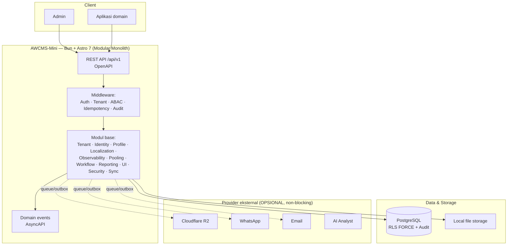

# AWCMS-Mini — Base Modular Monolith Standard

AWCMS-Mini adalah **base modular monolith** (Bun + Astro + PostgreSQL) yang menjadi **standar pengembangan semua aplikasi AhliWeb**. Arsitektur, dokumen, dan konvensinya mengikuti paket perencanaan **AWPOS** (`docs/awpos` pada repo awpos) — AWPOS adalah contoh aplikasi domain pertama di atas base ini.

> **Status:** Foundation (Sprint 1) selesai & tervalidasi — buildable, teruji, siap dilanjutkan dari Issue 1.1. Coding agent & kontributor **wajib membaca [`AGENTS.md`](AGENTS.md) lebih dulu**.

## Arsitektur tingkat tinggi



## Stack final

- Runtime: **Bun** · Web: **Astro 7** (SSR) · Database: **PostgreSQL** (postgres.js)
- Arsitektur: **Modular monolith, microservice-ready**
- Security baseline: **RBAC + ABAC (default deny) + RLS FORCE + Audit Log**
- Kontrak: **OpenAPI** (REST) + **AsyncAPI** (domain event)
- Versioning: **SemVer + Changesets**

## Quick start

```bash
bun install
docker compose up -d postgres
cp .env.example .env
bun run db:migrate
bun run dev            # http://localhost:4321 → /api/v1/health
```

Validasi lengkap: `bun run production:preflight` (atau langkah individual: `bun test`, `bun run api:spec:check`, `bun run security:readiness`, `bun run build`).

## Yang sudah tersedia (Foundation)

- **Module contract + registry** — `src/modules/index.ts`, 11 modul base skeleton ber-TODO.
- **Helper standar `_shared`** — response envelope, error code, tenant context, ABAC guard (default deny), audit + redaction, domain event envelope, idempotency, validasi input.
- **`src/lib`** — config fail-fast (doc 18), logger Pino + redaction, pool postgres.js, `withTenant` (RLS `SET LOCAL`), transaction wrapper, scrypt password, JWT sesi, storage lokal, i18n.
- **Database** — migration runner berurutan + checksum, schema 001–004 (foundation, tenant/identity/profile, RBAC/ABAC, observability) dengan **RLS FORCE teruji**.
- **Kontrak** — OpenAPI + AsyncAPI baseline; `api:spec:check` menjaga konsistensi kontrak ↔ modul.
- **Ops** — health & pool health endpoint, contract test, security readiness, production preflight, Docker Compose PostgreSQL, profil deploy.

## Paket dokumen

Dokumen 01–19 di [`docs/awcms-mini/`](docs/awcms-mini/README.md) (struktur sama dengan paket AWPOS): canvas induk, PRD, SRS, ERD, OpenAPI/AsyncAPI, issues, sprint/testing, SOP, roadmap repo, coding standard, blueprint, generator prompt, traceability, UI/UX, frontend, backend/data access, seed RBAC/ABAC, env reference, glossary.

## Membangun aplikasi baru di atas base

1. Gunakan base ini; **jangan ubah lapisan `_shared`/`lib`** kecuali lewat issue base.
2. Tambah modul domain di `src/modules/` + daftarkan di registry; migration lanjut nomor berikutnya (`005_awcms_...`); kontrak di `openapi/modules/` + AsyncAPI.
3. Susun paket dokumen 01–19 aplikasi Anda — paket AWPOS adalah contoh terisi penuh.
4. Ikuti `AGENTS.md`, skill proyek [`.claude/skills/`](.claude/skills/README.md), dan subagents [`.claude/agents/`](.claude/agents/).

## Versioning

SemVer + [Changesets](.changeset/README.md); riwayat di [`CHANGELOG.md`](CHANGELOG.md). Setiap PR yang mengubah perilaku wajib menyertakan changeset. Baseline `0.0.0`; rilis bertag pertama `0.1.0` (Foundation).

## Lisensi & arsip

Lihat [`LICENSE.md`](LICENSE.md). Implementasi sebelumnya (Astro+Hono+emdash, single-tenant) diarsip di branch `legacy/pre-awpos-standard`.
