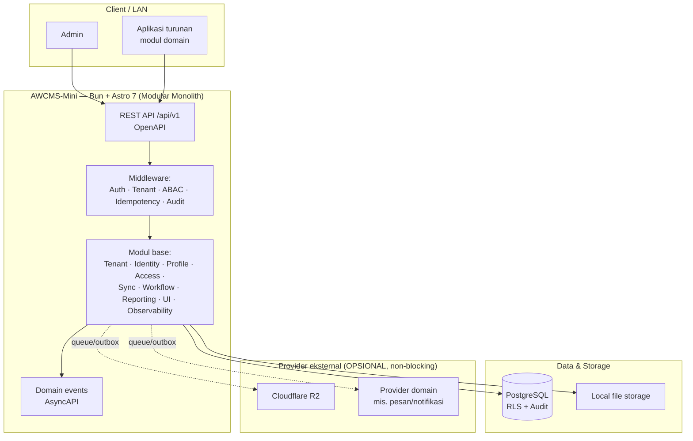
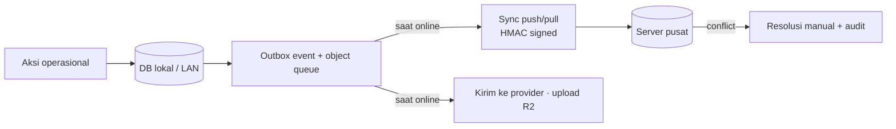
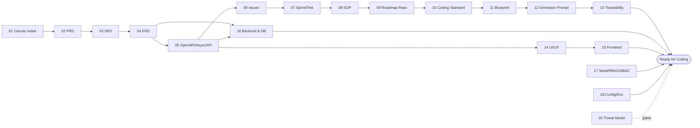

# AWCMS-Mini — Modular Monolith Standard

AWCMS-Mini adalah **base modular monolith standar** AhliWeb berbasis **Bun + Astro 7 + PostgreSQL**. Ia berisi lapisan **reusable** (multi-tenant, RBAC/ABAC/RLS, audit, offline-first, kontrak OpenAPI/AsyncAPI, coding standard, skill proyek) yang menjadi fondasi aplikasi turunan. Aplikasi domain (mis. AWPOS untuk retail/POS) dibangun **di atas** base ini dengan menambah modulnya sendiri.

> **Status:** Sprint foundation Issue 0.1-0.3, seluruh epic Tenant/Identity/Profile (Issue 2.1-2.4, M2), Issue 12.1 (Setup Wizard), seluruh epic M5 Sync Storage (Issue 6.1-6.3), seluruh epic M7 UI/UX & Reporting (Issue 8.1 Admin Layout Shell, 9.1 Management Reporting Views), Issue 10.1 (Structured Logging and Audit Trail), dan Issue 10.2 (Database Connection Pooling and Backpressure) tersedia: Astro build, health endpoint, module contract, response helper, soft-delete convention, folder standar, runner PostgreSQL checksum-based, baseline OpenAPI/AsyncAPI dengan validator, skema tenant/office/physical location/tenant settings, skema profile/identifier/channel/address/entity link/merge request, skema identity/tenant user/session dengan endpoint live `POST /auth/login`, `POST /auth/logout`, `GET /auth/me`, skema RBAC/ABAC dengan evaluator default-deny live `POST /access/evaluate`, setup wizard live `GET /setup/status`, `POST /setup/initialize`, sync node/outbox/inbox HMAC-signed live `POST /sync/push`, `POST /sync/pull`, `GET /sync/status`, sync conflict tracking/resolution (bearer session) live `GET /sync/conflicts`, `POST /sync/conflicts/{id}/resolve`, R2 object sync queue HMAC-signed live `POST /sync/objects`, `GET /sync/objects/status`, SSR admin shell (`/login`, `/admin`, `/admin/settings`) dengan design token/theming dan sesi cookie httpOnly, dashboard reporting live `GET /reports/tenant-activity`, `GET /reports/access-audit`, `GET /reports/sync-health`, `GET /reports/module-usage`, audit trail generik live `GET /logs/audit` dengan logger JSON terstruktur, redaksi lintas-modul, correlation ID, serta contoh lifecycle profil (`DELETE`/`POST .../restore`/`POST .../purge`), dan connection pooling/backpressure live `GET /database/pool/health` dengan work-class gate serta circuit breaker terpasang di `withTenant` (melindungi seluruh endpoint tenant-scoped) — seluruhnya dengan RLS. Modul deployment masih backlog. Kontributor & coding agent **wajib membaca [`AGENTS.md`](AGENTS.md) lebih dulu**.

## Daftar isi

- [Arsitektur tingkat tinggi](#arsitektur-tingkat-tinggi)
- [Stack](#stack)
- [Prinsip utama](#prinsip-utama)
- [Paket dokumen](#paket-dokumen)
- [Untuk kontributor](#untuk-kontributor)
- [Keamanan](#keamanan)
- [Tata kelola & komunitas](#tata-kelola--komunitas)
- [Versioning](#versioning)
- [Lisensi](#lisensi)

## Arsitektur tingkat tinggi

Provider eksternal terhubung lewat **outbox/queue**, bukan jalur langsung transaksi — sehingga alur kritikal tetap jalan saat koneksi eksternal bermasalah.

## Prinsip offline-first

## Stack

- Runtime: **Bun** ([ADR-0002](docs/adr/0002-bun-only-runtime.md) — Bun-only; Node.js hanya lewat pengecualian tertulis)
- Web framework: **Astro 7** (SSR di atas Bun)
- Database: **PostgreSQL** dengan **RLS** ([ADR-0003](docs/adr/0003-postgresql-rls-multi-tenant.md))
- Arsitektur: **Modular monolith, microservice-ready** ([ADR-0001](docs/adr/0001-modular-monolith-architecture.md))
- Mode operasi: **Offline-first / LAN-first**, optional online sync ([ADR-0006](docs/adr/0006-offline-first-sync-outbox.md))
- Storage file opsional: **Cloudflare R2**
- Security baseline: **RBAC + ABAC + PostgreSQL RLS + Audit Log** ([ADR-0004](docs/adr/0004-rbac-abac-default-deny.md))
- Kontrak: **OpenAPI** + **AsyncAPI** ([ADR-0007](docs/adr/0007-openapi-asyncapi-contracts.md))

## Prinsip utama

1. Alur operasional kritikal tetap berjalan tanpa internet bila mode offline/LAN diaktifkan.
2. Provider eksternal (R2, pesan, dsb.) tidak boleh menjadi dependency alur kritikal dan tidak boleh dipanggil di dalam DB transaction.
3. Data yang sudah posted (bila aplikasi turunan memilikinya) bersifat immutable, idempotent, atomic, dan audit-ready.
4. Multi-tenant wajib memakai `tenant_id`, RLS, tenant context, dan ABAC.
5. Data sensitif (password, token, NPWP, NIK, email, nomor HP) wajib di-hash/mask/redact.
6. Master/config/draft yang bisa dihapus memakai **soft delete**; list default menyembunyikan `deleted_at`, restore/purge harus berizin dan diaudit ([ADR-0005](docs/adr/0005-soft-delete-and-immutability.md)).
7. Dokumentasi, migration, API contract, test, dan SOP mengikuti implementasi nyata.
8. Backend **Bun-only**; pengecualian Node.js hanya dengan izin maintainer + catatan docs.

## Paket dokumen

Paket dokumen master ada di [`docs/awcms-mini/`](docs/awcms-mini/README.md). Rantai dari kebutuhan sampai siap koding:

- **01–13** perencanaan → kontrak → eksekusi; **14–18** desain teknis; **19** glossary; **20** threat model & arsitektur keamanan.
- **Catatan penting:** dokumen **02–19** memakai domain retail/POS (gaya AWPOS) sebagai **contoh ilustratif** — polanya reusable, entitas/endpoint/layarnya adalah ilustrasi domain yang diganti aplikasi turunan. Lihat [`docs/awcms-mini/README.md`](docs/awcms-mini/README.md) §Reusable vs domain turunan.
- **Keputusan arsitektural** dicatat di [`docs/adr/`](docs/adr/README.md).
- **Snapshot GitHub issue** aktual di [`docs/awcms-mini/github/`](docs/awcms-mini/github/README.md).

## Untuk kontributor

1. Baca [`AGENTS.md`](AGENTS.md) — kontrak kerja, aturan wajib, guardrail keamanan.
2. Baca [`CONTRIBUTING.md`](CONTRIBUTING.md) — alur kontribusi, setup, konvensi commit, Definition of Done.
3. Gunakan **skill proyek** di [`.claude/skills/`](.claude/skills/README.md) agar standar diterapkan konsisten.
4. Kerjakan **atomic** per issue; migration bila schema berubah, OpenAPI bila API berubah, AsyncAPI bila event berubah.
5. Validasi (`bun run check` = lint + docs-check + typecheck + `bun test` + Astro build) sebelum PR.

### Mulai dari

Backlog base generik ada di [`docs/awcms-mini/06_github_issues_detail.md`](docs/awcms-mini/06_github_issues_detail.md). Foundation **Issue 0.1-0.3**, seluruh epic M2 (**2.1** tenant/office, **2.2** central profile, **2.3** identity/login, **2.4** RBAC/ABAC), **12.1** (setup wizard), seluruh epic M5 Sync Storage (**6.1** sync outbox/inbox, **6.2** sync conflict tracking/resolution, **6.3** R2 object sync queue), seluruh epic M7 UI/UX & Reporting (**8.1** admin layout shell, **9.1** management reporting views), **10.1** (structured logging & audit trail), dan **10.2** (database connection pooling & backpressure) sudah tersedia; urutan berikutnya: **10.3** (production security readiness), **11.1** (workflow approval engine), **12.2** (offline/LAN deployment profile) — semuanya epic M8, kini `status:ready`.

## Keamanan

- Kebijakan pelaporan kerentanan: [`SECURITY.md`](SECURITY.md) (gunakan private vulnerability reporting — **jangan** issue publik).
- Model ancaman & arsitektur keamanan: [`docs/awcms-mini/20_threat_model_security_architecture.md`](docs/awcms-mini/20_threat_model_security_architecture.md).
- Automasi: Dependabot, CodeQL, secret scanning, CI hygiene (Bun-only + no-`.env`).

## Tata kelola & komunitas

| Dokumen                                    | Isi                                 |
| ------------------------------------------ | ----------------------------------- |
| [`CONTRIBUTING.md`](CONTRIBUTING.md)       | Cara berkontribusi                  |
| [`CODE_OF_CONDUCT.md`](CODE_OF_CONDUCT.md) | Standar perilaku komunitas          |
| [`GOVERNANCE.md`](GOVERNANCE.md)           | Peran, pengambilan keputusan, rilis |
| [`SUPPORT.md`](SUPPORT.md)                 | Kanal bantuan                       |
| [`SECURITY.md`](SECURITY.md)               | Kebijakan keamanan                  |
| [`docs/adr/`](docs/adr/README.md)          | Architecture Decision Records       |

## Versioning

**Semantic Versioning** + **[Changesets](.changeset/README.md)**; riwayat di [`CHANGELOG.md`](CHANGELOG.md). Setiap PR yang mengubah perilaku wajib menyertakan changeset. Versi saat ini `0.13.0` (Foundation skeleton SSR + Issue 2.1-2.4: tenant/office, central profile, identity/login, RBAC/ABAC + Issue 12.1 setup wizard + epic M5 Sync Storage tuntas: Issue 6.1 sync outbox/inbox, 6.2 sync conflict tracking/resolution, 6.3 R2 object sync queue + epic M7 UI/UX & Reporting tuntas: Issue 8.1 admin layout shell, 9.1 management reporting views + Issue 10.1 structured logging & audit trail + Issue 10.2 database connection pooling & backpressure).

## Lisensi

Dilisensikan di bawah lisensi **MIT** — lihat [`LICENSE`](LICENSE). Audit standar pengembangan terakhir: [`docs/awcms-mini/AUDIT_STANDAR_PENGEMBANGAN_2026-07-04.md`](docs/awcms-mini/AUDIT_STANDAR_PENGEMBANGAN_2026-07-04.md).
