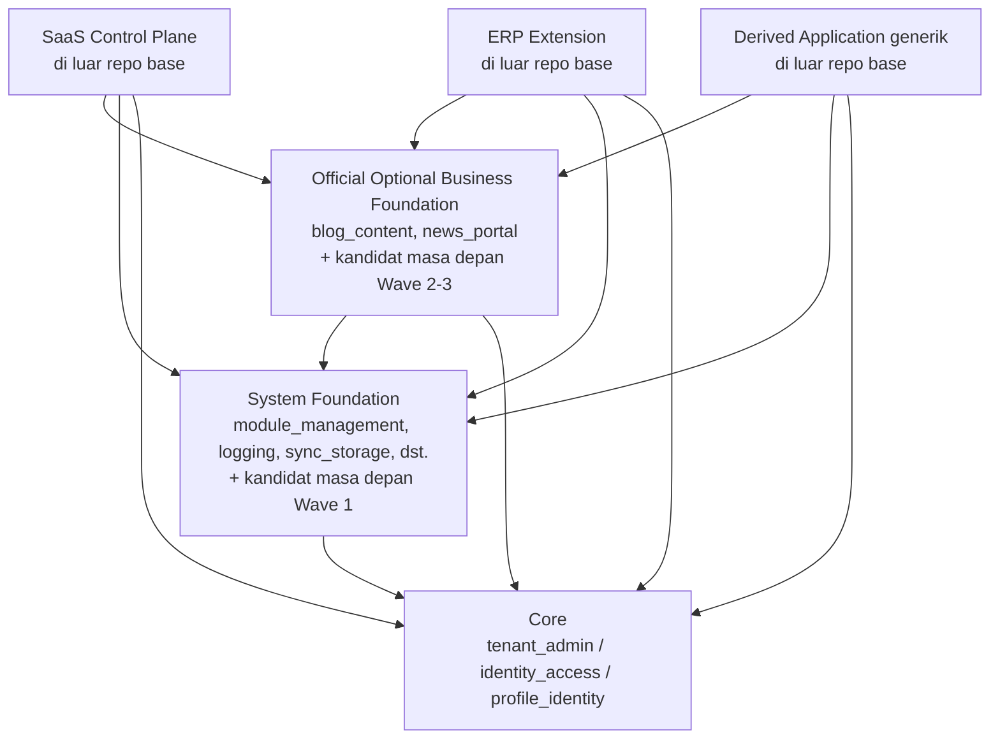

# ADR-0013 — Lapisan ekstensi platform, batas tenant/bisnis, dan kriteria evidence-based ekstraksi layanan

- **Status:** Accepted
- **Tanggal:** 2026-07-13
- **Pengambil keputusan:** @ahliweb
- **Terkait:** Issue #739 (epic #738 `platform-evolution`), Issue #680/#681/#696 (epic #679 `platform-hardening`), ADR-0001, ADR-0002, ADR-0003, ADR-0004, ADR-0005, ADR-0006, ADR-0011, ADR-0012, `docs/awcms-mini/21_module_admission_governance.md`, `docs/awcms-mini/derived-application-guide.md`, `docs/awcms-mini/19_glossary_terminology.md`, `src/modules/module-management/domain/module-dependency-graph.ts`

> **Catatan amandemen (2026-07-19, Issue #869 epic #868).** Klasifikasi
> placement **SaaS Control Plane** di §1 (tabel baris 4, kolom "Hidup di
> repo base ini? = **Tidak pernah**"), serta penempatan "di luar base"
> untuk SaaS Control Plane di §3/§6/§8, **di-amend oleh
> [ADR-0022](0022-saas-control-plane-admission-boundary-and-lifecycle-contracts.md)**:
> ketujuh modul control-plane (`service_catalog`, `tenant_entitlement`,
> `tenant_provisioning`, `tenant_lifecycle`, `usage_metering`,
> `subscription_billing`, `payment_gateway`) sekarang diadmisi sebagai
> **Official Optional Business Foundation (lapisan 3) in-repo,
> default-disabled** — bukan lapisan-4 out-of-repo. Mengikuti aturan
> `docs/adr/README.md`, badan ADR-0013 di bawah **sengaja tidak** ditulis
> ulang; hanya titik placement itu yang berubah. **Semua aturan ADR-0013
> lain tetap berlaku penuh** — arah DAG (§1), tenant = batas keamanan RLS
> tunggal (§2), pemisahan tegas SaaS billing vs ERP general ledger (§3),
> data-ownership matrix + no-shared-table-write (§6), kriteria
> evidence-based ekstraksi layanan (§7). Lihat ADR-0022 untuk detail.

## Konteks

AWCMS-Mini sudah punya modular monolith tepercaya (ADR-0001), registry statis (ADR-0012), validasi seluruh registry sebagai DAG (`validateModuleDependencyGraph`, Issue #680), pemisahan capability port/adapter untuk kolaborasi lintas-modul (ADR-0011, Issue #681), dan lima kategori admission modul (Core/System/Official Optional Module/Derived Application/External Integration, `docs/awcms-mini/21_module_admission_governance.md`, Issue #696). Semua mekanisme itu menjawab satu pertanyaan: **modul baru apa boleh masuk registry base ini, dan kategori apa yang berlaku** — sepenuhnya di dalam satu repo.

Epic #738 mengangkat pertanyaan satu level di atasnya, yang belum pernah dijawab: bagaimana **banyak repo turunan yang independen** (SaaS control plane, ekstensi ERP, dan aplikasi turunan vertikal seperti POS/CRM/portal sekolah) boleh **menyusun** kemampuan base ini tanpa mengedit registry base, tanpa saling menimpa data satu sama lain, dan dengan bar yang jelas kapan (bila pernah) sebuah modul layak dipisah jadi layanan sendiri. Dokumen governance yang ada (doc 21) eksplisit menyebut kategori "Derived Application" sebagai satu ember besar "di luar repo base" — cukup untuk admission satu modul, tapi tidak cukup untuk memisahkan secara tegas: layanan katalog & billing SaaS (yang menagih **tenant** untuk memakai platform) dari katalog item & general ledger ERP (pembukuan **internal** milik tenant itu sendiri), atau tenant (batas keamanan/isolasi RLS) dari legal entity/organization unit (pengelompokan bisnis/akuntansi di dalam satu tenant yang sama).

Issue ini **docs-only, tanpa mengubah perilaku runtime** — tujuannya murni membangun kosakata dan aturan arah dependency yang mengikat sebelum 16 issue lain di epic #738 didesain di atasnya. Sebelum menulis ADR ini, konten berikut dibaca dan dijadikan ground truth (bukan diasumsikan):

- `src/modules/_shared/module-contract.ts` — `ModuleType` union hari ini hanya `"base" | "system" | "domain" | "integration" | "derived"`, **tidak diubah** oleh ADR ini.
- `src/modules/module-management/domain/module-dependency-graph.ts` — validator DAG registry-wide (self-dependency, duplicate, missing dependency, cycle via algoritma Kahn) yang sudah berjalan sebagai bagian `bun run check` (`modules:dag:check`).
- `docs/awcms-mini/21_module_admission_governance.md` — lima kategori admission, pohon keputusan §3, dan kebijakan trusted static registry (§7); §8-nya memetakan 14 modul ke kategori sesuai kondisi saat Issue #696 ditulis — registry hari ini sudah tumbuh ke **16 modul terdaftar** (dikonfirmasi lewat `bun run modules:dag:check`), termasuk dua modul yang belum direkonsiliasi ke tabel §8 (`idn_admin_regions`, `social_publishing`) — lihat §1 di bawah.
- ADR-0011 — pemisahan capability port/adapter dan test struktural `tests/unit/module-boundary.test.ts` yang mencegah import lintas-modul langsung.
- `docs/awcms-mini/derived-application-guide.md` — lima contoh aplikasi turunan ilustratif yang sudah ada (AWPOS, Satu Sehat Kobar, Sistem Manajemen Mutu Faskes, Smart School Portal, Sistem Pengaduan Publik) dan checklist keamanan yang sudah wajib untuk setiap modul domain turunan.

**Catatan rekonsiliasi penting.** Badan issue epic #738 menyertakan sketsa "Architecture placement" yang, secara informal, menempatkan `logging` dan `module_management` di bawah "Core". Itu **bertentangan** dengan pemetaan yang sudah **Accepted** di ADR-0012/doc 21 §8 (Core hari ini hanya `tenant_admin`, `identity_access`, `profile_identity`; `logging` dan `module_management` adalah **System**). Sketsa di badan issue adalah ilustrasi kontekstual saat epic diajukan, bukan ADR — ADR ini secara eksplisit **mempertahankan** pemetaan ADR-0012/doc 21 yang mengikat (tidak ada admission decision baru yang mereklasifikasi modul mana pun di sini; doc 21 §9 eksplisit menuntut proposal + ADR terpisah untuk perubahan kategori/struktural semacam itu, konsisten dengan aturan `docs/adr/README.md` bahwa ADR yang sudah Accepted tidak ditulis ulang diam-diam, hanya ditandai Superseded lewat ADR baru). Lihat §1 di bawah untuk detail.

## Keputusan

### 1. Enam lapisan ekstensi target dan hubungannya dengan kategori admission ADR-0012

Kami memutuskan enam **lapisan ekstensi** (extension layers) sebagai kosakata arsitektural di atas lima kategori admission ADR-0012 — bukan pengganti, melainkan penamaan yang dipakai untuk bernalar tentang arah dependency **lintas repo/deployable**, sesuatu yang ADR-0012 sengaja tidak cakup (ADR-0012 murni tentang admission **di dalam** registry base ini).

| #   | Lapisan (ADR ini)                         | = Kategori ADR-0012 §2                 | Hidup di repo base ini? | Contoh hari ini                                                                                                                       | Kandidat masa depan (Wave epic #738 — **TIDAK didesain/diimplementasikan oleh ADR ini**)                                                         |
| --- | ----------------------------------------- | -------------------------------------- | ----------------------- | ------------------------------------------------------------------------------------------------------------------------------------- | ------------------------------------------------------------------------------------------------------------------------------------------------ |
| 1   | **Core**                                  | Core                                   | Ya, selalu aktif        | `tenant_admin`, `identity_access`, `profile_identity`                                                                                 | —                                                                                                                                                |
| 2   | **System Foundation**                     | System                                 | Ya                      | `module_management`, `logging`, `sync_storage`, `email`, `form_drafts`, `tenant_domain`, `visitor_analytics`, `reporting`, `workflow` | `domain_event_runtime`, `data_lifecycle`, `integration_hub`, `extension_assembly` (Wave 1 epic #738 — masing-masing butuh admission/ADR sendiri) |
| 3   | **Official Optional Business Foundation** | Official Optional Module               | Ya, opt-in per tenant   | `blog_content`, `news_portal`, `social_publishing`                                                                                    | `organization_structure`, `reference_data`, dokumen/managed-files generik, `case_management`, `data_exchange` (Wave 2/3 epic #738)               |
| 4   | **SaaS Control Plane**                    | (subset baru dari) Derived Application | **Tidak pernah**        | Belum ada — hipotetis, lihat §8                                                                                                       | Katalog layanan, subscription billing, entitlement tenant                                                                                        |
| 5   | **ERP Extension**                         | (subset baru dari) Derived Application | **Tidak pernah**        | Belum ada — hipotetis, lihat §8                                                                                                       | Item/product master, general ledger, AR/AP, valuasi inventory, payroll, pajak                                                                    |
| 6   | **Derived Application (generik)**         | Derived Application                    | **Tidak pernah**        | AWPOS (retail/POS), Smart School Portal, Satu Sehat Kobar, dst. (`derived-application-guide.md`)                                      | Vertikal bisnis lain apa pun                                                                                                                     |

Lapisan 4 dan 5 adalah **pembagian baru** dari ember "Derived Application" ADR-0012 — bukan kategori admission tambahan (admission tetap lima kategori ADR-0012; pohon keputusan §3 doc 21 tidak berubah satu simpul pun), melainkan penamaan yang dibutuhkan **data-ownership matrix** (§6) supaya "katalog layanan SaaS" dan "katalog item ERP" tidak pernah tercampur dalam satu tabel/skema. Kategori "External Integration" ADR-0012 tetap seperti adanya — dia hidup sebagai sub-komponen di dalam modul System Foundation/Official Optional Business Foundation pemiliknya (§2 doc 21), bukan lapisan tersendiri dalam daftar enam di atas.

**Dua modul yang lebih baru dari pemetaan doc 21 §8.** `social_publishing` (`type: "domain"` di `module.ts`-nya) sudah dimasukkan ke baris Official Optional Business Foundation di atas — pemetaannya tidak ambigu (doc 21 §2: `domain` → Official Optional Module). `idn_admin_regions` **sengaja tidak** dimasukkan ke baris mana pun: descriptor-nya sendiri men-set `type: "base"` (yang secara literal memetakan ke Core per doc 21 §2), tapi komentar di `module.ts`-nya sendiri menyebutnya "reusable reference/master data infrastructure every derived application can depend on" — secara konsep jauh lebih dekat ke kandidat primitif **`reference_data`** (Official Optional Business Foundation, kandidat masa depan pada tabel di atas, lihat juga Issue #750) daripada ke definisi Core doc 21 §4.1 ("platform tidak bisa boot/berfungsi tanpanya" — jelas tidak berlaku untuk modul yang masih `status: "experimental"` tanpa schema/API/UI). ADR ini **tidak** memutuskan kategori final `idn_admin_regions` di sini — itu reklasifikasi yang butuh admission decision tersendiri (doc 21 §9) — tapi mencatat tumpang tindih konseptual ini secara eksplisit supaya implementer `reference_data` (Issue #750) tidak terkejut menemukan `idn_admin_regions` sudah setengah membangun primitif yang sama.

Arah dependency tetap **DAG**, konsisten dengan `validateModuleDependencyGraph` (Issue #680) dan aturan required-dependency ADR-0012 §4.1/§4.2 (System boleh depend ke Core, tidak sebaliknya):

Panah menunjuk **ke arah dependency** (A → B berarti "A bergantung pada B"), identik dengan konvensi `dependencies: string[]` di `module.ts`. Tidak ada panah dari Core/System Foundation/Official Optional Business Foundation menuju lapisan 4-6 — base tidak pernah tahu-menahu soal SaaS Control Plane/ERP Extension/Derived Application mana pun yang berjalan di atasnya (arah yang sama seperti doc 21 §4.1: "arah dependency selalu dari System/Optional → Core, tidak pernah sebaliknya"). Selama semua modul turunan hidup dalam **satu proses monolith yang sama** (pola hari ini — repo turunan meng-vendor/fork base lalu mendaftarkan modul domainnya sendiri di `src/modules/index.ts` miliknya sendiri, doc 21 §4.4), graf di atas adalah literally `validateModuleDependencyGraph` yang sama, dijalankan atas registry gabungan itu. Begitu build-time assembly (kandidat Wave 1, **tidak didesain di sini**) atau ekstraksi layanan bukti-berbasis (§7) benar-benar ada, arah yang sama tetap berlaku tapi ditegakkan lewat kontrak API/event versi, bukan lagi satu compile-time registry.

### 2. Tenant vs legal entity vs organization unit

| Istilah               | Definisi                                                                                                                                                                                      | Batas apa                                                   | Status implementasi                                                                                                                                                                                                                             |
| --------------------- | --------------------------------------------------------------------------------------------------------------------------------------------------------------------------------------------- | ----------------------------------------------------------- | ----------------------------------------------------------------------------------------------------------------------------------------------------------------------------------------------------------------------------------------------- |
| **Tenant**            | Unit isolasi data & langganan platform (`awcms_mini_tenants`). Satu tenant = satu dataset terisolasi RLS.                                                                                     | **Keamanan (RLS)** + langganan/billing (SaaS Control Plane) | Sudah ada (ADR-0003, migration 002).                                                                                                                                                                                                            |
| **Legal entity**      | Badan hukum/usaha (mis. satu PT/CV) di **dalam** satu tenant — satu tenant bisa punya beberapa legal entity (mis. grup usaha dengan beberapa badan hukum berbagi satu langganan platform).    | Bisnis/akuntansi (pengelompokan pembukuan)                  | **Belum ada** — kandidat primitif `organization_structure` (Official Optional Business Foundation, Wave 2, doc 21 §4.3).                                                                                                                        |
| **Organization unit** | Subdivisi bisnis (departemen/cabang/cost center) di dalam satu legal entity (atau langsung di dalam tenant bila legal entity tidak dipakai) — untuk pelaporan/segregation-of-duties/workflow. | Bisnis/akuntansi/workflow                                   | **Belum ada** — kandidat primitif yang sama, Wave 2. Berbeda dari `awcms_mini_offices` (register lokasi fisik yang **sudah** ada, doc 04) — organization unit adalah hierarki bisnis abstrak, boleh mereferensikan office tapi tidak wajib 1:1. |

**Aturan yang tidak boleh dilonggarkan** (menegaskan guardrail epic #738, bukan mekanisme baru): RLS predicate tenant-scoped table **selalu dan hanya** `tenant_id` (`docs/awcms-mini/04_erd_data_dictionary.md` §RLS standard). Ketika `legal_entity_id`/`organization_unit_id` suatu hari ditambahkan sebagai kolom, keduanya adalah foreign key biasa dengan filter di level **ABAC/application query**, **tidak pernah** menjadi predicate `USING (...)` RLS kedua dan tidak pernah menggantikan `tenant_id`. Legal entity/organization unit tidak bisa melemahkan isolasi tenant — seorang user yang punya akses ke legal entity A pada tenant X tidak pernah, lewat mekanisme apa pun di lapisan ini, membaca baris tenant Y.

### 3. Service catalog/subscription billing (SaaS Control Plane) vs item/product catalog/general ledger (ERP Extension)

| Konsep                                                                        | Dimiliki lapisan   | Menjawab pertanyaan                                                 | Tidak boleh disamakan dengan                                                   |
| ----------------------------------------------------------------------------- | ------------------ | ------------------------------------------------------------------- | ------------------------------------------------------------------------------ |
| **Service catalog**                                                           | SaaS Control Plane | Paket/fitur/tier apa yang **operator platform** jual ke **tenant**. | Katalog produk/item yang dijual tenant ke pelanggannya sendiri (ERP/vertikal). |
| **Subscription billing** (invoice langganan, metering pemakaian, entitlement) | SaaS Control Plane | Berapa tenant ini ditagih untuk memakai platform.                   | General ledger, AR/AP, atau buku besar operasional tenant.                     |
| **Item/product master**                                                       | ERP Extension      | Apa yang tenant **sendiri** jual/kelola secara internal.            | Service catalog SaaS Control Plane.                                            |
| **General ledger / AR / AP / valuasi inventory / payroll / pajak**            | ERP Extension      | Pembukuan operasional internal tenant.                              | Subscription billing SaaS Control Plane.                                       |

Kedua pasang di atas **wajib dipisah secara eksplisit** — satu baris "subscription invoice" (SaaS Control Plane menagih tenant untuk memakai platform) tidak pernah berada di tabel yang sama dengan "sales invoice"/entri general ledger (ERP Extension mencatat transaksi bisnis tenant sendiri), meski keduanya sama-sama "invoice" secara istilah umum. Bila suatu hari tenant ingin mencatat biaya langganan platform-nya sendiri sebagai baris di general ledger internalnya, itu adalah **kolaborasi lintas-owner** lewat event/API (§6), bukan tabel bersama.

### 4. Profile/party dan business-role

- **Profile/party** — entitas kanonis (orang/organisasi) yang dikenal platform, **sudah dimiliki Core** (`profile_identity`, `awcms_mini_profiles` + `awcms_mini_profile_identifiers`/`_entity_links`). Lapisan mana pun (ERP Extension butuh master vendor/customer, SaaS Control Plane butuh billing contact) **mereferensikan profile yang sama** lewat `profile_entity_links`/capability port — tidak pernah membuat registry orang/organisasi duplikat sendiri. Ini penerapan langsung aturan no-shared-table-write (§6): satu-satunya pemilik tabel profile adalah `profile_identity`.
- **Business-role** — kapasitas fungsional seorang profile/party di dalam legal entity/organization unit (mis. "approver", "penanggung jawab gudang") untuk keperluan workflow/segregation-of-duties — **berbeda** dari RBAC **role** (`awcms_mini_roles`, dimiliki `identity_access`, mengatur _permission sistem_). Business-role **belum diimplementasikan** — kandidat Wave 2 epic #738 ("Business-scope assignments and segregation-of-duties hooks"), didefinisikan di sini murni sebagai batas konsep supaya implementasi nanti tidak menimpa/menggantikan makna RBAC role yang sudah ada.

### 5. Lifecycle dependency vs capability dependency — lintas repo

Doc 21 §5 sudah mendefinisikan dua graf independen **di dalam satu repo**: lifecycle dependency (`ModuleDescriptor.dependencies`, selalu required, mengatur urutan enable/disable) dan capability dependency (`ModuleDescriptor.capabilities.consumes`, ADR-0011, required/optional eksplisit, hubungan level-source lewat port/adapter). Kami memutuskan definisi yang sama berlaku pada **butir kasar lintas-repo/deployable**, tanpa mengubah artinya:

- **Lifecycle dependency lintas-repo** = aplikasi turunan mensyaratkan modul base tertentu **hadir dan enabled** di binary gabungan yang di-assembly. Hari ini itu berarti modul base ter-vendor/fork ke registry `src/modules/index.ts` milik repo turunan itu sendiri (pola yang sudah berjalan, doc 21 §4.4/`derived-application-guide.md`). Kandidat mekanisme deterministik pengganti (**"deterministic build-time module assembly"**, Wave 1 epic #738) **belum ada dan tidak didesain oleh ADR ini** — ADR ini hanya menyatakan bahwa begitu mekanisme itu ada, ia harus tetap tunduk pada arah DAG §1 dan tidak pernah mengizinkan aplikasi turunan mengedit registry base secara langsung (guardrail non-negotiable epic #738).
- **Capability dependency lintas-repo** = aplikasi turunan memanggil capability port/API publik-internal yang diekspos modul base, dengan `optional`/required diklasifikasikan eksplisit sama seperti ADR-0011 — hanya saja adapter konsumennya hidup di repo turunan, bukan modul base lain.

### 6. Data-ownership matrix dan aturan "no shared-table write"

| Pemilik (lapisan/modul)                                                                                                                                                 | Data representatif yang dimiliki                                                                      | Mekanisme integrasi yang diizinkan untuk pemilik LAIN berkolaborasi                                                                                                                                                      |
| ----------------------------------------------------------------------------------------------------------------------------------------------------------------------- | ----------------------------------------------------------------------------------------------------- | ------------------------------------------------------------------------------------------------------------------------------------------------------------------------------------------------------------------------ |
| **Core** (`tenant_admin`/`identity_access`/`profile_identity`)                                                                                                          | Tenant, office, identity, sesi, role/permission, profile/party kanonis                                | Capability port, kontrak API publik-internal (`/api/v1/...`), atau versioned event — tidak pernah baca/tulis tabel langsung dari modul lain.                                                                             |
| **workflow** (System Foundation)                                                                                                                                        | Definisi/instance/task/decision workflow                                                              | Capability port; event (`workflow.task.decided`, pola AsyncAPI yang sudah ada).                                                                                                                                          |
| **reporting** (System Foundation)                                                                                                                                       | View/materialized view — **proyeksi baca saja**, bukan sumber kebenaran                               | Konsumsi event/capability port dari modul pemilik data untuk membangun proyeksi; tidak ada modul lain yang menulis ke tabel reporting.                                                                                   |
| **domain_event_runtime** (System Foundation, kandidat masa depan)                                                                                                       | Status pengiriman envelope event (outbox/inbox/dead-letter) — bukan data bisnis                       | Kontrak event versi (AsyncAPI) itu sendiri adalah mekanismenya.                                                                                                                                                          |
| **data_lifecycle** (System Foundation, kandidat masa depan)                                                                                                             | Kebijakan retensi/partisi/arsip/purge + status eksekusinya                                            | Beroperasi lewat kontrak yang dideklarasikan modul pemilik data (kebijakan per tabel), tidak pernah akses langsung skema modul lain tanpa kontrak itu.                                                                   |
| **integration_hub** (System Foundation, kandidat masa depan)                                                                                                            | Konfigurasi koneksi sistem eksternal, envelope data-exchange staging                                  | Capability port/API publik-internal; data final tetap dimiliki modul bisnis pemiliknya, integration hub hanya memiliki envelope staging-nya.                                                                             |
| **Official Optional Business Foundation** (`blog_content`, `news_portal`, kandidat `organization_structure`/`reference_data`/dokumen/`case_management`/`data_exchange`) | Konten editorial, struktur organisasi/legal entity (kandidat), kode referensi, dokumen generik, kasus | Capability port/API/event — contoh nyata sudah berjalan: `blog_content` ↔ `news_portal` (ADR-0011).                                                                                                                      |
| **SaaS Control Plane** (di luar base)                                                                                                                                   | Service catalog, subscription plan, subscription billing/invoice, entitlement/usage metering tenant   | Kontrak API publik-internal atau versioned event **saja** (deployable terpisah dari base) — membaca identity/tenant Core lewat API/port miliknya, tidak pernah foreign key langsung ke skema Core dari repo/proses lain. |
| **ERP Extension** (di luar base)                                                                                                                                        | Item/product master, general ledger, AR/AP, valuasi inventory, payroll, pajak                         | Sama seperti di atas — tidak pernah menulis ke tabel SaaS Control Plane atau sebaliknya.                                                                                                                                 |
| **Derived Application generik** (di luar base)                                                                                                                          | Sepenuhnya spesifik domain (transaksi POS, rekam kunjungan kesehatan, disposisi pengaduan, dst.)      | Sama seperti di atas.                                                                                                                                                                                                    |

**Aturan "no shared-table write" diformalkan secara eksplisit**: hanya kode `application`/`infrastructure` milik modul PEMILIK sebuah tabel yang boleh mengeksekusi `INSERT`/`UPDATE`/`DELETE` terhadap tabel itu. Modul/lapisan lain yang butuh memengaruhi data itu **wajib** lewat fungsi yang diekspor modul pemilik (dalam satu proses — pola yang sudah konsisten dipakai seluruh modul base hari ini, ditegakkan otomatis untuk `blog_content`/`news_portal` oleh `tests/unit/module-boundary.test.ts`, ADR-0011) atau lewat capability port/API/event ketika pemanggil berada di repo/proses terpisah. **Batasan jujur**: penegakan otomatis (test struktural) hari ini hanya ada untuk pasangan `blog_content`/`news_portal` di dalam repo ini — belum ada mekanisme otomatis yang memverifikasi aturan ini lintas-repo (SaaS Control Plane/ERP Extension/Derived Application belum ada sama sekali hari ini); sampai ada, kepatuhan lintas-repo bersandar pada review manual + checklist admission (doc 21 §9), dicatat sebagai batasan, bukan diklaim sudah ditegakkan mesin.

### 7. Kriteria evidence-based untuk ekstraksi layanan (bukan mandat)

Modular monolith (ADR-0001) tetap default deployable. Sebuah modul **hanya** layak diusulkan untuk diekstrak jadi layanan terpisah bila **seluruh** kriteria berikut punya bukti terukur, bukan opini:

- Profil CPU/IO/concurrency yang **secara material berbeda** dari modul lain di monolith yang sama (bukti benchmark/observability, bukan asumsi).
- Batas keamanan/proses/jaringan yang **berbeda** secara nyata dari sisa monolith.
- Kadensi deployment independen yang **dibutuhkan bisnis**, bukan preferensi teknis.
- Pemilik operasional/on-call yang **jelas** dan berbeda dari tim pemilik monolith.
- Kepemilikan data yang **benar-benar terpisahkan** (sudah tidak melanggar §6 no-shared-table-write) dan kontrak API/event yang **stabil**.
- Kebutuhan business-continuity nyata untuk isolasi kegagalan (satu modul gagal tidak boleh menjatuhkan yang lain).

Bila kriteria di atas terpenuhi, ekstraksi **masih** butuh prasyarat berikut sebelum cutover: **backfill** data historis, **shadow read** (layanan baru dibaca paralel tanpa jadi sumber kebenaran dulu), rencana **cutover** eksplisit, rencana **rollback**, jaminan **no-dual-write** (tidak pernah dua sistem menulis sumber kebenaran yang sama secara bersamaan), dan **bukti observability** (metrik/log/trace) yang menunjukkan layanan baru benar-benar sehat sebelum monolith lama dimatikan untuk domain itu.

**Ini bukan mandat.** Konsisten dengan §Evidence-gated work not created yet di badan epic #738: microservices, sharding, cache terdistribusi tenant-safe, dan otomasi tenant placement/migration **secara eksplisit belum dibangun dan tidak diusulkan oleh ADR ini**. Tidak ada modul di registry base ini hari ini yang memenuhi bar di atas — ADR ini hanya mencatat bar-nya supaya proposal masa depan (yang butuh ADR terpisah, dengan rencana data-ownership/cutover/rollback/no-dual-write sendiri) punya kriteria objektif untuk ditolak atau diterima, bukan didiskusikan dari nol tiap kali diusulkan.

### 8. Lima contoh aplikasi turunan melalui pohon keputusan admission

Setiap contoh berikut **ilustratif**, mengikuti pola `derived-application-guide.md` — bukan modul yang ditambahkan ke base ini. Kelimanya dijalankan lewat pohon keputusan admission `docs/awcms-mini/21_module_admission_governance.md` §3 (Q5 → Q1 → Q2 → Q3 [→ Q4]), tanpa menduplikasi pohonnya di sini:

| Contoh                                                                                                        | Q5 (runtime code exec?) | Q1 (wajib boot?) | Q2 (infrastruktur reusable?)                                                              | Q3 (generik utk semua turunan?)                                                    | Hasil pohon §3             | Lapisan ADR ini                 | Data yang dimiliki (bukan base)                                                                                                                                                            |
| ------------------------------------------------------------------------------------------------------------- | ----------------------- | ---------------- | ----------------------------------------------------------------------------------------- | ---------------------------------------------------------------------------------- | -------------------------- | ------------------------------- | ------------------------------------------------------------------------------------------------------------------------------------------------------------------------------------------ |
| **AWPOS** (retail/POS — `derived-application-guide.md` contoh #1)                                             | Tidak                   | Tidak            | Tidak                                                                                     | Tidak (spesifik retail)                                                            | Bukan untuk base → Derived | **Derived Application generik** | Produk, transaksi POS, stok, pelanggan (`sales`, `inventory`, `tax-coretax`, `crm`)                                                                                                        |
| **CRM vertikal mandiri** (customer engagement lintas-channel, di luar AWPOS)                                  | Tidak                   | Tidak            | Tidak                                                                                     | Tidak (spesifik proses penjualan/relasi pelanggan satu vertikal)                   | Bukan untuk base → Derived | **Derived Application generik** | Kontak CRM, riwayat komunikasi, consent — memakai ulang `profile_identity` (Core) untuk identitas kanonis dan `email` (System Foundation) untuk pengiriman, bukan registry kontak sendiri. |
| **Ekstensi ERP** (general ledger + AR/AP + valuasi inventory, terpisah dari VAT-staging Coretax-ready AWPOS)  | Tidak                   | Tidak            | Tidak                                                                                     | Tidak (spesifik pembukuan tenant)                                                  | Bukan untuk base → Derived | **ERP Extension**               | Item/product master, general ledger, AR/AP, valuasi inventory — lihat §3 pemisahan dari service catalog SaaS.                                                                              |
| **SaaS billing control-plane** (mengelola service catalog & subscription billing tenant di banyak deployment) | Tidak                   | Tidak            | Tidak (bukan infrastruktur base semua deployment — LAN-first tetap harus jalan tanpa dia) | Tidak (spesifik model bisnis SaaS operator, bukan kebutuhan tiap aplikasi turunan) | Bukan untuk base → Derived | **SaaS Control Plane**          | Service catalog, subscription plan/invoice, entitlement tenant — lihat §3 pemisahan dari item catalog ERP.                                                                                 |
| **Smart School Portal** (akademik/kehadiran/nilai — `derived-application-guide.md` contoh #4)                 | Tidak                   | Tidak            | Tidak                                                                                     | Tidak (spesifik domain pendidikan)                                                 | Bukan untuk base → Derived | **Derived Application generik** | Siswa, kelas, jadwal, nilai (`academic`, `attendance`, `grading`, `parent-portal`)                                                                                                         |

Kelimanya berhenti di simpul yang sama pada pohon §3 doc 21 ("bukan untuk repo base ini, arahkan ke aplikasi turunan") — perbedaannya murni pada **lapisan mana** (§1) dan **data apa** (§6) yang mereka miliki begitu berada di luar base, yang menentukan aturan integrasi mana yang berlaku ketika dua repo turunan (mis. AWPOS + SaaS billing control-plane operator yang sama) perlu berkolaborasi: selalu lewat API/event, tidak pernah tabel bersama.

### 9. Guardrail non-negotiable (ditegaskan ulang, tidak ada yang dilonggarkan oleh ADR ini)

- Modular monolith tetap default deployable — tidak ada mandat microservices (§7).
- Tidak ada runtime plugin upload/marketplace/`eval`/eksekusi kode asing (ADR-0012 §7, tidak berubah).
- Aplikasi turunan tidak boleh mengedit registry base secara langsung setelah build-time assembly tersedia (§5) — mekanisme itu sendiri adalah pekerjaan masa depan, **tidak didesain di sini**.
- Tenant tetap batas keamanan; legal entity/organization unit tidak pernah menjadi substitusi isolasi tenant (§2).
- Tabel tenant-scoped tetap `tenant_id` + `ENABLE`+`FORCE RLS` + index tenant-first + ABAC default-deny + least-privilege DB role — semua **sudah** berjalan (ADR-0003/0004), ADR ini hanya menegaskan ulang, tidak menambah mekanisme baru.
- Panggilan provider eksternal tetap opsional, timeout-bounded, dan di luar database transaction (AGENTS.md aturan #11, tidak berubah oleh ADR ini).
- Profil offline/LAN-first tetap berfungsi penuh dengan kapabilitas online/provider dimatikan (tidak berubah).
- Tidak ada shared-table write lintas pemilik modul (§6).
- ADR ini sendiri **tidak menambah** logika bisnis Platform Masjid/Jualanku.info/POS/marketplace/finance-ledger/inventory-valuation/payroll/pajak/vertikal lain ke base — seluruhnya tetap murni ilustrasi di §8 dan dokumen turunan yang sudah ada.

## Konsekuensi

- **Positif:** 16 issue lain di epic #738 (Wave 1-4) sekarang punya kosakata dan arah dependency yang sama untuk dirujuk, alih-alih setiap issue mendefinisikan ulang "layer"/"boundary" sendiri-sendiri secara ad-hoc.
- **Positif:** Pemisahan eksplisit service catalog/subscription billing (SaaS Control Plane) dari item catalog/general ledger (ERP Extension) mencegah Wave 4 (kontrak ekstensi ERP + SaaS control-plane) mengulang kesalahan yang pernah terjadi di `blog_content`/`news_portal` sebelum ADR-0011 (cycle implisit yang baru terlihat lewat audit statis) — kali ini dicegah di level ADR sebelum kode pertama ditulis.
- **Positif:** Bar ekstraksi layanan (§7) yang eksplisit "bukan mandat" memberi jawaban siap-pakai bila ada proposal microservice/sharding/cache terdistribusi diajukan sebelum buktinya ada.
- **Negatif/trade-off:** ADR ini memperkenalkan istilah baru (legal entity, organization unit, business-role, service catalog, subscription billing, dst.) yang **belum** punya implementasi apa pun — ada risiko dokumen "mendahului" kode untuk sementara sampai Wave 2/3 benar-benar membangunnya; mitigasinya adalah setiap tabel/istilah baru wajib melalui admission process (doc 21 §3/§9) dan migration/ADR-nya sendiri sebelum dianggap nyata, sama seperti setiap fitur base lain.
- **Negatif/trade-off:** Penegakan "no-shared-table-write" lintas-repo (§6) hari ini murni dokumentasi/review manual — belum ada test struktural otomatis seperti `tests/unit/module-boundary.test.ts` yang bisa memverifikasinya lintas repo terpisah (baru ada untuk `blog_content`/`news_portal` di dalam repo yang sama). Dicatat sebagai limitation, bukan diklaim sudah ditegakkan mesin.
- **Netral:** Tidak ada perubahan pada `ModuleType` union, tidak ada modul yang direklasifikasi, tidak ada migration SQL, tidak ada endpoint/event baru — murni dokumen arsitektur yang menjadi rujukan wajib untuk issue kode berikutnya di epic #738.

## Alternatif yang dipertimbangkan

- **Mengedit ADR-0012 langsung alih-alih membuat ADR baru** — ditolak: ADR-0012 sudah **Accepted** dan sengaja dibatasi pada admission modul di dalam satu repo (doc 21); scope pertanyaan epic #738 (banyak repo turunan independen) adalah pertanyaan berbeda yang memperluas, bukan mengganti, keputusan ADR-0012 — ADR baru yang saling merujuk lebih jujur daripada menulis ulang keputusan yang sudah di-merge (aturan `docs/adr/README.md`: ADR tidak dihapus/ditulis ulang, hanya ditandai Superseded bila benar-benar diganti — ADR ini tidak mensupersede ADR-0012 sama sekali).
- **Mengikuti sketsa "Architecture placement" badan epic #738 apa adanya** (menempatkan `logging`/`module_management` di Core) — ditolak: bertentangan langsung dengan pemetaan ADR-0012/doc 21 §8 yang mengikat tanpa admission decision baru; sketsa epic diperlakukan sebagai ilustrasi kontekstual saat epic diajukan, dikoreksi di §1 ADR ini.
- **Mendesain/mengimplementasikan tabel legal entity & organization unit sekarang** — eksplisit di luar cakupan (issue #739 docs-only; scope epic #738 §Out of scope melarang implementasi apa pun di issue ini) — didefinisikan sebagai batas konsep saja, implementasi menunggu admission/issue Wave 2 terpisah.
- **Satu ember "Derived Application" datar tanpa SaaS Control Plane/ERP Extension terpisah** — ditolak: acceptance criteria epic #738 eksplisit mensyaratkan service catalog SaaS dipisah tegas dari item/product master ERP, dan subscription billing dipisah tegas dari general ledger/AR-AP — ember datar tidak bisa membawa pembedaan itu di data-ownership matrix (§6).
- **Mewajibkan ekstraksi microservice untuk modul tertentu sekarang** (mis. `sync_storage`/`reporting` yang paling I/O-heavy) — ditolak eksplisit: bertentangan dengan §Evidence-gated work not created yet badan epic #738; tidak ada modul yang punya bukti terukur memenuhi kriteria §7 hari ini.
