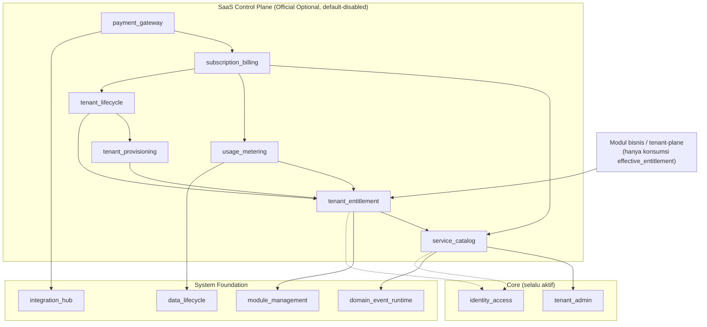
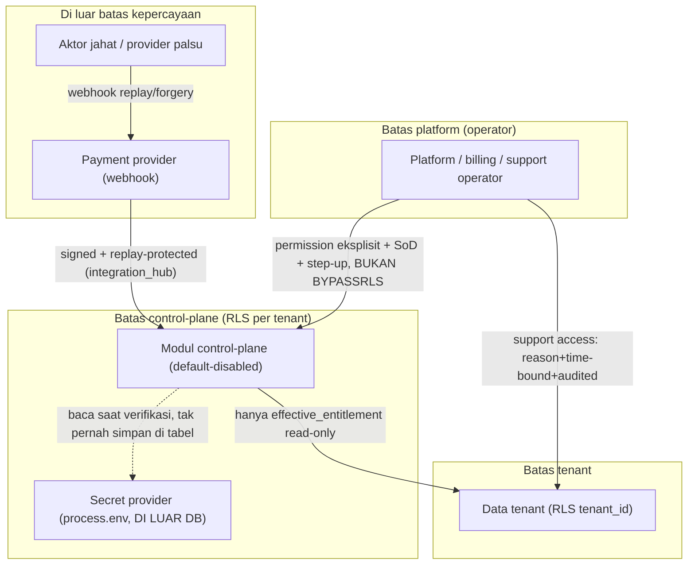
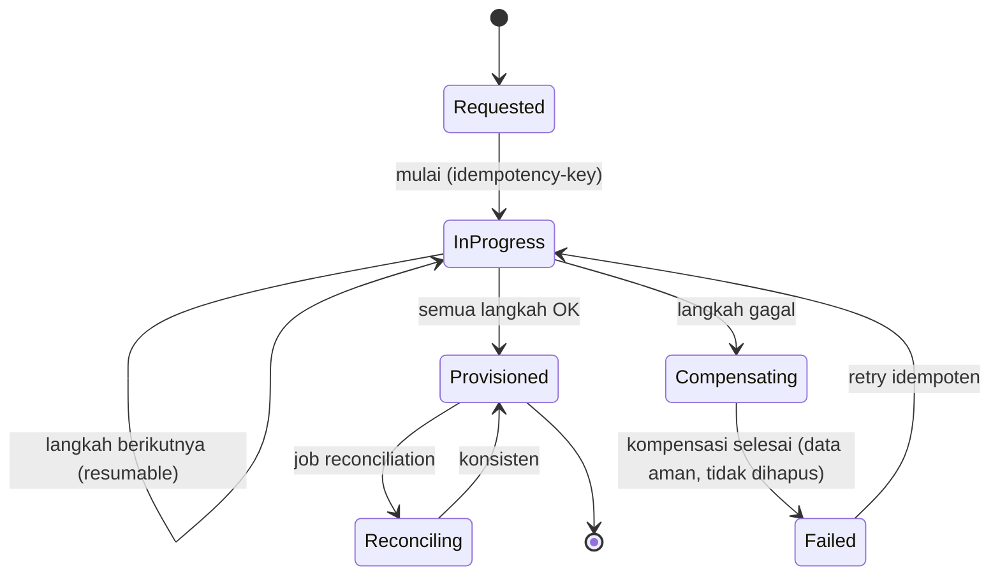
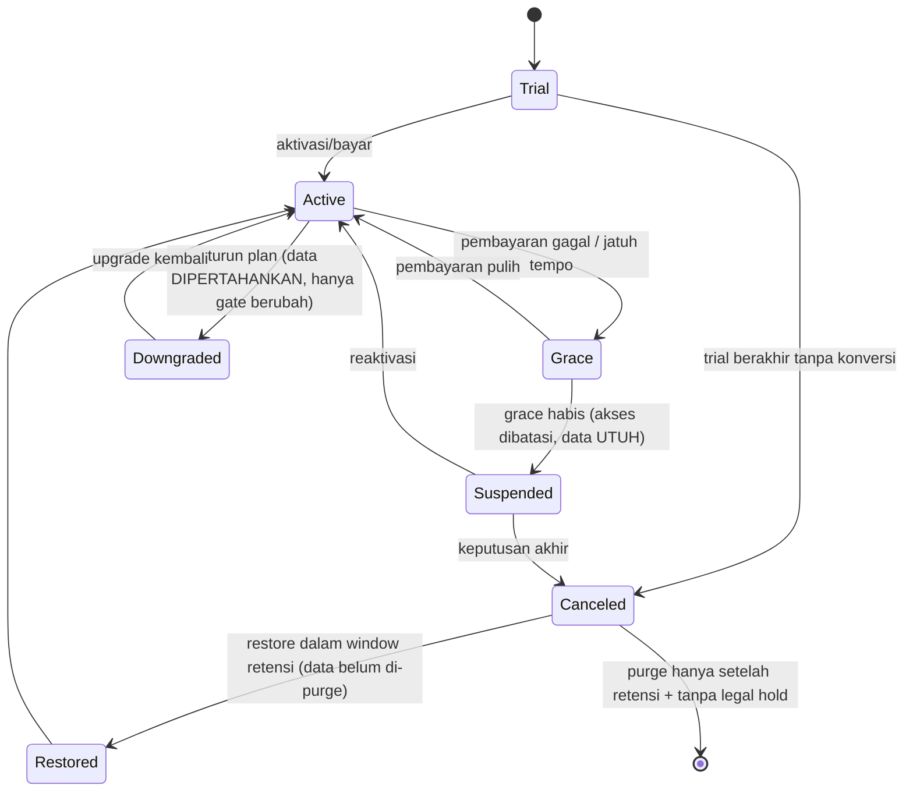
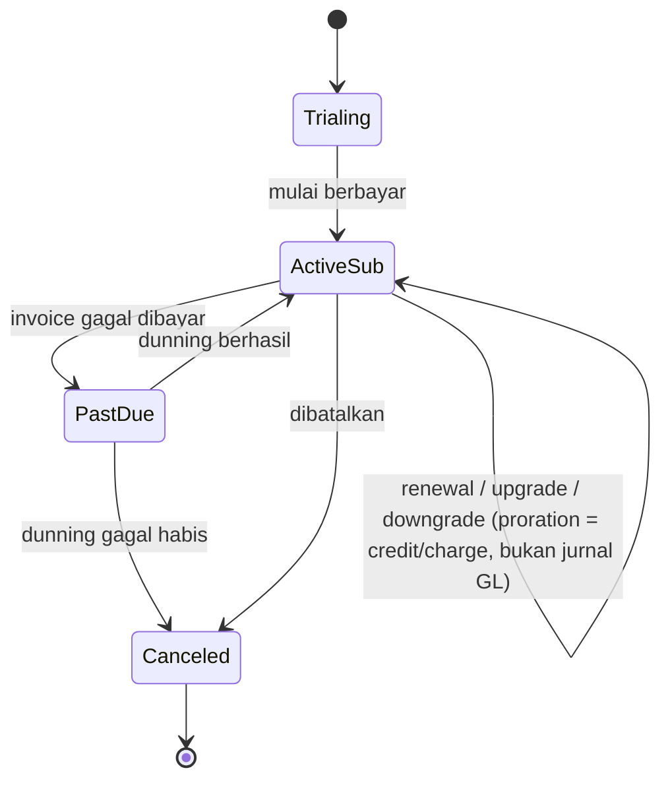
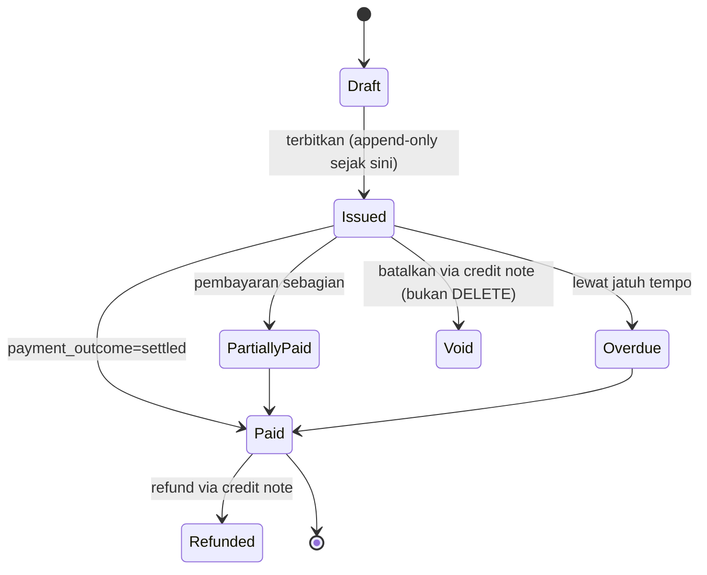
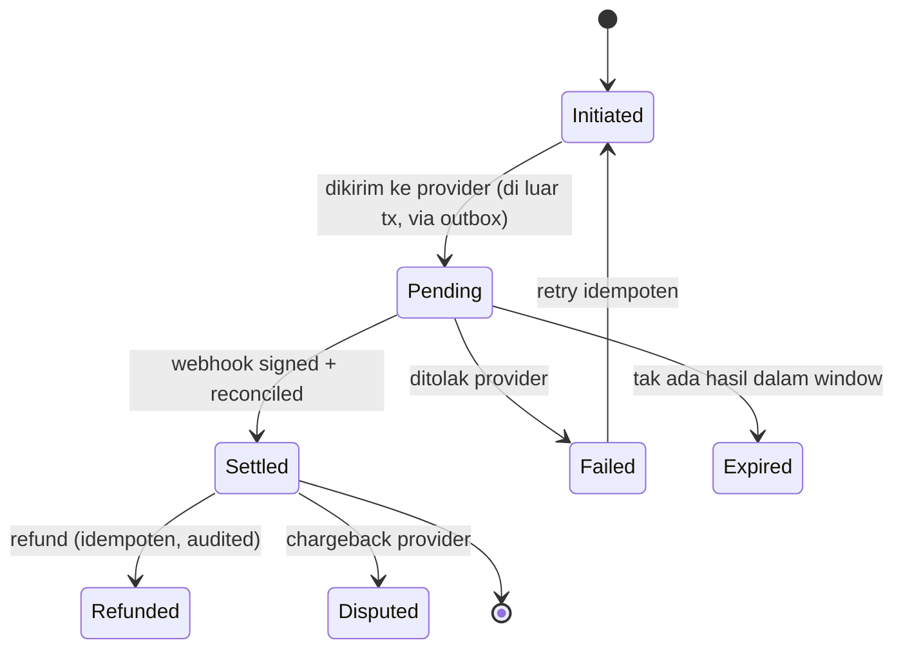

# ADR-0022 — Admission, boundary, trust model, dan lifecycle contracts SaaS Control Plane (opt-in, in-repo, default-disabled)

- **Status:** Accepted
- **Tanggal:** 2026-07-19
- **Pengambil keputusan:** @ahliweb
- **Terkait:** Issue #869 (Wave 0 epic #868 `saas-control-plane`), ADR-0001 (modular monolith), ADR-0002 (Bun-only), ADR-0003 (RLS multi-tenant), ADR-0004 (RBAC+ABAC default-deny), ADR-0005 (soft delete/immutability), ADR-0006 (offline-first/outbox/sync HMAC), ADR-0007 (OpenAPI/AsyncAPI), ADR-0011 (capability ports), ADR-0012 (module admission), **ADR-0013 (extension layers — sebagian di-_amend_ oleh ADR ini, lihat §1)**, ADR-0014 (build-time composition), ADR-0015 (compatibility manifest), ADR-0019 (`integration_hub` — webhook inbound + replay protection), ADR-0020 (kontrak ERP — pemisahan billing vs GL), ADR-0021 (`reference_data` — pola global-baseline vs tenant-override), `docs/awcms-mini/20_threat_model_security_architecture.md`, `docs/awcms-mini/21_module_admission_governance.md`, `docs/awcms-mini/derived-application-guide.md`

> **Ini adalah Wave-0 (docs-only) epic #868.** ADR ini tidak menambah kode
> runtime, migration, endpoint, event, atau UI apa pun — ia menetapkan
> keputusan admission/boundary/trust/lifecycle yang **mengikat** dan
> **memblokir** seluruh issue implementasi #870–#881 (acceptance criterion
> #869: "No implementation child issue may merge before its relevant
> admission decision is accepted"). Setiap istilah/tabel/state-machine di
> sini adalah **batas konsep + kontrak**, bukan bukti bahwa tabel/endpoint
> yang disebut sudah ada — mereka menunggu migration/ADR/issue masing-
> masing sebelum dianggap nyata, sama seperti ADR-0013.

## Konteks

Roadmap platform-evolution (epic #738, selesai #739–#755) menutup seluruh
prasyarat fondasi (build-time composition ADR-0014, compatibility manifest
ADR-0015, `domain_event_runtime`, `data_lifecycle`, business-scope/SoD,
`workflow`, `organization_structure`, `reference_data`, `document_infra`,
`data_exchange`, `reporting`, `integration_hub`, kontrak ERP ADR-0020) dan
mengizinkan sebuah **SaaS control plane opt-in** dibangun **hanya setelah**
kontrak-kontrak itu stabil. Epic #868 mengisi rekomendasi tervalidasi yang
tersisa: katalog layanan, entitlement tenant, provisioning, lifecycle,
usage metering, subscription billing, dan payment gateway.

ADR-0013 §1 sudah memperkenalkan kosakata "lapisan ekstensi" dan
**mem-pra-klasifikasikan** SaaS Control Plane sebagai lapisan 4 yang hidup
**di luar repo base ("Tidak pernah")**. Sejak itu, maintainer (@ahliweb)
memutuskan sebaliknya untuk epic #868: ketujuh modul dikelola sebagai
**Official Optional Business Foundation di dalam repo ini, default-
disabled** — pola yang sama dengan `news_portal`/`social_publishing` (opt-in
per tenant, kode ter-review in-repo). ADR ini mencatat keputusan itu secara
otoritatif, meng-_amend_ klasifikasi placement ADR-0013 pada titik itu
(§1), dan **mempertahankan penuh** seluruh aturan ADR-0013 yang lain (arah
DAG, tenant = batas keamanan, no-shared-table-write, pemisahan tegas SaaS
billing vs ERP general ledger).

Sebelum menulis ADR ini, ground truth berikut dibaca (bukan diasumsikan):

- `src/modules/index.ts` / `listBaseModules()` — 23 modul base ter-review;
  `application-registry.ts` adalah satu-satunya seam yang boleh diisi repo
  turunan (ADR-0014), base registry tidak pernah diedit turunan.
- `src/modules/module-management/domain/tenant-module-lifecycle.ts` —
  `ModuleTenantState.tenantEnabled` **default `true`** bila tidak ada baris
  `awcms_mini_tenant_modules` ("modul tanpa state eksplisit = enabled").
  Ini konsekuensinya untuk "default-disabled" dibahas eksplisit di §7.
- `docs/awcms-mini/21_module_admission_governance.md` §2–§9 — lima kategori
  admission, pohon keputusan, trusted static registry, larangan runtime
  code execution.
- ADR-0019 (`integration_hub`) — signed inbound webhook + replay protection
  sudah ada sebagai fondasi yang **dipakai ulang** payment webhook (§9),
  bukan dibangun ulang.
- ADR-0020 §3 / ADR-0013 §3 — subscription billing ≠ general ledger/AR-AP/
  tax; ditegakkan ulang di §11.

## Keputusan

### 1. Placement — tujuh modul diadmisi sebagai Official Optional Business Foundation _in-repo, default-disabled_ (amends ADR-0013)

Ketujuh modul — `service_catalog`, `tenant_entitlement`,
`tenant_provisioning`, `tenant_lifecycle`, `usage_metering`,
`subscription_billing`, `payment_gateway` — diadmisi sebagai **Official
Optional Module** (= lapisan ADR-0013 "Official Optional Business
Foundation", lapisan 3), **hidup di registry base repo ini** (`src/modules/
index.ts`, kode ter-review), **opt-in per tenant, default-disabled** (§7).

**Amendment terhadap ADR-0013.** Baris "SaaS Control Plane" pada tabel
ADR-0013 §1 (kolom "Hidup di repo base ini? = **Tidak pernah**"), serta
penempatan "di luar base" pada §3/§6/§8 ADR-0013 untuk SaaS Control Plane,
**digantikan oleh keputusan ini**: SaaS Control Plane sekarang adalah
lapisan-3 in-repo, bukan lapisan-4 out-of-repo. Perubahan ini dicatat
sebagai catatan amandemen bertanggal di kepala ADR-0013 (mengikuti preseden
catatan currency ADR-0012, bukan menulis ulang badan ADR yang sudah
Accepted). **Semua aturan ADR-0013 yang lain tetap berlaku penuh** — arah
DAG (§1), tenant = batas keamanan RLS tunggal (§2), pemisahan tegas
service-catalog/subscription-billing SaaS dari item-master/general-ledger
ERP (§3), data-ownership matrix + no-shared-table-write (§6), kriteria
evidence-based ekstraksi layanan (§7). Reklasifikasi ini adalah keputusan
maintainer eksplisit lewat proses doc 21 §9 (bukan dilakukan tim aplikasi
turunan), tepat seperti yang §4.4 doc 21 syaratkan untuk menaikkan sebuah
kapabilitas menjadi Official Optional Module base.

**Alasan memilih in-repo optional daripada extension repo terpisah** (§Alternatif
merinci penolakannya):

- **Konsistensi mekanis dengan sistem module-management yang sudah ada.**
  In-repo optional modules langsung mendapat `listBaseModules()`, reverse-
  dependency guard (`MODULE_REVERSE_DEPENDENCY_ACTIVE`), preset aktivasi,
  `modules:dag:check`/`modules:compose:check`, permission sync, navigation
  registry, health/readiness, dan compatibility manifest (ADR-0015) —
  seluruh gerbang governance yang sudah ditegakkan CI. Extension repo
  terpisah harus membangun ulang atau melewati semua itu.
- **Pola preseden identik** (`news_portal`, `social_publishing`,
  `organization_structure`, `reference_data`): modul opt-in per tenant yang
  generik lintas aplikasi turunan sudah terbukti sebagai lapisan-3 in-repo.
- **LAN/offline first tetap utuh** (§7): modul default-disabled + panggilan
  provider di luar transaksi (§9) berarti deployment LAN yang tidak pernah
  mengaktifkan control plane berjalan 100% tanpa perubahan perilaku.
- **Blast-radius admission yang jelas**: setiap modul tetap wajib lolos
  pohon keputusan doc 21 §3, ADR/migration/RLS/audit/idempotency sendiri di
  Wave-1/2/3 — bukan blanket approval.

### 2. Admission per modul (mengisi `module-proposal-template.md` inline, ringkas)

| Modul (`key`)          | Masalah/kebutuhan generik lintas turunan                                                 | `type` | Lifecycle dependency (aktif duluan)                                                                                                     | Capability yang di-_provide_/-_consume_ (ADR-0011)                                                                    | Kelas kompat.          | Provider eksternal      |
| ---------------------- | ---------------------------------------------------------------------------------------- | ------ | --------------------------------------------------------------------------------------------------------------------------------------- | --------------------------------------------------------------------------------------------------------------------- | ---------------------- | ----------------------- |
| `service_catalog`      | Katalog plan/offer/fitur/kuota/harga berversi yang operator jual ke tenant               | domain | `tenant_admin`, `identity_access`, `domain_event_runtime`                                                                               | PROVIDES `service_catalog_read` (plan/fitur/kuota efektif-tanggal)                                                    | offline-lan-safe       | Tidak ada               |
| `tenant_entitlement`   | Entitlement efektif (modul/fitur/kuota) tenant + override + penjelasan                   | domain | `tenant_admin`, `identity_access`, `module_management`, `domain_event_runtime`; consumes `service_catalog_read`                         | PROVIDES `effective_entitlement` (dipakai modul bisnis untuk gating; **satu-satunya** kontrak yang tenant-plane baca) | offline-lan-safe       | Tidak ada               |
| `tenant_provisioning`  | Provisioning tenant idempoten/resumable + kompensasi + reconciliation + readiness        | domain | `tenant_admin`, `identity_access`, `module_management`, `domain_event_runtime`; consumes `effective_entitlement`                        | PROVIDES `provisioning_status`                                                                                        | offline-lan-safe       | Tidak ada               |
| `tenant_lifecycle`     | Semantik trial/active/grace/suspended/canceled/restore/downgrade fail-safe               | domain | `tenant_admin`, `identity_access`, `domain_event_runtime`; consumes `effective_entitlement`, `provisioning_status`                      | PROVIDES `tenant_lifecycle_state` (dikonsumsi API/SSR/routing/worker untuk perilaku akses deterministik)              | offline-lan-safe       | Tidak ada               |
| `usage_metering`       | Event pemakaian + agregasi + kuota + koreksi + reconciliation                            | domain | `tenant_admin`, `identity_access`, `domain_event_runtime`, `data_lifecycle`; consumes `effective_entitlement`                           | PROVIDES `usage_aggregate` (dikonsumsi `subscription_billing`)                                                        | offline-lan-safe       | Tidak ada               |
| `subscription_billing` | Subscription/invoice/credit/renewal/upgrade-downgrade/dunning **state** (bukan GL/AR-AP) | domain | `tenant_admin`, `identity_access`, `domain_event_runtime`; consumes `service_catalog_read`, `usage_aggregate`, `tenant_lifecycle_state` | PROVIDES `billing_document_state` (dikonsumsi `payment_gateway`)                                                      | offline-lan-safe¹      | Tidak ada di modul ini² |
| `payment_gateway`      | Checkout/webhook inbox bertandatangan/retry-DLQ/refund/reconciliation provider-netral    | domain | `tenant_admin`, `identity_access`, `domain_event_runtime`, `integration_hub`; consumes `billing_document_state`                         | PROVIDES `payment_outcome` (dikonsumsi `subscription_billing` untuk transisi invoice)                                 | **full-online-opt-in** | Ya (adapter opt-in)     |

¹ `subscription_billing` menghitung state (jatuh tempo, dunning) dari data
lokal — jalan penuh offline. Yang butuh online hanyalah **penyelesaian
pembayaran** (`payment_gateway`).
² `subscription_billing` sendiri tidak memanggil provider; ia menyerahkan
penyelesaian ke `payment_gateway` lewat capability port `payment_outcome` +
outbox. Ini menegakkan ADR-0006/AGENTS.md #8 (provider di luar transaksi).

Kesepuluh butir template lain (§3 "kenapa bukan Derived Application", §8
security, §9 ownership, §10 deprecation, §11 alternatif) berlaku seragam:
setiap modul **lolos node Q3 pohon keputusan doc 21 §3** ("generik untuk
SEMUA aplikasi turunan") karena provisioning/entitlement/metering/billing
adalah kebutuhan **operator platform mana pun** yang menjual akses ke
tenant (retail SaaS, sekolah SaaS, faskes SaaS, dst.) — bukan aturan satu
vertikal; ownership `@ahliweb` (CODEOWNERS); tidak menggantikan modul lain
(deprecation N/A); alternatif "extension repo" ditolak di §Alternatif.

**Batas keras (semua modul):** service_catalog **bukan** item/product master
ERP; subscription_billing **bukan** general ledger/AR-AP/kas-bank/tax engine;
metadata alokasi/settlement pembayaran **bukan** double-entry accounting
(§11). Tidak ada provider/kredensial/aturan harga hardcoded. Tidak ada
runtime plugin/marketplace/`eval`/kode tenant executable (ADR-0012 §7 tidak
dilonggarkan).

### 3. Kepemilikan data control-plane vs tenant-plane (unambiguous)

| Data                                                                                                              | Pemilik (control-plane modul)                    | Kelas tabel                                                                                                                                                          | Cara tenant-plane berinteraksi                                                                                       |
| ----------------------------------------------------------------------------------------------------------------- | ------------------------------------------------ | -------------------------------------------------------------------------------------------------------------------------------------------------------------------- | -------------------------------------------------------------------------------------------------------------------- |
| Plan/offer/fitur/kuota/harga katalog — **hanya baris `published` + effective-dated** (identik untuk semua tenant) | `service_catalog`                                | **Global baseline `published` saja** (tanpa `tenant_id`, RLS-exempt terdaftar³); draft/deprecated + harga internal/offer operator-only **tidak** RLS-free (Medium-1) | Baca lewat capability `service_catalog_read` (hanya `published`); tidak pernah tulis                                 |
| Record tenant (`awcms_mini_tenants`)                                                                              | **Core `tenant_admin`** (bukan control-plane)    | Sudah ada (ADR-0003)                                                                                                                                                 | Control-plane mereferensikan lewat FK/port, tidak membuat registry tenant duplikat                                   |
| Entitlement efektif + override tenant                                                                             | `tenant_entitlement`                             | **Tenant-scoped** `tenant_id` + `ENABLE`+`FORCE RLS`                                                                                                                 | Modul bisnis membaca **hanya** kontrak `effective_entitlement` (read-only), tidak query tabel entitlement langsung   |
| Subscription/invoice/credit/dunning tenant                                                                        | `subscription_billing`                           | **Tenant-scoped** `tenant_id` + `ENABLE`+`FORCE RLS`                                                                                                                 | Read-only lewat port `billing_document_state`; **tidak pernah** menyatu dengan sales invoice/GL tenant (ADR-0013 §3) |
| Provider reference (checkout id, charge id, refund id) + webhook envelope **ter-mask**                            | `payment_gateway`                                | **Tenant-scoped** `tenant_id` + `ENABLE`+`FORCE RLS`; envelope via `integration_hub`; **PII di envelope di-mask doc 04 SEBELUM persist** (Medium-2)                  | Tidak dibaca modul bisnis; hanya `subscription_billing` lewat `payment_outcome`                                      |
| Usage record + agregat                                                                                            | `usage_metering`                                 | **Tenant-scoped** `tenant_id` + `ENABLE`+`FORCE RLS`; append-only⁴                                                                                                   | Read-only lewat `usage_aggregate`                                                                                    |
| Provisioning run + langkah kompensasi + tenant lifecycle state                                                    | `tenant_provisioning` / `tenant_lifecycle`       | **Tenant-scoped** `tenant_id` + `ENABLE`+`FORCE RLS`                                                                                                                 | Lifecycle state dibaca API/SSR/routing/worker lewat `tenant_lifecycle_state` untuk perilaku akses                    |
| **Secret provider** (API key, webhook signing secret)                                                             | **`process.env` / secret store deployment saja** | **BUKAN tabel** (tenant-readable maupun global)                                                                                                                      | Tidak pernah ada di tabel apa pun; rotasi = konfigurasi deployment (§6)                                              |

³ Pola identik `reference_data`/`awcms_mini_permissions`/`idn_admin_regions`
(ADR-0021 §8): tabel global baseline didaftarkan eksplisit ke
`RLS_FREE_TABLES` + `ALLOWED_GLOBAL_TABLE_GRANTS` di `scripts/security-
readiness.ts` (RLS-exempt ter-review, bukan celah). Mutasi katalog tetap
lewat endpoint terautentikasi + permission `service_catalog.*` sempit untuk
operator tepercaya. **Kontrak Medium-1 untuk #870:** grant global (RLS-free)
**hanya** berlaku untuk baris katalog berstatus `published` + effective-dated
— karena event `service_catalog.plan.published` mengimplikasikan adanya
status `draft`/`deprecated`, dan katalog operator lazim memuat harga
internal/offer operator-only yang **tidak** boleh terbaca sesi tenant mana
pun. Baris `draft`/`deprecated` dan kolom harga-internal hidup di tabel/
kolom terlindung (RLS atau kolom yang tidak di-grant global), **bukan**
blanket RLS-free. `service_catalog_read` hanya pernah mengembalikan
`published`.
⁴ Usage record dan billing document yang sudah "posted"/di-invoice bersifat
**append-only** (ADR-0005): koreksi lewat entri kompensasi/credit note, bukan
hapus/edit in-place (§9, §11).

**Aturan no-shared-table-write (ADR-0013 §6) berlaku penuh:** hanya modul
pemilik yang `INSERT`/`UPDATE`/`DELETE` tabelnya; lintas modul lewat
capability port/event. Tenant-plane (modul bisnis turunan) **hanya**
mengonsumsi kontrak `effective_entitlement` (+ turunannya) — tidak pernah
membaca/menulis tabel control-plane langsung.

### 4. Arah dependency + kontrak capability/event (tidak ada reverse dependency base→SaaS)

Panah = "A bergantung pada B" (identik konvensi `dependencies: string[]`).
**Tidak ada panah dari Core/System/modul bisnis menuju modul control-plane**
— base/core tidak pernah tahu-menahu logika SaaS. Satu-satunya panah dari
tenant-plane ke control-plane adalah `Biz --> TE` yang **hanya** kontrak
read-only `effective_entitlement` (bukan import/FK langsung), memenuhi
acceptance criterion #869 "no reverse dependency from base/core into
application-specific SaaS logic". Graf tetap DAG (`modules:dag:check`).

**Invariant fail-closed `effective_entitlement` (High-2) — kontrak satu-
satunya yang men-gate akses komersial WAJIB DENY saat ragu.** `effective_
entitlement` adalah satu-satunya jalur tenant-plane membaca hak akses fitur/
kuota, sehingga perilakunya pada kondisi tepi mengikat secara keamanan:

- **Absent / indeterminate / unavailable = DENY (fail-closed).** Bila
  entitlement tidak ditemukan, tidak dapat ditentukan, `tenant_entitlement`
  disabled/belum ter-provision, atau resolusi error — jawabannya **selalu
  tolak akses**, **tidak pernah** grant-all/"anggap punya semua". Ini
  invariant, bukan preferensi implementasi.
- **Axis berbeda dari ABAC permission default-deny (ADR-0004).** Entitlement
  bukan permission: ABAC menjawab "apakah aktor ini boleh melakukan aksi
  ini"; entitlement menjawab "apakah tenant ini berlangganan fitur/kuota
  ini". Keduanya default-deny tapi pada sumbu berbeda dan **keduanya** harus
  lolos — gate entitlement tidak menggantikan gate permission, dan sebaliknya.
- **Gate hidup di helper capability, BUKAN per-route.** Cek entitlement
  ditempatkan di dalam helper penyedia kontrak (satu titik), bukan disalin ke
  tiap route/SSR page — persis pelajaran memory `ssr-admin-pages-skip-module-enabled`
  (#841: 54/55 halaman admin lolos gate karena gating ada di route, bukan
  helper). #871 mengimplementasikan helper ini plus test yang membuktikan
  fail-closed pada tiap kondisi tepi di atas.

**Kontrak event (AsyncAPI, ditulis di Wave-1/2 masing-masing):** semua modul
control-plane adalah REAL producer via `domain_event_runtime` (`appendDomain
Event`), mis. `service_catalog.plan.published`, `tenant.provisioning.
completed`, `tenant.lifecycle.suspended`, `usage.aggregated`, `subscription.
invoice.issued`, `payment.outcome.settled`. Konsumsi lintas modul lewat
outbox event, bukan panggilan sinkron lintas-modul.

**Transisi lifecycle yang butuh sinyal billing bersifat event-driven (Low).**
`tenant_lifecycle` **sengaja tidak** depend `subscription_billing` (menghindari
cycle SB→TL→SB, lihat graf: `SB --> TL`). Transisi `Active→Grace`/`Grace→Active`
(§11.2) karena gagal/pulih bayar karena itu **event-driven**: `subscription_
billing` meng-emit event (mis. `subscription.invoice.past_due` / `.recovered`),
`tenant_lifecycle` **subscribe** dan mentransisikan state — DAG tetap terjaga
tanpa dependency kode TL→SB.

### 5. Aktor (identitas) dan pemisahan tugas

| Aktor                   | Scope                                                 | Yang boleh                                                                           | Kontrol wajib                                                                                                   |
| ----------------------- | ----------------------------------------------------- | ------------------------------------------------------------------------------------ | --------------------------------------------------------------------------------------------------------------- |
| **Platform operator**   | Lintas-tenant (administrasi platform)                 | Kelola katalog, provisioning, lifecycle tenant                                       | Permission platform eksplisit; **bukan** `BYPASSRLS` (§6); aksi high-risk butuh audit + step-up                 |
| **Billing operator**    | Lintas-tenant, terbatas komersial                     | Invoice/credit/refund/dunning; **tidak** boleh mengubah entitlement teknis diam-diam | Terpisah dari platform operator (SoD); refund/credit = high-risk (idempotency + audit)                          |
| **Support operator**    | Cross-tenant **hanya** saat akses eksplisit dibuka    | Baca konteks tenant tertentu untuk troubleshooting                                   | **Reason-bound, time-bound, audited** (§6); default tidak punya akses data tenant                               |
| **Tenant owner/admin**  | Satu tenant (RLS `tenant_id`)                         | Lihat langganan/invoice/pemakaian tenant sendiri; **bounded self-service** (#878)    | RLS penuh; tidak pernah lihat tenant lain; tidak boleh ubah katalog/harga global                                |
| **Automation identity** | Worker/job (dispatch outbox, reconciliation, dunning) | Menjalankan transisi state deterministik dari event/jadwal                           | Least-privilege DB role; tak ada sesi interaktif; setiap mutasi high-risk tetap idempoten + audit + correlation |

Pemisahan platform-operator vs billing-operator vs support-operator adalah
**SoD wajib** (acceptance criterion #869 "high-risk operator actions require
explicit permissions and SoD/step-up guidance"). Detail permission key +
step-up + support-access ditegakkan di #879.

### 6. Trust model — platform role bukan BYPASSRLS, secret di luar tabel

- **Platform/operator role BUKAN jalur `BYPASSRLS` tersembunyi.** Akses
  lintas-tenant operator tetap melewati RLS + query yang **eksplisit
  memilih** tenant target dengan permission platform yang dievaluasi ABAC —
  bukan role Postgres ber-`BYPASSRLS` yang diam-diam melihat semua baris.
  Ini menegakkan ADR-0003/0013 §2 (tenant = batas keamanan tunggal;
  `tenant_id` satu-satunya RLS predicate) dan boundary #879.
- **Invariant "no soft super-tenant" — pola BACA lintas-tenant operator
  ditutup rapat (High-1).** Melarang atribut `BYPASSRLS` saja tidak cukup;
  pola baca setara-risiko harus diikat sebagai kontrak mengikat #870–#881:
  - **(a) Baca satu-tenant lewat konteks per-tenant.** Akses operator ke
    tabel tenant-scoped **hanya** boleh lewat iterasi konteks per-tenant
    (`withTenant()` / `SET LOCAL app.current_tenant_id`, doc 16) — satu
    tenant per konteks — dan **setiap** akses lintas-tenant menghasilkan
    audit event (reason + time-bound, sama seperti support access).
  - **(b) Agregat lintas-tenant lewat read-model purpose-built.** Kebutuhan
    agregat lintas-tenant (dashboard "semua tenant suspended", metering/
    billing rollup lintas-tenant) **wajib** memakai read-model/endpoint
    khusus yang permission-gated + audited — bukan query ad-hoc yang
    memindai tabel tenant-scoped semua tenant sekaligus.
  - **(c) LARANGAN EKSPLISIT memperluas predikat RLS dengan platform-claim.**
    Predikat RLS tabel tenant-scoped **tidak pernah** boleh diperluas dengan
    klausa platform-claim — mis. `USING (tenant_id = current_setting(...)
OR current_setting('app.is_platform') = 't')` atau `OR
has_platform_claim()`. Itu adalah `BYPASSRLS` fungsional yang **lolos**
    gate `scripts/security-readiness.ts` (yang memeriksa atribut role, bukan
    isi predikat). Setiap policy control-plane predikatnya **selalu dan
    hanya** `tenant_id` (ADR-0013 §2). Penambahan predikat platform-claim
    ke policy manapun adalah pelanggaran ADR ini dan wajib ditolak review;
    kandidat gate statis (memindai definisi policy migration atas klausa
    `OR ... platform`/`is_platform`) dicatat sebagai follow-up #879.
- **Cross-tenant support access eksplisit + reason-bound + time-bound +
  audited.** Support operator default **tidak** punya akses data tenant;
  akses dibuka lewat grant eksplisit yang mencatat alasan, kedaluwarsa
  otomatis (time-bound), dan menghasilkan audit event — pola business-scope
  time-bound yang sudah ada (`identity-access:business-scope:expiry`).
- **Secret ownership + rotasi eksplisit; tak ada secret di tabel tenant-
  readable.** Kredensial provider pembayaran + webhook signing secret hidup
  **hanya di `process.env`/secret store deployment** (doc 18), tidak pernah
  di kolom tabel (tenant-scoped maupun global). Rotasi = mengganti
  konfigurasi deployment; tabel `payment_gateway` menyimpan **referensi**
  provider (charge id), bukan secret. Verifikasi tanda tangan webhook
  memakai secret dari env, bukan dari baris DB.
- **Downgrade/suspension fail-safe TANPA hapus data** (§8, §11): perubahan
  akses = perubahan **state** + gate entitlement, tidak pernah `DELETE`
  data tenant.

### 7. Applicability provider online + perilaku LAN/offline + default-disabled

- **Full-online provider capability = opt-in.** Hanya `payment_gateway` yang
  memanggil provider eksternal (adapter opt-in, di luar transaksi DB,
  timeout-bounded, via outbox — ADR-0006/AGENTS.md #8). Enam modul lain
  adalah operasi DB murni (offline-lan-safe).
- **LAN/offline tetap operasional saat control plane disabled.** Deployment
  profil `offline-lan` yang tidak pernah mengaktifkan modul control-plane
  berjalan 100% — POS/tenant business jalan tanpa konektivitas internet
  sama sekali. Ini adalah invariant yang **memblokir** desain apa pun di
  #870–#881 yang membuat jalur LAN bergantung pada control plane.
- **Default-disabled — keputusan + gap yang harus ditutup runtime.** Hari
  ini `tenant-module-lifecycle.ts` men-default `tenantEnabled = true` bila
  tak ada baris `awcms_mini_tenant_modules` ("modul tanpa state = enabled").
  Keputusan ADR ini: ketujuh modul control-plane **HARUS default-disabled
  per tenant** dan tidak boleh punya permukaan reachable untuk tenant yang
  tidak eksplisit mengaktifkan control plane. Runtime (#870–#874) **wajib**
  menutup gap ini secara eksplisit — mis. flag descriptor
  `defaultTenantState: "disabled"` atau aktivasi hanya lewat preset/
  entitlement — **sebelum** modul manapun ter-merge. Ini juga item threat
  model (§10): modul billing/entitlement yang diam-diam aktif di deployment
  LAN adalah permukaan serangan + kebingungan operasional, bukan sekadar
  kosmetik.
- **Default-disabled butuh GATE struktural, bukan hanya prosa/flag
  (Medium-3, entry-criterion Wave-1).** "Menutup gap" di atas **tidak
  cukup** hanya menambah flag `defaultTenantState`. Issue yang
  memperkenalkannya (#870–#874) **wajib** turut ship unit test — mis. di
  `tests/unit/module-governance*`/`module-doc-reconciliation` — yang
  **GAGAL** bila salah satu dari tujuh key control-plane (`service_catalog`,
  `tenant_entitlement`, `tenant_provisioning`, `tenant_lifecycle`,
  `usage_metering`, `subscription_billing`, `payment_gateway`) resolve ke
  `enabled` **tanpa** baris `awcms_mini_tenant_modules` eksplisit. Ground-
  truth yang di-assert: `module-management/domain/tenant-module-lifecycle.ts`
  hari ini men-default `tenantEnabled = true`, jadi test harus membuktikan
  ketujuh modul ini **dikecualikan** dari default-enabled itu. GATE — bukan
  sekadar flag — adalah bagian tak-terpisahkan dari "menutup gap".

### 8. Klasifikasi data, retensi, legal hold, audit, privasi, incident

| Dimensi                         | Keputusan boundary                                                                                                                                                                                                                                                                                                                                                                           |
| ------------------------------- | -------------------------------------------------------------------------------------------------------------------------------------------------------------------------------------------------------------------------------------------------------------------------------------------------------------------------------------------------------------------------------------------- |
| **Klasifikasi**                 | Katalog `published` = publik-internal (global); draft/harga-internal = restricted (§3, Medium-1). Entitlement/subscription/usage/invoice = tenant-confidential. Billing contact (nama/email) = PII (masking, doc 04). Provider secret = **restricted, di luar DB** (§6). Tidak ada PAN/kartu mentah disimpan (provider-tokenized saja).                                                      |
| **Webhook envelope (Medium-2)** | Envelope webhook payment yang **TERSIMPAN** (tabel `payment_gateway`/`integration_hub` — data operasional, beda dari audit log) lazim memuat PII mentah (nama, email, alamat tagih). **Wajib** lewat masking doc 04 (`awcms-mini-sensitive-data`: NPWP/NIK/phone/email/alamat) **sebelum** di-persist — **tidak ada** PII mentah di tabel, event, log, maupun IndexedDB. Kontrak untuk #877. |
| **Retensi + purge**             | Usage record, webhook envelope, payment attempt, outbox = tabel bervolume tinggi → **wajib** didaftarkan ke registry `data_lifecycle` (skill `awcms-mini-data-lifecycle`) dengan kebijakan retensi/arsip/purge. Dokumen billing (invoice) = append-only, retensi panjang sesuai kewajiban legal.                                                                                             |
| **Legal hold**                  | Legal hold `data_lifecycle` menahan purge invoice/billing yang sedang bersengketa (mekanisme sudah ada; control plane hanya mendaftarkan tabelnya).                                                                                                                                                                                                                                          |
| **Audit**                       | Seluruh aksi high-risk (publish/deprecate plan, override entitlement, provisioning commit/rollback, suspend/cancel/restore/downgrade, koreksi usage, issue/void invoice, refund/credit, resolve payment) → `recordAuditEvent` dengan redaction (skill `awcms-mini-audit-log`).                                                                                                               |
| **Privasi (UU PDP/27701)**      | Billing contact di-mask/hash sesuai doc 04; tenant hanya lihat datanya sendiri; support access ke PII tenant = reason/time-bound (§6).                                                                                                                                                                                                                                                       |
| **Incident boundary**           | Kompromi kredensial provider = incident deployment-scope (rotasi env, §6), bukan mutasi tabel. Webhook replay/forgery ditangkap `integration_hub` replay-protection (ADR-0019).                                                                                                                                                                                                              |

### 9. Prinsip failure/retry/compensation/reconciliation/rollback

- **Idempotency high-risk.** Setiap mutasi high-risk (provisioning step,
  invoice issue, payment initiate, refund) menerima `Idempotency-Key`, aman
  diulang (skill `awcms-mini-idempotency`; hash **wajib** menyertakan
  resource id, memory [[idempotency-hash-missing-resource-id-recurring]]).
- **Provider di luar transaksi + outbox.** `payment_gateway` tidak pernah
  memegang koneksi/transaksi DB selama panggilan provider; checkout/refund
  di-dispatch lewat outbox worker; webhook masuk lewat `integration_hub`
  inbox bertandatangan dengan replay-protection (ADR-0019), diproses
  asinkron dengan **retry + DLQ**. PII di envelope webhook **di-mask
  (doc 04) sebelum persist** (§8, Medium-2).
- **Anti-replay webhook durable (Low).** Verifikasi webhook memakai window
  timestamp **≤ 300 detik** DAN nonce/`event-id` idempotency yang **persisten
  di DB** (bukan cache in-memory) — sehingga replay tetap tertangkap setelah
  restart proses/lintas replica. #877 **tidak** boleh menganggap idempotency
  in-memory cukup; mekanisme replay-protection tetap didelegasikan ke
  `integration_hub` (ADR-0019).
- **Compensation, bukan rollback destruktif.** Provisioning yang gagal di
  tengah menjalankan **langkah kompensasi** (undo saga) yang tercatat +
  idempoten, bukan menghapus data mentah. Downgrade/suspension mengubah
  **state + gate**, tidak pernah `DELETE` data tenant (fail-safe, §6/§11).
- **Reconciliation sebagai sumber kebenaran akhir.** Job reconciliation
  membandingkan state provider (payment) dengan state lokal secara periodik
  dan menutup drift lewat entri koreksi yang audited — bukan mengandalkan
  webhook tunggal sebagai satu-satunya sinyal (provider outage-safe).
- **Append-only untuk yang sudah posted.** Invoice/usage yang sudah
  di-posting tidak diedit in-place; koreksi = credit note/adjustment entry
  (ADR-0005).

### 10. Threat model

| Ancaman                 | Vektor                                                                                               | Kontrol (ditegakkan di ADR ini + issue penegak)                                                                                                                                                                                                                                                                                                           |
| ----------------------- | ---------------------------------------------------------------------------------------------------- | --------------------------------------------------------------------------------------------------------------------------------------------------------------------------------------------------------------------------------------------------------------------------------------------------------------------------------------------------------- |
| **Cross-tenant access** | Operator/modul membaca tenant lain; "soft super-tenant" via OR-clause platform-claim di predikat RLS | RLS `tenant_id` tunggal; platform role **bukan** BYPASSRLS + **larangan eksplisit** memperluas predikat RLS dengan platform-claim, baca operator hanya via konteks per-tenant audited, agregat lewat read-model purpose-built (§6 High-1); `effective_entitlement` fail-closed (§4 High-2); modul bisnis hanya baca `effective_entitlement` (§3/§4). #879 |
| **Operator abuse**      | Platform/billing operator menyalahgunakan wewenang                                                   | SoD (§5), step-up, semua aksi high-risk audited (§8); support access reason/time-bound (§6). #879                                                                                                                                                                                                                                                         |
| **Webhook replay**      | Provider webhook diputar ulang / dipalsukan                                                          | `integration_hub` signed inbox + replay-protection (ADR-0019); idempotency per event id (§9). #877                                                                                                                                                                                                                                                        |
| **Duplicate billing**   | Charge/invoice ganda karena retry                                                                    | Idempotency-Key wajib + hash ber-resource-id (§9); invoice append-only + reconciliation (§9). #876/#877                                                                                                                                                                                                                                                   |
| **Provider outage**     | Provider tak tersedia saat charge/refund                                                             | Provider di luar transaksi + outbox + retry/DLQ + reconciliation (§9); billing state dihitung lokal (offline-safe, §2). #877                                                                                                                                                                                                                              |
| **Downgrade data loss** | Downgrade/suspend menghapus data tenant                                                              | Fail-safe: ubah state + gate, **tidak pernah** `DELETE` (§6/§9/§11); soft-delete/legal-hold (§8). #873                                                                                                                                                                                                                                                    |
| **Secret leakage**      | Kredensial provider bocor lewat tabel/log                                                            | Secret **hanya** di `process.env`, tak pernah di tabel tenant-readable (§3/§6); redaction audit/log (§8); rotasi = env. #879                                                                                                                                                                                                                              |

### 11. State machines (billing = state, BUKAN GL/AR-AP/tax; payment metadata BUKAN double-entry)

**11.1 Tenant provisioning** (idempoten/resumable, kompensasi):

**11.2 Tenant lifecycle** (trial/active/grace/suspended/canceled/restore/downgrade — fail-safe):

**11.3 Subscription:**

**11.4 Invoice** (append-only; koreksi = credit note, bukan edit/hapus):

**11.5 Payment outcome:**

**Penegasan (ADR-0013 §3 / ADR-0020):** semua "invoice"/"payment"/"credit"
di atas adalah **state komersial langganan platform** — bukan entri general
ledger/AR-AP/kas-bank, bukan double-entry, bukan tax engine. Bila tenant
ingin membukukan biaya langganannya di GL internalnya, itu kolaborasi
lintas-owner lewat event/API (ADR-0013 §3), bukan tabel bersama.

### 12. Guardrail non-negotiable (ditegaskan ulang)

- Tenant tetap batas keamanan; platform role tidak bypass RLS diam-diam.
- Secret provider hanya di env, tak pernah di tabel tenant-readable.
- Provider di luar transaksi; LAN/offline penuh saat control plane disabled.
- Downgrade/suspension tidak pernah hapus data tenant.
- Service catalog ≠ item master; subscription billing ≠ GL/AR-AP/tax;
  payment metadata ≠ double-entry.
- Tidak ada runtime plugin/marketplace/`eval`/kode tenant executable.
- Setiap tabel tenant-scoped: `tenant_id` + `ENABLE`+`FORCE RLS` + index
  tenant-first + ABAC default-deny + least-privilege DB role.
- Semua mutasi high-risk: permission eksplisit + idempotency + audit +
  correlation id + safe error + concurrency control.

## Konsekuensi

- **Positif:** #870–#881 punya keputusan placement, boundary, trust model,
  data-ownership, aktor, dan state-machine yang sama untuk dirujuk — tidak
  ada issue yang mendefinisikan ulang boundary sendiri; acceptance criterion
  #869 (admission diterima untuk 7 modul, ownership unambiguous, tidak ada
  reverse dependency, state machine + threat model lengkap, LAN/offline +
  online eksplisit) terpenuhi di satu dokumen otoritatif.
- **Positif:** Memilih in-repo optional (bukan extension repo) memberi 7
  modul seluruh gerbang governance yang sudah ditegakkan CI (dag/compose/
  compatibility/reverse-dep/preset) tanpa membangun ulang.
- **Negatif/trade-off:** ADR ini meng-amend placement ADR-0013 §1 untuk
  SaaS Control Plane — risiko pembaca membaca ADR-0013 tanpa melihat
  amandemen; mitigasi: catatan amandemen bertanggal di kepala ADR-0013 +
  baris indeks README yang menautkan ADR ini.
- **Negatif/trade-off:** "Default-disabled" belum jadi mekanisme runtime
  (default hari ini = enabled); ADR ini menetapkannya sebagai **requirement
  yang harus ditutup** #870–#874, bukan sesuatu yang sudah berlaku — dicatat
  jujur sebagai gap (§7), bukan diklaim sudah ada.
- **Negatif/trade-off:** Seluruh istilah/tabel/state-machine "mendahului"
  kode sampai Wave-1/2/3 membangunnya — mitigasi sama seperti ADR-0013:
  setiap tabel/endpoint/event wajib migration/ADR/issue sendiri sebelum
  dianggap nyata.
- **Kontrak (Low, reviewer): test struktural no-shared-table-write mendarat
  BERSAMA modul control-plane pertama, tidak "menyusul".** Penegakan
  control-plane ≠ tenant-plane (tenant-plane hanya baca `effective_
entitlement`, no direct table read/write lintas modul) tidak boleh
  bersandar review manual lebih lama dari perlu: modul control-plane pertama
  yang mendarat (#870/#871) **wajib** turut menambah/memperluas
  `tests/unit/module-boundary.test.ts` untuk pasangan control-plane ↔ tenant-
  plane, pola yang sama seperti `blog_content`/`news_portal` (ADR-0011). Hari
  ini belum ada test struktural khusus tujuh modul ini semata karena kodenya
  belum ada — bukan karena penegakannya boleh ditunda ke PR terpisah.
- **Netral:** Tidak ada migration/endpoint/event/UI di PR ini — murni
  dokumen arsitektur + amandemen ADR-0013 + update doc 20/21/guide + skill.

## Alternatif yang dipertimbangkan

- **Repo ekstensi/control-plane terpisah yang disusun sendiri** (klasifikasi
  awal ADR-0013 §1) — **ditolak**: (a) harus membangun ulang atau melewati
  seluruh gerbang module-management yang sudah ada (`listBaseModules`,
  reverse-dep guard, preset, dag/compose check, compatibility manifest);
  (b) tidak ada bukti terukur yang memenuhi kriteria ekstraksi layanan
  ADR-0013 §7 (profil CPU/IO berbeda, kadensi deploy independen, on-call
  terpisah) — control plane adalah operasi DB + satu adapter opt-in, bukan
  beban yang membenarkan proses/repo terpisah; (c) LAN/offline first sudah
  aman lewat default-disabled + provider-di-luar-transaksi tanpa perlu
  pemisahan deployable. Bila kelak bukti §7 muncul, ekstraksi tetap terbuka
  lewat ADR terpisah dengan rencana cutover/rollback/no-dual-write sendiri.
- **Menaruh SaaS di Core/System (selalu aktif)** — ditolak: melanggar LAN/
  offline-first (deployment LAN tidak butuh billing) dan doc 21 §4.1 (Core =
  platform tak bisa boot tanpanya — jelas tidak berlaku).
- **Menyatukan subscription invoice dengan sales invoice/GL tenant** —
  ditolak eksplisit: melanggar ADR-0013 §3 / ADR-0020 (billing SaaS ≠ GL/
  AR-AP/tax); satu baris "subscription invoice" tidak pernah di tabel yang
  sama dengan "sales invoice"/entri jurnal.
- **Menyimpan secret provider di tabel settings tenant** (agar "rotasi lewat
  UI") — ditolak: melanggar §6 (tak ada secret di tabel tenant-readable);
  secret hidup di env/secret store deployment, rotasi = konfigurasi
  deployment.
- **Membiarkan modul default-enabled seperti modul lain** — ditolak: modul
  billing/entitlement yang aktif diam-diam di deployment LAN = permukaan
  serangan + kebingungan; default-disabled ditetapkan sebagai requirement
  runtime (§7).
- **Menulis ulang badan ADR-0013** alih-alih amandemen bertanggal + ADR
  baru — ditolak: melanggar `docs/adr/README.md` (ADR Accepted tidak ditulis
  ulang diam-diam; hanya ditandai/di-amend lewat ADR baru yang merujuknya).
