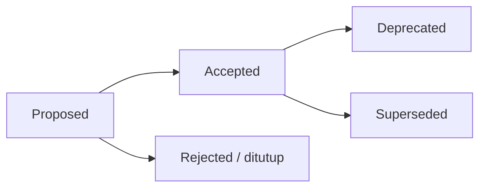

# Architecture Decision Records (ADR)

Folder ini menyimpan **catatan keputusan arsitektural** AWCMS-Mini. Setiap keputusan penting (arsitektur, runtime, kontrak, keamanan) dicatat sebagai satu berkas ADR agar konteks dan alasannya awet.

## Aturan

1. Satu keputusan = satu berkas `NNNN-judul-kebab.md` (nomor urut, nol di depan).
2. ADR **tidak dihapus**. Bila sebuah keputusan diganti, ADR lama ditandai `Status: Superseded by ADR-XXXX` dan ADR baru mereferensikannya.
3. Status yang valid: `Proposed`, `Accepted`, `Deprecated`, `Superseded`.
4. Perubahan standar yang mengikat (lihat [`GOVERNANCE.md`](../../GOVERNANCE.md)) wajib punya ADR.
5. Gunakan template di [`0000-template.md`](0000-template.md).

## Alur

## Indeks

| ADR                                                             | Judul                                                                                                                                                                                                                                                                  | Status   |
| --------------------------------------------------------------- | ---------------------------------------------------------------------------------------------------------------------------------------------------------------------------------------------------------------------------------------------------------------------- | -------- |
| [0001](0001-modular-monolith-architecture.md)                   | Modular monolith, microservice-ready                                                                                                                                                                                                                                   | Accepted |
| [0002](0002-bun-only-runtime.md)                                | Runtime & tooling Bun-only                                                                                                                                                                                                                                             | Accepted |
| [0003](0003-postgresql-rls-multi-tenant.md)                     | PostgreSQL + RLS untuk isolasi multi-tenant                                                                                                                                                                                                                            | Accepted |
| [0004](0004-rbac-abac-default-deny.md)                          | RBAC + ABAC default-deny sebagai baseline akses                                                                                                                                                                                                                        | Accepted |
| [0005](0005-soft-delete-and-immutability.md)                    | Soft delete untuk master/config, immutability untuk data posted                                                                                                                                                                                                        | Accepted |
| [0006](0006-offline-first-sync-outbox.md)                       | Offline-first + transactional outbox + sync HMAC                                                                                                                                                                                                                       | Accepted |
| [0007](0007-openapi-asyncapi-contracts.md)                      | OpenAPI & AsyncAPI sebagai kontrak wajib                                                                                                                                                                                                                               | Accepted |
| [0008](0008-independent-contract-and-module-versioning.md)      | Versioning independen: package, kontrak API/event, module descriptor                                                                                                                                                                                                   | Accepted |
| [0009](0009-public-tenant-scoped-routes.md)                     | Resolusi tenant untuk rute publik lewat path `tenantCode`, bukan subdomain                                                                                                                                                                                             | Accepted |
| [0010](0010-public-host-tenant-routing.md)                      | Routing tenant publik berbasis host/domain — ekstensi online-public di atas ADR-0009                                                                                                                                                                                   | Accepted |
| [0011](0011-capability-ports-for-cross-module-collaboration.md) | Capability ports untuk kolaborasi lintas-modul (`blog_content`/`news_portal`)                                                                                                                                                                                          | Accepted |
| [0012](0012-module-admission-and-trusted-registry-boundary.md)  | Kategori admission modul (Core/System/Optional/Derived/Integration) & batas trusted static registry                                                                                                                                                                    | Accepted |
| [0013](0013-extension-layers-and-boundary-model.md)             | Lapisan ekstensi platform (Core/System Foundation/Official Optional Business Foundation/SaaS Control Plane/ERP Extension/Derived Application), batas tenant vs legal entity vs organization unit, data-ownership matrix, dan kriteria evidence-based ekstraksi layanan | Accepted |

Detail rinci tiap keputusan tetap berada di paket dokumen `docs/awcms-mini/`; ADR merangkum **keputusan + alasan + konsekuensi**, bukan menggantikan dokumen teknis.
