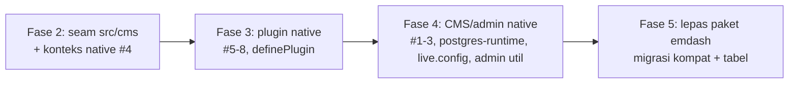

# Inventaris Touchpoint EmDash — AWCMS-Mini

**Tujuan:** Memetakan **semua titik** `awcms-mini` yang bergantung pada paket `emdash`, sebagai dasar epic decoupling (EmDash = rujukan arsitektur saja, ADR-020). Ini output **Fase 1** dari epic decoupling (#327, issue #328).

> Rujukan: personal-coding `docs/architecture/awcms-mini-emdash-decoupling-plan.md`, ADR-020/DL-018.

---

## Document Control

| Field                         | Value                |
| ----------------------------- | -------------------- |
| Status                        | Inventaris (Fase 1)  |
| Berlaku untuk                 | `ahliweb/awcms-mini` |
| Versi paket emdash saat audit | `0.9.0`              |
| Tanggal audit                 | 2026-06-18           |
| Classification                | internal             |

---

## 0. Ringkasan

| Kategori                                           | Jumlah    | Fase penyelesaian               |
| -------------------------------------------------- | --------- | ------------------------------- |
| Import runtime dari `emdash`                       | 7 file    | Fase 2–3 (seam + plugin native) |
| Konfigurasi (astro.config + runtime + live config) | 3 titik   | Fase 2 / Fase 4                 |
| Migrasi kompatibilitas EmDash                      | 4 file    | Fase 5                          |
| Tabel dibuat migrasi kompat                        | ~23 tabel | Fase 5 (pisah dipakai/tidak)    |
| Plugin pakai `definePlugin`                        | 2 plugin  | Fase 3                          |

---

## 1. Import runtime dari paket `emdash`

| #   | File                                               | Import                                                           | Jenis                        | Fase     | Rencana pengganti                                             |
| --- | -------------------------------------------------- | ---------------------------------------------------------------- | ---------------------------- | -------- | ------------------------------------------------------------- |
| 1   | `astro.config.mjs`                                 | `emdash/astro` (integrasi) + `emdashDatabase`                    | Integrasi Astro + DB runtime | Fase 2/4 | Seam `src/cms/` + integrasi Astro native / minimal            |
| 2   | `src/emdash/postgres-runtime.mjs`                  | adapter DB EmDash (postgres)                                     | DB runtime EmDash            | Fase 4   | Repository native (pg + Kysely) — sudah ada pola di `src/db/` |
| 3   | `src/live.config.ts`                               | `emdashLoader` from `emdash/runtime` (`_emdash` live collection) | Astro content loader         | Fase 4   | Loader content native / hapus bila tak dipakai                |
| 4   | `src/auth/middleware-entry.mjs`                    | `runWithContext` from `emdash`                                   | Konteks request EmDash       | Fase 2   | Helper konteks native (AsyncLocalStorage) di seam             |
| 5   | `src/plugins/route-authorization.mjs`              | `PluginRouteError` from `emdash`                                 | Tipe error plugin            | Fase 3   | Tipe error native di kontrak plugin (`src/plugins/`)          |
| 6   | `src/plugins/awcms-users-admin/index.mjs`          | `definePlugin, PluginRouteError`                                 | Plugin descriptor EmDash     | Fase 3   | Registry/loader native (#318)                                 |
| 7   | `src/plugins/internal-governance-sample/index.mjs` | `definePlugin, PluginRouteError`                                 | Plugin descriptor EmDash     | Fase 3   | Registry/loader native (#318)                                 |
| 8   | `src/plugins/awcms-users-admin/admin.tsx`          | `apiFetch, parseApiResponse` from `emdash/plugin-utils`          | Util admin UI                | Fase 4   | Util admin native (fetch + envelope API §6)                   |

> Setelah Fase 2, **dilarang** ada import `emdash` di luar seam `src/cms/` + `astro.config.mjs`. Setelah Fase 5, nol import.

---

## 2. Konfigurasi

| Titik                             | Isi                                                                                                        | Fase     | Catatan                                                                      |
| --------------------------------- | ---------------------------------------------------------------------------------------------------------- | -------- | ---------------------------------------------------------------------------- |
| `astro.config.mjs`                | integrasi `emdash()` + `emdashDatabase` (entrypoint `src/emdash/postgres-runtime.mjs`) + plugin descriptor | Fase 2/4 | Titik integrasi utama; dilepas paling akhir setelah CMS/admin native siap    |
| `src/emdash/postgres-runtime.mjs` | adapter database EmDash (pool pg)                                                                          | Fase 4   | Ganti dengan koneksi native `src/db/` (sudah ada)                            |
| `src/live.config.ts`              | `_emdash: defineLiveCollection({ loader: emdashLoader() })`                                                | Fase 4   | Cek apakah live collection `_emdash` benar-benar dipakai; bila tidak → hapus |

---

## 3. Migrasi & tabel kompatibilitas

### 3.1 File migrasi terkait EmDash

| File                                                            | Peran                                                                          | Fase   |
| --------------------------------------------------------------- | ------------------------------------------------------------------------------ | ------ |
| `src/db/migrations/007_emdash_auth_compatibility.mjs`           | Kompat auth EmDash                                                             | Fase 5 |
| `src/db/migrations/008_emdash_runtime_bootstrap.mjs`            | Bootstrap runtime EmDash (`options`, `_emdash_*`, `_plugin_*`)                 | Fase 5 |
| `src/db/migrations/034_emdash_compatibility_support_tables.mjs` | Tabel kompat (taxonomies, media, revisions, credentials, auth\_\*, oauth, dst) | Fase 5 |
| `src/db/migrations/emdash-compatibility.mjs`                    | Helper ledger kompat EmDash                                                    | Fase 5 |

### 3.2 Tabel: dipakai app code vs runtime-only

Audit referensi tabel di `src/`/`server/` (di luar migrasi):

| Status                                             | Tabel                                                                                                                                                                                                                                                                                                                                                                                               | Tindakan Fase 5                                                                                                                            |
| -------------------------------------------------- | --------------------------------------------------------------------------------------------------------------------------------------------------------------------------------------------------------------------------------------------------------------------------------------------------------------------------------------------------------------------------------------------------- | ------------------------------------------------------------------------------------------------------------------------------------------ |
| **Dipakai app code**                               | `options` (2 file), `media` (1 file)                                                                                                                                                                                                                                                                                                                                                                | **Pindahkan kepemilikan ke migrasi native** (tetap PostgreSQL) sebelum lepas emdash                                                        |
| **Runtime-only (tidak diakses app code langsung)** | `_emdash_collections`, `_emdash_fields`, `_emdash_menus`, `_emdash_menu_items`, `_emdash_widgets`, `_emdash_widget_areas`, `_emdash_taxonomy_defs`, `_emdash_cron_tasks`, `_emdash_migrations(_lock)`, `_plugin_state`, `_plugin_storage`, `_plugin_indexes`, `taxonomies`, `content_taxonomies`, `revisions`, `credentials`, `auth_tokens`, `oauth_accounts`, `allowed_domains`, `auth_challenges` | Evaluasi per tabel: dibutuhkan fungsi Mini? bila tidak → **jangan dibawa** (arsipkan); bila ya (mis. auth) → migrasi ke kepemilikan native |

> Catatan: tabel "runtime-only" dikonsumsi oleh runtime EmDash secara internal, bukan oleh kode `awcms-mini`. Saat runtime EmDash dilepas (Fase 4/5), mayoritas tabel ini menjadi tidak relevan kecuali yang menopang fungsi yang masih dibutuhkan Mini (utamanya auth & media/options).

---

## 4. Plugin yang memakai `definePlugin` EmDash

| Plugin                       | File                                                      | Fase   | Pengganti                                                       |
| ---------------------------- | --------------------------------------------------------- | ------ | --------------------------------------------------------------- |
| `awcms-users-admin`          | `src/plugins/awcms-users-admin/index.mjs` (+ `admin.tsx`) | Fase 3 | Manifest native + registry/loader (#318), util admin native     |
| `internal-governance-sample` | `src/plugins/internal-governance-sample/index.mjs`        | Fase 3 | Manifest native + registry/loader, atau hapus bila hanya contoh |

> Aset native pengganti sudah tersedia: `src/plugins/manifest.mjs`, `registry.mjs`, `loader.mjs`, `src/db/plugin-adapter.mjs` (#316–#318).

---

## 5. Urutan penyelesaian (ringkas)

- **Fase 2** menangani #4 (konteks) + membungkus #1.
- **Fase 3** menangani #5–#8 (plugin & tipe error) → memakai registry native.
- **Fase 4** menangani #2, #3, postgres-runtime, live.config, admin util.
- **Fase 5** menangani migrasi kompat + tabel (pindah `options`/`media`/auth ke native; arsipkan sisanya) + hapus dependency `emdash`.

---

## 6. Acceptance (Fase 1)

- [x] Inventaris mencakup seluruh hit `emdash` di kode + config + migrasi.
- [x] Tiap touchpoint ditandai fase penyelesaiannya.
- [x] Tabel kompat dipisah **dipakai app code** (`options`, `media`) vs **runtime-only**.

---

## 7. Referensi

- Epic decoupling: #327; rencana: personal-coding `docs/architecture/awcms-mini-emdash-decoupling-plan.md`.
- ADR-020 (EmDash = rujukan saja), ADR-018 (plugin contract native).
- Aset native: `src/plugins/{manifest,registry,loader}.mjs`, `src/db/plugin-adapter.mjs`.
