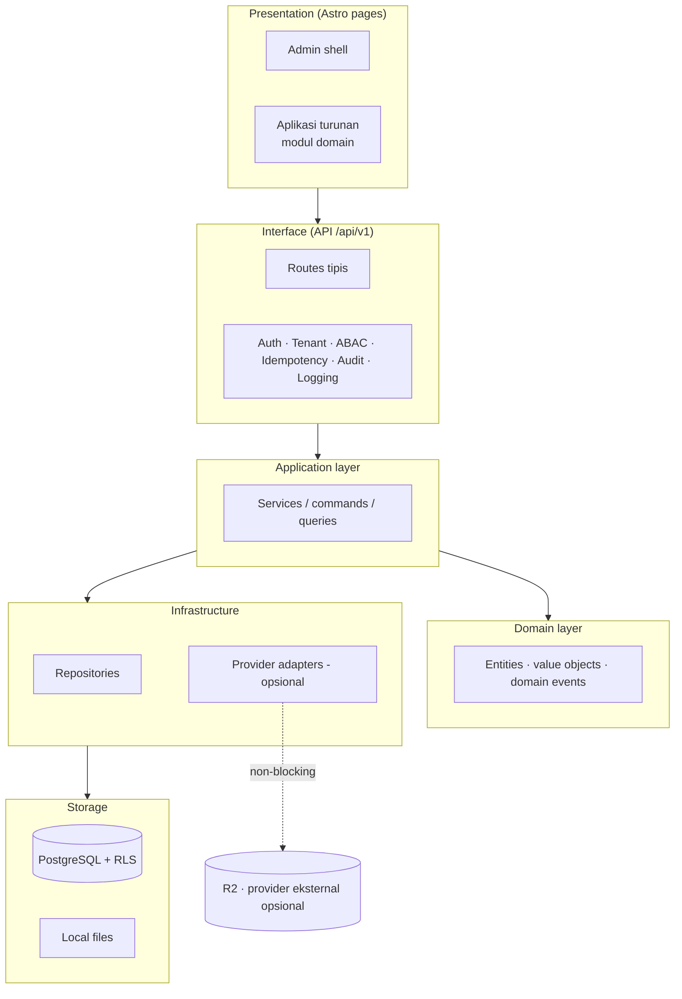

# Bagian 1 — Canvas Induk Tahapan Pengembangan AWCMS-Mini

## Objective

Membangun **AWCMS-Mini Modular Monolith Standard** sebagai **base reusable** yang aman, offline-first, dan siap dikembangkan bertahap untuk menjadi fondasi aplikasi apa pun (multi-tenant, RBAC/ABAC, audit, sync). AWCMS-Mini adalah **contoh repo pengembangan umum** — bukan aplikasi domain tertentu. Aplikasi turunan contoh (mis. AWPOS untuk retail/POS) dibangun di atas base ini dengan menambah modul domainnya sendiri; lihat `docs/awcms-mini/README.md` §Reusable vs domain turunan.

## Stack final

| Area             | Keputusan                                           |
| ---------------- | --------------------------------------------------- |
| Runtime          | Bun                                                 |
| Backend platform | Bun-only; Node.js hanya lewat pengecualian tertulis |
| Web              | Astro 7                                             |
| Database         | PostgreSQL                                          |
| Arsitektur       | Modular monolith, microservice-ready                |
| Mode operasi     | Offline-first / LAN-first                           |
| Sync             | Optional online sync                                |
| Storage          | Local file, optional Cloudflare R2                  |
| Security         | RBAC + ABAC + PostgreSQL RLS + Audit Log            |
| API docs         | OpenAPI                                             |
| Event docs       | AsyncAPI                                            |

## Arsitektur logis



## Ketergantungan antar modul (base)

```mermaid
flowchart LR
  TA[Tenant Admin] --> IA[Identity & Access]
  CP[Central Profile] --> IA
  IA --> WF[Workflow Approval]
  IA --> UI[UI Experience]
  IA --> SYNC[Sync Storage]
  RPT[Management Reporting] --> UI
  L10N[Localization UI] --> UI
  OBS[Observability Logging] -.audit/log.-> ALL[Semua modul]
  DBC[Database Connectivity] -.pool.-> ALL
  SEC[Production Security] -.gates.-> ALL
```



> Modul domain aplikasi turunan (mis. katalog produk, POS, gudang, pajak, CRM) menambah node-nya sendiri di diagram ketergantungan milik aplikasi tersebut — tidak digambar di sini karena bukan bagian base.

> Desain teknis implementasi ada di dokumen lanjutan: UI/UX (`14`), frontend & integrasi/offline-first (`15`), backend data access & database (`16`), seed/RBAC/ABAC (`17`), konfigurasi/environment (`18`).

## Prinsip desain

1. Sistem harus bisa berjalan lokal tanpa internet.
2. Internet hanya dibutuhkan untuk sync, R2, atau integrasi eksternal opsional.
3. Aplikasi turunan tidak boleh bergantung pada provider eksternal untuk operasi intinya.
4. Semua transaksi/dokumen yang sudah posted (bila aplikasi turunan punya konsep ini) harus immutable.
5. Mutation high-risk wajib idempotent.
6. Database harus tenant-aware.
7. Perubahan data append-only (bila relevan untuk domain aplikasi turunan) harus tercatat sebagai movement/event, bukan overwrite.
8. Semua akses sensitif harus melewati ABAC dan audit.
9. Resource master/config/draft yang bisa dihapus memakai soft delete; dokumen posted tetap immutable.
10. Dokumen, kode, migration, OpenAPI, AsyncAPI, dan SOP harus konsisten.

## Modul utama (base)

| Modul                 | Fungsi                                             |
| --------------------- | -------------------------------------------------- |
| Tenant Admin          | Tenant, office, setup wizard                       |
| Identity & Access     | Login, tenant user, RBAC, ABAC, decision log       |
| Central Profile       | Profil user/customer/supplier/contact terpusat     |
| Sync Storage          | Sync node, outbox/inbox, conflict, R2 object queue |
| Localization UI       | i18n, locale, theme                                |
| UI Experience         | Admin shell, navigation registry, theme, i18n      |
| Observability Logging | Log, audit, security event, troubleshooting        |
| Database Connectivity | Pooling, queue, PgBouncer profile, health          |
| Workflow Approval     | Approval high-risk action                          |
| Management Reporting  | Dashboard dan laporan generik                      |
| Production Security   | Readiness, finding, go-live gates                  |

Modul domain (katalog produk, POS, gudang, pajak/Coretax, CRM receipt, AI business analyst, dsb.) **bukan bagian base ini** — ditambahkan aplikasi turunan contoh (mis. AWPOS) di atas base.

## Fase pengembangan (base)


### Fase 0 — Foundation

- Repository skeleton.
- Module contract.
- SQL migration runner.
- OpenAPI/AsyncAPI baseline.
- Docker Compose PostgreSQL.
- Health endpoint.

### Fase 1 — Tenant, Identity, Profile

- Tenant dan office.
- Setup wizard.
- Owner/admin login.
- Central profile.
- Profile resolver.
- RBAC dan ABAC.

### Fase 2 — Reliability dan Operasional

- Structured logging.
- Audit trail.
- Database pooling.
- Backpressure.
- Backup/restore SOP.

### Fase 3 — Sync Storage

- Offline sync outbox/inbox.
- Conflict resolution.
- R2 object queue.

### Fase 4 — UI/UX dan Reporting

- Admin shell.
- Navigation registry.
- Management reporting views generik.

### Fase 5 — Workflow, Security, Deployment

- Workflow approval.
- Security readiness.
- Go-live gates.
- Deployment profile.
- Handover.

## Base-ready boundary

AWCMS-Mini base dianggap siap dipakai (untuk mulai membangun aplikasi turunan) jika:

- Tenant setup berhasil.
- Owner/admin login.
- Role dasar dan ABAC default deny berjalan.
- Central profile resolver bekerja.
- Audit log high-risk tersedia.
- Master data yang dihapus tidak hilang fisik dan dapat dipulihkan oleh role berizin.
- Backup/restore diuji.

## Production-ready boundary

Production-ready jika:

- Base ready selesai.
- RLS tested.
- ABAC tested.
- Audit high-risk aktif.
- Soft delete, restore, dan purge policy diuji untuk resource yang deletable.
- No critical security finding.
- Backup restore pass.
- Pool health OK.
- Concurrency/load test dasar OK (mutation high-risk idempotent di bawah beban paralel).
- SOP dan handover selesai.

## Next action

Mulai implementasi dari:

```text
Issue 0.1 — Initialize AWCMS-Mini Modular Monolith Repository Structure
```
