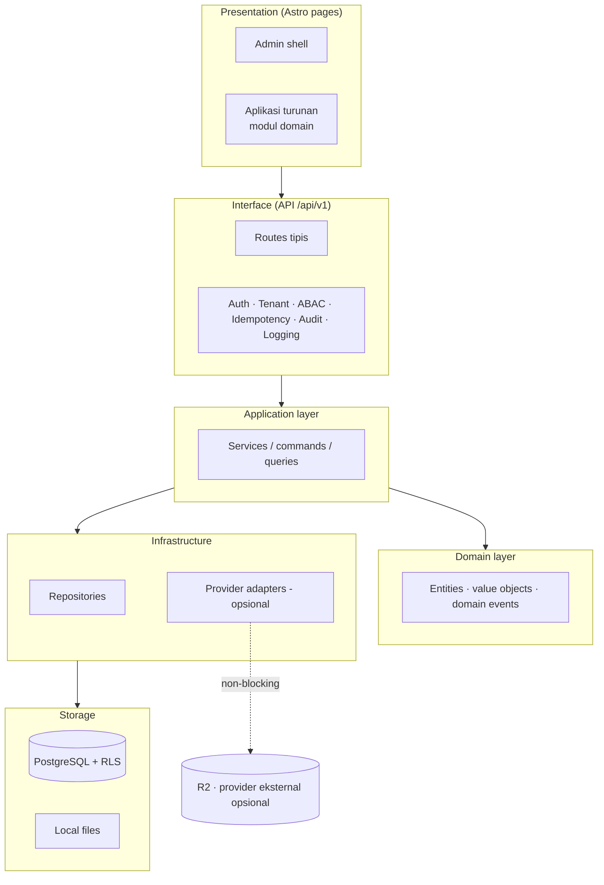
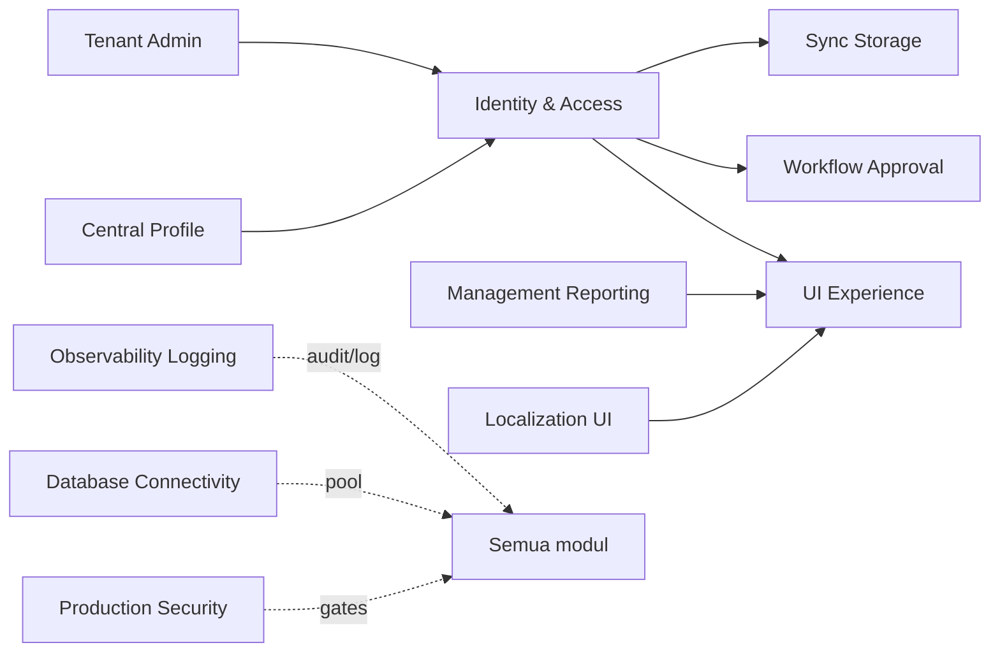
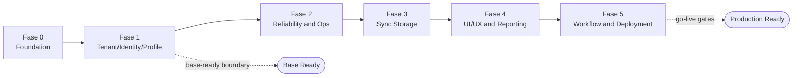

# Bagian 1 — Canvas Induk Tahapan Pengembangan AWCMS-Mini

## Objective

Membangun **AWCMS-Mini Modular Monolith Standard** sebagai **base reusable** yang aman, offline-first, dan siap dikembangkan bertahap untuk menjadi fondasi aplikasi apa pun (multi-tenant, RBAC/ABAC, audit, sync). AWCMS-Mini adalah **contoh repo pengembangan umum** — bukan aplikasi domain tertentu. Aplikasi turunan contoh (mis. AWPOS untuk retail/POS) dibangun di atas base ini dengan menambah modul domainnya sendiri; lihat `docs/awcms-mini/README.md` §Reusable vs domain turunan.

## Stack final

| Area             | Keputusan                                           |
| ---------------- | --------------------------------------------------- |
| Runtime          | Bun                                                 |
| Backend platform | Bun-only; Node.js hanya lewat pengecualian tertulis |
| Web              | Astro 7                                             |
| Database         | PostgreSQL                                          |
| Arsitektur       | Modular monolith, microservice-ready                |
| Mode operasi     | Offline-first / LAN-first                           |
| Sync             | Optional online sync                                |
| Storage          | Local file, optional Cloudflare R2                  |
| Security         | RBAC + ABAC + PostgreSQL RLS + Audit Log            |
| API docs         | OpenAPI                                             |
| Event docs       | AsyncAPI                                            |

## Arsitektur logis



## Ketergantungan antar modul (base)



> **Diagram ini menyederhanakan.** Ia menggambar alur arsitektur inti, **bukan** seluruh 28 modul terdaftar, dan beberapa node-nya (UI Experience, Localization UI, Database Connectivity, Production Security) **bukan modul terdaftar** sama sekali — lihat §"Kapabilitas base yang BUKAN modul terdaftar" di bawah. Ketergantungan yang mengikat secara mesin adalah field `dependencies` di tiap `module.ts`, divalidasi `bun run modules:dag:check`.

> Modul domain aplikasi turunan (mis. katalog produk, POS, gudang, pajak, CRM) menambah node-nya sendiri di diagram ketergantungan milik aplikasi tersebut — tidak digambar di sini karena disumbangkan lewat `src/modules/application-registry.ts`, bukan oleh base.

> Desain teknis implementasi ada di dokumen lanjutan: UI/UX (`14`), frontend & integrasi/offline-first (`15`), backend data access & database (`16`), seed/RBAC/ABAC (`17`), konfigurasi/environment (`18`).

## Prinsip desain

1. Sistem harus bisa berjalan lokal tanpa internet.
2. Internet hanya dibutuhkan untuk sync, R2, atau integrasi eksternal opsional.
3. Aplikasi turunan tidak boleh bergantung pada provider eksternal untuk operasi intinya.
4. Semua transaksi/dokumen yang sudah posted (bila aplikasi turunan punya konsep ini) harus immutable.
5. Mutation high-risk wajib idempotent.
6. Database harus tenant-aware.
7. Perubahan data append-only (bila relevan untuk domain aplikasi turunan) harus tercatat sebagai movement/event, bukan overwrite.
8. Semua akses sensitif harus melewati ABAC dan audit.
9. Resource master/config/draft yang bisa dihapus memakai soft delete; dokumen posted tetap immutable.
10. Dokumen, kode, migration, OpenAPI, AsyncAPI, dan SOP harus konsisten.

## Modul utama (base)

Sumber kebenaran tabel ini adalah **`listBaseModules()`** di
`src/modules/index.ts` — **28 modul terdaftar**, bukan daftar tulis-tangan.
Kolom `key` adalah key yang benar-benar didaftarkan; **jangan menurunkannya
dari nama direktori** (`src/modules/workflow-approval` terdaftar sebagai
`workflow`). Kolom Kategori mengikuti taksonomi
[`21_module_admission_governance.md`](21_module_admission_governance.md) §8,
dan `type`/`status` mengikuti `module.ts` masing-masing. Tabel ini dijaga
tetap sinkron oleh `tests/unit/module-doc-reconciliation.test.ts` — menambah
modul ke registry tanpa menambah barisnya di sini akan gagal di CI.

| Modul (`key`)             | Nama                             | Kategori          | Fungsi                                                                                                                                                                                                                                                                                                                                                                                                                                                                                                                                                                                                                                                |
| ------------------------- | -------------------------------- | ----------------- | ----------------------------------------------------------------------------------------------------------------------------------------------------------------------------------------------------------------------------------------------------------------------------------------------------------------------------------------------------------------------------------------------------------------------------------------------------------------------------------------------------------------------------------------------------------------------------------------------------------------------------------------------------- |
| `tenant_admin`            | Tenant Admin                     | Core              | Tenant, hierarki office, physical location, tenant settings, setup wizard                                                                                                                                                                                                                                                                                                                                                                                                                                                                                                                                                                             |
| `identity_access`         | Identity & Access                | Core              | Login, tenant user, RBAC, ABAC, session, decision log                                                                                                                                                                                                                                                                                                                                                                                                                                                                                                                                                                                                 |
| `profile_identity`        | Profile Identity                 | Core              | Party (person/organization) terpusat, identifier, entity link                                                                                                                                                                                                                                                                                                                                                                                                                                                                                                                                                                                         |
| `module_management`       | Module Management                | System            | Registry modul tenant-aware, enable/disable, settings, permission sync                                                                                                                                                                                                                                                                                                                                                                                                                                                                                                                                                                                |
| `logging`                 | Logging & Audit Trail            | System            | Audit trail lintas-modul, structured logging, correlation ID, metrics                                                                                                                                                                                                                                                                                                                                                                                                                                                                                                                                                                                 |
| `sync_storage`            | Sync Storage                     | System            | Sync node, outbox/inbox, conflict, R2 object queue, HMAC push/pull                                                                                                                                                                                                                                                                                                                                                                                                                                                                                                                                                                                    |
| `email`                   | Email                            | System            | Layanan email provider-neutral: template, recipient, dispatcher outbox                                                                                                                                                                                                                                                                                                                                                                                                                                                                                                                                                                                |
| `form_drafts`             | Form Drafts                      | System            | Draft store server-side generik untuk wizard pattern                                                                                                                                                                                                                                                                                                                                                                                                                                                                                                                                                                                                  |
| `tenant_domain`           | Tenant Domain                    | System            | Mapping domain/subdomain tenant untuk routing publik online-primary                                                                                                                                                                                                                                                                                                                                                                                                                                                                                                                                                                                   |
| `visitor_analytics`       | Visitor Analytics                | System            | Statistik pengunjung privacy-first untuk route admin dan publik                                                                                                                                                                                                                                                                                                                                                                                                                                                                                                                                                                                       |
| `reporting`               | Management Reporting             | System            | View & projection laporan manajemen generik, export dispatcher                                                                                                                                                                                                                                                                                                                                                                                                                                                                                                                                                                                        |
| `workflow`                | Workflow Approval                | System            | Engine workflow-definition terkelola & berversi untuk approval high-risk                                                                                                                                                                                                                                                                                                                                                                                                                                                                                                                                                                              |
| `data_lifecycle`          | Data Lifecycle                   | System            | Registry tabel bervolume tinggi: retensi, partisi, arsip, legal hold, purge                                                                                                                                                                                                                                                                                                                                                                                                                                                                                                                                                                           |
| `domain_event_runtime`    | Domain Event Runtime             | System            | Outbox & dispatcher domain event transaksional dan berversi                                                                                                                                                                                                                                                                                                                                                                                                                                                                                                                                                                                           |
| `integration_hub`         | Integration Hub                  | System            | Batas integrasi generik provider-neutral (inbound/outbound)                                                                                                                                                                                                                                                                                                                                                                                                                                                                                                                                                                                           |
| `idn_admin_regions`       | Indonesia Administrative Regions | System            | Master data wilayah administratif Indonesia (`type: base`, `status: experimental` — scaffold, lihat catatan di bawah)                                                                                                                                                                                                                                                                                                                                                                                                                                                                                                                                 |
| `blog_content`            | Blog Content                     | Official Optional | Manajemen konten/blog tenant-scoped                                                                                                                                                                                                                                                                                                                                                                                                                                                                                                                                                                                                                   |
| `news_portal`             | News Portal                      | Official Optional | Lapisan editorial + media di atas blog_content/tenant_domain                                                                                                                                                                                                                                                                                                                                                                                                                                                                                                                                                                                          |
| `social_publishing`       | Social Publishing                | Official Optional | Outbox auto-posting sosial provider-neutral                                                                                                                                                                                                                                                                                                                                                                                                                                                                                                                                                                                                           |
| `organization_structure`  | Organization Structure           | Official Optional | Fondasi struktur organisasi tenant-scoped opsional                                                                                                                                                                                                                                                                                                                                                                                                                                                                                                                                                                                                    |
| `reference_data`          | Reference Data                   | Official Optional | Fondasi reference data provider-neutral opsional                                                                                                                                                                                                                                                                                                                                                                                                                                                                                                                                                                                                      |
| `service_catalog`         | Service Catalog                  | Official Optional | Katalog plan/offer SaaS berversi (control-plane, default-disabled, ADR-0022) — offer immutable, harga exact minor-unit                                                                                                                                                                                                                                                                                                                                                                                                                                                                                                                                |
| `tenant_entitlement`      | Tenant Entitlement               | Official Optional | Entitlement efektif fitur/modul/kuota tenant (control-plane, default-disabled, tenant-scoped, ADR-0022) — kontrak fail-closed `effective_entitlement`, override reason/time-bound                                                                                                                                                                                                                                                                                                                                                                                                                                                                     |
| `tenant_provisioning`     | Tenant Provisioning              | Official Optional | Provisioning tenant idempoten/resumable (control-plane, default-disabled, tenant-scoped, ADR-0022) — plan/step registry berversi, lease/checkpoint/bounded-retry, kompensasi diklasifikasi, reconciliation non-destruktif, readiness                                                                                                                                                                                                                                                                                                                                                                                                                  |
| `usage_metering`          | Usage Metering                   | Official Optional | Fondasi metering provider-neutral (control-plane, default-disabled, tenant-scoped, ADR-0022) — event append-only numeric-only, aggregation deterministik, koreksi bertanda, quota fail-closed, reconciliation                                                                                                                                                                                                                                                                                                                                                                                                                                         |
| `tenant_lifecycle`        | Tenant Lifecycle                 | Official Optional | Siklus hidup SaaS tenant (control-plane, default-disabled, tenant-scoped, ADR-0022) — state machine berversi, restriksi fail-closed server-derived lintas API/SSR/public/worker, transisi terjadwal idempoten, downgrade non-destruktif, restore ter-rekonsiliasi                                                                                                                                                                                                                                                                                                                                                                                     |
| `subscription_billing`    | Subscription Billing             | Official Optional | State komersial SaaS subscription (control-plane, default-disabled, tenant-scoped, ADR-0022) — subscription terikat versi offer immutable (#870), invoice draft/issued immutable, credit note, referensi alokasi pembayaran, dunning via kontrak lifecycle #873, upgrade/downgrade/cancel terjadwal. Uang EXACT minor-unit, generasi invoice idempoten per (subscription, period, offer). BUKAN general ledger/AR-AP/tax engine                                                                                                                                                                                                                       |
| `payment_gateway`         | Payment Gateway                  | Official Optional | Gateway pembayaran provider-neutral (control-plane, default-disabled, tenant-scoped, ADR-0022) — checkout/session ter-hosting, webhook masuk bertandatangan fail-closed (HMAC + freshness ≤300s + binding provider/account + size + anti-replay per-event-id DURABLE di DB + ordering), event ternormalisasi, refund, retry/DLQ, provider health + circuit breaker, reconciliation. Status pembayaran TAK PERNAH dipercaya dari redirect browser — hanya webhook signed tervalidasi/reconciliation. Panggilan provider SELALU di luar transaksi DB (ADR-0006). Secret hanya di process.env. BUKAN general ledger/AR-AP/merchant settlement/tax engine |
| `document_infrastructure` | Document Infrastructure          | Official Optional | Infrastruktur METADATA dokumen generik tenant-scoped                                                                                                                                                                                                                                                                                                                                                                                                                                                                                                                                                                                                  |
| `data_exchange`           | Data Exchange                    | Official Optional | Framework import/export CSV/JSON bertahap provider-neutral                                                                                                                                                                                                                                                                                                                                                                                                                                                                                                                                                                                            |

> **Klarifikasi scope (Issue #828).** Versi sebelumnya dokumen ini
> menyatakan _"modul domain ... bukan bagian base ini"_. **Klaim itu
> dicabut**: base repo ini memang mendaftarkan modul berkategori domain
> (`blog_content`, `news_portal`, `social_publishing`, dan cluster
> Official Optional lainnya) di `src/modules/index.ts`. Yang benar adalah:
> modul **Core/System** wajib ada, sedangkan modul **Official Optional**
> ikut ter-ship di base tapi bisa di-disable per tenant. Modul domain
> **aplikasi turunan** (katalog produk, POS, gudang, pajak/Coretax, CRM
> receipt, AI business analyst, dsb.) yang bukan bagian base ini —
> ditambahkan aplikasi turunan (mis. AWPOS) lewat
> `src/modules/application-registry.ts` (Issue #740), bukan dengan mengedit
> registry base.

### Kapabilitas base yang BUKAN modul terdaftar

Empat kapabilitas base di bawah nyata dan berfungsi, tapi **sengaja tidak
punya folder `src/modules/*` maupun `ModuleDescriptor`** — konsekuensinya
mereka tidak punya entri permission/navigation/health di registry dan
**tidak terlihat oleh `bun run modules:dag:check`**. Diagram ketergantungan
di atas menggambar mereka sebagai node agar alur arsitekturnya terbaca;
itu **bukan** klaim bahwa mereka modul terdaftar (Issue #828 Temuan 5).

| Kapabilitas           | Rumah sebenarnya di repo                                      | Kenapa bukan modul                                                                |
| --------------------- | ------------------------------------------------------------- | --------------------------------------------------------------------------------- |
| Localization UI       | `i18n/*.po`, `src/lib/i18n/`, middleware resolusi locale      | Lintas-modul murni: setiap modul memakainya, tak satu pun memilikinya             |
| UI Experience         | `src/lib/ui/`, `src/layouts/`, `src/components/`              | Shell/komponen presentasi bersama, bukan domain dengan tabel/permission sendiri   |
| Database Connectivity | `src/lib/database/`                                           | Fondasi infrastruktur di bawah semua modul; pool/health-nya bukan resource tenant |
| Production Security   | `scripts/security-readiness.ts`, `bun run security:readiness` | **Script-only & ephemeral** — lihat catatan di doc 13 §Matrix Modul vs Migration  |

## Fase pengembangan (base)



### Fase 0 — Foundation

- Repository skeleton.
- Module contract.
- SQL migration runner.
- OpenAPI/AsyncAPI baseline.
- Docker Compose PostgreSQL.
- Health endpoint.

### Fase 1 — Tenant, Identity, Profile

- Tenant dan office.
- Setup wizard.
- Owner/admin login.
- Central profile.
- Profile resolver.
- RBAC dan ABAC.

### Fase 2 — Reliability dan Operasional

- Structured logging.
- Audit trail.
- Database pooling.
- Backpressure.
- Backup/restore SOP.

### Fase 3 — Sync Storage

- Offline sync outbox/inbox.
- Conflict resolution.
- R2 object queue.

### Fase 4 — UI/UX dan Reporting

- Admin shell.
- Navigation registry.
- Management reporting views generik.

### Fase 5 — Workflow, Security, Deployment

- Workflow approval.
- Security readiness.
- Go-live gates.
- Deployment profile.
- Handover.

## Base-ready boundary

AWCMS-Mini base dianggap siap dipakai (untuk mulai membangun aplikasi turunan) jika:

- Tenant setup berhasil.
- Owner/admin login.
- Role dasar dan ABAC default deny berjalan.
- Central profile resolver bekerja.
- Audit log high-risk tersedia.
- Master data yang dihapus tidak hilang fisik dan dapat dipulihkan oleh role berizin.
- Backup/restore diuji.

## Production-ready boundary

Production-ready jika:

- Base ready selesai.
- RLS tested.
- ABAC tested.
- Audit high-risk aktif.
- Soft delete, restore, dan purge policy diuji untuk resource yang deletable.
- No critical security finding.
- Backup restore pass.
- Pool health OK.
- Concurrency/load test dasar OK (mutation high-risk idempotent di bawah beban paralel).
- SOP dan handover selesai.

## Next action

Mulai implementasi dari:

```text
Issue 0.1 — Initialize AWCMS-Mini Modular Monolith Repository Structure
```
