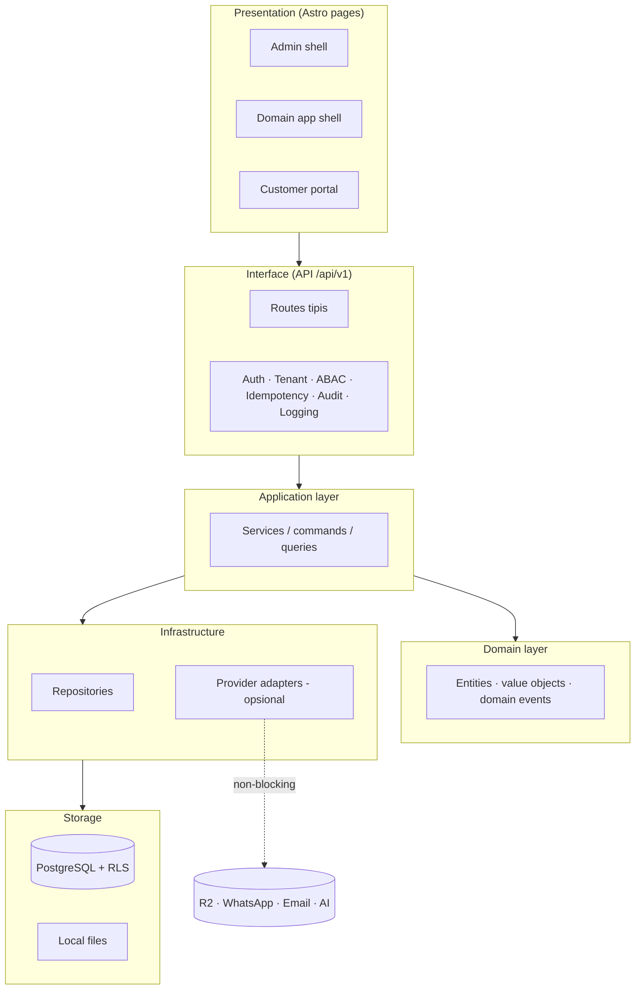
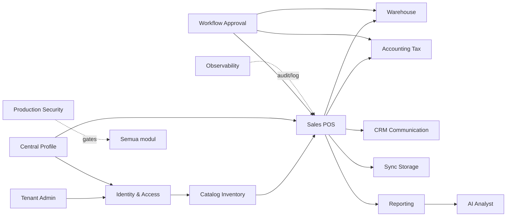
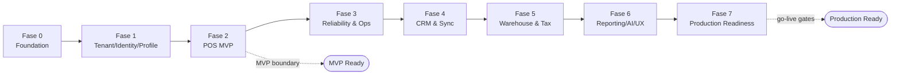

# Bagian 1 — Canvas Induk Tahapan Pengembangan AWCMS-Mini

## Objective

Membangun **AWCMS-Mini Modular Monolith Standard** sebagai sistem standar modular yang aman, offline-first, dan siap dikembangkan bertahap untuk kebutuhan toko, cabang, gudang, receipt digital, pajak/Coretax, reporting, dan AI business analyst.

## Stack final

| Area | Keputusan |
|---|---|
| Runtime | Bun |
| Web | Astro 7 |
| Database | PostgreSQL |
| Arsitektur | Modular monolith, microservice-ready |
| Mode operasi | Offline-first / LAN-first |
| Sync | Optional online sync |
| Storage | Local file, optional Cloudflare R2 |
| Security | RBAC + ABAC + PostgreSQL RLS + Audit Log |
| API docs | OpenAPI |
| Event docs | AsyncAPI |

## Arsitektur logis



## Ketergantungan antar modul



> Desain teknis implementasi ada di dokumen lanjutan: UI/UX (`14`), frontend & integrasi/offline-first (`15`), backend data access & database (`16`), seed/RBAC/ABAC (`17`), konfigurasi/environment (`18`).

## Prinsip desain

1. Sistem harus bisa berjalan lokal tanpa internet.
2. Internet hanya dibutuhkan untuk sync, R2, WhatsApp/email receipt, atau integrasi eksternal.
3. POS tidak boleh bergantung pada provider eksternal.
4. Semua transaksi posted harus immutable.
5. Mutation high-risk wajib idempotent.
6. Database harus tenant-aware.
7. Semua perubahan stok harus tercatat sebagai movement append-only.
8. Semua akses sensitif harus melewati ABAC dan audit.
9. Resource master/config/draft yang bisa dihapus memakai soft delete; dokumen posted tetap immutable.
10. Dokumen, kode, migration, OpenAPI, AsyncAPI, dan SOP harus konsisten.

## Modul utama

| Modul | Fungsi |
|---|---|
| Tenant Admin | Tenant, office, toko, cabang, gudang, setup wizard |
| Identity & Access | Login, tenant user, RBAC, ABAC, decision log |
| Central Profile | Profil user/customer/supplier/contact terpusat |
| Catalog Inventory | Produk, kategori, satuan, harga, stok dasar |
| Sales POS | Checkout, cart, payment, posting transaksi |
| Shared Stock Routing | Shared stock multi tenant dan routing transaksi |
| Warehouse Management | Warehouse, zone, bin, lot, transfer, cycle count |
| Accounting Tax/Coretax | Tax profile, VAT invoice, Coretax XML-ready batch |
| CRM Communication | Receipt PDF, WhatsApp/email outbox, provider adapter |
| Sync Storage | Sync node, outbox/inbox, conflict, R2 object queue |
| AI Analyst | Read-only business analyst berbasis safe aggregate views |
| UI Experience | Admin, operator, customer portal, theme, i18n |
| Observability Logging | Log, audit, security event, troubleshooting |
| Database Connectivity | Pooling, queue, PgBouncer profile, health |
| Workflow Approval | Approval high-risk action |
| Management Reporting | Dashboard dan laporan |
| Production Security | Readiness, finding, go-live gates |

## Fase pengembangan



### Fase 0 — Foundation

- Repository skeleton.
- Module contract.
- SQL migration runner.
- OpenAPI/AsyncAPI baseline.
- Docker Compose PostgreSQL.
- Health endpoint.

### Fase 1 — Tenant, Identity, Profile

- Tenant dan office.
- Setup wizard.
- Owner/admin/operator login.
- Central profile.
- Profile resolver.
- RBAC dan ABAC.

### Fase 2 — POS MVP

- Product catalog.
- Stock balance.
- Checkout/cart.
- Payment.
- Atomic transaction posting.
- Idempotency.
- Stock locking.
- Receipt PDF lokal.

### Fase 3 — Reliability dan Operasional

- Structured logging.
- Audit trail.
- Database pooling.
- Backpressure.
- Backup/restore SOP.

### Fase 4 — CRM dan Sync

- WhatsApp receipt.
- Email receipt.
- Customer receipt portal.
- Offline sync.
- Conflict resolution.
- R2 object queue.

### Fase 5 — Warehouse dan Tax

- Multi gudang.
- Bin/rak.
- Lot/batch/expired.
- Transfer antar gudang.
- Cycle count.
- Tax profile.
- VAT invoice staging.
- Coretax batch XML-ready.

### Fase 6 — Reporting, AI, UI/UX

- Admin dashboard.
- POS fullscreen UI.
- Customer portal.
- Management reporting.
- AI business analyst read-only.

### Fase 7 — Production Readiness

- Workflow approval.
- Security readiness.
- Go-live gates.
- Deployment profile.
- Handover.

## MVP boundary

AWCMS-Mini MVP dianggap siap jika:

- Tenant setup berhasil.
- Owner/admin/operator login.
- Role dasar dan ABAC default deny berjalan.
- Produk dapat dibuat.
- Stok awal dapat diinput.
- Kasir dapat checkout dan posting transaksi.
- Posting transaksi idempotent dan atomic.
- Stok berkurang dengan movement.
- Receipt PDF lokal dibuat.
- Audit log transaksi tersedia.
- Master data yang dihapus tidak hilang fisik dan dapat dipulihkan oleh role berizin.
- Backup/restore diuji.

## Production-ready boundary

Production-ready jika:

- MVP selesai.
- RLS tested.
- ABAC tested.
- Audit high-risk aktif.
- Soft delete, restore, dan purge policy diuji untuk resource yang deletable.
- No critical security finding.
- Backup restore pass.
- Pool health OK.
- POS concurrent test OK.
- SOP dan handover selesai.

## Next action

Mulai implementasi dari:

```text
Issue 0.1 — Initialize AWCMS-Mini Modular Monolith Repository Structure
```
