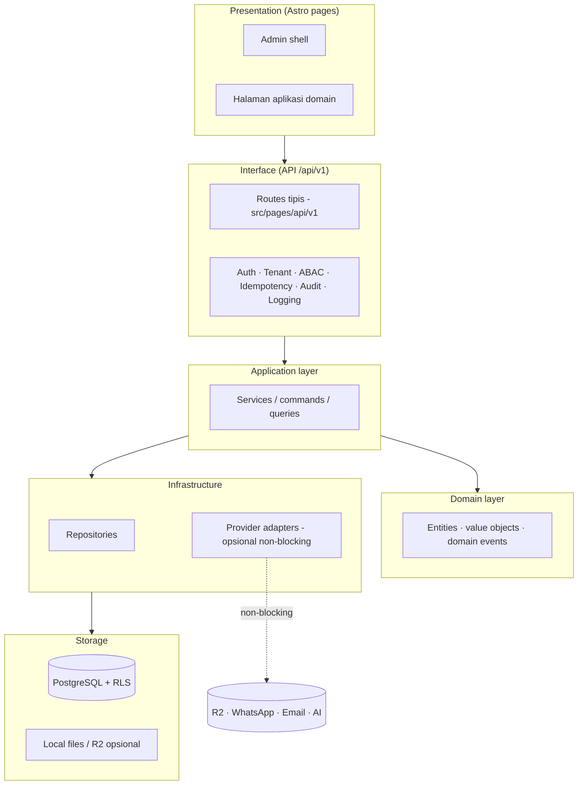
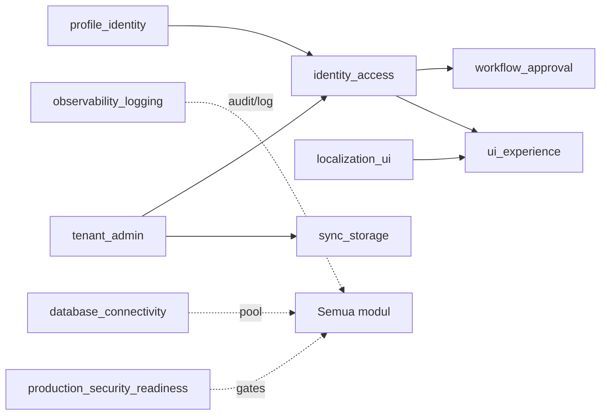
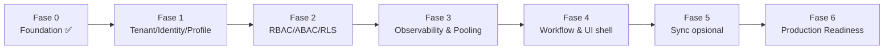

# Bagian 1 — Canvas Induk AWCMS-Mini Base

## Objective

Menyediakan **AWCMS-Mini** sebagai base modular monolith yang aman, offline-first-ready, dan menjadi **standar pengembangan semua aplikasi AhliWeb berikutnya** (contoh domain pertama: AWPOS).

## Stack final

| Area         | Keputusan                                |
| ------------ | ---------------------------------------- |
| Runtime      | Bun                                      |
| Web          | Astro 7 (SSR, adapter node standalone)   |
| Database     | PostgreSQL (driver postgres.js)          |
| Arsitektur   | Modular monolith, microservice-ready     |
| Mode operasi | Offline/LAN-first-ready, optional sync   |
| Security     | RBAC + ABAC + PostgreSQL RLS + Audit Log |
| API docs     | OpenAPI (`openapi/`)                     |
| Event docs   | AsyncAPI (`asyncapi/`)                   |
| Versioning   | SemVer + Changesets                      |

## Arsitektur logis

## Modul base

| Modul                           | Fungsi                                                  |
| ------------------------------- | ------------------------------------------------------- |
| `_shared`                       | Module contract, response/error, context, guard, helper |
| `tenant_admin`                  | Tenant, office, tenant settings, setup wizard           |
| `identity_access`               | Login, tenant user, RBAC, ABAC, decision log            |
| `profile_identity`              | Central profile + identifier ter-mask/hash              |
| `localization_ui`               | i18n (id/en/ms/ar), theme                               |
| `observability_logging`         | Log, audit, security event                              |
| `database_connectivity`         | Pooling, backpressure, pool health                      |
| `workflow_approval`             | Approval high-risk lintas modul                         |
| `management_reporting`          | Kontrak laporan read-only                               |
| `ui_experience`                 | Admin shell, navigation registry, design token          |
| `production_security_readiness` | Readiness, finding, go-live gates                       |
| `sync_storage`                  | Offline sync HMAC + object queue (opsional)             |

Modul domain (mis. `catalog_inventory`, `sales_pos`) ditambahkan aplikasi turunan — lihat paket AWPOS sebagai contoh lengkap.

## Ketergantungan antar modul base

## Prinsip desain

1. Aplikasi harus bisa berjalan lokal tanpa internet; provider eksternal tidak boleh jadi dependency transaksi.
2. Mutation high-risk wajib idempotent; multi-table wajib transaction.
3. Database tenant-aware: `tenant_id` + tenant context + RLS (FORCE) + filter eksplisit.
4. Semua akses sensitif melewati ABAC (default deny) dan audit.
5. Data sensitif dimask/redact — tidak pernah masuk response/log/audit mentah.
6. Dokumen, kode, migration, OpenAPI, AsyncAPI, dan SOP harus konsisten.

## Fase pengembangan base

- **Fase 0 — Foundation (SELESAI):** skeleton repo, module contract + registry, `_shared`, migration runner + 001–004, OpenAPI/AsyncAPI baseline, health endpoint, scripts readiness/preflight, Docker Compose PostgreSQL.
- **Fase 1:** setup wizard, login, central profile (schema 002 sudah tersedia; service/API menyusul).
- **Fase 2:** evaluator ABAC + assignment API + decision log (schema 003 tersedia).
- **Fase 3:** repository audit/log/security event (schema 004 tersedia), pool gate work-class.
- **Fase 4:** workflow approval, admin shell + design tokens.
- **Fase 5:** sync HMAC + object queue (feature-flagged).
- **Fase 6:** readiness gates penuh + deployment profile.

## Base-ready boundary

Base dianggap siap dipakai aplikasi domain bila:

- Setup wizard menghasilkan tenant + owner + role default + ABAC default, lalu terkunci.
- Login/`auth/me` jalan; ABAC default deny teruji; RLS teruji (lihat doc 07).
- Audit high-risk aktif; redaction teruji.
- `db:migrate`, `api:spec:check`, `test`, `build`, `security:readiness` pass.

## Next action

Lanjutkan sesuai urutan issue doc 06 mulai **Issue 1.1 — Setup wizard API**.
