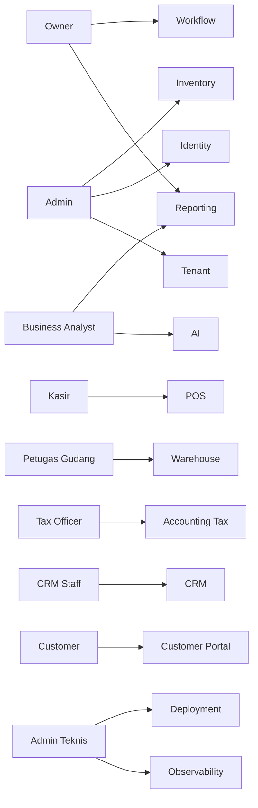
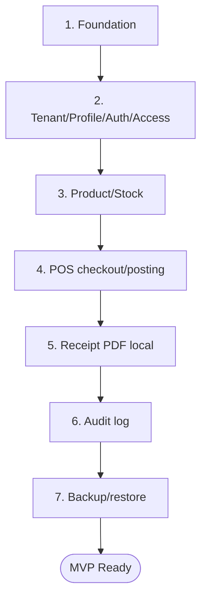

# Bagian 2 — PRD Detail Per Modul

> **Contoh domain (ilustratif).** Dokumen ini memakai domain retail/POS bergaya AWPOS sebagai contoh berjalan. **Pola & standar**-nya reusable untuk base AWCMS-Mini; **entitas, endpoint, layar, dan istilah domain** (produk, POS, gudang, pajak, CRM, AI, dsb.) adalah ilustrasi yang **diganti** oleh aplikasi turunan. Lihat [README paket dokumen](README.md) §Reusable vs domain turunan.

## Tujuan PRD

Dokumen ini menjelaskan kebutuhan produk AWCMS-Mini dari sisi bisnis, pengguna, fitur, prioritas, dan acceptance criteria per modul.

## Peta persona ke modul

## Persona utama

| Persona          | Kebutuhan                                                |
| ---------------- | -------------------------------------------------------- |
| Owner            | Monitoring omzet, stok, approval, laporan, risiko bisnis |
| Admin            | Setup tenant, user, produk, stok, laporan, konfigurasi   |
| Kasir            | Transaksi cepat, search/scan produk, payment, receipt    |
| Petugas Gudang   | Transfer, receiving, cycle count, stok bin/lot           |
| Tax Officer      | Tax profile, VAT invoice, Coretax batch export           |
| CRM Staff        | Contact, consent, receipt WhatsApp/email                 |
| Business Analyst | Laporan agregat dan AI insight aman                      |
| Customer         | Buka receipt, download PDF, consent                      |
| Admin Teknis     | Deployment, backup, restore, troubleshooting             |

## Modul 1 — Tenant Admin

### Problem

AWCMS-Mini harus mendukung tenant, toko, cabang, office, gudang, dan lokasi fisik.

### Scope

- Tenant master.
- Office/cabang/toko/gudang.
- Physical location.
- Setup wizard awal.
- Setup lock.

### Acceptance criteria

- Tenant pertama dapat dibuat.
- Owner pertama dapat dibuat.
- Office pertama dapat dibuat.
- Setup tidak dapat dijalankan ulang setelah locked.
- Tenant inactive tidak dapat melakukan transaksi.
- Office/lokasi yang tidak dipakai dapat diarsipkan via soft delete tanpa menghapus riwayat transaksi.

## Modul 2 — Identity & Access

### Problem

Setiap user harus memiliki login dan hak akses sesuai tugas.

### Scope

- Identity login.
- Tenant user membership.
- Role.
- Permission.
- ABAC policy.
- Access decision log.

### Acceptance criteria

- Owner/admin/operator dapat login.
- ABAC default deny.
- Deny overrides allow.
- Kasir tidak bisa akses pajak/export.
- Access denied tercatat.

## Modul 3 — Central Profile

### Problem

Data user, customer, supplier, CRM contact, dan tax party tidak boleh terduplikasi.

### Scope

- Profile person/organization.
- Identifier email, phone, WhatsApp, NPWP, NIK.
- Masked value.
- Entity link.
- Dedup/merge request.

### Acceptance criteria

- Customer bisa di-resolve dari WhatsApp/email.
- Identifier duplicate tidak membuat profile baru.
- Profile bisa di-link ke user/customer/tax/CRM.
- Merge high-risk membutuhkan approval.
- Profile/contact yang tidak aktif dapat diarsipkan; identifier sensitif tetap masked dan tidak dihapus fisik sebelum retention.

## Modul 4 — Catalog & Inventory

### Problem

POS membutuhkan master produk, harga, satuan, stok, dan movement.

### Scope

- Category.
- Brand.
- Unit.
- Product.
- Product price.
- Stock balance.
- Stock movement.

### Acceptance criteria

- Produk bisa dibuat.
- SKU unik per tenant.
- Barcode unik jika diisi.
- Produk inactive tidak bisa dijual.
- Movement stok append-only.
- Produk/kategori/brand/unit dapat diarsipkan via soft delete jika tidak sedang dipakai transaksi aktif.

## Modul 5 — Sales POS

### Problem

Kasir membutuhkan transaksi cepat, aman, dan tidak dobel.

### Scope

- Checkout session.
- Cart/line item.
- Payment.
- Posting transaksi.
- Idempotency.
- Stock lock.
- Sales document.
- Receipt request.

### Acceptance criteria

- Kasir bisa checkout.
- Total dihitung server-side.
- Posting mengurangi stok.
- Double click tidak membuat transaksi ganda.
- Stok kurang menghasilkan error aman.
- Transaksi posted immutable.
- Cart/checkout draft dapat dibatalkan/diarsipkan; sales document posted tidak boleh di-soft-delete.

## Modul 6 — Shared Stock Routing

### Problem

Beberapa tenant bisa berbagi stok di lokasi fisik yang sama, dengan transaksi diarahkan ke tenant tertentu.

### Scope

- Stock pool.
- Stock pool member.
- Product mapping.
- Routing rule.
- Routing decision.
- Settlement guardrail.

### Acceptance criteria

- Stock pool memiliki member tenant.
- Routing rule memilih tenant berdasarkan kondisi.
- Legal basis dicatat.
- Routing decision diaudit.
- Rule lama diarsipkan via soft delete agar histori routing tetap dapat diaudit.

## Modul 7 — Warehouse Management

### Problem

Multi gudang memerlukan warehouse, zone, bin, lot, serial, transfer, in-transit, dan cycle count.

### Scope

- Warehouse.
- Zone.
- Bin.
- Bin balance.
- Lot/batch/expired.
- Serial.
- Transfer order.
- Shipment/receipt.
- Cycle count.
- Stock adjustment request.

### Acceptance criteria

- Warehouse dibuat dari office.
- Bin code unik per warehouse.
- Transfer antar gudang dapat shipped/received.
- Partial receipt didukung.
- Damaged/expired masuk quarantine.
- Cycle count menghasilkan variance dan adjustment request.
- Zone/bin master dapat diarsipkan via soft delete jika tidak memiliki stok aktif; movement tetap append-only.

## Modul 8 — Accounting Tax/Coretax

### Problem

AWCMS-Mini perlu siap pajak Indonesia dan Coretax tanpa mengasumsikan upload API resmi.

### Scope

- Tax profile.
- NITKU/ID TKU.
- Party tax profile.
- Product tax profile.
- VAT invoice staging.
- Coretax batch XML-ready.
- Checksum dan approval.

### Acceptance criteria

- NPWP/NIK/NITKU dimasking.
- VAT invoice dapat digenerate dari sales posted.
- Missing tax data terdeteksi.
- Coretax batch membutuhkan approval jika policy aktif.
- Tax profile lama diarsipkan via soft delete; faktur dan batch exported tetap immutable.

## Modul 9 — CRM Communication

### Problem

Customer membutuhkan bukti transaksi digital melalui PDF, WhatsApp, dan email.

### Scope

- Receipt PDF.
- CRM contact.
- Contact channel.
- Consent.
- Message outbox.
- StarSender adapter.
- Mailketing adapter.
- Customer portal.

### Acceptance criteria

- Receipt PDF dibuat.
- Consent dicek sebelum mengirim.
- Offline masuk queue.
- Token receipt aman.
- Customer hanya melihat receipt miliknya.
- Contact/channel dapat diarsipkan via soft delete; delivery log dan receipt tetap mengikuti retention.

## Modul 10 — Sync Storage

### Problem

Node offline perlu sinkron ke server pusat saat online.

### Scope

- Sync node.
- Outbox/inbox.
- Push/pull.
- HMAC signature.
- Checkpoint.
- Conflict.
- Object queue/R2.

### Acceptance criteria

- Push/pull signed.
- Duplicate batch tidak dobel.
- Conflict immutable tercatat.
- File checksum diverifikasi.

## Modul 11 — AI Business Analyst

### Problem

Owner membutuhkan insight bisnis cepat tanpa membuka data mentah sensitif.

### Scope

- Safe aggregate views.
- Read-only tools.
- Tool policy.
- Tool call audit.
- Hermes adapter optional.

### Acceptance criteria

- AI tidak bisa raw SQL.
- AI tidak bisa mutation.
- AI tidak expose PII mentah.
- Semua tool call diaudit.

## Modul 12 — UI Experience

### Scope

- Admin shell.
- POS fullscreen.
- Customer receipt portal.
- Theme light/dark/system.
- Locale ID/EN awal.
- Navigation role-aware.

### Acceptance criteria

- Admin melihat dashboard.
- Kasir transaksi keyboard-first.
- Customer portal mobile-friendly.
- UI punya loading/empty/error state.

## Modul 13 — Observability, Pooling, Workflow, Security

### Scope

- Structured log.
- Audit log.
- DB pool.
- Backpressure.
- Workflow approval.
- Production security readiness.
- Go-live gates.

### Acceptance criteria

- Correlation ID tersedia.
- Secret diredaksi.
- Pool health dapat dicek.
- High-risk action approval.
- Critical security finding memblokir go-live.

## MVP prioritas

1. Foundation.
2. Tenant/profile/auth/access.
3. Product/stock.
4. POS checkout/posting.
5. Receipt PDF local.
6. Audit log.
7. Backup/restore.

## Out of scope MVP

- Payment gateway.
- Native mobile app.
- Advanced BI.
- Upload langsung Coretax.
- AI mutation.
- Microservice split.
