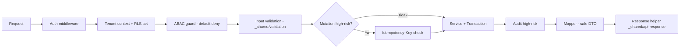

# Bagian 3 — SRS Detail per Modul Base

## Tujuan SRS

Menetapkan spesifikasi teknis modul base yang siap diimplementasi: requirement fungsional, validasi, dan security per modul. Modul domain mengikuti pola dokumen ini di paket aplikasinya.

## Pipeline request lintas modul

## Requirement umum lintas modul

### Multi-tenant

1. Semua tabel tenant-scoped punya `tenant_id` + RLS `FORCE` + policy `app.current_tenant_id`.
2. Semua akses lewat `withTenant()` (`SET LOCAL` via `set_config(..., true)`).
3. Query tetap memfilter `tenant_id` eksplisit (defense in depth).

### Security

1. Endpoint non-public wajib auth + ABAC guard (`guardAccess`, default deny).
2. Error response standard (`toErrorResponse`) — tidak pernah stack trace.
3. Secret hanya dari environment (doc 18); redaction wajib (doc 10).

### Transaction safety

1. Mutation multi-table dalam `withTransaction`/`withTenant`.
2. Mutation high-risk wajib `Idempotency-Key` (`requireIdempotencyKey` + `evaluateReplay`).
3. Provider eksternal tidak dipanggil di dalam transaction.

### Audit

1. High-risk action → `buildAuditEvent` → insert `awcms_audit_events` di transaction yang sama.
2. Attributes selalu melalui `redactSensitive`.

## 1. Tenant Admin

### Functional requirement

1. `GET /setup/status` → `{ initialized: boolean }`.
2. `POST /setup/initialize` → buat tenant + owner identity + tenant_user + office pertama + seed doc 17, idempotent, terkunci setelah sukses.
3. CRUD office (create/read/update; nonaktif via status, bukan delete).
4. Tenant settings key-value (`awcms_tenant_settings`).

### Validation

- `tenant_code`/`office_code`: slug, unik (per scope), maks 64.
- `office_type` enum; `parent_office_id` harus office tenant yang sama.

### Security

- `setup/initialize` publik hanya saat belum initialized; setelah itu 403.
- Office management: permission `tenant_admin.office_management.*`.

## 2. Identity & Access

### Functional requirement

1. `POST /auth/login` → verifikasi scrypt, terapkan lockout (`failed_login_count`, `locked_until`), terbitkan JWT sesi (lib/auth/session).
2. `GET /auth/me` → context user + roles (safe DTO).
3. `POST /auth/logout` → invalidasi sesi.
4. `GET /access/modules` → registry module/activity dari katalog permission.
5. `POST /access/evaluate` → jalankan evaluator ABAC, kembalikan `AccessDecision`.
6. `POST /access/assignments` → assign role/permission (idempotent, audit).
7. `GET /access/decision-logs` → decision log (Auditor/Owner).

### Aturan evaluator (doc 17)

- Default deny; allow hanya dari role→permission; deny policy selalu menang.
- Setiap deny high-risk ditulis ke `awcms_abac_decision_logs`.
- Evaluasi memakai `AccessRequest` (module, activity, action, atribut resource/environment).

### Validation

- Login identifier maks 255; password minimal 8; percobaan gagal → hitung lockout.

### Security

- Login gagal tidak membocorkan mana yang salah (identifier vs password).
- Event `identity.login.succeeded/failed` diterbitkan; login failed = security event.

## 3. Profile Identity

### Functional requirement

1. CRUD profile; `POST /profiles/resolve` (idempotent) mencari via `value_hash`, membuat bila tidak ada.
2. Identifier: normalisasi per tipe (email lowercase, phone E.164) → hash + mask.
3. Entity link: kaitkan profile ke entitas modul lain (module, type, id).
4. Merge request → approval (workflow) → tandai `merged_into_profile_id`.

### Validation

- `identifier_type` enum; nilai dinormalisasi sebelum hash; duplikat per `(tenant, type, hash)` ditolak/di-resolve.

### Security

- Response hanya `masked_value`; nilai mentah tidak disimpan (hanya hash + mask).
- Resolve/link/merge = high-risk → idempotency + audit.

## 4. Localization UI

1. Kamus terjemahan per locale + fallback (`resolveLocale`, q-aware).
2. `ar` dirender RTL (`textDirection`).
3. Preferensi `default_locale`/`default_theme` dari `awcms_tenants` / `awcms_tenant_settings`.

## 5. Observability Logging

1. Repository insert log/audit/security event (attributes sudah ter-redact).
2. `GET /logs/*` read-only, pagination keyset, ABAC (Auditor).
3. `correlation_id`/`request_id` dari `traceIdsFromRequest`.

## 6. Database Connectivity

1. Pool gate per work class: `critical_transaction` > `interactive` > `reporting` > `background_sync` > `maintenance`.
2. Antrean penuh/timeout → `503 DATABASE_BUSY` + event `database.pool.saturated`.
3. `GET /database/pool/health` (sudah tersedia) melaporkan status/latensi.

## 7. Workflow Approval

1. Definisi workflow per jenis aksi; instance + task + decision.
2. `POST /workflow/tasks/{id}/decision` idempotent; self-approval ditolak (ABAC policy 7).
3. Hasil decision diterbitkan sebagai event `workflow.task.approved/rejected`.

## 8. Management Reporting

1. Kontrak query read-only: DTO projection, sort whitelist, pagination keyset.
2. Tidak ada akses tabel mentah modul lain — hanya view yang dideklarasikan.

## 9. UI Experience

1. Admin shell membaca module registry (`src/modules/index.ts`) + permission → navigasi.
2. Design token doc 14; theme light/dark/system.

## 10. Production Security Readiness

1. `scripts/security-readiness.ts`: env hygiene, RLS coverage, validitas migration, config production.
2. Go-live gate: critical finding = BLOCKED (exit non-zero).

## 11. Sync Storage (opsional)

1. Signature HMAC `timestamp.body`, skew maks `AWCMS_SYNC_MAX_SKEW_SEC` (default 300), timing-safe compare.
2. Duplicate event idempotent; conflict → resolusi manual + audit.

## Error code standar

Lihat `src/modules/_shared/api-error.ts` — satu-satunya sumber: `VALIDATION_ERROR` 400, `AUTH_REQUIRED`/`TOKEN_EXPIRED` 401, `ACCESS_DENIED` 403, `TENANT_REQUIRED` 400, `RESOURCE_NOT_FOUND` 404, `IDEMPOTENCY_REQUIRED` 400, `IDEMPOTENCY_CONFLICT` 409, `WORKFLOW_APPROVAL_REQUIRED` 409, `SYNC_CONFLICT` 409, `DATABASE_BUSY` 503, `PROVIDER_ERROR` 502, `INTERNAL_ERROR` 500.

## Testing requirement minimum

- Unit: helper `_shared` + lib (sudah ada di `tests/`), evaluator ABAC (saat dibangun), service per modul.
- Integration: migration runner terhadap PostgreSQL nyata; RLS isolation test (pola di doc 07).
- Contract: `bun run api:contract:test` terhadap server berjalan.
- Fitness: `validateModuleRegistry` + `api:spec:check` menjaga konsistensi modul/kontrak.
