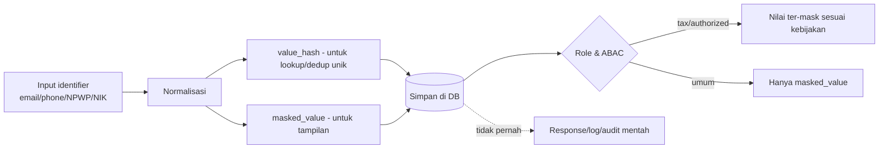

# Bagian 4 — ERD dan Data Dictionary Detail

## Tujuan

Dokumen ini menjadi baseline database AWCMS Mini: ERD konseptual, ownership tabel, data dictionary ringkas, index, RLS, klasifikasi data, migration order, dan retention.

## Prinsip database

1. Semua tabel tenant-scoped wajib `tenant_id`.
2. Primary key menggunakan UUID.
3. Timestamp menggunakan `timestamptz`.
4. Monetary/quantity menggunakan `numeric`, bukan floating point.
5. Posted transaction dan posted stock movement append-only.
6. Koreksi memakai reversal/return/adjustment.
7. FK child wajib index.
8. Tabel tenant-scoped wajib RLS.
9. Data sensitif dimasking, di-hash untuk lookup/dedup jika relevan.
10. Migration harus berurutan dan audit-ready.

## ERD konseptual utama

```mermaid
erDiagram
  AWCMS Mini_TENANTS ||--o{ AWCMS Mini_OFFICES : owns
  AWCMS Mini_TENANTS ||--o{ AWCMS Mini_TENANT_USERS : has
  AWCMS Mini_PROFILES ||--o{ AWCMS Mini_PROFILE_IDENTIFIERS : has
  AWCMS Mini_PROFILES ||--o{ AWCMS Mini_PROFILE_ENTITY_LINKS : links
  AWCMS Mini_IDENTITIES ||--o{ AWCMS Mini_TENANT_USERS : joins
  AWCMS Mini_TENANTS ||--o{ AWCMS Mini_PRODUCTS : owns
  AWCMS Mini_PRODUCTS ||--o{ AWCMS Mini_PRODUCT_PRICES : priced
  AWCMS Mini_PRODUCTS ||--o{ AWCMS Mini_STOCK_BALANCES : stocked
  AWCMS Mini_STOCK_BALANCES ||--o{ AWCMS Mini_STOCK_MOVEMENTS : changes
  AWCMS Mini_CHECKOUT_SESSIONS ||--o{ AWCMS Mini_CHECKOUT_LINES : contains
  AWCMS Mini_CHECKOUT_SESSIONS ||--|| AWCMS Mini_SALES_DOCUMENTS : posts_to
  AWCMS Mini_SALES_DOCUMENTS ||--o{ AWCMS Mini_SALES_DOCUMENT_LINES : contains
  AWCMS Mini_SALES_DOCUMENTS ||--o{ AWCMS Mini_RECEIPT_PDFS : generates
  AWCMS Mini_OFFICES ||--o{ AWCMS Mini_WAREHOUSES : extends
  AWCMS Mini_WAREHOUSES ||--o{ AWCMS Mini_WAREHOUSE_ZONES : contains
  AWCMS Mini_WAREHOUSE_ZONES ||--o{ AWCMS Mini_WAREHOUSE_BINS : contains
  AWCMS Mini_WAREHOUSE_BINS ||--o{ AWCMS Mini_WAREHOUSE_BIN_BALANCES : stores
  AWCMS Mini_WAREHOUSE_TRANSFER_ORDERS ||--o{ AWCMS Mini_WAREHOUSE_TRANSFER_LINES : contains
  AWCMS Mini_TAX_PROFILES ||--o{ AWCMS Mini_TAX_BUSINESS_UNITS : has
  AWCMS Mini_SALES_DOCUMENTS ||--o{ AWCMS Mini_VAT_INVOICES : stages
  AWCMS Mini_CRM_CONTACTS ||--o{ AWCMS Mini_MESSAGE_OUTBOX : receives
  AWCMS Mini_SYNC_NODES ||--o{ AWCMS Mini_SYNC_OUTBOX : produces
  AWCMS Mini_WORKFLOW_INSTANCES ||--o{ AWCMS Mini_WORKFLOW_TASKS : creates
```

## Global column standard

| Kolom             | Tipe        | Fungsi                   |
| ----------------- | ----------- | ------------------------ |
| `id`              | uuid        | Primary key              |
| `tenant_id`       | uuid        | Isolasi tenant           |
| `code`            | text        | Kode bisnis              |
| `status`          | text        | Status lifecycle         |
| `created_at`      | timestamptz | Waktu dibuat             |
| `updated_at`      | timestamptz | Waktu update             |
| `deleted_at`      | timestamptz | Soft delete jika relevan |
| `created_by`      | uuid        | Actor pembuat            |
| `updated_by`      | uuid        | Actor update             |
| `sync_version`    | bigint      | Version untuk sync       |
| `origin_node_id`  | uuid        | Node asal offline/sync   |
| `idempotency_key` | text        | Idempotency mutation     |

## Table ownership matrix

| Module               | Table utama                                                                                                                                                                                                          |
| -------------------- | -------------------------------------------------------------------------------------------------------------------------------------------------------------------------------------------------------------------- |
| Foundation           | `awcms_modules`, `awcms_schema_migrations`, `awcms_system_events`                                                                                                                                                    |
| Tenant Admin         | `awcms_tenants`, `awcms_offices`, `awcms_physical_locations`, `awcms_tenant_settings`                                                                                                                                |
| Profile Identity     | `awcms_profiles`, `awcms_profile_identifiers`, `awcms_profile_channels`, `awcms_profile_addresses`, `awcms_profile_entity_links`, `awcms_profile_merge_requests`                                                     |
| Identity Access      | `awcms_identities`, `awcms_tenant_users`, `awcms_roles`, `awcms_permissions`, `awcms_abac_policies`, `awcms_abac_decision_logs`                                                                                      |
| Catalog Inventory    | `awcms_products`, `awcms_product_categories`, `awcms_units`, `awcms_product_prices`, `awcms_stock_balances`, `awcms_stock_movements`                                                                                 |
| Sales POS            | `awcms_checkout_sessions`, `awcms_checkout_lines`, `awcms_sales_documents`, `awcms_sales_document_lines`, `awcms_sales_payments`, `awcms_idempotency_keys`                                                           |
| Shared Stock Routing | `awcms_stock_pools`, `awcms_stock_pool_members`, `awcms_transaction_routing_rules`, `awcms_transaction_routing_decisions`                                                                                            |
| Warehouse            | `awcms_warehouses`, `awcms_warehouse_zones`, `awcms_warehouse_bins`, `awcms_inventory_lots`, `awcms_inventory_serials`, `awcms_warehouse_bin_balances`, `awcms_warehouse_transfer_orders`, `awcms_cycle_count_plans` |
| Accounting Tax       | `awcms_tax_profiles`, `awcms_tax_business_units`, `awcms_party_tax_profiles`, `awcms_product_tax_profiles`, `awcms_vat_invoices`, `awcms_coretax_batches`                                                            |
| CRM                  | `awcms_crm_contacts`, `awcms_crm_contact_channels`, `awcms_receipt_pdfs`, `awcms_message_outbox`, `awcms_message_attempts`                                                                                           |
| Sync Storage         | `awcms_sync_nodes`, `awcms_sync_outbox`, `awcms_sync_inbox`, `awcms_sync_conflicts`, `awcms_object_sync_queue`                                                                                                       |
| AI Analyst           | `awcms_ai_sessions`, `awcms_ai_messages`, `awcms_ai_tool_calls`, `awcms_ai_tool_policies`                                                                                                                            |
| Logging              | `awcms_log_events`, `awcms_audit_events`, `awcms_security_events`                                                                                                                                                    |
| Workflow             | `awcms_workflow_definitions`, `awcms_workflow_instances`, `awcms_workflow_tasks`, `awcms_workflow_decisions`                                                                                                         |
| Reporting            | report views/materialized views                                                                                                                                                                                      |
| Production Security  | `awcms_security_controls`, `awcms_security_readiness_assessments`, `awcms_security_findings`, `awcms_go_live_gates`                                                                                                  |

## Data dictionary ringkas per modul

### `awcms_tenants`

| Kolom            | Tipe | Keterangan                |
| ---------------- | ---- | ------------------------- |
| `id`             | uuid | PK                        |
| `tenant_code`    | text | Unik global               |
| `tenant_name`    | text | Nama operasional          |
| `legal_name`     | text | Nama legal                |
| `status`         | text | active/inactive/suspended |
| `default_locale` | text | id/en/ms/ar               |
| `default_theme`  | text | light/dark/system         |

Index: unique `tenant_code`.

### `awcms_offices`

| Kolom              | Tipe | Keterangan                               |
| ------------------ | ---- | ---------------------------------------- |
| `tenant_id`        | uuid | Tenant scope                             |
| `office_code`      | text | Unik per tenant                          |
| `office_name`      | text | Nama kantor/toko/gudang                  |
| `office_type`      | text | head_office/branch/store/warehouse/other |
| `parent_office_id` | uuid | Hierarki                                 |
| `status`           | text | active/inactive                          |

Index: `(tenant_id, office_code)`, `(tenant_id, office_type)`.

### `awcms_profiles`

Canonical profile untuk user/customer/supplier/contact.

Kolom penting: `tenant_id`, `profile_type`, `display_name`, `legal_name`, `status`, `verification_status`, `risk_level`, `merged_into_profile_id`.

### `awcms_profile_identifiers`

Identifier sensitif seperti email, phone, WhatsApp, NPWP, NIK.

Kolom penting: `identifier_type`, `normalized_value`, `value_hash`, `masked_value`, `is_primary`, `verification_status`.

Constraint: unique `(tenant_id, identifier_type, value_hash)`.

### `awcms_identities`

Login identity.

Kolom penting: `profile_id`, `login_identifier`, `password_hash`, `status`, `failed_login_count`, `locked_until`, `last_login_at`.

Catatan: `password_hash` tidak pernah keluar response/API/log.

### `awcms_products`

Product master.

Kolom penting: `tenant_id`, `sku`, `barcode`, `product_name`, `category_id`, `base_unit_id`, `tracking_type`, `status`.

Constraint: unique `(tenant_id, sku)`, unique `(tenant_id, barcode)` jika barcode tidak null.

### `awcms_stock_balances`

Saldo stok per office.

Kolom penting: `tenant_id`, `product_id`, `office_id`, `quantity_on_hand`, `quantity_reserved`, `quantity_available`.

Constraint: unique `(tenant_id, product_id, office_id)`.

### `awcms_stock_movements`

Mutasi stok append-only.

Kolom penting: `product_id`, `office_id`, `movement_type`, `quantity_delta`, `reference_module`, `reference_type`, `reference_id`, `posted_at`.

### `awcms_checkout_sessions`

Draft transaksi kasir.

Kolom penting: `cashier_user_id`, `office_id`, `customer_profile_id`, `status`, `gross_total`, `discount_total`, `tax_total`, `net_total`.

### `awcms_sales_documents`

Transaksi posted immutable.

Kolom penting: `source_checkout_id`, `document_no`, `office_id`, `customer_profile_id`, `status`, `gross_total`, `tax_total`, `net_total`, `posted_at`.

Constraint: unique `(tenant_id, document_no)`.

### `awcms_warehouse_bin_balances`

Saldo stok detail per bin/lot/serial.

Kolom penting: `warehouse_id`, `zone_id`, `bin_id`, `product_id`, `lot_id`, `serial_id`, `quantity_on_hand`, `quantity_reserved`, `quantity_available`.

### `awcms_vat_invoices`

VAT invoice staging.

Kolom penting: `sales_document_id`, `tax_profile_id`, `tax_business_unit_id`, `invoice_no`, `status`, `dpp_total`, `vat_total`, `luxury_tax_total`.

### `awcms_message_outbox`

Queue pengiriman WhatsApp/email.

Kolom penting: `contact_id`, `channel_type`, `provider_code`, `message_type`, `payload_json`, `status`, `next_retry_at`.

### `awcms_sync_outbox`

Event lokal yang perlu disinkronkan.

Kolom penting: `node_id`, `event_type`, `aggregate_type`, `aggregate_id`, `payload_json`, `status`.

## RLS standard

Setiap tabel tenant-scoped:

```sql
ALTER TABLE table_name ENABLE ROW LEVEL SECURITY;

CREATE POLICY table_name_tenant_isolation
  ON table_name
  USING (tenant_id = current_setting('app.current_tenant_id')::uuid);
```

## Index standard

- `(tenant_id)` untuk semua tabel tenant-scoped.
- `(tenant_id, created_at DESC)` untuk transaksi/log/event.
- `(tenant_id, status, created_at)` untuk workflow/outbox/task.
- FK child index.
- Search index untuk produk/profile jika data besar.

## Alur perlindungan data sensitif



## Sensitive data classification

| Data                   | Level       | Kontrol                   |
| ---------------------- | ----------- | ------------------------- |
| Password hash          | Critical    | Never expose              |
| API key/provider token | Critical    | Env only                  |
| NPWP/NIK/NITKU         | High        | Mask, ABAC tax role       |
| Phone/WhatsApp/email   | High        | Mask/hash lookup          |
| Address                | Medium/High | Need-to-know              |
| Sales transaction      | Medium      | Tenant RLS, audit         |
| Tax invoice/XML        | High        | Tax role, audit, checksum |
| AI prompt/tool call    | Medium      | No raw PII                |

## Retention awal

| Data                       |                  Retention |
| -------------------------- | -------------------------: |
| Idempotency key            |                  7–30 hari |
| HTTP request log           |                 30–90 hari |
| Security/audit log         | 1–5 tahun sesuai kebutuhan |
| Tax records                |    Sesuai regulasi dan SOP |
| CRM delivery log           |                    1 tahun |
| AI session                 |                90–365 hari |
| Sync conflict              |         Resolved + 1 tahun |
| Transaction/stock movement |          Long-term/archive |
