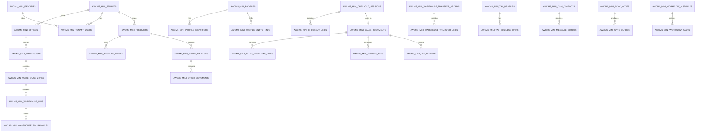
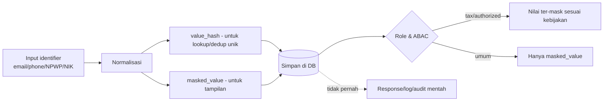

# Bagian 4 — ERD dan Data Dictionary Detail

> **Contoh domain (ilustratif).** Dokumen ini memakai domain retail/POS bergaya AWPOS sebagai contoh berjalan. **Pola & standar**-nya reusable untuk base AWCMS-Mini; **entitas, endpoint, layar, dan istilah domain** (produk, POS, gudang, pajak, CRM, AI, dsb.) adalah ilustrasi yang **diganti** oleh aplikasi turunan. Lihat [README paket dokumen](README.md) §Reusable vs domain turunan.

## Tujuan

Dokumen ini menjadi baseline database AWCMS-Mini: ERD konseptual, ownership tabel, data dictionary ringkas, index, RLS, klasifikasi data, migration order, dan retention.

## Prinsip database

1. Semua tabel tenant-scoped wajib `tenant_id`.
2. Primary key menggunakan UUID.
3. Timestamp menggunakan `timestamptz`.
4. Monetary/quantity menggunakan `numeric`, bukan floating point.
5. Posted transaction dan posted stock movement append-only.
6. Koreksi memakai reversal/return/adjustment.
7. FK child wajib index.
8. Tabel tenant-scoped wajib RLS.
9. Data sensitif dimasking, di-hash untuk lookup/dedup jika relevan.
10. Migration harus berurutan dan audit-ready.
11. Resource yang deletable memakai soft delete; physical delete hanya untuk purge retention/legal yang berizin.

## ERD konseptual utama



## Global column standard

| Kolom             | Tipe        | Fungsi                                        |
| ----------------- | ----------- | --------------------------------------------- |
| `id`              | uuid        | Primary key                                   |
| `tenant_id`       | uuid        | Isolasi tenant                                |
| `code`            | text        | Kode bisnis                                   |
| `status`          | text        | Status lifecycle                              |
| `created_at`      | timestamptz | Waktu dibuat                                  |
| `updated_at`      | timestamptz | Waktu update                                  |
| `created_by`      | uuid        | Actor pembuat                                 |
| `updated_by`      | uuid        | Actor update                                  |
| `deleted_at`      | timestamptz | Soft delete jika relevan                      |
| `deleted_by`      | uuid        | Actor yang mengarsipkan/menghapus soft        |
| `delete_reason`   | text        | Alasan soft delete/purge                      |
| `restored_at`     | timestamptz | Waktu restore jika resource mendukung restore |
| `restored_by`     | uuid        | Actor restore                                 |
| `sync_version`    | bigint      | Version untuk sync                            |
| `origin_node_id`  | uuid        | Node asal offline/sync                        |
| `idempotency_key` | text        | Idempotency mutation                          |

## Table ownership matrix

| Module               | Table utama                                                                                                                                                                                                                                                                                                                                                                                                                                       |
| -------------------- | ------------------------------------------------------------------------------------------------------------------------------------------------------------------------------------------------------------------------------------------------------------------------------------------------------------------------------------------------------------------------------------------------------------------------------------------------- |
| Foundation           | `awcms_mini_modules`, `awcms_mini_schema_migrations`, `awcms_mini_system_events`                                                                                                                                                                                                                                                                                                                                                                  |
| Tenant Admin         | `awcms_mini_tenants`, `awcms_mini_offices`, `awcms_mini_physical_locations`, `awcms_mini_tenant_settings`                                                                                                                                                                                                                                                                                                                                         |
| Profile Identity     | `awcms_mini_profiles`, `awcms_mini_profile_identifiers`, `awcms_mini_profile_channels`, `awcms_mini_profile_addresses`, `awcms_mini_profile_entity_links`, `awcms_mini_profile_merge_requests`, `awcms_mini_profile_relationships`, `awcms_mini_profile_duplicate_candidates`, `awcms_mini_profile_merge_history` (Issue #748)                                                                                                                    |
| Identity Access      | `awcms_mini_identities`, `awcms_mini_tenant_users`, `awcms_mini_sessions`, `awcms_mini_password_reset_tokens`, `awcms_mini_roles`, `awcms_mini_permissions`, `awcms_mini_abac_policies`, `awcms_mini_abac_decision_logs`                                                                                                                                                                                                                          |
| Catalog Inventory    | `awcms_mini_products`, `awcms_mini_product_categories`, `awcms_mini_units`, `awcms_mini_product_prices`, `awcms_mini_stock_balances`, `awcms_mini_stock_movements`                                                                                                                                                                                                                                                                                |
| Sales POS            | `awcms_mini_checkout_sessions`, `awcms_mini_checkout_lines`, `awcms_mini_sales_documents`, `awcms_mini_sales_document_lines`, `awcms_mini_sales_payments`, `awcms_mini_idempotency_keys`                                                                                                                                                                                                                                                          |
| Shared Stock Routing | `awcms_mini_stock_pools`, `awcms_mini_stock_pool_members`, `awcms_mini_transaction_routing_rules`, `awcms_mini_transaction_routing_decisions`                                                                                                                                                                                                                                                                                                     |
| Warehouse            | `awcms_mini_warehouses`, `awcms_mini_warehouse_zones`, `awcms_mini_warehouse_bins`, `awcms_mini_inventory_lots`, `awcms_mini_inventory_serials`, `awcms_mini_warehouse_bin_balances`, `awcms_mini_warehouse_transfer_orders`, `awcms_mini_cycle_count_plans`                                                                                                                                                                                      |
| Accounting Tax       | `awcms_mini_tax_profiles`, `awcms_mini_tax_business_units`, `awcms_mini_party_tax_profiles`, `awcms_mini_product_tax_profiles`, `awcms_mini_vat_invoices`, `awcms_mini_coretax_batches`                                                                                                                                                                                                                                                           |
| CRM                  | `awcms_mini_crm_contacts`, `awcms_mini_crm_contact_channels`, `awcms_mini_receipt_pdfs`, `awcms_mini_message_outbox`, `awcms_mini_message_attempts`                                                                                                                                                                                                                                                                                               |
| Sync Storage         | `awcms_mini_sync_nodes`, `awcms_mini_sync_outbox`, `awcms_mini_sync_inbox`, `awcms_mini_sync_conflicts`, `awcms_mini_object_sync_queue`                                                                                                                                                                                                                                                                                                           |
| Email (base)         | `awcms_mini_email_templates`, `awcms_mini_email_messages`, `awcms_mini_email_delivery_attempts`, `awcms_mini_email_suppression_list`                                                                                                                                                                                                                                                                                                              |
| AI Analyst           | `awcms_mini_ai_sessions`, `awcms_mini_ai_messages`, `awcms_mini_ai_tool_calls`, `awcms_mini_ai_tool_policies`                                                                                                                                                                                                                                                                                                                                     |
| Logging              | `awcms_mini_log_events`, `awcms_mini_audit_events`, `awcms_mini_security_events`                                                                                                                                                                                                                                                                                                                                                                  |
| Workflow             | `awcms_mini_workflow_definitions` (versioned: `version`/`lifecycle_status`/`graph`/`facts_schema`, Issue #747), `awcms_mini_workflow_instances` (pinned `workflow_definition_version`, `facts`), `awcms_mini_workflow_tasks` (node-based: `node_id`, `quorum_rule`, `due_at`, `escalation_step`), `awcms_mini_workflow_decisions`, `awcms_mini_workflow_task_assignments`, `awcms_mini_workflow_delegations`, `awcms_mini_workflow_join_arrivals` |
| Reporting            | report views/materialized views                                                                                                                                                                                                                                                                                                                                                                                                                   |
| Production Security  | `awcms_mini_security_controls`, `awcms_mini_security_readiness_assessments`, `awcms_mini_security_findings`, `awcms_mini_go_live_gates`                                                                                                                                                                                                                                                                                                           |
| Module Management    | `awcms_mini_modules` (extended), `awcms_mini_tenant_modules`, `awcms_mini_module_dependencies`, `awcms_mini_module_settings`, `awcms_mini_module_navigation`, `awcms_mini_module_jobs`, `awcms_mini_module_health_checks`                                                                                                                                                                                                                         |
| Data Lifecycle       | `awcms_mini_data_lifecycle_legal_holds`, `awcms_mini_data_lifecycle_cursors`, `awcms_mini_data_lifecycle_archive_manifests`, `awcms_mini_data_lifecycle_runs`                                                                                                                                                                                                                                                                                     |

## Data dictionary ringkas per modul

### `awcms_mini_tenants`

| Kolom            | Tipe | Keterangan                |
| ---------------- | ---- | ------------------------- |
| `id`             | uuid | PK                        |
| `tenant_code`    | text | Unik global               |
| `tenant_name`    | text | Nama operasional          |
| `legal_name`     | text | Nama legal                |
| `status`         | text | active/inactive/suspended |
| `default_locale` | text | en/id/ms/ar               |
| `default_theme`  | text | light/dark/system         |

Index: unique `tenant_code`.

`default_locale` — locale default tenant (min **en**, **id**). **Target default `'en'`**; migration `002` saat ini masih `DEFAULT 'id'` — diubah ke `'en'` via migration baru saat i18n dibangun (issue #433, milestone M9). Locale efektif = preferensi per-user (bila ada) → `default_locale` tenant.

### `awcms_mini_offices`

| Kolom              | Tipe | Keterangan                               |
| ------------------ | ---- | ---------------------------------------- |
| `tenant_id`        | uuid | Tenant scope                             |
| `office_code`      | text | Unik per tenant                          |
| `office_name`      | text | Nama kantor/toko/gudang                  |
| `office_type`      | text | head_office/branch/store/warehouse/other |
| `parent_office_id` | uuid | Hierarki                                 |
| `status`           | text | active/inactive                          |

Index: `(tenant_id, office_code)`, `(tenant_id, office_type)`.

### `awcms_mini_profiles`

Canonical profile untuk user/customer/supplier/contact.

Kolom penting: `tenant_id`, `profile_type`, `display_name`, `legal_name`, `status`, `verification_status`, `risk_level`, `merged_into_profile_id`.

### `awcms_mini_profile_identifiers`

Identifier sensitif seperti email, phone, WhatsApp, NPWP, NIK.

Kolom penting: `identifier_type`, `normalized_value`, `value_hash`, `masked_value`, `is_primary`, `verification_status`.

Constraint: unique `(tenant_id, identifier_type, value_hash)`.

### Profile Identity — party lifecycle completion (Issue #748, epic `platform-evolution` #738 Wave 2, `sql/059`)

Melengkapi `awcms_mini_profiles`/`awcms_mini_profile_identifiers`/`_channels`/`_addresses`/`_merge_requests` di atas menjadi siklus hidup party kanonik penuh — lihat `src/modules/profile-identity/README.md` untuk detail lengkap kolom/endpoint/keputusan desain. Ketujuh tabel migration 003 sudah `FORCE ROW LEVEL SECURITY` sejak migration `013_awcms_mini_enforce_rls_least_privilege.sql`; migration `059` re-issue statement `FORCE` yang sama sebagai no-op aman (PR #777 review correction — draft awal salah mengklaim migration ini menutup gap yang sebenarnya sudah ditutup migration 013).

Kolom baru pada tabel yang sudah ada: `profile_identifiers` mendapat `provenance`/`verified_at`/`verified_by`/`valid_from`/`valid_until`; `profile_channels`/`profile_addresses` mendapat `valid_from`/`valid_until` (channels juga `verified_at`/`verified_by`); `profile_merge_requests` mendapat `requires_approval`/`field_conflict_snapshot`/`reference_impact_snapshot`/`duplicate_candidate_id`/`executed_at`/`executed_by`.

- **`awcms_mini_profile_relationships`** — relasi party-to-party effective-dated, generik. `relationship_type` teks bebas (bukan `CHECK` enum peran bisnis) tervalidasi format `^[a-z][a-z0-9_]{1,63}$` di level SQL dan domain. `is_authorized_representative`+`representation_scope` memodelkan perwakilan resmi sebagai relasi biasa, bukan mekanisme terpisah. `status` (`active`/`ended`, bukan soft delete). Unique parsial `(tenant_id, from_profile_id, to_profile_id, relationship_type) WHERE status = 'active'`.
- **`awcms_mini_profile_duplicate_candidates`** — kandidat duplikat deterministik (identifier sama) + heuristik (kemiripan nama, Sorensen-Dice bigram). `match_reasons` jsonb selalu explainable. Pasangan disimpan terurut (`profile_id_a < profile_id_b`, `CHECK`) sehingga tidak dobel. `status` (`pending`/`confirmed_duplicate`/`not_duplicate`) — keputusan `not_duplicate` immutable terhadap scan ulang (`ON CONFLICT ... WHERE status = 'pending'`).
- **`awcms_mini_profile_merge_history`** — **append-only**, terpisah dari `profile_merge_requests` yang mutable. Survivor/loser, snapshot konflik/impact saat eksekusi, jumlah `entity_links` yang direpoint — dasar penalaran/pemulihan pasca-merge (tidak ada un-merge otomatis).

Keamanan: cross-tenant matching/merge dilarang keras, ditegakkan dua lapis — RLS FORCE, dan `domain/merge.ts`'s `assertSameTenant` yang dipanggil ulang tepat sebelum operasi merge nyata (create DAN execute), tidak pernah mempercayai tenant id lama.

### `awcms_mini_identities`

Login identity.

Kolom penting: `profile_id`, `login_identifier`, `password_hash`, `status`, `failed_login_count`, `locked_until`, `last_login_at`.

Catatan: `password_hash` tidak pernah keluar response/API/log.

### `awcms_mini_password_reset_tokens` (Issue #496, epic #492, `sql/022`)

Token reset password sekali-pakai. Kolom penting: `identity_id`, `token_hash` (unik — hanya hash yang disimpan, token mentah tidak pernah persisted), `expires_at`, `used_at` (single-use — beda dari `awcms_mini_sessions` yang tidak butuh kolom ini). RLS FORCE. Request baru menandai token outstanding sebelumnya sebagai `used_at = now()` (superseded) sebelum membuat yang baru — hanya link terbaru yang pernah valid.

### `awcms_mini_products`

Product master.

Kolom penting: `tenant_id`, `sku`, `barcode`, `product_name`, `category_id`, `base_unit_id`, `tracking_type`, `status`.

Constraint: unique `(tenant_id, sku)`, unique `(tenant_id, barcode)` jika barcode tidak null.

### `awcms_mini_stock_balances`

Saldo stok per office.

Kolom penting: `tenant_id`, `product_id`, `office_id`, `quantity_on_hand`, `quantity_reserved`, `quantity_available`.

Constraint: unique `(tenant_id, product_id, office_id)`.

### `awcms_mini_stock_movements`

Mutasi stok append-only.

Kolom penting: `product_id`, `office_id`, `movement_type`, `quantity_delta`, `reference_module`, `reference_type`, `reference_id`, `posted_at`.

### `awcms_mini_checkout_sessions`

Draft transaksi operasional.

Kolom penting: `cashier_user_id`, `office_id`, `customer_profile_id`, `status`, `gross_total`, `discount_total`, `tax_total`, `net_total`.

### `awcms_mini_sales_documents`

Transaksi posted immutable.

Kolom penting: `source_checkout_id`, `document_no`, `office_id`, `customer_profile_id`, `status`, `gross_total`, `tax_total`, `net_total`, `posted_at`.

Constraint: unique `(tenant_id, document_no)`.

### `awcms_mini_warehouse_bin_balances`

Saldo stok detail per bin/lot/serial.

Kolom penting: `warehouse_id`, `zone_id`, `bin_id`, `product_id`, `lot_id`, `serial_id`, `quantity_on_hand`, `quantity_reserved`, `quantity_available`.

### `awcms_mini_vat_invoices`

VAT invoice staging.

Kolom penting: `sales_document_id`, `tax_profile_id`, `tax_business_unit_id`, `invoice_no`, `status`, `dpp_total`, `vat_total`, `luxury_tax_total`.

### `awcms_mini_message_outbox`

Queue pengiriman WhatsApp/email (contoh domain retail/POS §CRM, tidak diubah oleh Issue #494 di bawah).

Kolom penting: `contact_id`, `channel_type`, `provider_code`, `message_type`, `payload_json`, `status`, `next_retry_at`.

### Email (base, generik — Issue #494/#498, epic #492, `sql/020`/`021`)

Berbeda dari `awcms_mini_message_outbox` di atas (contoh domain retail/POS) — ini infrastruktur base reusable untuk password reset, system announcement, dan workflow notification (arsitektur di Issue #493, `src/modules/email/README.md`). RLS FORCE di keempat tabel; hanya `email_templates` yang soft-deletable (master/config, plus `restored_at`/`restored_by` sejak `sql/021`), tiga lainnya berbasis status transition + purge fisik (seperti `awcms_mini_audit_events`).

- **`awcms_mini_email_templates`** — `template_key` (format `area.name`, mis. `auth.password_reset`, sekaligus jadi kategori allowlist variabel render — Issue #498), `subject_template`/`text_body_template`/`html_body_template` **jsonb per-locale** (`{"en": "...", "id": "..."}`, `sql/021` — doc §Konten multi-bahasa "JSONB per-locale"; minimal salah satu body), `is_active`. Unik `(tenant_id, template_key)` WHERE `deleted_at IS NULL`.
- **`awcms_mini_email_messages`** — outbox, satu baris = satu unit pengiriman ke satu alamat (bukan fan-out ke banyak recipient dalam satu baris — lihat `email_recipients` di bawah). `category` (format sama seperti `template_key`), `template_key` (denormalized, bukan FK — riwayat tetap valid walau template diubah/dihapus), `to_address`/`to_address_hash`/`to_address_masked` (pola normalize/hash/mask `awcms-mini-sensitive-data`, direuse dari `profile-identity/domain/identifier.ts`), `variables` (jsonb, untuk rendering ulang oleh dispatcher — **bukan** `rendered_html_body`/`rendered_text_body`, sengaja tidak disimpan; "prefer template key + variables hash over full rendered body"), `variables_hash`, `status` (`queued → sending → sent | failed → retry_wait → cancelled | suppressed`), `retry_count`, `next_attempt_at` (dobel sebagai claim lease saat `sending`, pola sama `awcms_mini_object_sync_queue`).
- **`awcms_mini_email_delivery_attempts`** — riwayat percobaan per pesan (`message_id` FK), `outcome` (`success`/`failure`), `provider_response_snippet` (sudah diredaksi oleh caller sebelum insert — bukan raw response).
- **`awcms_mini_email_suppression_list`** — block-list bounce/complaint/manual/unsubscribe, key lookup `recipient_hash` (bukan raw address).
- **`email_recipients`** (diusulkan issue) **tidak dibuat** — setiap `email_messages` sudah satu baris per recipient; bulk send (Issue #497) meng-enqueue N baris `email_messages` berbagi `correlation_id`, bukan satu baris fan-out ke banyak recipient.

### `awcms_mini_sync_outbox`

Event lokal yang perlu disinkronkan.

Kolom penting: `node_id`, `event_type`, `aggregate_type`, `aggregate_id`, `payload_json`, `status`.

### Module Management (Issue #511–#521, epic #510, `sql/025`)

Mengubah registry modul dari code-only (`src/modules/index.ts`) jadi database-backed sekaligus tenant-aware. `awcms_mini_modules` sudah ada sejak migration 001 (dormant, belum pernah ditulis aplikasi) — migration 025 memperluasnya di tempat (`module_type`, `lifecycle_status`, `descriptor_version`, `is_core`, `is_tenant_configurable`, `updated_at`) dan menambah tabel pendukung berikut. Semua tabel "registry" (dependencies/navigation/jobs/health-checks) **RLS-free** — metadata code-derived, sama untuk semua tenant, sinkron dari `listModules()` lewat `syncModuleDescriptors` (Issue #513); dua tabel tenant-writable (`tenant_modules`/`module_settings`) **RLS FORCE**.

- **`awcms_mini_tenant_modules`** (Issue #515) — status aktif/nonaktif modul **per tenant**. Baris tidak ada = default enabled (backward-compatible dengan perilaku pre-epic "semua modul selalu aktif"). Kolom: `enabled`, `enabled_at`/`enabled_by`, `disabled_at`/`disabled_by`/`disable_reason`. Unik `(tenant_id, module_key)`. RLS FORCE.
- **`awcms_mini_module_dependencies`** — graph dependency antar modul, dibaca validasi enable/disable Issue #515. Composite PK `(module_key, depends_on_module_key)`, `CHECK` menolak self-dependency.
- **`awcms_mini_module_settings`** (Issue #516) — override pengaturan non-secret **per tenant** (`settings` jsonb, `schema_version`). Tidak boleh berisi secret/token mentah — ditegakkan di application layer (`findSensitiveKeys`, `_shared/redaction.ts`), bukan skema. Unik `(tenant_id, module_key)`. RLS FORCE.
- **`awcms_mini_module_navigation`** (Issue #518) — entri navigasi admin per modul (`label_key`, `path`, `sort_order`, `nav_group`, `required_permission`). `path` unik global — dua modul mendeklarasikan route sama adalah bug authoring descriptor.
- **`awcms_mini_module_jobs`** (Issue #519) — registry command operasional (`command`, `purpose`, `recommended_schedule`, `environment_notes`, `safe_in_offline_lan`). Dokumentasi murni — tidak pernah jadi permukaan "eksekusi command". Unik `(module_key, command)`.
- **`awcms_mini_module_health_checks`** (Issue #520) — riwayat hasil health check, **instance-level** (bukan per-tenant — status kesehatan adalah fakta tentang instance yang di-deploy). `status` (`healthy`/`degraded`/`failed`/`unknown`), `message` (harus redaction-ready, sama seperti `email_delivery_attempts.provider_response_snippet` — tidak pernah raw secret/stack trace). Hanya ditulis oleh `POST /api/v1/modules/{moduleKey}/health/check` (aksi eksplisit) — `GET .../health` murni baca, tidak pernah menulis baris.

Tidak ada tabel `awcms_mini_module_lifecycle_events` terpisah (sempat diusulkan draft issue awal) — aksi lifecycle/config modul tetap tercatat lewat `awcms_mini_audit_events` generik yang sudah ada (`module_key = 'module_management'`, `resource_type` = `tenant_module`/`module_settings`/`module_health`), menghindari sumber kebenaran kedua yang divergen untuk fakta yang sama.

### Blog Content (Issue #537–#543, epic #536, `sql/026`–`030`)

Modul domain pertama yang didaftarkan langsung di repo base ini (ADR-0009), bukan di aplikasi turunan — lihat `src/modules/blog-content/README.md` untuk detail lengkap kolom/query/endpoint per tabel; ringkasan ERD di sini hanya nama tabel, tujuan, dan tenant-scoping.

Skema inti (`026_awcms_mini_blog_content_schema.sql`, semua tenant-scoped `ENABLE`+`FORCE ROW LEVEL SECURITY`):

- **`awcms_mini_blog_posts`** / **`awcms_mini_blog_pages`** — konten utama. `status` (`draft→review→scheduled→published→archived`), `visibility` (`public|private|unlisted`), `search_vector tsvector` **`GENERATED ALWAYS ... STORED`** (migration `028`, weighted title/excerpt/content_text) — bukan trigger, PostgreSQL sendiri yang menjaganya sinkron. Slug unik per `(tenant_id, locale)` selama aktif. Pages tambah `page_type`/`parent_page_id`/`menu_order`.
- **`awcms_mini_blog_terms`** — kategori (`taxonomy_type='category'`, boleh `parent_id`) dan tag (`taxonomy_type='tag'`, `CHECK` menolak `parent_id`). Slug unik per `(tenant_id, taxonomy_type)`.
- **`awcms_mini_blog_post_terms`** — relasi many-to-many post↔term, membawa `tenant_id` sendiri untuk RLS.
- **`awcms_mini_blog_revisions`** — **append-only** (tidak pernah `UPDATE`/`DELETE`, pola sama `awcms_mini_audit_events`), revision history post/page.
- **`awcms_mini_blog_redirects`** — soft-deletable, unik per `(tenant_id, from_path)` selama aktif.
- **`awcms_mini_blog_settings`** — satu baris per tenant (`tenant_id` = PK, pola sama `awcms_mini_tenant_settings`), bukan soft-deletable. Diaktifkan lewat `GET`/`PATCH /api/v1/blog/settings` sejak Issue #543 (kolom sudah ada sejak migration 026).

Skema presentasi (`029_awcms_mini_blog_content_presentation_schema.sql`, Issue #542, RLS FORCE juga): `awcms_mini_blog_templates` (`layout_json` whitelisted), `awcms_mini_blog_menus`+`_menu_items` (hierarki satu level), `awcms_mini_blog_widgets` (posisi tetap, body plain text), `awcms_mini_blog_ads`+`_ad_placements` (placement targeting + jadwal), `awcms_mini_blog_theme_settings` (override `awcms_mini_tenants.default_theme`, satu baris per tenant). Plus kolom `translation_group_id uuid` (nullable) di posts/pages untuk menautkan varian-locale.

Permission seed: 26 permission (`027_awcms_mini_blog_content_permissions.sql`) + 10 permission presentasi (`030_awcms_mini_blog_content_presentation_permissions.sql`) = 36 total, dideklarasikan penuh di `module.ts`'s `permissions` array sejak Issue #543 (sebelumnya array kosong meski permission-nya sudah di DB).

### Visitor Analytics (Issue #617–#618, epic: visitor analytics #617-#624, `sql/038`–`039`)

Statistik pengunjung manusia privacy-first untuk rute admin dan publik — lihat `src/modules/visitor-analytics/README.md` dan `.claude/skills/awcms-mini-visitor-analytics/SKILL.md` untuk detail lengkap. Berbeda dari `awcms_mini_audit_events` (log aksi high-risk): tabel di bawah ini adalah data telemetry volume tinggi dengan retensi lebih pendek, bukan audit trail.

Skema inti (`039_awcms_mini_visitor_analytics_schema.sql`, Issue #618, semua tenant-scoped `ENABLE`+`FORCE ROW LEVEL SECURITY`). Tidak ada tabel soft-deletable di sini (bukan master/config data) — lifecycle-nya purge berbasis retensi (job Issue #624), pola sama `awcms_mini_audit_events`:

- **`awcms_mini_visitor_sessions`** — satu baris per sesi presence pengunjung (`visitor_key_hash`, `area`, `first_seen_at`/`last_seen_at`, browser/device/geo yang sudah diparse). `ip_address` (raw, `inet`) dan `user_agent_hash`/`ip_hash` semuanya nullable — raw IP hanya terisi bila `VISITOR_ANALYTICS_RAW_IP_ENABLED=true` (default `false`, Issue #617). `login_identifier_snapshot` nullable, tidak boleh diisi untuk pengunjung publik anonim.
- **`awcms_mini_visit_events`** — satu baris per page-view/API call (`method`, `status_code`, `path_sanitized`, `human_status`, dua kolom `jsonb` catch-all `user_agent_parsed`/`geo` yang hanya berisi nilai hasil parse, tidak pernah raw request data). FK opsional ke `visitor_session_id`/`identity_id`.
- **`awcms_mini_visitor_daily_rollups`** — agregat harian pre-computed per `(tenant_id, date, area)` (PK komposit, sekaligus target upsert job rollup Issue #624): unique visitor/pageview counts plus `top_paths`/`top_browsers`/`top_devices`/`top_countries` (`jsonb`, masing-masing array ringkasan, bukan raw event).

Permission seed: 8 permission (`038_awcms_mini_visitor_analytics_permissions.sql`, Issue #617), termasuk `raw_detail.read` yang sengaja terpisah dari `dashboard.read` agar akses dashboard agregat tidak otomatis memberi akses IP/user-agent mentah.

Epic lengkap (#617-#624): middleware collector (#620), UA parser (#619), API + dashboard (#621/#622), enrichment geolokasi (#623), dan job rollup/retensi + readiness checks + dokumentasi kepatuhan (#624) semuanya selesai — lihat `docs/awcms-mini/visitor-analytics.md` untuk panduan operasional lengkap (mode offline/LAN vs online, retensi, pemetaan kepatuhan UU PDP/PP PSTE/ISO 27001-27002-27005-27701/OWASP ASVS/Logging Cheat Sheet).

### News Portal — media object registry (Issue #633, epic `news_portal` #631-#642/#649, `sql/041`)

R2-only, tenant-scoped media metadata registry for news images — lihat
`docs/awcms-mini/news-portal/full-online-r2-architecture.md` §5/§6 dan
`.claude/skills/awcms-mini-news-portal/SKILL.md` §633 untuk detail
lengkap kolom/keputusan rekonsiliasi. Berbeda dari
`awcms_mini_blog_content`'s `featuredMediaId`/`gallery` (URL bebas,
tanpa tabel media): tabel ini adalah sumber kebenaran metadata gambar
saat preset `news_portal_full_online_r2` (#632) aktif; binary tetap di
Cloudflare R2, tidak pernah di Postgres.

- **`awcms_mini_news_media_objects`** — satu baris per objek media.
  `storage_driver` di-`CHECK` `= 'cloudflare_r2'` (satu-satunya driver
  didukung untuk registry ini). `object_key` di-`CHECK` mengikuti format
  `news-media/{tenant_id}/{yyyy}/{mm}/{uuid}.{ext}` (arsitektur doc §6)
  — server-generated, `{ext}` diturunkan dari `mime_type` tervalidasi,
  tidak pernah dari nama file client. `owner_resource_type`/
  `owner_resource_id` adalah polymorphic reference generik tanpa FK
  (pola sama `awcms_mini_audit_events.resource_type`/`resource_id`),
  keduanya `NULL` kecuali `status='attached'` (`CHECK` menegakkan
  konsistensi ini). `status` (`pending_upload → uploaded → verified →
attached`, plus `orphaned`/`deleted`/`failed`) **ortogonal** terhadap
  soft delete (`deleted_at`) — pola sama `awcms_mini_blog_posts`, hapus/
  restore tidak menulis ulang `status`. `module_key` di-`CHECK`
  `= 'news_portal'` untuk saat ini (lebar hanya bila modul lain benar-benar
  reuse skema ini). Soft-deletable (`deleted_at`/`deleted_by`/
  `delete_reason`/`restored_at`/`restored_by`); purge hanya dari baris
  yang sudah soft-deleted. RLS `ENABLE`+`FORCE`.

Permission key untuk endpoint upload/confirm mendatang (Issue #634)
sudah disiapkan sebagai konstanta (`news_portal.media.{create,read,
verify,attach,detach,delete,restore,purge}`,
`domain/news-media-permissions.ts`) — **belum** dideklarasikan di
`module.ts`'s `permissions` array (belum ada endpoint yang
menegakkannya).

### News Portal — R2-only advertisement placement presets (Issue #638, `sql/048`)

- **`awcms_mini_news_portal_ad_placements`** — satu baris per ad
  dikonfigurasi untuk satu `placement_key` (`CHECK` dua belas nilai tetap:
  `header_banner`, `below_headline`, `homepage_middle`,
  `homepage_bottom`, `article_top/middle/bottom`,
  `sidebar_top/middle/bottom`, `category_archive_top`,
  `search_result_top`). `media_object_id` adalah **FK nyata** (bukan
  polymorphic tanpa FK seperti `owner_resource_id` di atas) ke
  `awcms_mini_news_media_objects` — tabel ini TIDAK punya kolom
  `image_url` bebas teks sama sekali, jadi R2-only-ness berlaku by
  construction, bukan lewat gerbang mode runtime seperti Issue #636's
  `blog_content` gate. Tabel BARU, TERPISAH dari `blog_content`'s
  `awcms_mini_blog_ads`/`awcms_mini_blog_ad_placements` (migration 029,
  `image_url` bebas URL http(s), tidak diubah issue ini) — lihat
  `.claude/skills/awcms-mini-news-portal/SKILL.md` §638 untuk alasan
  lengkap kenapa bukan ekstensi tabel yang sudah ada. `link_url` opsional,
  divalidasi aplikasi sebagai absolute http(s) (`isSafeAdLinkUrl`).
  `rotation_mode` (`latest|priority|random_safe|weighted`) + `priority`
  mengontrol seleksi tampil saat render (`ad-placement-rotation.ts`'s
  `selectAdsForRotation`, murni, tanpa I/O). Scheduling `starts_at`/
  `ends_at` (nullable, `CHECK ends_at > starts_at`). Soft-deletable
  (`deleted_at`/`deleted_by`/`delete_reason`). RLS `ENABLE`+`FORCE`.
  `recommended_size`/`allowed_media_types`/`max_items` per `placement_key`
  BUKAN kolom tabel — metadata preset statis di kode
  (`ad-placement-policy.ts`'s `AD_PLACEMENT_PRESETS`), sama pola
  `homepage-section-policy.ts`'s `HomepageSectionType` whitelist.

### Master Data — Indonesia Administrative Regions (Issue #657, epic #654, `sql/054`)

Master data wilayah administratif Indonesia (provinsi/kabupaten-kota/
kecamatan/desa-kelurahan) untuk modul `idn_admin_regions` (`type: "base"`),
disumber dari repository third-party `cahyadsn/wilayah` (MIT License,
divendor Issue #656). Lihat
`.claude/skills/awcms-mini-idn-admin-regions/SKILL.md` §657 dan
`src/modules/idn-admin-regions/README.md` untuk rasional lengkap.

**GLOBAL reference data, BUKAN tenant-scoped** — beda dari hampir semua
tabel lain di dokumen ini: TIDAK ada kolom `tenant_id`, TIDAK ada RLS.
Dataset wilayah identik untuk semua tenant, sama alasan
`awcms_mini_permissions`/`awcms_mini_modules` global — kedua tabel di
bawah terdaftar di `RLS_FREE_TABLES` DAN `ALLOWED_GLOBAL_TABLE_GRANTS` di
`scripts/security-readiness.ts`.

- **`awcms_mini_idn_region_datasets`** — satu baris per versi dataset yang
  diimpor. `dataset_code` unik global. `source_repository`/`source_path`/
  `source_commit_sha`/`source_license` (default `'MIT'`)/
  `source_file_sha256` merekam provenance upstream persis (repo, path,
  commit SHA, lisensi — acceptance criteria eksplisit issue #657); nilai
  ini harus bisa menampung fakta nyata `data/idn-admin-regions/manifest.json`
  (commit SHA 40 karakter hex, checksum SHA-256 — dibuktikan lewat
  integration test yang menyalin nilai asli tersebut). `status` di-`CHECK`
  ke `('validated','active','superseded','rejected')` — `validated`/
  `active` diambil dari kalimat eksplisit body issue #660/#661,
  `superseded` menampung dataset yang pernah aktif lalu digantikan/
  di-rollback (mempertahankan `activated_at`/`activated_by` historis).
  **"Hanya satu dataset aktif"** ditegakkan lewat partial unique index
  `CREATE UNIQUE INDEX ... ON awcms_mini_idn_region_datasets (status)
WHERE status = 'active'` — karena semua baris yang ter-index pasti
  bernilai `'active'`, unique constraint pada nilai itu berarti maksimal
  satu baris; index yang sama sekaligus jadi index tercepat untuk query
  default #662 ("dataset aktif").
- **`awcms_mini_idn_admin_regions`** — satu baris per region ternormalisasi
  milik satu `dataset_id` (FK ke tabel di atas). `code` hanya unik DALAM
  satu dataset (unique index `(dataset_id, code)` — dataset baru boleh
  memakai ulang `code` yang sama dari dataset lama, karena setiap import
  membuat baris baru, tidak pernah menimpa baris dataset lama — inilah
  yang membuat rollback #661 mungkin). `level` (smallint, `CHECK BETWEEN 1
AND 4`) dan `region_type` (`CHECK IN
('province','regency','district','village')`) mencerminkan 4 tingkat
  hierarki administratif. `parent_code`/`province_code`/`regency_code`/
  `district_code`/`village_code`/`full_path_code`/`full_path_name`
  seluruhnya nullable — baris tingkat provinsi hanya mengisi
  `province_code` (dirinya sendiri), baris desa mengisi keempatnya.
  `source_row_hash` untuk mendukung diff antar-versi dataset (#661).
  Index `(dataset_id, parent_code)` (parent lookup) dan
  `(dataset_id, normalized_name)` (search index — btree biasa, bukan
  `pg_trgm`/GIN; repo ini belum punya precedent extension tersebut dan
  acceptance criteria tidak meminta fuzzy substring search).

**Least-privilege grant**: `awcms_mini_app` diberi NOL grant pada kedua
tabel di migration `054` sendiri (`REVOKE ALL` segera setelah
`CREATE TABLE`, membatalkan grant blanket default `ALTER DEFAULT
PRIVILEGES` migration 013) — issue #657 adalah schema-only, belum ada
jalur kode apa pun yang membaca/menulis tabel ini. Issue lanjutan (#660
import, #661 activate/rollback, #662 lookup API) masing-masing menambah
grant persis yang jalur kode barunya butuhkan, di migration mereka
sendiri.

Tidak ada kolom soft-delete (`deleted_at` dst.) pada kedua tabel — daftar
kolom di body issue #657 sudah eksplisit dan tidak menyebutkannya; tidak
ada issue manapun di epic ini yang menghapus dataset/region (lebih dekat
ke riwayat versi append-only). Tidak ada data pribadi disimpan di kedua
tabel.

### Data Lifecycle (Issue #745, epic #738 platform-evolution, `sql/057`–`058`)

Registry tabel bervolume tinggi kontribusi-modul dan mesin lifecycle
aman (retensi/partisi/arsip/legal hold/purge) — lihat
`src/modules/data-lifecycle/README.md` dan
`docs/awcms-mini/data-lifecycle.md` untuk detail lengkap. Modul ini
**tidak pernah** memiliki tabel modul lain — descriptor yang
menggambarkan tabel modul LAIN (mis. `awcms_mini_audit_events`) hidup di
KODE (`ModuleDescriptor.dataLifecycle`, dideklarasikan oleh modul
pemilik tabel itu sendiri), bukan disalin ke sini (issue #745: "jangan
duplikasi fakta descriptor immutable ke settings mutable").

Skema inti (`057_awcms_mini_data_lifecycle_schema.sql`, semua
tenant-scoped `ENABLE`+`FORCE ROW LEVEL SECURITY`):

- **`awcms_mini_data_lifecycle_legal_holds`** — satu-satunya override
  runtime/tenant nyata yang dibutuhkan sistem ini: `descriptor_key`
  (nullable = tenant-wide), `scope_description`, `reason`,
  `authority_reference`, `authority_metadata` (jsonb), `status`
  (`active`/`released`), `requested_by`/`approved_by`,
  `released_by`/`released_at`/`release_reason`. Legal hold aktif
  OVERRIDE retensi/purge biasa — dicek di `planLifecycleDryRun` sebelum
  cabang apa pun yang bisa melaporkan baris purgeable.
- **`awcms_mini_data_lifecycle_cursors`** — state pause/resume bounded
  job per `(tenant_id, descriptor_key, phase)`.
- **`awcms_mini_data_lifecycle_archive_manifests`** — bukti artefak
  arsip: lokasi, jumlah baris, rentang cursor, checksum SHA-256, versi
  skema, referensi prosedur restore.
- **`awcms_mini_data_lifecycle_runs`** — riwayat eksekusi dry-run/
  archive/purge, count teragregasi saja (`eligible_count`/`held_count`/
  `archived_count`/`purgeable_count`/`purged_count`/`blocked_count`/
  `error_count`) — tidak pernah row content/PII individual. Juga
  descriptor `"generic"` milik modul ini sendiri (dogfooding mesin
  generic pada tabelnya sendiri, satu-satunya cara membuktikan eksekusi
  generic end-to-end tanpa menyentuh skema modul lain).

Permission seed: 6 permission
(`058_awcms_mini_data_lifecycle_permissions.sql`) — `registry.read`,
`legal_hold.{read,create,release}` (create/release SENGAJA terpisah,
"default-deny release"), `plan.analyze`, `runs.read`.

### Business-Scope Assignments & SoD (Issue #746, epic `platform-evolution` #738 Wave 2, `sql/061`–`062`)

Owned by `identity_access` (Core) — lihat
`src/modules/identity-access/README.md` §Business-scope assignments &
segregation-of-duties (SoD) hooks untuk detail lengkap. Empat tabel,
semua tenant-scoped `ENABLE`+`FORCE ROW LEVEL SECURITY`,
`tenant_id`-first pada setiap composite index (`061_awcms_mini_business_
scope_assignments_schema.sql`):

- **`awcms_mini_business_scope_assignments`** — satu baris = satu
  `tenant_user_id` diberi `role_id` (nullable) yang dibatasi pada satu
  referensi `(scope_type, scope_id)` GENERIK — bukan foreign key ke
  tabel modul opsional mana pun (divalidasi via `BusinessScopeHierarchyPort`
  di application layer, tidak pernah dipercaya dari input request).
  `effective_from`/`effective_to`/`is_temporary`/`reason`/
  `granted_by_tenant_user_id`/`approved_by_tenant_user_id`/`status`
  (`active`/`expired`/`revoked`)/`revoked_at`/`revoked_by_tenant_user_id`/
  `revoke_reason`. CHECK constraint memastikan assignment temporary
  wajib punya `effective_to`.
- **`awcms_mini_business_scope_assignment_events`** — append-only
  riwayat lifecycle (`granted`/`revoked`/`expired`/`renewed`).
- **`awcms_mini_sod_conflict_exceptions`** — flow exception/override
  temporer: `rule_key` (mencocokkan `SoDRuleDescriptor.ruleKey` di
  REGISTRY KODE, bukan foreign key — registry adalah kode, bukan
  tabel), `scope_type`/`scope_id` nullable (blanket vs. scope-specific),
  `justification`, `requested_by_tenant_user_id`/
  `approved_by_tenant_user_id` (harus berbeda, ditegakkan di application
  layer), `status` (`pending`/`approved`/`rejected`/`expired`/`revoked`),
  `effective_from`/`effective_to` (WAJIB diisi — tanpa override tak
  berbatas waktu).
- **`awcms_mini_sod_conflict_evaluations`** — append-only decision log
  untuk setiap evaluasi konflik SoD (mirip
  `awcms_mini_abac_decision_logs`), dicatat terlepas dari hasilnya.

Permission seed: 9 permission (`062_awcms_mini_business_scope_
permissions.sql`) — `business_scope_assignments.{read,create,revoke}`,
`business_scope_conflicts.read`,
`business_scope_exceptions.{read,create,approve,reject,revoke}`.

`awcms_mini_worker` (Issue #683) diberi `SELECT`/`UPDATE` pada
assignments, `SELECT`/`INSERT` pada assignment-events, dan `SELECT`/
`UPDATE` pada sod-conflict-exceptions (job expiry terjadwal,
`identity-access:business-scope:expiry`) — TIDAK pernah akses
`awcms_mini_sod_conflict_evaluations` (tabel itu hanya ditulis
request-path chokepoint pada `awcms_mini_app`).

### Domain Event Runtime (Issue #742, epic `platform-evolution` #738 Wave 1, `sql/056`)

Outbox transaksional generik multi-consumer untuk modul `domain_event_runtime`
(`type: "system"`) — beda dari tiga precedent outbox single-purpose yang
sudah ada (`awcms_mini_object_sync_queue`, `..._email_messages`,
`..._social_publish_jobs`, masing-masing satu consumer implisit) karena
SATU event bisa fan-out ke BANYAK consumer terdaftar, dengan ordering
eksplisit per aggregate/order-key (bukan total order global). Lihat
`src/modules/domain-event-runtime/README.md` untuk rasional desain
lengkap. Enam tabel, semua tenant-scoped dengan RLS standar:

- **`awcms_mini_domain_events`** — outbox itu sendiri, append-only. Kolom
  `event_sequence` (`bigint GENERATED ALWAYS AS IDENTITY`) adalah penanda
  urutan insersi monoton murni — tie-breaker untuk ordering dispatcher
  ketika dua event punya `recorded_at` identik (event dalam transaksi yang
  sama), BUKAN identifier bisnis. `order_key` (default
  `aggregate_type:aggregate_id`, bisa dioverride producer) adalah kunci
  ordering eksplisit. `payload` jsonb dibatasi 65536 byte (`CHECK`,
  backstop dari validasi aplikasi `domain/envelope.ts`).
- **`awcms_mini_domain_event_deliveries`** — satu baris per (event,
  consumer terdaftar), dibuat di transaksi YANG SAMA dengan insert event
  (fan-out diputuskan saat publish, dari static consumer registry di
  kode). `status` HANYA `pending`/`delivered`/`dead_letter`/`skipped` —
  TIDAK ada status transien `claimed` (beda dari
  `awcms_mini_object_sync_queue`/`..._email_messages`/
  `..._social_publish_jobs` yang punya `sending`/`publishing`) karena
  claim+eksekusi+finalize berjalan dalam SATU transaksi untuk dua
  reference consumer same-process modul ini — lihat README modul §Execution
  model untuk alasan lengkap kenapa ini aman (dan kapan pola lease
  dibutuhkan lagi). Partial unique index
  `(tenant_id, event_id, consumer_name) WHERE replay_of_delivery_id IS NULL`
  menjamin maksimal satu delivery ORIGINAL per (event, consumer) — replay
  membuat baris BARU (`replay_of_delivery_id` terisi), tidak pernah
  menimpa baris asal.
- **`awcms_mini_domain_event_consumer_effects`** — marker idempotency
  generik per (consumer, event) yang bisa dipakai handler consumer mana
  pun (`applyConsumerEffectOnce`) — mekanisme nyata di balik "duplicate
  delivery tidak boleh menduplikasi side effect", bukan sekadar dokumentasi.
  Sengaja TIDAK punya FK ke `awcms_mini_domain_events` (retensi keduanya
  independen — lihat catatan `data_lifecycle` di bawah).
- **`awcms_mini_domain_event_consumer_state`** — flag pause/resume per
  (tenant, consumer terdaftar).
- **`awcms_mini_domain_event_replays`** — append-only, jejak audit khusus
  aksi replay (beda dari `awcms_mini_audit_events` yang juga dapat baris
  per replay — tabel ini menyimpan linkage terstruktur
  `original_delivery_id`/`replay_delivery_id` untuk rekonstruksi lineage
  replay, bukan blob `attributes` bebas).
- **`awcms_mini_domain_event_activity_daily`** — rollup read-model harian
  (tenant/tanggal/event_type -> count) yang dipelihara reference consumer
  "reporting/read-model projection" milik modul ini sendiri — TIDAK
  menyentuh tabel modul `reporting` terpisah (no shared-table write,
  ADR-0013 §6).

**Retensi/purge**: belum ada mekanisme purge khusus untuk keenam tabel ini
di issue ini — didesain sebagai titik integrasi masa depan untuk kandidat
System Foundation `data_lifecycle` (epic #738 Wave 1, issue bersaudara),
yang diharapkan mendeklarasikan kontrak kebijakan retensi per-tabel;
pemilik modul ini baru mengimplementasikan terhadap kontrak itu begitu ada
(bukan membangun purge job bespoke sekarang).

### Organization Structure (Issue #749, epic `platform-evolution` #738 Wave 2, ADR-0016, `sql/063`–`064`)

Modul Official Optional Module baru `organization_structure` — legal
entity, tipe unit organisasi tenant-configurable, unit organisasi
efektif-tanggal, hierarki parent-child bergaya SCD Type 2, lokasi
operasional, relasi many-to-many lokasi-ke-unit, dan assignment
efektif-tanggal pihak/unit. Lihat `src/modules/organization-structure/README.md`
untuk rasional desain lengkap. Tenant dan legal entity/organization unit
tetap konsep berbeda (ADR-0013 §2) — RLS predicate SETIAP tabel di bawah
selalu dan hanya `tenant_id`. Tujuh tabel, semua tenant-scoped
`ENABLE`+`FORCE ROW LEVEL SECURITY`, `tenant_id`-first pada setiap
composite index:

- **`awcms_mini_legal_entities`** — badan usaha di dalam satu tenant
  (BUKAN tenant itu sendiri). `name`, pasangan identifier generik opaque
  (`registration_identifier`+`registration_identifier_label` — CHECK
  memastikan pasangan konsisten, TIDAK PERNAH field spesifik pemerintah
  seperti NPWP/SIUP), `status` (`active`/`inactive`),
  `effective_from`/`effective_to`, soft-delete/deactivate penuh
  (`deleted_at`/`deleted_by`/`delete_reason`/`restored_at`/`restored_by`).
- **`awcms_mini_organization_unit_types`** — vocabulary tipe unit
  tenant-configurable (`code` snake_case unik per tenant). Contoh seed
  yang disarankan (`department`/`branch`/`cost_center`/`warehouse`/
  `program_unit`) didokumentasikan di kode
  (`domain/organization-unit-type.ts`'s `DEFAULT_UNIT_TYPE_SEEDS`), TIDAK
  PERNAH baris INSERT migration-time.
- **`awcms_mini_organization_units`** — unit efektif-tanggal, opsional
  terhubung ke satu legal entity (TIDAK PERNAH wajib — unit langsung di
  bawah tenant eksplisit diizinkan) dan opsional bertipe.
- **`awcms_mini_organization_unit_hierarchies`** — edge parent-child
  efektif-tanggal bergaya SCD Type 2. Reparenting TIDAK PERNAH mengubah
  `parent_organization_unit_id` in-place — menutup edge terbuka saat ini
  (`effective_to = now()`) lalu membuka baris baru. Partial unique index
  `(tenant_id, organization_unit_id) WHERE effective_to IS NULL` menjamin
  maksimal SATU edge terbuka per unit di level database — backstop di
  belakang `pg_advisory_xact_lock` tenant-wide yang diambil aplikasi
  (`application/organization-unit-hierarchy-service.ts`'s `reparentUnit`,
  SATU-SATUNYA jalur tulis terhadap tabel ini) untuk menutup race
  concurrent-reparent lintas baris. Self-parent ditolak via CHECK
  constraint; cycle (langsung/transitif) TIDAK bisa diekspresikan sebagai
  CHECK (butuh graph traversal) — divalidasi transaksional di application
  layer sebelum commit.
- **`awcms_mini_operational_locations`** — lokasi fisik, address field
  opsional, lat/lng opsional divalidasi `[-90,90]`/`[-180,180]` via CHECK
  (pasangan lat/lng harus sama-sama diisi atau sama-sama kosong).
- **`awcms_mini_location_unit_relationships`** — join many-to-many
  eksplisit lokasi<->unit, sendiri efektif-tanggal (`relationship_type`
  `primary`/`secondary`). Partial unique index memastikan maksimal satu
  relationship TERBUKA per pasangan (lokasi, unit).
- **`awcms_mini_organization_unit_assignments`** — assignment
  efektif-tanggal `tenant_user_id` (FK biasa ke `awcms_mini_tenant_users`
  milik `identity_access`, divalidasi ulang tenant-scoped di application
  layer — TIDAK PERNAH membuat registry person/party duplikat, ADR-0013
  §4) ke satu unit, dengan `position_label` string bebas opsional
  (EKSPLISIT BUKAN hierarki HR/payroll). `status` (`active`/`ended`)
  TIDAK PERNAH soft-delete — mengakhiri assignment adalah state
  terminal yang sama dengan pola `revoke` `business_scope_assignments`.
  Partial unique index (`065_awcms_mini_organization_structure_assignment_
unique_index.sql`, security-review follow-up PR #779) memastikan
  maksimal satu assignment `active` per pasangan (unit, tenant user) —
  sama pola `awcms_mini_location_unit_relationships_current_key` di atas;
  `POST .../assignments` (create) wajib `Idempotency-Key`.

Permission seed: 28 permission (`064_awcms_mini_organization_structure_
permissions.sql`) — `legal_entities.{read,create,update,delete,restore}`,
`unit_types.{read,create,update,delete,restore}`,
`units.{read,create,update,delete,restore}`,
`hierarchy.{read,assign}` (`assign` = SATU-SATUNYA aksi mutasi reparent,
mencakup baik create-edge maupun reparent karena keduanya jalur tulis
yang sama persis),
`locations.{read,create,update,delete,restore}`,
`location_unit_relationships.{read,create,revoke}`,
`assignments.{read,create,revoke}`.

Capability port: modul ini menyediakan implementasi NYATA
`BusinessScopeHierarchyPort` (`_shared/ports/business-scope-hierarchy-
port.ts`) untuk `scopeType` `"legal_entity"`/`"organization_unit"`
(`application/organization-structure-hierarchy-port-adapter.ts`) —
`identity_access` TIDAK memiliki lifecycle atau capability dependency ke
modul ini di arah mana pun (Core tidak pernah depend ke Optional,
ADR-0013 §1); composition root memilih adapter mana yang di-inject.
`"location"` sengaja TIDAK diekspos lewat port ini (lihat ADR-0016 §10).

`awcms_mini_worker` diberi `SELECT` saja pada ketujuh tabel (job
`organization-structure:metrics-snapshot`, READ-ONLY — active units,
hierarchy max depth, expiring-soon assignments) — TIDAK ada grant
INSERT/UPDATE/DELETE untuk worker role (semua mutasi terjadi di jalur
request `awcms_mini_app`).

### Document Infrastructure (Issue #751, epic `platform-evolution` #738 Wave 3, ADR-0017, `sql/066`–`067`)

Modul Official Optional Module baru `document_infrastructure` —
infrastruktur metadata dokumen generik: klasifikasi, registry dokumen,
versi immutable, relasi resource generik, numbering sequence
concurrency-safe, dan evidence append-only. Modul ini TIDAK PERNAH
mengimplementasikan skema dokumen domain (surat/invoice/PO/journal
batch/rekam medis/kontrak) — itu tetap dimiliki modul domain masing-
masing. Lihat `src/modules/document-infrastructure/README.md` untuk
rasional desain lengkap. Tujuh tabel, semua tenant-scoped
`ENABLE`+`FORCE ROW LEVEL SECURITY`, `tenant_id`-first pada setiap
composite index:

- **`awcms_mini_document_classifications`** — katalog klasifikasi
  (`code` snake_case unik per tenant, `confidentiality_level`
  `public`/`internal`/`confidential`/`restricted`, `retention_reference`
  teks bebas dipetakan manual ke kebijakan `data_lifecycle` — BUKAN
  FK/capability call di PR ini, ADR-0017 §4).
- **`awcms_mini_documents`** — registry dokumen: `owner_module_key`/
  `document_type` (string OPAQUE — modul ini tidak pernah membaca tabel
  modul lain), klasifikasi opsional, `status`
  (`active`/`superseded`/`archived`/`void`), `confidentiality_level`
  (didenormalisasi dari klasifikasi saat create, bisa berbeda kemudian
  lewat `reclassify`), dan referensi resource generik PRIMER
  (`resource_type`+`resource_id`, string opaque). `current_version_number`
  adalah cache denormalisasi yang HANYA diperbarui oleh
  `application/document-version-service.ts`. `status='void'` (business-
  state, tetap terlihat sebagai evidence) SENGAJA terpisah dari
  soft-delete (`deleted_at`, record salah-buat) — dua konsep berbeda,
  bukan switch yang sama.
- **`awcms_mini_document_versions`** — **IMMUTABLE, APPEND-ONLY** (TIDAK
  ADA kolom `updated_at`/`deleted_at`, dan TIDAK ADA statement
  `UPDATE`/`DELETE` terhadap tabel ini di seluruh modul — lihat header
  `application/document-version-service.ts`). `content_reference`/
  `content_reference_kind` menunjuk ke kontrak managed-object storage
  yang sudah disetujui (mis. `sync_storage`'s object queue key, atau
  URL/system reference eksternal) — TIDAK PERNAH kolom blob biner.
  `checksum_sha256` divalidasi format 64-hex-lowercase via CHECK. Koreksi
  = versi baru dengan `previous_version_id` menunjuk mundur, tidak pernah
  in-place edit.
- **`awcms_mini_document_resource_relations`** — relasi typed TAMBAHAN
  dokumen->resource, di luar referensi primer di atas. Ditulis HANYA
  lewat capability port (`application/document-resource-relation-port.ts`)
  — tidak ada modul lain yang pernah `INSERT` langsung ke tabel ini
  (ADR-0013 §6). Partial unique index mencegah duplikat relasi aktif.
- **`awcms_mini_document_number_sequences`** — definisi sequence
  penomoran, efektif-tanggal bergaya SCD Type 2 (pola sama
  `awcms_mini_organization_unit_hierarchies`) — merevisi format
  (`application/document-number-sequence-definition-service.ts`'s
  `reviseSequenceDefinition`) TIDAK PERNAH mereset/menggunakan-ulang
  counter (`current_value`/`current_period_key` dibawa maju ke baris
  baru). Partial unique index `(tenant_id, scope_type,
coalesce(scope_id,''), sequence_key) WHERE effective_to IS NULL`
  menjamin maksimal SATU definisi terbuka per scope+key di level
  database.
- **`awcms_mini_document_number_reservations`** — satu baris per nomor
  yang PERNAH dialokasikan (reserved -> committed ATAU canceled).
  `UNIQUE (tenant_id, sequence_id, reserved_number)` menjamin "tidak
  pernah reuse nomor" secara STRUKTURAL (bukan hanya janji aplikasi) —
  berlaku terlepas dari status akhir reservasi. Alokasi ATOMIK lewat
  `SELECT ... FOR UPDATE` pada baris definisi sequence yang sedang
  terbuka (`application/document-number-reservation-service.ts`'s
  `reserveNumber`) — dibuktikan lewat test konkurensi nyata
  (`tests/integration/document-infrastructure.integration.test.ts`,
  20 request paralel, 20 nomor unik).
- **`awcms_mini_document_evidence`** — jejak evidence APPEND-ONLY (tidak
  ada UPDATE/DELETE) untuk event numbering/versi/lifecycle dokumen
  (`number_reserved`/`number_committed`/`number_canceled`/
  `version_created`/`document_voided`/`document_restored`/
  `document_reclassified`/`sequence_defined`/`sequence_revised`/
  `sequence_deactivated`/`sequence_restored`).

Format nomor (`format_template`, mis. `INV/{YYYY}/{SEQ:6}`) divalidasi
lewat grammar token TERBATAS (`domain/number-format-template.ts`) —
parser scan karakter tunggal manual, BUKAN `eval`/regex bebas/dynamic
code (issue #751 security requirement). Token yang didukung:
`{SEQ}`/`{SEQ:n}` (n=1-12), `{YYYY}`, `{YY}`, `{MM}`, `{DD}`.

**Penegakan confidentiality-tier saat membaca** (security-review
Critical finding, PR #780 — `confidentiality_level` semula tersimpan
tapi tidak pernah dikonsultasikan untuk keputusan akses). Dua permission
tambahan, ADDITIF terhadap `documents.read` dasar (bukan hierarki — satu
tidak menyiratkan yang lain), pola sama `visitor_analytics.raw_detail.read`
(`sql/038`): `documents_confidential.read` dan `documents_restricted.read`
(`068_awcms_mini_document_infrastructure_confidentiality_permissions.sql`).
`domain/document.ts`'s `isConfidentialityLevelReadable`/
`readableConfidentialityLevels` (murni, tidak resolve permission sendiri)

- `application/document-directory.ts`'s `listDocuments`/
  `fetchDocumentById`/`listDocumentsByPrimaryResource` (parameter `access`
  WAJIB, bukan opsional — dipaksa compile-time) adalah titik penegakan
  nyata: `listDocuments` memfilter di level SQL (`confidentiality_level =
ANY(...)`, baris `confidential`/`restricted` tanpa clearance tidak
  pernah keluar dari PostgreSQL), `fetchDocumentById` mengembalikan `null`
  (identik "tidak ditemukan", tidak pernah mengonfirmasi keberadaan
  dokumen ke caller tanpa clearance) untuk dokumen yang levelnya di luar
  clearance caller. Route `GET .../documents`, `GET .../documents/{id}`,
  `GET .../documents/{id}/versions`, dan `GET .../documents/{id}/relations`
  semua menerapkan ini (dua route terakhir memverifikasi parent document
  readable dulu sebelum mengembalikan sub-resource-nya). **Batasan
  tercatat**: endpoint mutasi (void/restore/reclassify/versions.create/
  relations.assign/revoke) dan `GET .../evidence`/`GET .../reservations`
  BELUM menerapkan gating tingkat-confidentiality yang sama — permission
  action-spesifik (mis. `documents.void`) tetap jadi satu-satunya gate
  untuk mutasi, sengaja dipisah dari dimensi "siapa boleh membaca level
  apa" (lihat ADR-0017 §7 untuk rasional lengkap).

Permission seed: 29 permission (`067_awcms_mini_document_infrastructure_
permissions.sql` + `068_awcms_mini_document_infrastructure_confidentiality_
permissions.sql`) — `classifications.{read,create,update,delete,restore}`,
`documents.{read,create,update,delete,restore,void,reclassify}`,
`documents_confidential.read`, `documents_restricted.read`,
`versions.{read,create}`, `relations.{read,assign,revoke}`,
`sequences.{read,create,update,delete,restore}`,
`reservations.{read,reserve,commit,cancel}`, `evidence.read`. Empat
action baru ditambahkan additive ke `AccessAction`/`HIGH_RISK_ACTIONS`
(`identity-access/domain/access-control.ts`): `void`, `reclassify`,
`reserve`, `commit` — `cancel` (reservasi) reuse literal yang sudah ada
TANPA ditambahkan ke `HIGH_RISK_ACTIONS` (menghindari mengubah blast
radius `cancel` di modul lain); endpoint cancel reservasi tetap
mewajibkan `Idempotency-Key` di level route secara independen.

Capability port: modul ini MENYEDIAKAN `document_resource_relations`
(`application/document-resource-relation-port.ts`'s
`linkDocumentToResource`/`unlinkDocumentFromResource`/
`listRelationsForResource`/`listRelationsForDocument`) — modul lain
meng-IMPOR dan MEMANGGIL fungsi ini langsung (in-process, pola ADR-0011
sama dengan `blog_content`↔`news_portal`). Tidak ada `capabilities.consumes`
di modul ini (ADR-0017 §4/§10 — sengaja tidak ada hard dependency ke
`data_lifecycle`/`workflow_approval`/`sync_storage` di PR ini).

`awcms_mini_worker` diberi `SELECT` saja pada ketujuh tabel — tidak ada
scheduled job yang memutasi data di modul ini (semua mutasi terjadi di
jalur request `awcms_mini_app`).

### Data Exchange (Issue #752, epic `platform-evolution` #738 Wave 3, ADR-0018, `sql/069`–`070`)

Modul Official Optional Module baru `data_exchange` — kerangka generik
staged import/export CSV/JSON: staging, validasi/parse ber-batas,
preview tanpa mutasi domain, commit asinkron idempoten (worker), export
dengan manifest/checksum, dan rekonsiliasi. Modul ini TIDAK pernah
mendefinisikan skema bisnis sendiri — setiap modul pemilik kontribusi
schema/validasi/mapping/commit adapter-nya sendiri lewat capability port
(`DataExchangeAdapterPort`/`DataExchangeExportSourcePort`, `_shared/
ports/data-exchange-adapter-port.ts`) dan deskriptor statis
(`ExchangeDescriptor`, `_shared/module-contract.ts`'s field
`dataExchange`) — TIDAK PERNAH menulis langsung ke tabel modul lain
(ADR-0013 §6). Lihat `src/modules/data-exchange/README.md`. Lima tabel,
semua tenant-scoped `ENABLE`+`FORCE ROW LEVEL SECURITY`, `tenant_id`-first
pada setiap composite index:

- **`awcms_mini_data_exchange_import_batches`** — satu baris per staged
  upload. `raw_content` (text) menyimpan byte file ASLI inline di database
  (BUKAN object storage eksternal — offline-lan-safe), dibatasi ukuran
  yang sama dengan tier HTTP `large` (5 MiB, `src/lib/security/request-
body-limit.ts`). `checksum_sha256` dihitung SERVER-SIDE saat intake
  (tidak pernah percaya nilai klaim klien sebagai sumber kebenaran).
  `validate_cursor`/`commit_cursor` adalah cursor progress asinkron
  ber-batas — mekanisme yang membuat worker-restart-lalu-resume TIDAK
  PERNAH menerapkan ulang baris yang sudah selesai. `paused_at`
  memungkinkan operator menjeda commit yang sedang berjalan lama; worker
  melewati batch yang dijeda sepenuhnya. `expires_at` (default 30 hari)
  untuk integrasi lifecycle (`data_lifecycle`, lihat di bawah).
- **`awcms_mini_data_exchange_staged_rows`** — satu baris per record
  sumber yang sudah di-parse. `fields` (jsonb) SUDAH dinetralkan dari
  formula injection (Issue #752 syarat keamanan) SEBELUM baris ini pernah
  di-INSERT — lihat `domain/formula-injection-guard.ts`. `natural_key`
  adalah identitas stabil per-baris milik adapter pemilik, dipakai untuk
  pelacakan idempotency commit per-baris. Cascade-delete mengikuti induk
  `import_batches` (`ON DELETE CASCADE`) — tidak didaftarkan sebagai
  descriptor lifecycle terpisah.
- **`awcms_mini_data_exchange_export_jobs`** — satu baris per export yang
  dipicu. `file_content` (artifact export) dan `manifest` (jsonb: schema/
  versi/filter/row count/checksum/metadata pembuatan — syarat acceptance
  Issue #752) terisi setelah job selesai.
- **`awcms_mini_data_exchange_reconciliation_reports`** — append-only,
  satu baris per pass commit import yang selesai atau export job yang
  selesai. Membandingkan `source_count`/`processed_count` dan
  `source_checksum_sha256`/`processed_checksum_sha256` opsional
  (`domain/reconciliation.ts`'s `evaluateReconciliation`) — `mismatch`
  boolean + `details` text.
- **`awcms_mini_data_exchange_reference_items`** — fixture referensi
  SWADAYA (bukan domain bisnis nyata) yang dimiliki modul ini sendiri
  (`code`/`label`/`value`/`status`, unique `(tenant_id, code)` WHERE tidak
  soft-deleted) — membuktikan mekanisme staging/validate/preview/commit/
  export/rekonsiliasi end-to-end (create/update/conflict, partial-failure/
  resume, export/rekonsiliasi) tanpa menyentuh modul lain (ADR-0018 §10,
  preseden "foundation issue ships zero real business integrations" dari
  `domain_event_runtime`).

Permission seed: 13 permission (`070_awcms_mini_data_exchange_
permissions.sql`) — `descriptors.read`, `imports.{read,create,post,
cancel,retry,manage}` (`post` = SATU-SATUNYA konsumen nyata literal aksi
`"post"` yang sudah dicadangkan sejak awal union `AccessAction`;
`manage` = pause/resume, meng-reuse aksi generik yang sama
`domain_event_runtime` pakai untuk pause/resume consumer),
`preview_errors.read` (permission TERPISAH dari `imports.read` — nilai
baris invalid mentah wajib permission eksplisit), `exports.{read,create,
cancel}`, `export_downloads.read` (permission TERPISAH dari
`exports.read` — isi FILE export lebih sensitif dari sekadar metadata
job), `reconciliation.read`.

`awcms_mini_worker` diberi grant sesuai kebutuhan pipeline asinkron
(`SELECT, UPDATE` pada `import_batches`/`export_jobs`; `SELECT, INSERT,
UPDATE` pada `staged_rows`/`reference_items`; `SELECT, INSERT` pada
`reconciliation_reports`) — seluruh pipeline parse/validate/commit/export
berjalan di jalur worker (`bun run data-exchange:worker`), bukan jalur
request `awcms_mini_app`.

Integrasi lifecycle (`data_lifecycle`, Issue #745): tiga descriptor
`dataLifecycle` (`import_batches`/`export_jobs`/`reconciliation_reports`)
didaftarkan di `module.ts` modul ini sendiri — `executionMode: "generic"`,
`retentionClass: "operational_queue"`, legal hold `overrides_retention`.
`staged_rows` TIDAK didaftarkan terpisah (cascade mengikuti induknya).

## Konten multi-bahasa (translatable content)

Berbeda dari **string UI statis** (label/tombol/pesan error) yang memakai katalog `.po` gettext di sisi aplikasi (doc 14 §i18n), **data input pengguna** yang perlu tampil multi-bahasa disimpan **di database, satu nilai per bahasa aktif**. Base generik sudah punya satu contoh nyata (`awcms_mini_email_templates.subject_template`/`text_body_template`/`html_body_template`, `sql/021`, Issue #498 — lihat §Email di atas) — bukan lagi sekadar konvensi belum-terpakai; ini **standar** yang wajib diikuti aplikasi turunan (mis. modul domain seperti `blog_content`, epic #536) saat menambah field konten translatable baru.

Pola yang diizinkan (pilih per kebutuhan, konsisten dalam satu modul):

- **JSONB per-locale** — kolom `<field>_i18n jsonb` berisi `{ "en": "...", "id": "..." }` untuk semua **bahasa aktif** tenant. Cocok untuk field bebas yang jarang di-query per-bahasa. Fallback ke `default_locale` bila key locale aktif kosong.
- **Tabel translasi terpisah** — `<entity>_translations (entity_id, locale, field, value)` dengan unique `(entity_id, locale, field)`. Cocok bila konten di-query/urut/cari per-bahasa (perlu index). Tetap tenant-scoped + RLS.
- **Baris-per-locale + link group** (`blog_content`, Issue #542/#537) — untuk entitas yang keseluruhannya (bukan satu field) berbeda per bahasa dan tetap perlu jadi baris independen dengan slug/status/lifecycle sendiri (mis. blog post): satu kolom `locale` di baris utama (bukan field terpisah), slug unik per `(tenant_id, locale, slug)`, dan kolom penaut opsional (`translation_group_id uuid`, nullable, tanpa FK/trigger) untuk mengelompokkan beberapa baris locale-variant sebagai satu entitas logis. Dipilih ketimbang dua pola di atas karena field individual (title/content/excerpt) tidak perlu tampil serentak lintas bahasa dalam satu render — cukup satu locale per request, sama seperti halaman web pada umumnya.

Aturan:

- Wajib menyimpan nilai untuk **setiap locale aktif** tenant (minimal `en`+`id`); tampilan memilih nilai locale aktif dengan fallback ke `default_locale`.
- Tetap ikut RLS tenant isolation, soft delete (bila entity-nya soft-deletable), dan masking bila field sensitif.
- Nilai locale bukan secret; tetap divalidasi & di-escape saat render (anti-XSS, auto-escape Astro).

## Soft delete standard

Soft delete adalah mekanisme default untuk master/config/draft tenant-scoped yang perlu bisa diarsipkan tanpa memutus referensi historis.

| Kategori data                                                                                                   | Kebijakan                                                                                |
| --------------------------------------------------------------------------------------------------------------- | ---------------------------------------------------------------------------------------- |
| Tenant/office/location, profile/contact/channel, product/category/brand/unit, warehouse zone/bin, rule/config   | Soft delete didukung jika tidak melanggar constraint bisnis aktif                        |
| Checkout/cart draft/held                                                                                        | Boleh cancel/soft delete sesuai lifecycle                                                |
| Posted sales document, posted sales line/payment, posted stock movement, audit/security log, exported tax batch | Tidak boleh soft delete; gunakan reversal/cancel/return/adjustment/status                |
| Data sensitif PII/tax                                                                                           | Soft delete tidak menghapus kewajiban masking; purge/anonymize mengikuti retention/legal |

Aturan implementasi:

- Kolom minimum: `deleted_at`, `deleted_by`, `delete_reason`; tambahkan `restored_at`/`restored_by` bila restore didukung.
- Query list/detail default wajib menambahkan `deleted_at IS NULL`.
- API hanya boleh menampilkan soft-deleted record bila ada permission eksplisit dan parameter seperti `includeDeleted=true`.
- Unique business key yang boleh dipakai ulang setelah delete memakai partial unique index, contoh `UNIQUE (tenant_id, sku) WHERE deleted_at IS NULL`.
- FK dari transaksi historis tetap mengarah ke record soft-deleted; mapper menampilkan status archived tanpa membuka data sensitif.
- Restore wajib validasi konflik partial unique index, status lifecycle, dan ABAC.
- Purge hanya untuk retention/legal hold yang memenuhi syarat, harus diaudit, dan tidak boleh memutus FK penting.
- Untuk sync, soft delete dikirim sebagai tombstone event; jangan physical delete sebelum semua node menerima tombstone atau retention terpenuhi.

## RLS standard

Setiap tabel tenant-scoped:

```sql
ALTER TABLE table_name ENABLE ROW LEVEL SECURITY;

CREATE POLICY table_name_tenant_isolation
  ON table_name
  USING (tenant_id = current_setting('app.current_tenant_id')::uuid);
```

RLS mengisolasi tenant; filter soft delete tetap wajib di query/repository agar arsip tidak bocor pada list/detail default.

## Index standard

- `(tenant_id)` untuk semua tabel tenant-scoped.
- `(tenant_id, created_at DESC)` untuk transaksi/log/event.
- `(tenant_id, status, created_at)` untuk workflow/outbox/task.
- `(tenant_id, deleted_at)` atau partial index `WHERE deleted_at IS NULL` untuk tabel soft-deletable yang sering di-list.
- FK child index.
- Search index untuk produk/profile jika data besar.

## Alur perlindungan data sensitif



## Sensitive data classification

| Data                   | Level       | Kontrol                   |
| ---------------------- | ----------- | ------------------------- |
| Password hash          | Critical    | Never expose              |
| API key/provider token | Critical    | Env only                  |
| NPWP/NIK/NITKU         | High        | Mask, ABAC tax role       |
| Phone/WhatsApp/email   | High        | Mask/hash lookup          |
| Address                | Medium/High | Need-to-know              |
| Sales transaction      | Medium      | Tenant RLS, audit         |
| Tax invoice/XML        | High        | Tax role, audit, checksum |
| AI prompt/tool call    | Medium      | No raw PII                |

## Retention awal

| Data                                                                              |                                                                                                                                                                                                                                                                                                                                                                                                                                                                                                                                                                                                                                                                                                                                                  Retention |
| --------------------------------------------------------------------------------- | ---------------------------------------------------------------------------------------------------------------------------------------------------------------------------------------------------------------------------------------------------------------------------------------------------------------------------------------------------------------------------------------------------------------------------------------------------------------------------------------------------------------------------------------------------------------------------------------------------------------------------------------------------------------------------------------------------------------------------------------------------------: |
| Idempotency key                                                                   |                                                                                                                                                                                                                                                                                                                                                                                                                                                                                                                                                                                                                                                                                                                                                  7–30 hari |
| HTTP request log                                                                  |                                                                                                                                                                                                                                                                                                                                                                                                                                                                                                                                                                                                                                                                                                                                                 30–90 hari |
| Security/audit log                                                                |                                                                                                                                                                                                                                                                                                                                                                                                                                                                                                                                                                                                                                                                                                                                 1–5 tahun sesuai kebutuhan |
| — `awcms_mini_audit_events` (implementasi Issue #447)                             | Default **730 hari** (2 tahun, titik tengah rentang di atas), dikonfigurasi via `AUDIT_LOG_RETENTION_DAYS` (doc 18). Dipurge oleh `bun run logs:audit:purge` (`scripts/audit-log-purge.ts`) — job terjadwal internal, bukan endpoint publik, batch `DELETE ... LIMIT 5000` per tenant per pass. Aksi purge itu sendiri direkam sebagai audit event baru (`action='purge'`, `resourceType='audit_event'`) — tidak pernah purge diam-diam. Physical delete murni berbasis umur (tidak ada FK anak pada tabel ini, migration 011). Terdaftar sebagai descriptor `"delegated"` `logging.audit_events` (Issue #745) — legal hold NYATA (bukan lagi sekadar "jangan jadwalkan job untuk tenant itu") kini tersedia lewat `data_lifecycle`, lihat baris di bawah. |
| Tax records                                                                       |                                                                                                                                                                                                                                                                                                                                                                                                                                                                                                                                                                                                                                                                                                                                    Sesuai regulasi dan SOP |
| CRM delivery log                                                                  |                                                                                                                                                                                                                                                                                                                                                                                                                                                                                                                                                                                                                                                                                                                                                    1 tahun |
| — `awcms_mini_email_messages`/`_delivery_attempts` (Issue #494, epic #492)        |                                                                                                                                                                                                                                                                                                                                                                         Kandidat purge fisik setelah rows mencapai status terminal (`sent`/`failed`/`cancelled`/`suppressed`) melewati retention window, meniru `awcms_mini_audit_events`/`AUDIT_LOG_RETENTION_DAYS` (doc 18) — job purge terjadwal adalah fast-follow (Issue #499), belum bagian dari migration ini. `provider_response_snippet` selalu sudah diredaksi sebelum insert, tidak pernah raw. |
| AI session                                                                        |                                                                                                                                                                                                                                                                                                                                                                                                                                                                                                                                                                                                                                                                                                                                                90–365 hari |
| Sync conflict                                                                     |                                                                                                                                                                                                                                                                                                                                                                                                                                                                                                                                                                                                                                                                                                                                         Resolved + 1 tahun |
| Transaction/stock movement                                                        |                                                                                                                                                                                                                                                                                                                                                                                                                                                                                                                                                                                                                                                                                                                                          Long-term/archive |
| — `awcms_mini_visit_events`/raw detail (Issue #617/#624, epic: visitor analytics) |                                                                                                                                                                                                                Event: default **90 hari** (`VISITOR_ANALYTICS_EVENT_RETENTION_DAYS`); raw IP/user-agent detail: default **30 hari** (`VISITOR_ANALYTICS_RAW_DETAIL_RETENTION_DAYS`), lebih pendek karena kelas data lebih sensitif (doc 18 §Visitor analytics). Dipurge oleh `bun run analytics:purge` (`scripts/visitor-analytics-purge.ts`, Issue #624) — memanggil `purgeVisitorAnalyticsData` yang sama dengan `POST /api/v1/analytics/retention/purge` (Issue #621) untuk setiap tenant aktif, audit `critical` per tenant yang benar-benar terpurge. |
| — `awcms_mini_visitor_daily_rollups` (Issue #617/#624, epic: visitor analytics)   |                                                                                                                                                                                                                                                                                                                                                                                                                                                                                                  Default **730 hari** (`VISITOR_ANALYTICS_ROLLUP_RETENTION_DAYS`) — agregat, bukan raw data, jadi retensi jauh lebih panjang. Diisi oleh `bun run analytics:rollup` (Issue #624, idempotent UPSERT per hari) dan dipurge oleh job purge yang sama di atas. |
| — `awcms_mini_data_lifecycle_runs` (Issue #745, epic #738 platform-evolution)     |                                                                 Default **180 hari** (bukan env var — batas dideklarasikan di kode descriptor `data_lifecycle.data_lifecycle_runs`, `module.ts`, sesuai prinsip "tidak ada satu periode retensi legal universal", lihat `docs/awcms-mini/data-lifecycle.md` §Pemetaan kepatuhan). Diarsipkan (JSONL, checksum SHA-256) sebelum purge fisik oleh `bun run data-lifecycle:archive-purge` — satu-satunya descriptor `executionMode: "generic"` di PR ini, mesin `data_lifecycle` mem-bounded-archive/purge tabelnya sendiri. Tabel lain (audit/analytics/form-drafts) terdaftar sebagai descriptor `"delegated"` — dibaca untuk dry-run, purge asli tetap lewat job masing-masing di atas, tidak diduplikasi. |
