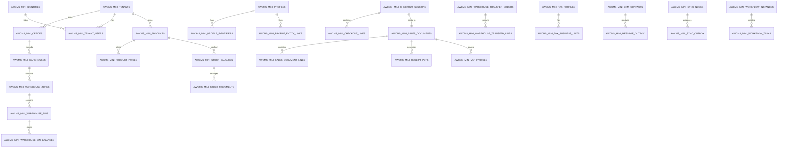
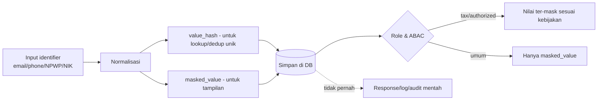

# Bagian 4 — ERD dan Data Dictionary Detail

> **Contoh domain (ilustratif).** Dokumen ini memakai domain retail/POS bergaya AWPOS sebagai contoh berjalan. **Pola & standar**-nya reusable untuk base AWCMS-Mini; **entitas, endpoint, layar, dan istilah domain** (produk, POS, gudang, pajak, CRM, AI, dsb.) adalah ilustrasi yang **diganti** oleh aplikasi turunan. Lihat [README paket dokumen](README.md) §Reusable vs domain turunan.

## Tujuan

Dokumen ini menjadi baseline database AWCMS-Mini: ERD konseptual, ownership tabel, data dictionary ringkas, index, RLS, klasifikasi data, migration order, dan retention.

## Prinsip database

1. Semua tabel tenant-scoped wajib `tenant_id`.
2. Primary key menggunakan UUID.
3. Timestamp menggunakan `timestamptz`.
4. Monetary/quantity menggunakan `numeric`, bukan floating point.
5. Posted transaction dan posted stock movement append-only.
6. Koreksi memakai reversal/return/adjustment.
7. FK child wajib index.
8. Tabel tenant-scoped wajib RLS.
9. Data sensitif dimasking, di-hash untuk lookup/dedup jika relevan.
10. Migration harus berurutan dan audit-ready.
11. Resource yang deletable memakai soft delete; physical delete hanya untuk purge retention/legal yang berizin.

## ERD konseptual utama



## Global column standard

| Kolom             | Tipe        | Fungsi                                        |
| ----------------- | ----------- | --------------------------------------------- |
| `id`              | uuid        | Primary key                                   |
| `tenant_id`       | uuid        | Isolasi tenant                                |
| `code`            | text        | Kode bisnis                                   |
| `status`          | text        | Status lifecycle                              |
| `created_at`      | timestamptz | Waktu dibuat                                  |
| `updated_at`      | timestamptz | Waktu update                                  |
| `created_by`      | uuid        | Actor pembuat                                 |
| `updated_by`      | uuid        | Actor update                                  |
| `deleted_at`      | timestamptz | Soft delete jika relevan                      |
| `deleted_by`      | uuid        | Actor yang mengarsipkan/menghapus soft        |
| `delete_reason`   | text        | Alasan soft delete/purge                      |
| `restored_at`     | timestamptz | Waktu restore jika resource mendukung restore |
| `restored_by`     | uuid        | Actor restore                                 |
| `sync_version`    | bigint      | Version untuk sync                            |
| `origin_node_id`  | uuid        | Node asal offline/sync                        |
| `idempotency_key` | text        | Idempotency mutation                          |

## Table ownership matrix

| Module               | Table utama                                                                                                                                                                                                                                                  |
| -------------------- | ------------------------------------------------------------------------------------------------------------------------------------------------------------------------------------------------------------------------------------------------------------ |
| Foundation           | `awcms_mini_modules`, `awcms_mini_schema_migrations`, `awcms_mini_system_events`                                                                                                                                                                             |
| Tenant Admin         | `awcms_mini_tenants`, `awcms_mini_offices`, `awcms_mini_physical_locations`, `awcms_mini_tenant_settings`                                                                                                                                                    |
| Profile Identity     | `awcms_mini_profiles`, `awcms_mini_profile_identifiers`, `awcms_mini_profile_channels`, `awcms_mini_profile_addresses`, `awcms_mini_profile_entity_links`, `awcms_mini_profile_merge_requests`                                                               |
| Identity Access      | `awcms_mini_identities`, `awcms_mini_tenant_users`, `awcms_mini_roles`, `awcms_mini_permissions`, `awcms_mini_abac_policies`, `awcms_mini_abac_decision_logs`                                                                                                |
| Catalog Inventory    | `awcms_mini_products`, `awcms_mini_product_categories`, `awcms_mini_units`, `awcms_mini_product_prices`, `awcms_mini_stock_balances`, `awcms_mini_stock_movements`                                                                                           |
| Sales POS            | `awcms_mini_checkout_sessions`, `awcms_mini_checkout_lines`, `awcms_mini_sales_documents`, `awcms_mini_sales_document_lines`, `awcms_mini_sales_payments`, `awcms_mini_idempotency_keys`                                                                     |
| Shared Stock Routing | `awcms_mini_stock_pools`, `awcms_mini_stock_pool_members`, `awcms_mini_transaction_routing_rules`, `awcms_mini_transaction_routing_decisions`                                                                                                                |
| Warehouse            | `awcms_mini_warehouses`, `awcms_mini_warehouse_zones`, `awcms_mini_warehouse_bins`, `awcms_mini_inventory_lots`, `awcms_mini_inventory_serials`, `awcms_mini_warehouse_bin_balances`, `awcms_mini_warehouse_transfer_orders`, `awcms_mini_cycle_count_plans` |
| Accounting Tax       | `awcms_mini_tax_profiles`, `awcms_mini_tax_business_units`, `awcms_mini_party_tax_profiles`, `awcms_mini_product_tax_profiles`, `awcms_mini_vat_invoices`, `awcms_mini_coretax_batches`                                                                      |
| CRM                  | `awcms_mini_crm_contacts`, `awcms_mini_crm_contact_channels`, `awcms_mini_receipt_pdfs`, `awcms_mini_message_outbox`, `awcms_mini_message_attempts`                                                                                                          |
| Sync Storage         | `awcms_mini_sync_nodes`, `awcms_mini_sync_outbox`, `awcms_mini_sync_inbox`, `awcms_mini_sync_conflicts`, `awcms_mini_object_sync_queue`                                                                                                                      |
| Email (base)         | `awcms_mini_email_templates`, `awcms_mini_email_messages`, `awcms_mini_email_delivery_attempts`, `awcms_mini_email_suppression_list`                                                                                                                         |
| AI Analyst           | `awcms_mini_ai_sessions`, `awcms_mini_ai_messages`, `awcms_mini_ai_tool_calls`, `awcms_mini_ai_tool_policies`                                                                                                                                                |
| Logging              | `awcms_mini_log_events`, `awcms_mini_audit_events`, `awcms_mini_security_events`                                                                                                                                                                             |
| Workflow             | `awcms_mini_workflow_definitions`, `awcms_mini_workflow_instances`, `awcms_mini_workflow_tasks`, `awcms_mini_workflow_decisions`                                                                                                                             |
| Reporting            | report views/materialized views                                                                                                                                                                                                                              |
| Production Security  | `awcms_mini_security_controls`, `awcms_mini_security_readiness_assessments`, `awcms_mini_security_findings`, `awcms_mini_go_live_gates`                                                                                                                      |

## Data dictionary ringkas per modul

### `awcms_mini_tenants`

| Kolom            | Tipe | Keterangan                |
| ---------------- | ---- | ------------------------- |
| `id`             | uuid | PK                        |
| `tenant_code`    | text | Unik global               |
| `tenant_name`    | text | Nama operasional          |
| `legal_name`     | text | Nama legal                |
| `status`         | text | active/inactive/suspended |
| `default_locale` | text | en/id/ms/ar               |
| `default_theme`  | text | light/dark/system         |

Index: unique `tenant_code`.

`default_locale` — locale default tenant (min **en**, **id**). **Target default `'en'`**; migration `002` saat ini masih `DEFAULT 'id'` — diubah ke `'en'` via migration baru saat i18n dibangun (issue #433, milestone M9). Locale efektif = preferensi per-user (bila ada) → `default_locale` tenant.

### `awcms_mini_offices`

| Kolom              | Tipe | Keterangan                               |
| ------------------ | ---- | ---------------------------------------- |
| `tenant_id`        | uuid | Tenant scope                             |
| `office_code`      | text | Unik per tenant                          |
| `office_name`      | text | Nama kantor/toko/gudang                  |
| `office_type`      | text | head_office/branch/store/warehouse/other |
| `parent_office_id` | uuid | Hierarki                                 |
| `status`           | text | active/inactive                          |

Index: `(tenant_id, office_code)`, `(tenant_id, office_type)`.

### `awcms_mini_profiles`

Canonical profile untuk user/customer/supplier/contact.

Kolom penting: `tenant_id`, `profile_type`, `display_name`, `legal_name`, `status`, `verification_status`, `risk_level`, `merged_into_profile_id`.

### `awcms_mini_profile_identifiers`

Identifier sensitif seperti email, phone, WhatsApp, NPWP, NIK.

Kolom penting: `identifier_type`, `normalized_value`, `value_hash`, `masked_value`, `is_primary`, `verification_status`.

Constraint: unique `(tenant_id, identifier_type, value_hash)`.

### `awcms_mini_identities`

Login identity.

Kolom penting: `profile_id`, `login_identifier`, `password_hash`, `status`, `failed_login_count`, `locked_until`, `last_login_at`.

Catatan: `password_hash` tidak pernah keluar response/API/log.

### `awcms_mini_products`

Product master.

Kolom penting: `tenant_id`, `sku`, `barcode`, `product_name`, `category_id`, `base_unit_id`, `tracking_type`, `status`.

Constraint: unique `(tenant_id, sku)`, unique `(tenant_id, barcode)` jika barcode tidak null.

### `awcms_mini_stock_balances`

Saldo stok per office.

Kolom penting: `tenant_id`, `product_id`, `office_id`, `quantity_on_hand`, `quantity_reserved`, `quantity_available`.

Constraint: unique `(tenant_id, product_id, office_id)`.

### `awcms_mini_stock_movements`

Mutasi stok append-only.

Kolom penting: `product_id`, `office_id`, `movement_type`, `quantity_delta`, `reference_module`, `reference_type`, `reference_id`, `posted_at`.

### `awcms_mini_checkout_sessions`

Draft transaksi operasional.

Kolom penting: `cashier_user_id`, `office_id`, `customer_profile_id`, `status`, `gross_total`, `discount_total`, `tax_total`, `net_total`.

### `awcms_mini_sales_documents`

Transaksi posted immutable.

Kolom penting: `source_checkout_id`, `document_no`, `office_id`, `customer_profile_id`, `status`, `gross_total`, `tax_total`, `net_total`, `posted_at`.

Constraint: unique `(tenant_id, document_no)`.

### `awcms_mini_warehouse_bin_balances`

Saldo stok detail per bin/lot/serial.

Kolom penting: `warehouse_id`, `zone_id`, `bin_id`, `product_id`, `lot_id`, `serial_id`, `quantity_on_hand`, `quantity_reserved`, `quantity_available`.

### `awcms_mini_vat_invoices`

VAT invoice staging.

Kolom penting: `sales_document_id`, `tax_profile_id`, `tax_business_unit_id`, `invoice_no`, `status`, `dpp_total`, `vat_total`, `luxury_tax_total`.

### `awcms_mini_message_outbox`

Queue pengiriman WhatsApp/email (contoh domain retail/POS §CRM, tidak diubah oleh Issue #494 di bawah).

Kolom penting: `contact_id`, `channel_type`, `provider_code`, `message_type`, `payload_json`, `status`, `next_retry_at`.

### Email (base, generik — Issue #494, epic #492, `sql/020`)

Berbeda dari `awcms_mini_message_outbox` di atas (contoh domain retail/POS) — ini infrastruktur base reusable untuk password reset, system announcement, dan workflow notification (arsitektur di Issue #493, `src/modules/email/README.md`). RLS FORCE di keempat tabel; hanya `email_templates` yang soft-deletable (master/config), tiga lainnya berbasis status transition + purge fisik (seperti `awcms_mini_audit_events`).

- **`awcms_mini_email_templates`** — `template_key` (format `area.name`, mis. `auth.password_reset`), `subject_template`, `text_body_template`/`html_body_template` (minimal salah satu), `is_active`. Unik `(tenant_id, template_key)` WHERE `deleted_at IS NULL`.
- **`awcms_mini_email_messages`** — outbox, satu baris = satu unit pengiriman ke satu alamat (bukan fan-out ke banyak recipient dalam satu baris — lihat `email_recipients` di bawah). `category` (format sama seperti `template_key`), `template_key` (denormalized, bukan FK — riwayat tetap valid walau template diubah/dihapus), `to_address`/`to_address_hash`/`to_address_masked` (pola normalize/hash/mask `awcms-mini-sensitive-data`, direuse dari `profile-identity/domain/identifier.ts`), `variables` (jsonb, untuk rendering ulang oleh dispatcher — **bukan** `rendered_html_body`/`rendered_text_body`, sengaja tidak disimpan; "prefer template key + variables hash over full rendered body"), `variables_hash`, `status` (`queued → sending → sent | failed → retry_wait → cancelled | suppressed`), `retry_count`, `next_attempt_at` (dobel sebagai claim lease saat `sending`, pola sama `awcms_mini_object_sync_queue`).
- **`awcms_mini_email_delivery_attempts`** — riwayat percobaan per pesan (`message_id` FK), `outcome` (`success`/`failure`), `provider_response_snippet` (sudah diredaksi oleh caller sebelum insert — bukan raw response).
- **`awcms_mini_email_suppression_list`** — block-list bounce/complaint/manual/unsubscribe, key lookup `recipient_hash` (bukan raw address).
- **`email_recipients`** (diusulkan issue) **tidak dibuat** — setiap `email_messages` sudah satu baris per recipient; bulk send (Issue #497) meng-enqueue N baris `email_messages` berbagi `correlation_id`, bukan satu baris fan-out ke banyak recipient.

### `awcms_mini_sync_outbox`

Event lokal yang perlu disinkronkan.

Kolom penting: `node_id`, `event_type`, `aggregate_type`, `aggregate_id`, `payload_json`, `status`.

## Konten multi-bahasa (translatable content)

Berbeda dari **string UI statis** (label/tombol/pesan error) yang memakai katalog `.po` gettext di sisi aplikasi (doc 14 §i18n), **data input pengguna** yang perlu tampil multi-bahasa disimpan **di database, satu nilai per bahasa aktif**. Base generik belum punya kolom konten yang di-i18n-kan (itu scope aplikasi turunan); ini **konvensi/standar** yang wajib diikuti aplikasi turunan saat menambah field konten translatable.

Pola yang diizinkan (pilih per kebutuhan, konsisten dalam satu modul):

- **JSONB per-locale** — kolom `<field>_i18n jsonb` berisi `{ "en": "...", "id": "..." }` untuk semua **bahasa aktif** tenant. Cocok untuk field bebas yang jarang di-query per-bahasa. Fallback ke `default_locale` bila key locale aktif kosong.
- **Tabel translasi terpisah** — `<entity>_translations (entity_id, locale, field, value)` dengan unique `(entity_id, locale, field)`. Cocok bila konten di-query/urut/cari per-bahasa (perlu index). Tetap tenant-scoped + RLS.

Aturan:

- Wajib menyimpan nilai untuk **setiap locale aktif** tenant (minimal `en`+`id`); tampilan memilih nilai locale aktif dengan fallback ke `default_locale`.
- Tetap ikut RLS tenant isolation, soft delete (bila entity-nya soft-deletable), dan masking bila field sensitif.
- Nilai locale bukan secret; tetap divalidasi & di-escape saat render (anti-XSS, auto-escape Astro).

## Soft delete standard

Soft delete adalah mekanisme default untuk master/config/draft tenant-scoped yang perlu bisa diarsipkan tanpa memutus referensi historis.

| Kategori data                                                                                                   | Kebijakan                                                                                |
| --------------------------------------------------------------------------------------------------------------- | ---------------------------------------------------------------------------------------- |
| Tenant/office/location, profile/contact/channel, product/category/brand/unit, warehouse zone/bin, rule/config   | Soft delete didukung jika tidak melanggar constraint bisnis aktif                        |
| Checkout/cart draft/held                                                                                        | Boleh cancel/soft delete sesuai lifecycle                                                |
| Posted sales document, posted sales line/payment, posted stock movement, audit/security log, exported tax batch | Tidak boleh soft delete; gunakan reversal/cancel/return/adjustment/status                |
| Data sensitif PII/tax                                                                                           | Soft delete tidak menghapus kewajiban masking; purge/anonymize mengikuti retention/legal |

Aturan implementasi:

- Kolom minimum: `deleted_at`, `deleted_by`, `delete_reason`; tambahkan `restored_at`/`restored_by` bila restore didukung.
- Query list/detail default wajib menambahkan `deleted_at IS NULL`.
- API hanya boleh menampilkan soft-deleted record bila ada permission eksplisit dan parameter seperti `includeDeleted=true`.
- Unique business key yang boleh dipakai ulang setelah delete memakai partial unique index, contoh `UNIQUE (tenant_id, sku) WHERE deleted_at IS NULL`.
- FK dari transaksi historis tetap mengarah ke record soft-deleted; mapper menampilkan status archived tanpa membuka data sensitif.
- Restore wajib validasi konflik partial unique index, status lifecycle, dan ABAC.
- Purge hanya untuk retention/legal hold yang memenuhi syarat, harus diaudit, dan tidak boleh memutus FK penting.
- Untuk sync, soft delete dikirim sebagai tombstone event; jangan physical delete sebelum semua node menerima tombstone atau retention terpenuhi.

## RLS standard

Setiap tabel tenant-scoped:

```sql
ALTER TABLE table_name ENABLE ROW LEVEL SECURITY;

CREATE POLICY table_name_tenant_isolation
  ON table_name
  USING (tenant_id = current_setting('app.current_tenant_id')::uuid);
```

RLS mengisolasi tenant; filter soft delete tetap wajib di query/repository agar arsip tidak bocor pada list/detail default.

## Index standard

- `(tenant_id)` untuk semua tabel tenant-scoped.
- `(tenant_id, created_at DESC)` untuk transaksi/log/event.
- `(tenant_id, status, created_at)` untuk workflow/outbox/task.
- `(tenant_id, deleted_at)` atau partial index `WHERE deleted_at IS NULL` untuk tabel soft-deletable yang sering di-list.
- FK child index.
- Search index untuk produk/profile jika data besar.

## Alur perlindungan data sensitif



## Sensitive data classification

| Data                   | Level       | Kontrol                   |
| ---------------------- | ----------- | ------------------------- |
| Password hash          | Critical    | Never expose              |
| API key/provider token | Critical    | Env only                  |
| NPWP/NIK/NITKU         | High        | Mask, ABAC tax role       |
| Phone/WhatsApp/email   | High        | Mask/hash lookup          |
| Address                | Medium/High | Need-to-know              |
| Sales transaction      | Medium      | Tenant RLS, audit         |
| Tax invoice/XML        | High        | Tax role, audit, checksum |
| AI prompt/tool call    | Medium      | No raw PII                |

## Retention awal

| Data                                                                       |                                                                                                                                                                                                                                                                                                                                                                                                                                                                                                                                                                                        Retention |
| -------------------------------------------------------------------------- | -----------------------------------------------------------------------------------------------------------------------------------------------------------------------------------------------------------------------------------------------------------------------------------------------------------------------------------------------------------------------------------------------------------------------------------------------------------------------------------------------------------------------------------------------------------------------------------------------: |
| Idempotency key                                                            |                                                                                                                                                                                                                                                                                                                                                                                                                                                                                                                                                                                        7–30 hari |
| HTTP request log                                                           |                                                                                                                                                                                                                                                                                                                                                                                                                                                                                                                                                                                       30–90 hari |
| Security/audit log                                                         |                                                                                                                                                                                                                                                                                                                                                                                                                                                                                                                                                                       1–5 tahun sesuai kebutuhan |
| — `awcms_mini_audit_events` (implementasi Issue #447)                      | Default **730 hari** (2 tahun, titik tengah rentang di atas), dikonfigurasi via `AUDIT_LOG_RETENTION_DAYS` (doc 18). Dipurge oleh `bun run logs:audit:purge` (`scripts/audit-log-purge.ts`) — job terjadwal internal, bukan endpoint publik, batch `DELETE ... LIMIT 5000` per tenant per pass. Aksi purge itu sendiri direkam sebagai audit event baru (`action='purge'`, `resourceType='audit_event'`) — tidak pernah purge diam-diam. Physical delete murni berbasis umur (tidak ada FK anak pada tabel ini, migration 011) — tenant dengan legal hold aktif cukup tidak dijadwalkan job ini. |
| Tax records                                                                |                                                                                                                                                                                                                                                                                                                                                                                                                                                                                                                                                                          Sesuai regulasi dan SOP |
| CRM delivery log                                                           |                                                                                                                                                                                                                                                                                                                                                                                                                                                                                                                                                                                          1 tahun |
| — `awcms_mini_email_messages`/`_delivery_attempts` (Issue #494, epic #492) |                                                                                                                                                                                                               Kandidat purge fisik setelah rows mencapai status terminal (`sent`/`failed`/`cancelled`/`suppressed`) melewati retention window, meniru `awcms_mini_audit_events`/`AUDIT_LOG_RETENTION_DAYS` (doc 18) — job purge terjadwal adalah fast-follow (Issue #499), belum bagian dari migration ini. `provider_response_snippet` selalu sudah diredaksi sebelum insert, tidak pernah raw. |
| AI session                                                                 |                                                                                                                                                                                                                                                                                                                                                                                                                                                                                                                                                                                      90–365 hari |
| Sync conflict                                                              |                                                                                                                                                                                                                                                                                                                                                                                                                                                                                                                                                                               Resolved + 1 tahun |
| Transaction/stock movement                                                 |                                                                                                                                                                                                                                                                                                                                                                                                                                                                                                                                                                                Long-term/archive |
