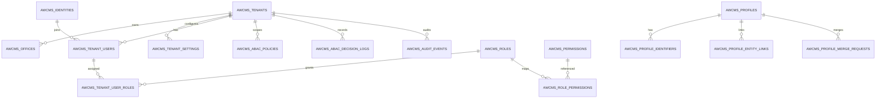

# Bagian 4 — ERD dan Data Dictionary Base

## Tujuan

Baseline database base AWCMS-Mini: ERD, ownership tabel, data dictionary, index, RLS, klasifikasi data, dan retention. Schema domain ditambahkan aplikasi turunan dengan pola yang sama.

## Prinsip database

1. Tabel tenant-scoped wajib `tenant_id`; PK `uuid` (`gen_random_uuid()`).
2. `timestamptz` untuk waktu; `numeric` untuk uang/quantity; `text + CHECK` untuk enum-like.
3. FK child wajib index; tabel tenant-scoped wajib RLS **ENABLE + FORCE** + policy.
4. Data sensitif: simpan `value_hash` (lookup) + `masked_value` (tampilan) — bukan nilai mentah.
5. Migration berurutan `NNN_awcms_<area>_<desc>.sql`, dijalankan runner ber-checksum; **tanpa BEGIN/COMMIT di file** (runner membungkus transaction).
6. Koreksi data lewat migration/reversal baru — tidak mengedit migration lama.

## ERD konseptual base



## Global column standard

| Kolom        | Tipe        | Fungsi                       |
| ------------ | ----------- | ---------------------------- |
| `id`         | uuid        | Primary key                  |
| `tenant_id`  | uuid        | Isolasi tenant               |
| `status`     | text+CHECK  | Status lifecycle             |
| `created_at` | timestamptz | Waktu dibuat                 |
| `updated_at` | timestamptz | Waktu update                 |
| `created_by` | uuid        | Actor pembuat (bila relevan) |
| `updated_by` | uuid        | Actor update (bila relevan)  |

Aplikasi domain menambahkan `sync_version`, `origin_node_id`, `idempotency_key` bila perlu (pola doc 04 AWPOS).

## Table ownership matrix (terimplementasi, migration 001–004)

| Module                | Tabel                                                                                                                                                                                            | Migration |
| --------------------- | ------------------------------------------------------------------------------------------------------------------------------------------------------------------------------------------------ | --------- |
| Foundation            | `awcms_schema_migrations`, `awcms_modules`, `awcms_system_events`, `awcms_idempotency_keys`                                                                                                      | 001       |
| Tenant Admin          | `awcms_tenants`, `awcms_offices`, `awcms_tenant_settings`                                                                                                                                        | 002       |
| Profile Identity      | `awcms_profiles`, `awcms_profile_identifiers`, `awcms_profile_entity_links`, `awcms_profile_merge_requests`                                                                                      | 002       |
| Identity & Access     | `awcms_identities`, `awcms_tenant_users` (002); `awcms_permissions`, `awcms_roles`, `awcms_role_permissions`, `awcms_tenant_user_roles`, `awcms_abac_policies`, `awcms_abac_decision_logs` (003) | 002–003   |
| Observability Logging | `awcms_log_events`, `awcms_audit_events`, `awcms_security_events`                                                                                                                                | 004       |

Tabel workflow, readiness, sync, i18n dibuat lewat migration baru saat modulnya diimplementasi (lihat README modul terkait).

## Catatan data dictionary penting

### `awcms_tenants` / `awcms_identities` / `awcms_permissions` — global (tanpa RLS tenant)

- `awcms_tenants`: root kepemilikan — akses hanya lewat service tenant-admin.
- `awcms_identities`: login global; `password_hash` (scrypt) **tidak pernah** keluar response/log; lockout via `failed_login_count`, `locked_until`.
- `awcms_permissions`: katalog global `module_key.activity_code.action` — memetakan kemampuan kode, bukan data tenant.

### `awcms_profile_identifiers`

- `value_hash` unik per `(tenant_id, identifier_type, value_hash)` untuk dedup.
- `masked_value` untuk tampilan; nilai mentah tidak disimpan.

### `awcms_idempotency_keys`

- Unik `(tenant_id, idempotency_key)`; simpan `request_hash`, `status`, `response_status`, `response_body`.

## RLS standard

```sql
ALTER TABLE nama_tabel ENABLE ROW LEVEL SECURITY;
ALTER TABLE nama_tabel FORCE ROW LEVEL SECURITY;
CREATE POLICY nama_tabel_tenant_isolation ON nama_tabel
  USING (tenant_id = NULLIF(current_setting('app.current_tenant_id', true), '')::uuid);
```

- `FORCE` agar owner tabel pun tunduk policy (kecuali superuser).
- `current_setting(..., true)` mengembalikan NULL saat konteks belum di-set → tidak ada baris yang bocor.
- Konteks di-set `withTenant()` via `set_config('app.current_tenant_id', $1, true)` = `SET LOCAL`, aman untuk PgBouncer transaction pooling.
- Terverifikasi: insert tanpa konteks ditolak; cross-tenant ditolak; select terisolasi per tenant.

## Index standard

- `(tenant_id, created_at DESC)` untuk log/event/transaksi.
- `(tenant_id, status, created_at)` untuk antrean/task.
- Semua FK child ber-index; unique constraint sesuai identitas bisnis.

## Sensitive data classification

| Data                      | Level    | Kontrol                         |
| ------------------------- | -------- | ------------------------------- |
| Password hash             | Critical | Never expose; scrypt; redaction |
| API key/provider token    | Critical | Env only (doc 18)               |
| NPWP/NIK                  | High     | Hash + mask; ABAC role khusus   |
| Phone/WhatsApp/email      | High     | Hash lookup + mask              |
| Audit/decision log        | Medium   | Tenant RLS; read-only Auditor   |
| Idempotency response body | Medium   | Tenant RLS; retention pendek    |

## Retention awal

| Data                 | Retention                  |
| -------------------- | -------------------------- |
| Idempotency key      | 7–30 hari                  |
| Log event            | 30–90 hari                 |
| Audit/security event | 1–5 tahun sesuai kebutuhan |
| Decision log         | ≥ 1 tahun                  |
| System events        | 90 hari                    |
