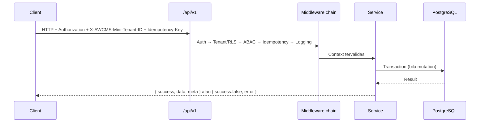
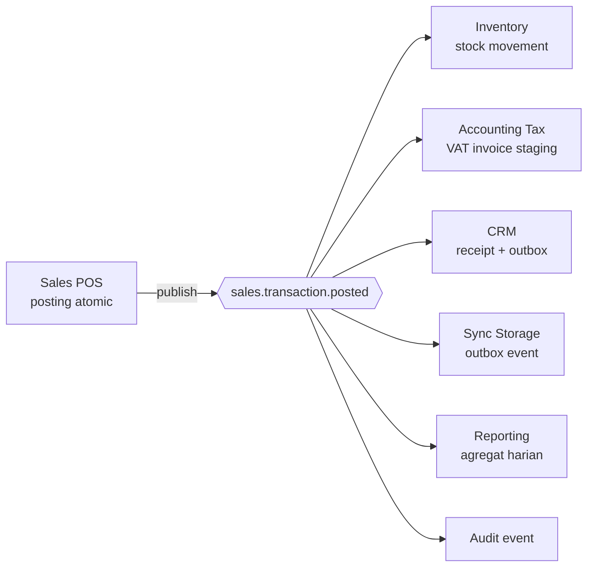

# Bagian 5 — OpenAPI dan AsyncAPI Detail

> **Contoh domain (ilustratif).** Dokumen ini memakai domain retail/POS bergaya AWPOS sebagai contoh berjalan. **Pola & standar**-nya reusable untuk base AWCMS-Mini; **entitas, endpoint, layar, dan istilah domain** (produk, POS, gudang, pajak, CRM, AI, dsb.) adalah ilustrasi yang **diganti** oleh aplikasi turunan. Lihat [README paket dokumen](README.md) §Reusable vs domain turunan.

## Tujuan

Dokumen ini menjadi baseline kontrak API dan domain event AWCMS-Mini. Semua API baru wajib diperbarui di OpenAPI. Semua event baru wajib diperbarui di AsyncAPI.

## Versi kontrak

`info.version` OpenAPI/AsyncAPI adalah SemVer **independen** dari versi rilis `package.json` — kebijakan lengkap + aturan bump di [ADR-0008](../adr/0008-independent-contract-and-module-versioning.md). Saat ini `1.0.0` (kontrak dinyatakan stabil sejak base generik selesai, v0.23.5). Divalidasi otomatis oleh `bun run api:spec:check` (harus berbentuk `X.Y.Z`).

## Standard API

Base path:

```text
/api/v1
```

Response sukses:

```json
{
  "success": true,
  "data": {},
  "meta": {
    "correlationId": "corr_...",
    "requestId": "req_..."
  }
}
```

Response error:

```json
{
  "success": false,
  "error": {
    "code": "VALIDATION_ERROR",
    "message": "Data tidak valid.",
    "details": [],
    "correlationId": "corr_..."
  }
}
```

## Header standard

| Header                   |                       Wajib | Fungsi                  |
| ------------------------ | --------------------------: | ----------------------- |
| `Authorization`          |           Ya kecuali public | Bearer token            |
| `X-AWCMS-Mini-Tenant-ID` |  Ya untuk tenant-scoped API | Tenant aktif            |
| `Idempotency-Key`        | Ya untuk mutation high-risk | Anti duplicate mutation |
| `X-Correlation-ID`       |                    Opsional | Trace request           |
| `X-Request-ID`           |                    Opsional | Trace client request    |
| `Accept-Language`        |                    Opsional | Locale                  |
| `X-AWCMS-Mini-Node-ID`   |               Ya untuk sync | Sync node               |
| `X-AWCMS-Mini-Timestamp` |        Ya untuk signed sync | Anti replay             |
| `X-AWCMS-Mini-Signature` |               Ya untuk sync | HMAC signature          |

## Soft delete API standard

DELETE pada resource tenant-scoped yang deletable berarti **soft delete**, bukan physical delete. Endpoint harus terdokumentasi di OpenAPI dengan perilaku berikut:

| Pola                                   | Fungsi                  | Catatan                                                                            |
| -------------------------------------- | ----------------------- | ---------------------------------------------------------------------------------- |
| `DELETE /<resources>/{id}`             | Soft delete resource    | Isi `deleted_at`, `deleted_by`, `delete_reason`; high-risk perlu `Idempotency-Key` |
| `POST /<resources>/{id}/restore`       | Restore resource        | Validasi konflik unique key, status lifecycle, ABAC, dan audit                     |
| `POST /<resources>/{id}/purge-request` | Request purge/anonymize | Hanya retention/legal; approval bila policy aktif                                  |
| `GET /<resources>?includeDeleted=true` | List termasuk arsip     | Hanya role berizin; default `false`                                                |

Default response list/detail tidak menampilkan soft-deleted record. Detail soft-deleted tanpa permission mengembalikan `RESOURCE_NOT_FOUND`; dengan permission arsip boleh mengembalikan data masked dengan status `deleted`.

## Endpoint wajib idempotency

- `POST /sales/checkout-sessions/{id}/post`
- `POST /sales/documents/{id}/cancel-request`
- `POST /profiles/resolve`
- `POST /profiles/{id}/links`
- `POST /profiles/merge-requests`
- `DELETE /profiles/{id}`
- `POST /profiles/{id}/restore`
- `DELETE /inventory/products/{id}`
- `POST /inventory/products/{id}/restore`
- `POST /warehouse-transfers`
- `POST /warehouse-transfers/{id}/approve`
- `POST /warehouse-transfers/{id}/ship`
- `POST /warehouse-transfers/{id}/receive`
- `POST /cycle-counts`
- `POST /stock-adjustment-requests`
- `POST /tax/vat-invoices/generate`
- `POST /tax/coretax/batches`
- `POST /crm/receipts/{id}/send`
- `POST /sync/push`
- `POST /workflow/tasks/{id}/decision`

## Error code standard

| Code                         | HTTP | Keterangan                                                       |
| ---------------------------- | ---: | ---------------------------------------------------------------- |
| `VALIDATION_ERROR`           |  400 | Data tidak valid                                                 |
| `AUTH_REQUIRED`              |  401 | Belum login                                                      |
| `TOKEN_EXPIRED`              |  401 | Token kadaluarsa                                                 |
| `ACCESS_DENIED`              |  403 | Tidak punya akses                                                |
| `TENANT_REQUIRED`            |  400 | Tenant wajib                                                     |
| `RESOURCE_NOT_FOUND`         |  404 | Resource tidak ditemukan                                         |
| `RESOURCE_DELETED`           |  410 | Resource sudah di-soft-delete dan butuh restore/arsip permission |
| `IDEMPOTENCY_REQUIRED`       |  400 | Header idempotency wajib                                         |
| `IDEMPOTENCY_CONFLICT`       |  409 | Key dipakai request berbeda                                      |
| `WORKFLOW_APPROVAL_REQUIRED` |  409 | Perlu approval                                                   |
| `STOCK_NOT_AVAILABLE`        |  409 | Stok tidak cukup                                                 |
| `SYNC_CONFLICT`              |  409 | Konflik sync                                                     |
| `PAYLOAD_TOO_LARGE`          |  413 | Body request melebihi batas ukuran (Issue #686)                  |
| `DATABASE_BUSY`              |  503 | Pool/DB sibuk                                                    |
| `PROVIDER_ERROR`             |  502 | Provider eksternal gagal                                         |
| `INTERNAL_ERROR`             |  500 | Error internal                                                   |

## API endpoint summary per modul

### Foundation

| Method | Endpoint  | Fungsi       |
| ------ | --------- | ------------ |
| GET    | `/health` | Health check |

### Tenant Admin

| Method   | Endpoint                      | Fungsi                       |
| -------- | ----------------------------- | ---------------------------- |
| GET      | `/setup/status`               | Status setup                 |
| POST     | `/setup/initialize`           | Setup tenant pertama         |
| GET      | `/tenants/current`            | Tenant aktif                 |
| GET/POST | `/offices`                    | List/create office           |
| PATCH    | `/offices/{officeId}`         | Update office                |
| DELETE   | `/offices/{officeId}`         | Soft delete office jika aman |
| POST     | `/offices/{officeId}/restore` | Restore office               |

### Identity & Access

| Method | Endpoint                | Fungsi                 |
| ------ | ----------------------- | ---------------------- |
| POST   | `/auth/login`           | Login                  |
| POST   | `/auth/logout`          | Logout                 |
| GET    | `/auth/me`              | User aktif             |
| GET    | `/access/modules`       | Daftar module/activity |
| POST   | `/access/evaluate`      | Evaluasi ABAC          |
| POST   | `/access/assignments`   | Assign access          |
| GET    | `/access/decision-logs` | Decision log           |

### Profile Identity

| Method   | Endpoint                        | Fungsi                             |
| -------- | ------------------------------- | ---------------------------------- |
| GET/POST | `/profiles`                     | List/create profile                |
| GET      | `/profiles/{profileId}`         | Detail profile                     |
| POST     | `/profiles/resolve`             | Resolve/create profile             |
| POST     | `/profiles/{profileId}/links`   | Link entity                        |
| GET      | `/profiles/dedup-candidates`    | Kandidat duplikat                  |
| POST     | `/profiles/merge-requests`      | Request merge                      |
| DELETE   | `/profiles/{profileId}`         | Soft delete profile/contact master |
| POST     | `/profiles/{profileId}/restore` | Restore profile                    |

### Catalog Inventory

| Method    | Endpoint                                  | Fungsi                |
| --------- | ----------------------------------------- | --------------------- |
| GET/POST  | `/inventory/products`                     | List/create product   |
| GET/PATCH | `/inventory/products/{productId}`         | Detail/update product |
| DELETE    | `/inventory/products/{productId}`         | Soft delete product   |
| POST      | `/inventory/products/{productId}/restore` | Restore product       |
| GET       | `/inventory/stock-balances`               | Stok                  |
| GET       | `/inventory/stock-movements`              | Mutasi stok           |
| POST      | `/inventory/stock-adjustment-requests`    | Request adjustment    |
| GET       | `/inventory/lots`                         | Lot/batch             |

### Sales POS

| Method | Endpoint                                       | Fungsi                |
| ------ | ---------------------------------------------- | --------------------- |
| POST   | `/sales/checkout-sessions`                     | Buat checkout         |
| GET    | `/sales/checkout-sessions/{id}`                | Detail checkout       |
| POST   | `/sales/checkout-sessions/{id}/items`          | Tambah item           |
| PATCH  | `/sales/checkout-sessions/{id}/items/{lineId}` | Update item           |
| DELETE | `/sales/checkout-sessions/{id}/items/{lineId}` | Hapus item            |
| POST   | `/sales/checkout-sessions/{id}/payments`       | Tambah payment        |
| POST   | `/sales/checkout-sessions/{id}/post`           | Posting transaksi     |
| POST   | `/sales/checkout-sessions/{id}/hold`           | Hold transaksi        |
| GET    | `/sales/documents/{id}`                        | Detail sales document |
| POST   | `/sales/documents/{id}/cancel-request`         | Request cancel        |

### Warehouse Management

| Method   | Endpoint                                         | Fungsi                            |
| -------- | ------------------------------------------------ | --------------------------------- |
| GET/POST | `/warehouses`                                    | List/create warehouse             |
| GET      | `/warehouses/{warehouseId}/stock`                | Stok gudang                       |
| GET/POST | `/warehouses/{warehouseId}/bins`                 | Bin list/create                   |
| DELETE   | `/warehouses/{warehouseId}/bins/{binId}`         | Soft delete bin jika saldo kosong |
| POST     | `/warehouses/{warehouseId}/bins/{binId}/restore` | Restore bin                       |
| POST     | `/warehouse-transfers`                           | Buat transfer                     |
| POST     | `/warehouse-transfers/{id}/approve`              | Approve                           |
| POST     | `/warehouse-transfers/{id}/ship`                 | Ship                              |
| POST     | `/warehouse-transfers/{id}/receive`              | Receive                           |
| POST     | `/cycle-counts`                                  | Buat cycle count                  |

### Accounting Tax/Coretax

| Method   | Endpoint                          | Fungsi               |
| -------- | --------------------------------- | -------------------- |
| GET/POST | `/tax/profiles`                   | Tax profile          |
| GET/POST | `/tax/business-units`             | NITKU/ID TKU         |
| GET/POST | `/tax/party-profiles`             | Party tax profile    |
| POST     | `/tax/vat-invoices/generate`      | Generate VAT invoice |
| GET      | `/tax/vat-invoices`               | List invoice         |
| POST     | `/tax/vat-invoices/{id}/validate` | Validasi             |
| POST     | `/tax/coretax/batches`            | Coretax batch export |

### CRM Communication

| Method   | Endpoint                            | Fungsi                      |
| -------- | ----------------------------------- | --------------------------- |
| GET/POST | `/crm/contacts`                     | CRM contacts                |
| PATCH    | `/crm/contacts/{id}/consent`        | Consent                     |
| POST     | `/crm/receipts/{receiptPdfId}/send` | Kirim receipt               |
| GET      | `/crm/messages`                     | Message outbox              |
| POST     | `/crm/messages/{id}/retry`          | Retry                       |
| DELETE   | `/crm/contacts/{id}`                | Soft delete contact/channel |
| POST     | `/crm/contacts/{id}/restore`        | Restore contact             |
| POST     | `/webhooks/crm/starsender`          | Webhook StarSender          |
| POST     | `/webhooks/crm/mailketing`          | Webhook Mailketing          |

### Sync Storage

| Method | Endpoint                       | Fungsi                |
| ------ | ------------------------------ | --------------------- |
| POST   | `/sync/push`                   | Push event            |
| POST   | `/sync/pull`                   | Pull event            |
| GET    | `/sync/status`                 | Sync status           |
| GET    | `/sync/conflicts`              | List conflict         |
| POST   | `/sync/conflicts/{id}/resolve` | Resolve conflict      |
| POST   | `/sync/objects/presign`        | Object upload/presign |

### Module Management (Issue #511–#521, epic #510)

Database-backed, tenant-aware module registry — generic infrastructure for managing every other registered module, not a domain-specific feature. Full detail: `src/modules/module-management/README.md`.

| Method | Endpoint                               | Fungsi                                                     |
| ------ | -------------------------------------- | ---------------------------------------------------------- |
| GET    | `/modules`                             | Katalog modul (code + DB registry)                         |
| GET    | `/modules/{moduleKey}`                 | Detail satu modul                                          |
| POST   | `/modules/sync`                        | Sync descriptor code → DB registry                         |
| GET    | `/modules/{moduleKey}/permissions`     | Status sinkron permission (synced/missing/orphaned)        |
| GET    | `/modules/{moduleKey}/jobs`            | Registry command operasional (dokumentasi, tidak eksekusi) |
| GET    | `/modules/{moduleKey}/health`          | Health/readiness cepat, read-only                          |
| POST   | `/modules/{moduleKey}/health/check`    | Trigger health check eksplisit (+ provider check bila ada) |
| GET    | `/tenant/modules`                      | Status enable/disable modul untuk tenant pemanggil         |
| POST   | `/tenant/modules/{moduleKey}/enable`   | Aktifkan modul untuk tenant                                |
| POST   | `/tenant/modules/{moduleKey}/disable`  | Nonaktifkan modul untuk tenant (butuh `reason`)            |
| GET    | `/tenant/modules/{moduleKey}/settings` | Effective settings (default + override tenant)             |
| PATCH  | `/tenant/modules/{moduleKey}/settings` | Update override settings tenant                            |

Tidak ada event AsyncAPI baru — perubahan lifecycle/config modul tercatat lewat `awcms_mini_audit_events` generik yang sudah ada, bukan domain event terpisah.

### Blog Content (Issue #537–#543, epic #536)

Modul domain pertama yang didaftarkan langsung di repo base ini (ADR-0009), bukan di aplikasi turunan. Full detail (guard/idempotency/audit per endpoint): `src/modules/blog-content/README.md`. Base path `/api/v1/blog`.

| Method                    | Endpoint                                          | Fungsi                                                                  |
| ------------------------- | ------------------------------------------------- | ----------------------------------------------------------------------- |
| GET                       | `/blog/posts`                                     | List post tenant (`?status=`/`?limit=`)                                 |
| POST                      | `/blog/posts`                                     | Buat post draft                                                         |
| GET                       | `/blog/posts/{id}`                                | Detail post                                                             |
| PATCH                     | `/blog/posts/{id}`                                | Update post (ABAC ownership override untuk author konten belum publish) |
| DELETE                    | `/blog/posts/{id}`                                | Soft delete (`reason` wajib)                                            |
| POST                      | `/blog/posts/{id}/submit-review`                  | draft/review → review                                                   |
| POST                      | `/blog/posts/{id}/publish`                        | → published (Idempotency-Key wajib)                                     |
| POST                      | `/blog/posts/{id}/schedule`                       | → scheduled (Idempotency-Key wajib, body `scheduledAt`)                 |
| POST                      | `/blog/posts/{id}/archive`                        | → archived (Idempotency-Key wajib)                                      |
| POST                      | `/blog/posts/{id}/restore`                        | Pulihkan soft-delete (Idempotency-Key wajib)                            |
| POST                      | `/blog/posts/{id}/purge`                          | Hard delete, hanya archived/soft-deleted (Idempotency-Key wajib)        |
| GET                       | `/blog/posts/{id}/revisions`                      | List revision history                                                   |
| GET                       | `/blog/posts/{id}/revisions/{revisionId}`         | Detail satu revisi                                                      |
| POST                      | `/blog/posts/{id}/revisions/{revisionId}/restore` | Restore konten dari revisi lama (append-only, Idempotency-Key wajib)    |
| GET/POST/GET/PATCH/DELETE | `/blog/pages(/{id})`                              | CRUD halaman statis — **tanpa** lifecycle-action endpoint               |
| GET/POST/PATCH/DELETE     | `/blog/terms(/{id})`                              | CRUD kategori/tag (tanpa `GET /{id}`)                                   |
| GET                       | `/blog/search`                                    | Full-text search admin, keyset-paginated (`?type=`/`?status=`)          |
| GET/PATCH                 | `/blog/settings`                                  | Pengaturan blog per tenant (Issue #543)                                 |
| GET/POST/PATCH/DELETE     | `/blog/templates(/{id})`                          | Template layout whitelisted (Issue #542)                                |
| GET/POST/PATCH/DELETE     | `/blog/menus(/{id})`                              | Menu hierarkis satu level (Issue #542)                                  |
| GET/POST/PATCH/DELETE     | `/blog/widgets(/{id})`                            | Widget posisi tetap (Issue #542)                                        |
| GET/POST/PATCH/DELETE     | `/blog/ads(/{id})`                                | Iklan + placement/jadwal (Issue #542)                                   |
| GET/PATCH                 | `/blog/theme`                                     | Override mode tema blog per tenant (Issue #542)                         |

Rute publik anonim (ADR-0009, resolusi tenant lewat path `tenantCode`, bukan subdomain/header), semua `APIRoute` `.ts` (bukan `.astro`, supaya testable lewat `tests/integration/harness.ts`):

| Method | Endpoint                              | Fungsi                                                  |
| ------ | ------------------------------------- | ------------------------------------------------------- |
| GET    | `/blog/{tenantCode}`                  | Index post publik (paginated)                           |
| GET    | `/blog/{tenantCode}/{slug}`           | Detail post                                             |
| GET    | `/blog/{tenantCode}/category/{slug}`  | Arsip kategori                                          |
| GET    | `/blog/{tenantCode}/tag/{slug}`       | Arsip tag                                               |
| GET    | `/blog/{tenantCode}/search`           | Search publik                                           |
| GET    | `/blog/{tenantCode}/feed.xml`         | RSS 2.0 (404 kalau `rssEnabled=false`)                  |
| GET    | `/blog/{tenantCode}/sitemap-blog.xml` | Sitemap protocol 0.9 (404 kalau `sitemapEnabled=false`) |

Admin UI (Issue #543): `/admin/blog/*` — Astro + vanilla JS, tidak menambah endpoint API baru (semua mutasi lewat endpoint di atas). Lihat README modul §Admin UI.

26 domain event AsyncAPI (`awcms-mini.blog-content.*`, §Event utama tidak mendaftarkan semuanya karena volumenya — lihat `asyncapi/awcms-mini-domain-events.asyncapi.yaml` dan README modul §Domain events untuk daftar lengkap + tabel produser). Sejak Issue #543 seluruh 26 channel punya produser nyata (celah terakhir, `settings.updated`, ditutup oleh `PATCH /api/v1/blog/settings`).

### AI, Reports, Logs, Workflow, Security

| Modul    | Endpoint utama                                                 |
| -------- | -------------------------------------------------------------- |
| AI       | `POST /ai/business-analyst/chat`                               |
| Reports  | `GET /reports/sales/daily`, `GET /reports/warehouse/dashboard` |
| Logs     | `GET /logs/recent`, `GET /logs/audit`, `GET /logs/security`    |
| DB Pool  | `GET /database/pool/health`                                    |
| Workflow | `GET /workflow/tasks`, `POST /workflow/tasks/{id}/decision`    |
| Security | `POST /security/go-live-gates/evaluate`                        |

## Siklus request API



## AsyncAPI event envelope

```json
{
  "eventId": "uuid",
  "eventType": "sales.transaction.posted",
  "eventVersion": "1.0",
  "tenantId": "uuid",
  "nodeId": "uuid-node",
  "aggregateType": "sales_document",
  "aggregateId": "uuid",
  "occurredAt": "2026-07-04T09:00:00+07:00",
  "actor": {
    "tenantUserId": "uuid",
    "profileId": "uuid"
  },
  "correlationId": "corr_001",
  "causationId": "event-before-id",
  "payload": {},
  "metadata": {
    "sourceModule": "sales_pos",
    "schemaVersion": "1.0"
  }
}
```

Soft delete event memakai envelope yang sama. Pola nama event: `<module>.<resource>.soft_deleted`, `<module>.<resource>.restored`, dan `<module>.<resource>.purge_requested` bila event perlu disinkronkan atau dikonsumsi modul lain. Payload tidak boleh membawa PII mentah; gunakan identifier, status, dan metadata audit yang sudah diredaksi.

## Event fan-out — `sales.transaction.posted`



## Event utama

| Event                            | Producer        | Consumer                             |
| -------------------------------- | --------------- | ------------------------------------ |
| `tenant.created`                 | Tenant Admin    | Audit, reporting                     |
| `identity.login.succeeded`       | Identity        | Audit/security                       |
| `profile.created`                | Profile         | CRM, reporting                       |
| `inventory.product.created`      | Inventory       | Reporting, sync                      |
| `inventory.product.soft_deleted` | Inventory       | POS cache, reporting, sync           |
| `inventory.product.restored`     | Inventory       | POS cache, reporting, sync           |
| `sales.transaction.posted`       | Sales POS       | Inventory, Tax, CRM, Sync, Reporting |
| `sales.receipt.generated`        | CRM/Sales       | CRM, sync                            |
| `warehouse.transfer.shipped`     | Warehouse       | Inventory, Sync, Reporting           |
| `warehouse.transfer.received`    | Warehouse       | Inventory, Sync, Reporting           |
| `tax.vat_invoice.generated`      | Tax             | Reporting, audit                     |
| `tax.coretax.batch_exported`     | Tax             | Sync, audit                          |
| `crm.message.sent`               | CRM             | Reporting, audit                     |
| `sync.conflict.detected`         | Sync            | Workflow, audit                      |
| `workflow.task.approved`         | Workflow        | Requesting module                    |
| `database.pool.saturated`        | DB Connectivity | Observability, security              |
| `database.pool.rejected`         | DB Connectivity | Observability, security              |
| `security.golive.blocked`        | Security        | Owner/admin                          |

## Contract testing requirement

- Semua endpoint punya success/error response schema.
- Tenant-scoped API wajib tenant header.
- Mutation high-risk wajib idempotency.
- Sensitive fields tidak tampil penuh.
- Event envelope lengkap.
- Event payload sesuai schema.
- Event tidak membawa raw sensitive data.
