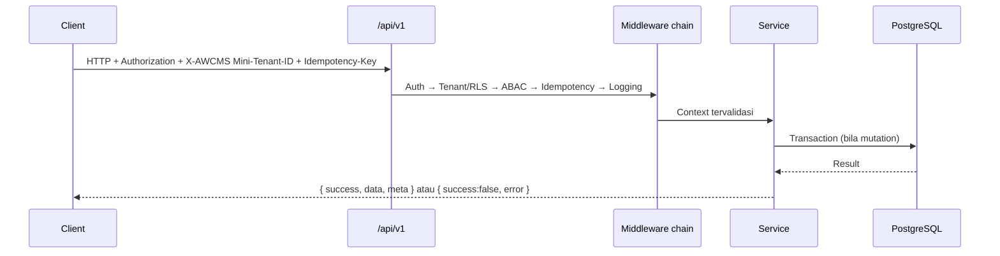
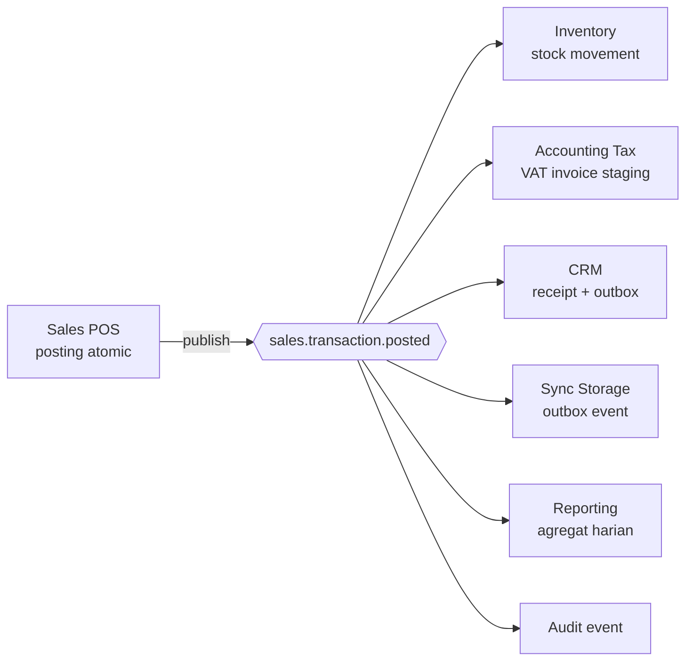

# Bagian 5 — OpenAPI dan AsyncAPI Detail

## Tujuan

Dokumen ini menjadi baseline kontrak API dan domain event AWCMS Mini. Semua API baru wajib diperbarui di OpenAPI. Semua event baru wajib diperbarui di AsyncAPI.

## Standard API

Base path:

```text
/api/v1
```

Response sukses:

```json
{
  "success": true,
  "data": {},
  "meta": {
    "correlationId": "corr_...",
    "requestId": "req_..."
  }
}
```

Response error:

```json
{
  "success": false,
  "error": {
    "code": "VALIDATION_ERROR",
    "message": "Data tidak valid.",
    "details": [],
    "correlationId": "corr_..."
  }
}
```

## Header standard

| Header                   |                       Wajib | Fungsi                  |
| ------------------------ | --------------------------: | ----------------------- |
| `Authorization`          |           Ya kecuali public | Bearer token            |
| `X-AWCMS Mini-Tenant-ID` |  Ya untuk tenant-scoped API | Tenant aktif            |
| `Idempotency-Key`        | Ya untuk mutation high-risk | Anti duplicate mutation |
| `X-Correlation-ID`       |                    Opsional | Trace request           |
| `X-Request-ID`           |                    Opsional | Trace client request    |
| `Accept-Language`        |                    Opsional | Locale                  |
| `X-AWCMS Mini-Node-ID`   |               Ya untuk sync | Sync node               |
| `X-AWCMS Mini-Timestamp` |        Ya untuk signed sync | Anti replay             |
| `X-AWCMS Mini-Signature` |               Ya untuk sync | HMAC signature          |

## Endpoint wajib idempotency

- `POST /sales/checkout-sessions/{id}/post`
- `POST /sales/documents/{id}/cancel-request`
- `POST /profiles/resolve`
- `POST /profiles/{id}/links`
- `POST /profiles/merge-requests`
- `POST /warehouse-transfers`
- `POST /warehouse-transfers/{id}/approve`
- `POST /warehouse-transfers/{id}/ship`
- `POST /warehouse-transfers/{id}/receive`
- `POST /cycle-counts`
- `POST /stock-adjustment-requests`
- `POST /tax/vat-invoices/generate`
- `POST /tax/coretax/batches`
- `POST /crm/receipts/{id}/send`
- `POST /sync/push`
- `POST /workflow/tasks/{id}/decision`

## Error code standard

| Code                         | HTTP | Keterangan                  |
| ---------------------------- | ---: | --------------------------- |
| `VALIDATION_ERROR`           |  400 | Data tidak valid            |
| `AUTH_REQUIRED`              |  401 | Belum login                 |
| `TOKEN_EXPIRED`              |  401 | Token kadaluarsa            |
| `ACCESS_DENIED`              |  403 | Tidak punya akses           |
| `TENANT_REQUIRED`            |  400 | Tenant wajib                |
| `RESOURCE_NOT_FOUND`         |  404 | Resource tidak ditemukan    |
| `IDEMPOTENCY_REQUIRED`       |  400 | Header idempotency wajib    |
| `IDEMPOTENCY_CONFLICT`       |  409 | Key dipakai request berbeda |
| `WORKFLOW_APPROVAL_REQUIRED` |  409 | Perlu approval              |
| `STOCK_NOT_AVAILABLE`        |  409 | Stok tidak cukup            |
| `SYNC_CONFLICT`              |  409 | Konflik sync                |
| `DATABASE_BUSY`              |  503 | Pool/DB sibuk               |
| `PROVIDER_ERROR`             |  502 | Provider eksternal gagal    |
| `INTERNAL_ERROR`             |  500 | Error internal              |

## API endpoint summary per modul

### Foundation

| Method | Endpoint  | Fungsi       |
| ------ | --------- | ------------ |
| GET    | `/health` | Health check |

### Tenant Admin

| Method   | Endpoint              | Fungsi               |
| -------- | --------------------- | -------------------- |
| GET      | `/setup/status`       | Status setup         |
| POST     | `/setup/initialize`   | Setup tenant pertama |
| GET      | `/tenants/current`    | Tenant aktif         |
| GET/POST | `/offices`            | List/create office   |
| PATCH    | `/offices/{officeId}` | Update office        |

### Identity & Access

| Method | Endpoint                | Fungsi                 |
| ------ | ----------------------- | ---------------------- |
| POST   | `/auth/login`           | Login                  |
| POST   | `/auth/logout`          | Logout                 |
| GET    | `/auth/me`              | User aktif             |
| GET    | `/access/modules`       | Daftar module/activity |
| POST   | `/access/evaluate`      | Evaluasi ABAC          |
| POST   | `/access/assignments`   | Assign access          |
| GET    | `/access/decision-logs` | Decision log           |

### Profile Identity

| Method   | Endpoint                      | Fungsi                 |
| -------- | ----------------------------- | ---------------------- |
| GET/POST | `/profiles`                   | List/create profile    |
| GET      | `/profiles/{profileId}`       | Detail profile         |
| POST     | `/profiles/resolve`           | Resolve/create profile |
| POST     | `/profiles/{profileId}/links` | Link entity            |
| GET      | `/profiles/dedup-candidates`  | Kandidat duplikat      |
| POST     | `/profiles/merge-requests`    | Request merge          |

### Catalog Inventory

| Method    | Endpoint                               | Fungsi                |
| --------- | -------------------------------------- | --------------------- |
| GET/POST  | `/inventory/products`                  | List/create product   |
| GET/PATCH | `/inventory/products/{productId}`      | Detail/update product |
| GET       | `/inventory/stock-balances`            | Stok                  |
| GET       | `/inventory/stock-movements`           | Mutasi stok           |
| POST      | `/inventory/stock-adjustment-requests` | Request adjustment    |
| GET       | `/inventory/lots`                      | Lot/batch             |

### Sales POS

| Method | Endpoint                                       | Fungsi                |
| ------ | ---------------------------------------------- | --------------------- |
| POST   | `/sales/checkout-sessions`                     | Buat checkout         |
| GET    | `/sales/checkout-sessions/{id}`                | Detail checkout       |
| POST   | `/sales/checkout-sessions/{id}/items`          | Tambah item           |
| PATCH  | `/sales/checkout-sessions/{id}/items/{lineId}` | Update item           |
| DELETE | `/sales/checkout-sessions/{id}/items/{lineId}` | Hapus item            |
| POST   | `/sales/checkout-sessions/{id}/payments`       | Tambah payment        |
| POST   | `/sales/checkout-sessions/{id}/post`           | Posting transaksi     |
| POST   | `/sales/checkout-sessions/{id}/hold`           | Hold transaksi        |
| GET    | `/sales/documents/{id}`                        | Detail sales document |
| POST   | `/sales/documents/{id}/cancel-request`         | Request cancel        |

### Warehouse Management

| Method   | Endpoint                            | Fungsi                |
| -------- | ----------------------------------- | --------------------- |
| GET/POST | `/warehouses`                       | List/create warehouse |
| GET      | `/warehouses/{warehouseId}/stock`   | Stok gudang           |
| GET/POST | `/warehouses/{warehouseId}/bins`    | Bin list/create       |
| POST     | `/warehouse-transfers`              | Buat transfer         |
| POST     | `/warehouse-transfers/{id}/approve` | Approve               |
| POST     | `/warehouse-transfers/{id}/ship`    | Ship                  |
| POST     | `/warehouse-transfers/{id}/receive` | Receive               |
| POST     | `/cycle-counts`                     | Buat cycle count      |

### Accounting Tax/Coretax

| Method   | Endpoint                          | Fungsi               |
| -------- | --------------------------------- | -------------------- |
| GET/POST | `/tax/profiles`                   | Tax profile          |
| GET/POST | `/tax/business-units`             | NITKU/ID TKU         |
| GET/POST | `/tax/party-profiles`             | Party tax profile    |
| POST     | `/tax/vat-invoices/generate`      | Generate VAT invoice |
| GET      | `/tax/vat-invoices`               | List invoice         |
| POST     | `/tax/vat-invoices/{id}/validate` | Validasi             |
| POST     | `/tax/coretax/batches`            | Coretax batch export |

### CRM Communication

| Method   | Endpoint                            | Fungsi             |
| -------- | ----------------------------------- | ------------------ |
| GET/POST | `/crm/contacts`                     | CRM contacts       |
| PATCH    | `/crm/contacts/{id}/consent`        | Consent            |
| POST     | `/crm/receipts/{receiptPdfId}/send` | Kirim receipt      |
| GET      | `/crm/messages`                     | Message outbox     |
| POST     | `/crm/messages/{id}/retry`          | Retry              |
| POST     | `/webhooks/crm/starsender`          | Webhook StarSender |
| POST     | `/webhooks/crm/mailketing`          | Webhook Mailketing |

### Sync Storage

| Method | Endpoint                       | Fungsi                |
| ------ | ------------------------------ | --------------------- |
| POST   | `/sync/push`                   | Push event            |
| POST   | `/sync/pull`                   | Pull event            |
| GET    | `/sync/status`                 | Sync status           |
| GET    | `/sync/conflicts`              | List conflict         |
| POST   | `/sync/conflicts/{id}/resolve` | Resolve conflict      |
| POST   | `/sync/objects/presign`        | Object upload/presign |

### AI, Reports, Logs, Workflow, Security

| Modul    | Endpoint utama                                                 |
| -------- | -------------------------------------------------------------- |
| AI       | `POST /ai/business-analyst/chat`                               |
| Reports  | `GET /reports/sales/daily`, `GET /reports/warehouse/dashboard` |
| Logs     | `GET /logs/recent`, `GET /logs/audit`, `GET /logs/security`    |
| DB Pool  | `GET /database/pool/health`                                    |
| Workflow | `GET /workflow/tasks`, `POST /workflow/tasks/{id}/decision`    |
| Security | `POST /security/go-live-gates/evaluate`                        |

## Siklus request API



## AsyncAPI event envelope

```json
{
  "eventId": "uuid",
  "eventType": "sales.transaction.posted",
  "eventVersion": "1.0",
  "tenantId": "uuid",
  "nodeId": "uuid-node",
  "aggregateType": "sales_document",
  "aggregateId": "uuid",
  "occurredAt": "2026-07-04T09:00:00+07:00",
  "actor": {
    "tenantUserId": "uuid",
    "profileId": "uuid"
  },
  "correlationId": "corr_001",
  "causationId": "event-before-id",
  "payload": {},
  "metadata": {
    "sourceModule": "sales_pos",
    "schemaVersion": "1.0"
  }
}
```

## Event fan-out — `sales.transaction.posted`



## Event utama

| Event                         | Producer        | Consumer                             |
| ----------------------------- | --------------- | ------------------------------------ |
| `tenant.created`              | Tenant Admin    | Audit, reporting                     |
| `identity.login.succeeded`    | Identity        | Audit/security                       |
| `profile.created`             | Profile         | CRM, reporting                       |
| `inventory.product.created`   | Inventory       | Reporting, sync                      |
| `sales.transaction.posted`    | Sales POS       | Inventory, Tax, CRM, Sync, Reporting |
| `sales.receipt.generated`     | CRM/Sales       | CRM, sync                            |
| `warehouse.transfer.shipped`  | Warehouse       | Inventory, Sync, Reporting           |
| `warehouse.transfer.received` | Warehouse       | Inventory, Sync, Reporting           |
| `tax.vat_invoice.generated`   | Tax             | Reporting, audit                     |
| `tax.coretax.batch_exported`  | Tax             | Sync, audit                          |
| `crm.message.sent`            | CRM             | Reporting, audit                     |
| `sync.conflict.detected`      | Sync            | Workflow, audit                      |
| `workflow.task.approved`      | Workflow        | Requesting module                    |
| `database.pool.saturated`     | DB Connectivity | Observability, security              |
| `security.golive.blocked`     | Security        | Owner/admin                          |

## Contract testing requirement

- Semua endpoint punya success/error response schema.
- Tenant-scoped API wajib tenant header.
- Mutation high-risk wajib idempotency.
- Sensitive fields tidak tampil penuh.
- Event envelope lengkap.
- Event payload sesuai schema.
- Event tidak membawa raw sensitive data.
