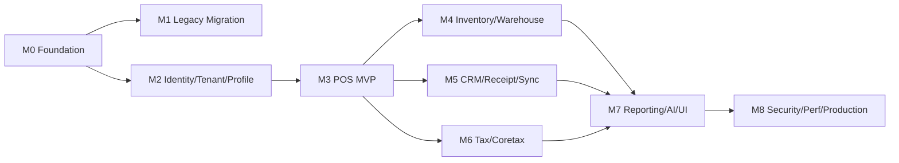
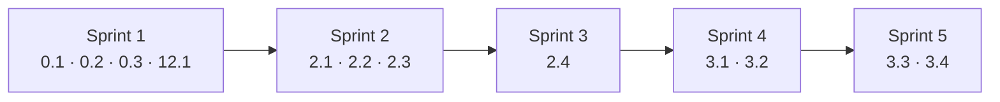

# Bagian 6 — GitHub Issues Detail

## Label rekomendasi

```text
type:epic
type:feature
type:task
type:security
type:docs
type:test
priority:p0
priority:p1
priority:p2
area:architecture
area:database
area:api
area:frontend
area:security
area:auth
area:tenant
area:profile
area:pos
area:inventory
area:warehouse
area:tax
area:crm
area:sync
area:ai
area:ui-ux
area:logging
area:deployment
area:migration
area:reporting
status:ready
status:blocked
status:needs-review
```

## Ketergantungan milestone



## Milestone rekomendasi

| Milestone                              | Fokus                                            |
| -------------------------------------- | ------------------------------------------------ |
| M0 — Repository Foundation             | Skeleton, migration runner, OpenAPI/AsyncAPI     |
| M1 — Legacy Migration & Data Model     | Toolkit migrasi legacy                           |
| M2 — Identity, Tenant, Profile         | Tenant, profile, auth, access                    |
| M3 — POS MVP                           | Product, stock, checkout, posting                |
| M4 — Inventory & Warehouse             | WMS, transfer, cycle count                       |
| M5 — CRM, Receipt, Sync                | Receipt, WA/email, sync/R2                       |
| M6 — Tax/Coretax Readiness             | Tax profile, VAT, Coretax batch                  |
| M7 — Reporting, AI, UI/UX              | Dashboard, UI, AI analyst                        |
| M8 — Security, Performance, Production | Logging, pooling, security readiness, deployment |

## Dokumen acuan per epic

Selain doc 01–05, setiap epic wajib membaca dokumen desain teknis terkait:

| Epic                        | Dokumen acuan utama                                      |
| --------------------------- | -------------------------------------------------------- |
| 0 Foundation                | 09, 10, 11, 16 (migration runner, pool), 18 (env)        |
| 1 Legacy Migration          | 04, 07 (legacy checklist)                                |
| 2 Tenant/Identity/Profile   | 03, 04, 16 (RLS/SET LOCAL), **17 (seed/RBAC/ABAC)**      |
| 3 POS MVP                   | 03, 04, 05, 10 (idempotency/lock), 16 (posting sequence) |
| 4 Warehouse                 | 03, 04, 05, 08 (state machine transfer)                  |
| 5 CRM Receipt               | 03, 05, 18 (provider flag), 16 (outbox)                  |
| 6 Sync & R2                 | 03, 10 (HMAC), 15 (offline client), 16 (outbox)          |
| 7 Tax/Coretax               | 03, 04, 05, 19 (istilah NITKU/DPP)                       |
| 8 UI/UX                     | **14 (design system/layar)**, **15 (frontend/offline)**  |
| 9 Reporting & AI            | 03, 05, 14 (dashboard UI)                                |
| 10 Logging/Pooling/Security | **16 (pool/backpressure)**, 07, 03                       |
| 11 Workflow                 | 03, 17 (self-approval policy)                            |
| 12 Setup & Deployment       | **17 (seed wizard)**, **18 (env/topologi)**, 07          |

---

# EPIC 0 — Repository Foundation

## Issue 0.1 — Initialize AWCMS-Mini Modular Monolith Repository Structure

**Problem:** AWCMS-Mini membutuhkan struktur repository yang konsisten, modular, dan siap dikembangkan bertahap.

**Scope:** Buat struktur `src/modules`, `_shared`, `src/lib`, `sql`, `scripts`, `openapi`, `asyncapi`, `docs`, `deploy`, `tests`, `fixtures`; buat `package.json`, `astro.config.mjs`, `tsconfig.json`, `.gitignore`, `.env.example`, `README.md`; buat module contract, module registry, API response helper, dan health endpoint.

**Out of scope:** Migration runner detail, login, POS, inventory, provider eksternal.

**Acceptance criteria:** Struktur tersedia, build pass, health endpoint ada, README menjelaskan stack, shared convention untuk soft-delete DTO/query helper terdokumentasi, tidak ada secret.

**Security notes:** `.env` ignored, `.env.example` placeholder, no hardcoded secret.

**Testing:** `bun install`, `bun run build`.

**Labels:** `type:task`, `priority:p0`, `area:architecture`.

## Issue 0.2 — Add SQL Migration Runner

**Problem:** Perubahan database harus terkontrol dan berurutan.

**Scope:** `scripts/db-migrate.ts`, `awcms_mini_schema_migrations`, checksum, skip migration yang sudah applied, command `db:migrate`, migration guide.

**Acceptance criteria:** Migration berjalan berurutan, tidak double-run, error menghentikan proses, password DB tidak bocor.

**Testing:** `bun run db:migrate`, `bun run build`.

## Issue 0.3 — Add OpenAPI and AsyncAPI Baseline

**Scope:** OpenAPI master, shared schemas, security schemes, AsyncAPI event envelope, script `api:spec:check`.

**Acceptance criteria:** API spec valid, AsyncAPI valid, shared response schema tersedia, soft delete/restore/purge pattern terdokumentasi, HMAC sync header terdokumentasi.

---

# EPIC 1 — Legacy Migration & Data Model

## Issue 1.1 — Add Legacy Migration Toolkit Schema

**Scope:** `awcms_mini_legacy_migration_runs`, mappings, row counts, validation errors, backfill tasks, mapping awal tabel legacy.

**Acceptance criteria:** Dry-run bisa mencatat row count dan error; password legacy tidak digunakan ulang.

## Issue 1.2 — Add Legacy Migration Dry-Run Service

**Scope:** Service dry-run, row count source-target, validation error, warning duplicate, command `legacy:preflight`.

**Acceptance criteria:** Dry-run tidak mengubah data final, critical error menghasilkan exit code gagal.

---

# EPIC 2 — Tenant, Identity, Profile

## Issue 2.1 — Add Tenant and Office Schema

**Scope:** `awcms_mini_tenants`, `awcms_mini_offices`, `awcms_mini_tenant_settings`, `awcms_mini_physical_locations`, RLS, unique tenant/office code, soft delete untuk office/location.

**Acceptance criteria:** Tenant dan office dapat dibuat, tipe office lengkap, duplicate ditolak, tenant inactive ditolak transaksi, office/location soft-deleted tidak muncul di list default dan restore diaudit.

## Issue 2.2 — Add Central Profile Schema

**Scope:** `awcms_mini_profiles`, identifiers, channels, addresses, entity links, audit logs, merge request, soft delete/restore profile/contact master.

**Acceptance criteria:** Profile bisa link ke user/customer/tax/CRM; identifier dimasking; duplicate resolver bekerja; profile soft-deleted tidak di-resolve untuk transaksi baru kecuali di-restore.

## Issue 2.3 — Add Identity Login and Tenant User Membership

**Scope:** Identity, password hash, tenant user, login/logout/me endpoint.

**Acceptance criteria:** Login sukses/gagal, tenant inactive ditolak, password tidak tampil.

## Issue 2.4 — Add RBAC and ABAC Access Control

**Scope:** Role, permission, activity registry, ABAC policy, assignment, decision log, evaluator.

**Acceptance criteria:** Default deny, deny overrides allow, operator ditolak akses tax/admin, decision log tercatat.

---

# EPIC 3 — POS MVP

## Issue 3.1 — Add Product Catalog MVP

**Scope:** Product, category, brand, unit, product unit, price, endpoint CRUD/search, soft delete/restore product master.

**Acceptance criteria:** SKU unik, barcode unik, harga aktif, product inactive/soft-deleted tidak bisa dijual, partial unique key aktif tidak konflik saat restore.

## Issue 3.2 — Add Stock Balance and Stock Movement MVP

**Scope:** Stock balances, stock movements append-only, opening balance, stock API.

**Acceptance criteria:** Movement update balance, movement posted tidak bisa dihapus, negative stock blocked by default.

## Issue 3.3 — Add Checkout Session and Cart

**Scope:** Checkout sessions, lines, payments, cart API, hold/cancel draft.

**Acceptance criteria:** Cart dibuat, item tambah/update/delete, total server-side; delete line bersifat draft-only dan tidak menyentuh sales document posted.

## Issue 3.4 — Add Idempotent Atomic Transaction Posting

**Scope:** Idempotency keys, posting service, ABAC, stock lock, sales document, sales lines, payment, stock movement, audit, sync event.

**Acceptance criteria:** Posting atomic, double submit tidak dobel, idempotency conflict 409, rollback jika gagal.

---

# EPIC 4 — Warehouse Management

## Issue 4.1 — Add Warehouse Zone and Bin Schema

**Scope:** Warehouse, zone, bin, bin balance, warehouse APIs, soft delete zone/bin kosong.

**Acceptance criteria:** Warehouse dari office, bin unique per warehouse, stok per bin terlihat, bin soft-deleted ditolak jika saldo aktif dan tidak muncul di list default.

## Issue 4.2 — Add Inventory Lot, Batch, Serial, and Expired Date

**Scope:** Lots, serials, expiry risk, FEFO support awal.

**Acceptance criteria:** Lot/serial tercatat, expired sale ditolak kecuali override.

## Issue 4.3 — Add Warehouse Transfer Order Workflow

**Scope:** Transfer orders/lines, shipments, receipts, in-transit, approve/ship/receive endpoint.

**Acceptance criteria:** Ship membuat in-transit, receive partial/full, over-receive ditolak, audit lengkap.

## Issue 4.4 — Add Cycle Count and Stock Adjustment Request

**Scope:** Cycle count plans/tasks/results, stock adjustment requests.

**Acceptance criteria:** Variance menghasilkan adjustment request, approval menghasilkan movement.

---

# EPIC 5 — CRM Receipt Delivery

## Issue 5.1 — Add PDF Receipt Generator

**Scope:** Receipt template, PDF generation, local file metadata, `awcms_mini_receipt_pdfs`.

**Acceptance criteria:** Sales posted menghasilkan PDF receipt, authorized download.

## Issue 5.2 — Add StarSender WhatsApp Receipt Delivery

**Scope:** StarSender adapter, message outbox, retry, delivery log.

**Acceptance criteria:** Consent checked, provider key from env, failed retry.

## Issue 5.3 — Add Mailketing Email Receipt Delivery

**Scope:** Mailketing adapter, email template, outbox, retry.

**Acceptance criteria:** Consent checked, attachment/link support, token/phone/email masked.

---

# EPIC 6 — Offline Sync & R2

## Issue 6.1 — Add Sync Outbox and Inbox

**Scope:** Sync nodes, outbox, inbox, batches, checkpoints, signed push/pull.

**Acceptance criteria:** HMAC validasi, duplicate batch idempotent, checkpoint updated.

## Issue 6.2 — Add Sync Conflict Tracking and Resolution

**Scope:** Conflict table, resolution API, conflict types.

**Acceptance criteria:** Immutable conflict manual, resolution audit.

## Issue 6.3 — Add R2 Object Sync Queue

**Scope:** R2 buckets, object queue, checksum, retry.

**Acceptance criteria:** Local file queued, upload optional, checksum verified.

---

# EPIC 7 — Accounting & Coretax

## Issue 7.1 — Add Tenant Tax Profile and Tax Business Unit

**Scope:** Tax profile, NITKU/ID TKU, tax API.

**Acceptance criteria:** Tax data masked for non-tax role.

## Issue 7.2 — Add Party and Product Tax Profiles

**Scope:** Party tax profile linked to profile, product tax profile with effective dates.

**Acceptance criteria:** VAT invoice can use party/product tax config.

## Issue 7.3 — Add VAT Invoice Staging from Sales Document

**Scope:** VAT invoices, lines, generate/validate endpoint.

**Acceptance criteria:** VAT draft from posted sales, missing NITKU error.

## Issue 7.4 — Add Coretax XML Batch Export

**Scope:** Coretax batches, XML generation, checksum, approval.

**Acceptance criteria:** Validated invoices batched, export audited, file restricted.

---

# EPIC 8 — UI/UX Implementation

## Issue 8.1 — Build Admin/Petugas Layout Shell

**Scope:** Admin layout, sidebar, topbar, tenant switcher, sync indicator, theme.

## Issue 8.2 — Build Cashier POS Fullscreen UI

**Scope:** POS fullscreen, keyboard shortcuts, barcode search, cart, payment, offline indicator.

## Issue 8.3 — Build Customer Receipt Portal

**Scope:** Token receipt page, PDF download, consent update, mobile-friendly.

---

# EPIC 9 — Reporting & AI

## Issue 9.1 — Add Management Reporting Views

**Scope:** Sales daily, stock summary, tax compliance, sync health, warehouse dashboard.

## Issue 9.2 — Add AI Business Analyst Safe Views and Tools

**Scope:** Safe views, read-only tools, tool policy, tool call audit, chat endpoint.

---

# EPIC 10 — Logging, Pooling, Production Security

## Issue 10.1 — Add Structured Logging and Audit Trail

**Scope:** JSON logger, correlation ID, redaction, audit, log APIs.

**Acceptance criteria tambahan:** Soft delete, restore, dan purge high-risk tercatat di audit dengan attributes yang sudah diredaksi.

## Issue 10.2 — Add Database Connection Pooling and Backpressure

**Scope:** Pool config, work class queue, circuit breaker, health endpoint, PgBouncer example.

## Issue 10.3 — Add Production Security Readiness Checklist

**Scope:** Security controls, readiness assessment, evidence, findings, go-live gates, preflight scripts.

---

# EPIC 11 — Workflow Approval

## Issue 11.1 — Add Workflow Approval Engine

**Scope:** Definitions, steps, instances, tasks, decisions, decision API, self-approval guard.

---

# EPIC 12 — Setup Wizard & Deployment

## Issue 12.1 — Add Initial Setup Wizard API

**Scope:** Setup status, initialize tenant/owner/office/role/ABAC default, setup lock.

## Issue 12.2 — Add Offline/LAN Deployment Profile

**Scope:** Deployment profiles, systemd, Docker Compose, PgBouncer, backup cron, `.env.example`.

---

# Status: backlog rencana issue

Dokumen ini adalah template/backlog rencana issue atomic untuk AWCMS-Mini. Snapshot live GitHub terbaru (2026-07-04T10:31:41Z) mencatat **0 issue** di `ahliweb/awcms-mini`; karena itu, nomor issue historis tidak boleh dipakai sebagai rujukan state saat ini.

Jika backlog ini ingin diaktifkan kembali di GitHub:

1. Buat ulang issue dari daftar epic dan issue di atas.
2. Pasang label, milestone, dependency, dokumen acuan, dan checklist DoD sesuai isi issue.
3. Mulai dari Issue 0.1, lalu ubah status issue yang dependency-nya sudah selesai dari `status:blocked` menjadi `status:ready`.
4. Refresh snapshot di [`github/README.md`](github/README.md), `github/issues-open-NNN.md`, `github/issues-closed-NNN.md`, dan `github/labels-milestones.md`.

Snapshot isi GitHub aktual dicatat di [`github/README.md`](github/README.md). Snapshot dipisah menjadi file `issues-open-NNN.md` dan `issues-closed-NNN.md`, dengan batas maksimal 100 issue per file. Dokumen ini tetap menjadi template/rencana issue atomic; folder `github/` menjadi arsip state GitHub yang direfresh dari `gh`.

# Sprint awal rekomendasi



1. Sprint 1: 0.1, 0.2, 0.3, 12.1.
2. Sprint 2: 2.1, 2.2, 2.3.
3. Sprint 3: 2.4.
4. Sprint 4: 3.1, 3.2.
5. Sprint 5: 3.3, 3.4.

# Definition of Done

- Scope sesuai issue.
- Tidak ada unrelated change.
- Migration jika schema berubah.
- OpenAPI jika API berubah.
- AsyncAPI jika event berubah.
- Test relevan.
- Docs update.
- Security checklist pass.
- Soft delete policy pass untuk resource yang deletable; posted/append-only entity tidak bisa dihapus.
- Laporan implementasi tersedia.
