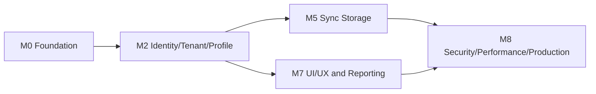
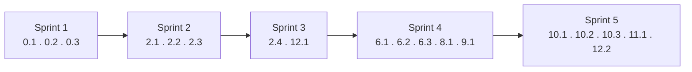

# Bagian 6 — GitHub Issues Detail (Base Generik)

AWCMS-Mini adalah **contoh repo pengembangan umum** — base modular monolith reusable, bukan aplikasi domain. Backlog di dokumen ini **hanya berisi modul generik** yang menjadi bagian AWCMS-Mini sendiri (Foundation, Tenant/Identity/Profile, Sync Storage, UI Experience, Management Reporting, Observability/Pooling/Security Readiness, Workflow Approval, Setup/Deployment). Modul domain (katalog produk, POS, gudang, pajak/Coretax, CRM receipt, AI business analyst, dan sejenisnya) **bukan bagian repo ini** — itu dibangun di aplikasi turunan contoh (mis. AWPOS) di atas base AWCMS-Mini. Lihat `docs/awcms-mini/README.md` §Reusable vs domain turunan.

Nomor epic mengikuti riwayat backlog asli (epic domain sudah dihapus, sehingga ada celah nomor — ini disengaja, bukan kesalahan, agar traceability terhadap issue GitHub yang sudah dibuat tetap valid).

## Label rekomendasi

```text
type:epic
type:feature
type:task
type:security
type:docs
type:test
priority:p0
priority:p1
priority:p2
area:architecture
area:database
area:api
area:frontend
area:security
area:auth
area:tenant
area:profile
area:sync
area:ui-ux
area:logging
area:deployment
area:reporting
status:ready
status:blocked
status:needs-review
```

## Ketergantungan milestone



## Milestone rekomendasi

| Milestone                              | Fokus                                                               |
| -------------------------------------- | ------------------------------------------------------------------- |
| M0 — Repository Foundation             | Skeleton, migration runner, OpenAPI/AsyncAPI, setup wizard          |
| M2 — Identity, Tenant, Profile         | Tenant, profile, auth, access                                       |
| M5 — Sync Storage                      | Offline sync outbox/inbox, conflict, R2 object queue                |
| M7 — UI/UX & Reporting                 | Admin shell, management reporting views                             |
| M8 — Security, Performance, Production | Logging, pooling, workflow approval, security readiness, deployment |

## Dokumen acuan per epic

Selain doc 01–05, setiap epic wajib membaca dokumen desain teknis terkait. Semua epic tunduk pada keputusan arsitektural di [`../adr/`](../adr/README.md) dan threat model di doc 20.

| Epic                        | Dokumen acuan utama                                                      |
| --------------------------- | ------------------------------------------------------------------------ |
| 0 Foundation                | 09, 10, 11, 16 (migration runner, pool), 18 (env); ADR 0001–0002, 0007   |
| 2 Tenant/Identity/Profile   | 03, 04, 16 (RLS/SET LOCAL), **17 (seed/RBAC/ABAC)**; ADR 0003–0004       |
| 6 Sync Storage              | 03, 10 (HMAC), 15 (offline client), 16 (outbox); ADR 0006                |
| 8 UI Experience             | **14 (design system/layar)**, **15 (frontend/offline)**                  |
| 9 Management Reporting      | 03, 05, 14 (dashboard UI)                                                |
| 10 Logging/Pooling/Security | **16 (pool/backpressure)**, 07, 03, **20 (threat model)**; ADR 0003–0005 |
| 11 Workflow Approval        | 03, 17 (self-approval policy); ADR 0004                                  |
| 12 Setup & Deployment       | **17 (seed wizard)**, **18 (env/topologi)**, 07                          |

---

# EPIC 0 — Repository Foundation

## Issue 0.1 — Initialize AWCMS-Mini Modular Monolith Repository Structure

**Problem:** AWCMS-Mini membutuhkan struktur repository yang konsisten, modular, dan siap dikembangkan bertahap.

**Scope:** Buat struktur `src/modules`, `_shared`, `src/lib`, `sql`, `scripts`, `openapi`, `asyncapi`, `docs`, `deploy`, `tests`, `fixtures`; buat `package.json`, `astro.config.mjs`, `tsconfig.json`, `.gitignore`, `.env.example`, `README.md`; buat module contract, module registry, API response helper, dan health endpoint.

**Out of scope:** Migration runner detail, login, dan modul domain aplikasi turunan (katalog, transaksi, dsb.).

**Acceptance criteria:** Struktur tersedia, build pass, health endpoint ada, README menjelaskan stack, shared convention untuk soft-delete DTO/query helper terdokumentasi, tidak ada secret.

**Security notes:** `.env` ignored, `.env.example` placeholder, no hardcoded secret.

**Testing:** `bun install`, `bun run build`.

**Labels:** `type:task`, `priority:p0`, `area:architecture`.

## Issue 0.2 — Add SQL Migration Runner

**Problem:** Perubahan database harus terkontrol dan berurutan.

**Scope:** `scripts/db-migrate.ts`, `awcms_mini_schema_migrations`, checksum, skip migration yang sudah applied, command `db:migrate`, migration guide.

**Acceptance criteria:** Migration berjalan berurutan, tidak double-run, error menghentikan proses, password DB tidak bocor.

**Testing:** `bun run db:migrate`, `bun run build`.

## Issue 0.3 — Add OpenAPI and AsyncAPI Baseline

**Scope:** OpenAPI master, shared schemas, security schemes, AsyncAPI event envelope, script `api:spec:check`.

**Acceptance criteria:** API spec valid, AsyncAPI valid, shared response schema tersedia, soft delete/restore/purge pattern terdokumentasi, HMAC sync header terdokumentasi.

---

# EPIC 2 — Tenant, Identity, Profile

## Issue 2.1 — Add Tenant and Office Schema

**Scope:** `awcms_mini_tenants`, `awcms_mini_offices`, `awcms_mini_tenant_settings`, `awcms_mini_physical_locations`, RLS, unique tenant/office code, soft delete untuk office/location.

**Acceptance criteria:** Tenant dan office dapat dibuat, tipe office lengkap, duplicate ditolak, tenant inactive ditolak transaksi, office/location soft-deleted tidak muncul di list default dan restore diaudit.

## Issue 2.2 — Add Central Profile Schema

**Scope:** `awcms_mini_profiles`, identifiers, channels, addresses, entity links, audit logs, merge request, soft delete/restore profile/contact master.

**Acceptance criteria:** Profile bisa link ke entitas modul lain; identifier dimasking; duplicate resolver bekerja; profile soft-deleted tidak di-resolve untuk transaksi baru kecuali di-restore.

## Issue 2.3 — Add Identity Login and Tenant User Membership

**Scope:** Identity, password hash, tenant user, login/logout/me endpoint.

**Acceptance criteria:** Login sukses/gagal, tenant inactive ditolak, password tidak tampil.

## Issue 2.4 — Add RBAC and ABAC Access Control

**Scope:** Role, permission, activity registry, ABAC policy, assignment, decision log, evaluator.

**Acceptance criteria:** Default deny, deny overrides allow, operator ditolak akses modul yang tidak diizinkan, decision log tercatat.

---

# EPIC 6 — Offline Sync Storage

## Issue 6.1 — Add Sync Outbox and Inbox

**Scope:** Sync nodes, outbox, inbox, batches, checkpoints, signed push/pull.

**Acceptance criteria:** HMAC validasi, duplicate batch idempotent, checkpoint updated.

## Issue 6.2 — Add Sync Conflict Tracking and Resolution

**Scope:** Conflict table, resolution API, conflict types.

**Acceptance criteria:** Immutable conflict manual, resolution audit.

## Issue 6.3 — Add R2 Object Sync Queue

**Scope:** R2 buckets, object queue, checksum, retry.

**Acceptance criteria:** Local file queued, upload optional, checksum verified.

---

# EPIC 8 — UI Experience

## Issue 8.1 — Build Admin Layout Shell

**Scope:** Admin layout, sidebar, topbar, tenant switcher, sync indicator, theme.

---

# EPIC 9 — Management Reporting

## Issue 9.1 — Add Management Reporting Views

**Scope:** Tenant activity summary, access/audit summary, sync health, module usage dashboard (generic reporting views — aplikasi turunan menambah view domainnya sendiri).

---

# EPIC 10 — Logging, Pooling, Production Security

## Issue 10.1 — Add Structured Logging and Audit Trail

**Scope:** JSON logger, correlation ID, redaction, audit, log APIs.

**Acceptance criteria tambahan:** Soft delete, restore, dan purge high-risk tercatat di audit dengan attributes yang sudah diredaksi.

## Issue 10.2 — Add Database Connection Pooling and Backpressure

**Scope:** Pool config, work class queue, circuit breaker, health endpoint, PgBouncer example.

## Issue 10.3 — Add Production Security Readiness Checklist

**Scope:** Security controls, readiness assessment, evidence, findings, go-live gates, preflight scripts.

---

# EPIC 11 — Workflow Approval

## Issue 11.1 — Add Workflow Approval Engine

**Scope:** Definitions, steps, instances, tasks, decisions, decision API, self-approval guard.

---

# EPIC 12 — Setup Wizard & Deployment

## Issue 12.1 — Add Initial Setup Wizard API

**Scope:** Setup status, initialize tenant/owner/office/role/ABAC default, setup lock.

## Issue 12.2 — Add Offline/LAN Deployment Profile

**Scope:** Deployment profiles, systemd, Docker Compose, PgBouncer, backup cron, `.env.example`.

---

# Status: backlog aktif di GitHub

Dokumen ini adalah template/backlog issue atomic generik untuk AWCMS-Mini base. Snapshot live GitHub terbaru (2026-07-04) mencatat **18 issue OPEN** dari backlog ini di `ahliweb/awcms-mini`.

Nomor `Issue X.Y` pada dokumen ini adalah **kode traceability internal**, bukan nomor issue GitHub. Untuk mengetahui nomor issue GitHub dari kode X.Y, lihat tabel di [`github/issues-open-001.md`](github/issues-open-001.md).

## Riwayat perubahan backlog (2026-07-04)

Backlog awal berisi 38 issue, termasuk epic domain POS/retail (Legacy Migration, POS MVP, Warehouse Management, CRM Receipt Delivery, Accounting & Coretax, sebagian UI/Reporting/AI) yang **tidak sesuai konteks AWCMS-Mini sebagai contoh repo pengembangan umum**. 20 issue domain tersebut ditutup (`not planned`) di GitHub dengan catatan bahwa kontennya dipindahkan ke aplikasi turunan contoh (mis. AWPOS), bukan dihapus historisnya. 2 issue (Admin shell, Management Reporting) digeneralisasi wording-nya agar tidak lagi memuat istilah domain (mis. "Petugas", "Sales daily/stock/tax/warehouse dashboard"). Milestone dan label domain yang menjadi tidak terpakai turut dibersihkan (lihat `github/README.md` §Genericization).

Status awal issue yang tersisa:

1. Sprint 1 (Issue 0.1, 0.2, 0.3) berlabel `status:ready`.
2. 15 issue lain berlabel `status:blocked` karena bergantung pada milestone yang belum selesai (lihat §Ketergantungan milestone di atas).
3. Setelah suatu issue selesai dan di-merge, ubah label issue yang dependency-nya baru terpenuhi dari `status:blocked` menjadi `status:ready` di GitHub.
4. Refresh snapshot di [`github/README.md`](github/README.md), `github/issues-open-NNN.md`, `github/issues-closed-NNN.md`, dan `github/labels-milestones.md` setiap kali status/label/milestone berubah.

### Koreksi urutan sprint (2026-07-05)

Sprint awal semula menempatkan **Issue 12.1 (Setup Wizard API)** di Sprint 1, sejajar dengan 0.1–0.3. Ini keliru: setup wizard menginisialisasi tenant, owner, office, role, permission, dan ABAC default — data yang skema-nya baru dibuat oleh Issue 2.1 (tenant/office), 2.3 (identity/login), dan 2.4 (RBAC/ABAC), semuanya Sprint 2/3. Audit implementasi Issue 0.1–0.3 (`AUDIT_STANDAR_PENGEMBANGAN_2026-07-04.md`) menemukan skema database masih kosong (hanya `awcms_mini_modules`/`awcms_mini_schema_migrations`) saat 12.1 hendak dikerjakan. **12.1 dipindah ke Sprint 3**, setelah 2.4, pada tabel dan diagram di bawah.

### Koreksi urutan sprint (2) — Sprint 4/5 tertukar (2026-07-05)

Sprint awal (setelah koreksi #1) menempatkan **10.1–10.3 (M8 — Security/Performance/Production) di Sprint 4**, sebelum **6.1–6.3 (M5 — Sync Storage) dan 8.1/9.1 (M7 — UI/UX & Reporting) di Sprint 5** — bertentangan dengan §Ketergantungan milestone di atas, yang menetapkan `M5 → M8` dan `M7 → M8` (M8 butuh M5 **dan** M7 selesai lebih dulu, bukan sebaliknya). Sprint 5 versi awal juga keliru mencampur `11.1`/`12.2` (keduanya milestone M8) bersama issue M5/M7. Ditemukan saat menutup Issue 12.1 dan hendak merekomendasikan langkah berikutnya — label GitHub `10.1`/`10.2`/`10.3`/`11.1`/`12.2` tetap `status:blocked` (tidak keliru diubah jadi `status:ready`). Diperbaiki: **Sprint 4 = 6.1, 6.2, 6.3, 8.1, 9.1** (M5+M7, keduanya cuma butuh M2 yang sudah tuntas, boleh paralel); **Sprint 5 = 10.1, 10.2, 10.3, 11.1, 12.2** (M8, semuanya).

Jika repo ini dipakai sebagai template untuk membangun aplikasi domain baru: **jangan** menambah epic domain ke backlog ini. Buat paket dokumen 01–20 dan backlog issue terpisah milik aplikasi turunan tersebut (pola: paket dokumen AWPOS), dan tambahkan modul domainnya di `src/modules/` di atas base ini.

Snapshot isi GitHub aktual dicatat di [`github/README.md`](github/README.md). Snapshot dipisah menjadi file `issues-open-NNN.md` dan `issues-closed-NNN.md`, dengan batas maksimal 100 issue per file. Dokumen ini tetap menjadi template/rencana issue atomic; folder `github/` menjadi arsip state GitHub yang direfresh dari `gh`.

# Sprint awal rekomendasi



1. Sprint 1: 0.1, 0.2, 0.3.
2. Sprint 2: 2.1, 2.2, 2.3.
3. Sprint 3: 2.4, 12.1 (setup wizard menunggu tenant/identity/RBAC/ABAC dari 2.1–2.4 — lihat §Koreksi urutan sprint).
4. Sprint 4: 6.1, 6.2, 6.3 (M5 — Sync Storage), 8.1, 9.1 (M7 — UI/UX & Reporting) — keduanya hanya bergantung pada M2 (tuntas), boleh paralel.
5. Sprint 5: 10.1, 10.2, 10.3, 11.1, 12.2 (M8 — Security/Performance/Production — lihat §Koreksi urutan sprint (2) untuk kenapa ini digeser setelah Sprint 4, bukan sebelumnya).

# Definition of Done

- Scope sesuai issue.
- Tidak ada unrelated change.
- Migration jika schema berubah.
- OpenAPI jika API berubah.
- AsyncAPI jika event berubah.
- Test relevan.
- Docs update.
- Security checklist pass.
- Soft delete policy pass untuk resource yang deletable; posted/append-only entity tidak bisa dihapus.
- Laporan implementasi tersedia.
