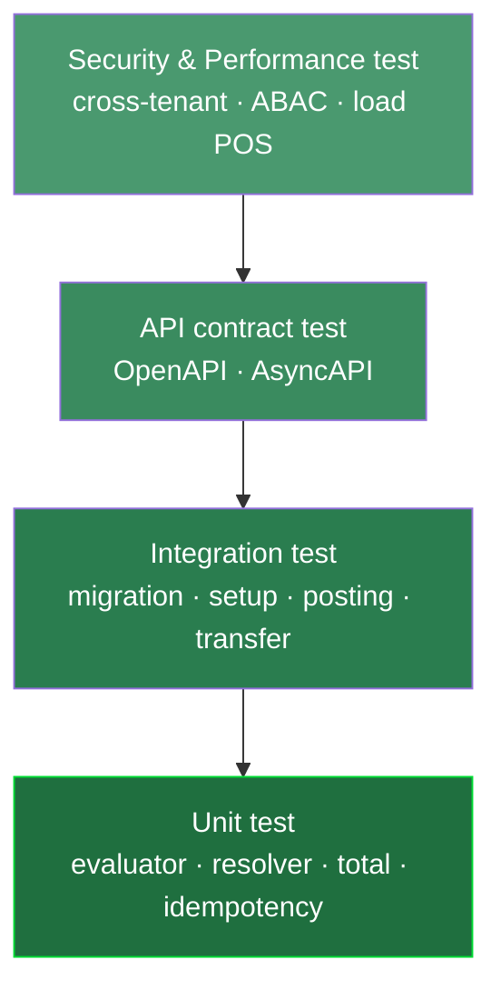
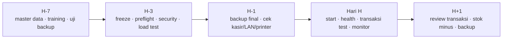

# Bagian 7 — Sprint Plan, Testing Checklist, dan Production Readiness

## Tujuan

Dokumen ini menetapkan rencana sprint, strategi testing, migration checklist, production readiness, backup/restore SOP, dan go-live checklist AWCMS Mini.

## Prinsip sprint

1. Satu sprint menghasilkan progress nyata.
2. Semua perubahan database lewat migration.
3. API baru update OpenAPI.
4. Event baru update AsyncAPI.
5. High-risk mutation idempotent.
6. High-risk action audit log.
7. Dokumentasi sesuai implementasi.

## Sprint Plan 1–12

```mermaid
gantt
  title Roadmap Sprint AWCMS Mini
  dateFormat X
  axisFormat S%s
  section Foundation
  S1 Foundation            :s1, 0, 1
  section Core
  S2 Tenant/Identity/Profile :s2, after s1, 1
  S3 RBAC/ABAC/RLS         :s3, after s2, 1
  S4 Catalog & Stock       :s4, after s3, 1
  S5 POS MVP               :s5, after s4, 1
  section Reliability
  S6 Logging & Pooling     :s6, after s5, 1
  S7 Receipt & CRM         :s7, after s6, 1
  S8 Offline Sync & R2     :s8, after s7, 1
  section Ext modules
  S9 Warehouse             :s9, after s8, 1
  S10 Tax/Coretax          :s10, after s9, 1
  S11 UI/Reporting/AI      :s11, after s10, 1
  S12 Production Readiness  :s12, after s11, 1
```



| Sprint | Fokus                     | Output utama                                         |
| -----: | ------------------------- | ---------------------------------------------------- |
|      1 | Repository Foundation     | Skeleton, migration runner, OpenAPI/AsyncAPI, health |
|      2 | Tenant, Identity, Profile | Tenant, office, setup, login, profile resolver       |
|      3 | RBAC, ABAC, RLS           | Role, policy, evaluator, decision log                |
|      4 | Product Catalog & Stock   | Produk, harga, stock balance, movement               |
|      5 | POS MVP                   | Checkout, cart, payment, atomic posting              |
|      6 | Logging & Pooling         | Structured log, audit, DB pool, backpressure         |
|      7 | Receipt & CRM             | PDF receipt, contact, consent, WA/email outbox       |
|      8 | Offline Sync & R2         | Sync push/pull, conflict, object queue               |
|      9 | Warehouse                 | Warehouse, bin, lot, transfer, cycle count           |
|     10 | Tax/Coretax               | Tax profile, VAT invoice, Coretax batch              |
|     11 | UI/UX, Reporting, AI      | Admin UI, POS UI, reports, AI analyst                |
|     12 | Production Readiness      | Workflow, security readiness, deployment, handover   |

## Sprint acceptance criteria ringkas

### Sprint 1

- `bun install` berhasil.
- `bun run build` berhasil.
- `bun run db:migrate` tersedia.
- `bun run api:spec:check` tersedia.
- `/api/v1/health` aktif.
- No secret committed.

### Sprint 2

- Tenant, office, owner dapat dibuat.
- Owner login berhasil.
- Profile resolver berjalan.
- Identifier dimasking.
- Setup locked.

### Sprint 3

- Role dan permission tersedia.
- ABAC default deny.
- Deny overrides allow.
- Decision log tercatat.
- Cross-tenant access blocked.

### Sprint 4

- Product CRUD/search berjalan.
- SKU unique.
- Stock balance dan movement berjalan.
- Product inactive tidak bisa dijual.

### Sprint 5

- Checkout/cart/payment berjalan.
- Posting transaksi atomic.
- Idempotency same key aman.
- Idempotency conflict 409.
- Stock lock dan rollback diuji.

### Sprint 6

- Correlation ID tersedia.
- Log diredaksi.
- Audit helper berjalan.
- Pool health endpoint aktif.
- Pool saturation terdeteksi.

### Sprint 7

- Receipt PDF local dibuat.
- CRM contact dan consent berjalan.
- WA/email outbox berjalan.
- Customer receipt token aman.

### Sprint 8

- Sync HMAC valid.
- Push/pull event berjalan.
- Duplicate event aman.
- Conflict tercatat.
- Object checksum diverifikasi.

### Sprint 9

- Warehouse/zone/bin dibuat.
- Lot/expired dibuat.
- Transfer shipped/received partial/full.
- Cycle count variance dan adjustment request.

### Sprint 10

- Tax profile dan NITKU dibuat.
- VAT invoice generated/validated.
- Coretax batch XML-ready dan checksum.
- Tax data masked.

### Sprint 11

- Admin shell tampil.
- POS fullscreen keyboard-first.
- Reports tenant-aware.
- AI read-only safe views.

### Sprint 12

- Workflow approve/reject.
- Security readiness pass.
- Go-live gate blocking critical fail.
- Backup/restore SOP dan deployment profile tersedia.

## Testing Strategy



Piramida: banyak unit test di dasar, sedikit end-to-end di puncak; security & performance test mengawal.

### Unit test target

- ABAC evaluator.
- Profile resolver.
- Product price selection.
- Stock movement calculation.
- Checkout total calculation.
- Idempotency service.
- Transaction posting guard.
- VAT calculation.
- Warehouse transfer status machine.
- Cycle count variance.
- HMAC signature.
- AI tool policy.

### Integration test target

- Migration dari database kosong.
- Setup wizard.
- Login owner/kasir.
- Product create.
- Opening stock.
- Checkout/posting.
- Stock berkurang.
- Receipt PDF.
- Sync outbox event.
- VAT invoice draft.
- Warehouse transfer.
- ABAC dan RLS.

### API contract test

- OpenAPI valid.
- Success/error response standard.
- Tenant header ada.
- Idempotency header ada.
- Pagination konsisten.
- Sensitive data tidak tampil penuh.

### Security test

- Tenant A tidak bisa baca Tenant B.
- Kasir tidak bisa export Coretax.
- Kasir tidak bisa assign role.
- Customer hanya bisa lihat receipt miliknya.
- Password/token/API key tidak masuk response/log.
- NPWP/NIK/phone/email dimasking.
- Sync HMAC invalid ditolak.
- AI raw PII/SQL ditolak.

### Performance test awal

| Area                    |               Target awal |
| ----------------------- | ------------------------: |
| Product search          |                  < 300 ms |
| Add item cart           |                  < 300 ms |
| Post transaction normal |                   < 1.5 s |
| Receipt PDF             |                     < 3 s |
| Sales daily report      | < 2 s data kecil-menengah |
| Pool acquire critical   |           < 500 ms normal |
| Sync push small batch   |                     < 2 s |

## Migration checklist

### Sebelum migration

- Backup database dibuat.
- Backup diverifikasi.
- Migration direview.
- Nomor migration benar.
- Tidak ada destructive SQL tanpa rencana.
- RLS, index, constraint dicek.
- Recovery plan disiapkan.

### Saat migration

- Jalankan staging dulu.
- Jalankan berurutan.
- Catat start/end time.
- Stop jika error.

### Setelah migration

- Row count penting dicek.
- Constraint/index dicek.
- RLS aktif.
- API smoke test.
- Login test.
- POS transaction test.
- Backup baru dibuat.

## Legacy migration checklist

- Backup legacy tersedia.
- Import ke schema `legacy` berhasil.
- Row count dihitung.
- Mapping table/field tersedia.
- Password legacy tidak digunakan ulang.
- Duplicate profile/product scan.
- Stock negative scan.
- Dry-run tanpa menulis final.
- Error/warning dicatat.

## Production readiness checklist

### Application

- Build pass.
- Migration pass.
- API spec valid.
- Production preflight pass.
- Setup wizard locked.
- Role default tersedia.
- ABAC default deny tested.
- RLS tested.
- Logging aktif.

### Database

- PostgreSQL version sesuai target.
- PostgreSQL tidak public.
- Least privilege DB user.
- Backup aktif.
- Restore tested.
- Index utama tersedia.
- Pool sehat.
- Slow query monitoring.

### Security

- No hardcoded secret.
- `.env` permission aman.
- Password hash modern.
- Login lockout.
- RLS aktif.
- ABAC aktif.
- Audit log aktif.
- Tax data masking.
- CRM opt-out.
- AI read-only.
- Sync HMAC jika hybrid.
- Error tidak expose stack trace.

## Backup SOP ringkas

Command contoh:

```bash
pg_dump --format=custom --file=/backup/awcms_$(date +%Y%m%d_%H%M%S).dump "$DATABASE_URL"
```

Checklist:

- File backup terbentuk.
- Ukuran masuk akal.
- Checksum dibuat.
- Disimpan aman.
- Tidak public.
- Retention diterapkan.
- Restore diuji.

## Restore SOP ringkas

```bash
createdb awcms_restore_test
pg_restore --dbname=awcms_restore_test --clean --if-exists /backup/awcms_YYYYMMDD_HHMMSS.dump
```

Validasi:

- Tenant terbaca.
- User terbaca.
- Produk/stok/transaksi terbaca.
- Login test.
- POS smoke test.
- Report smoke test.

## Go-live plan



### H-7

- Finalisasi master produk/stok/user.
- Training admin/kasir/gudang.
- Uji backup restore.
- Uji POS, receipt.

### H-3

- Freeze fitur besar.
- Production preflight.
- Security readiness.
- Pool load test.
- Review critical finding.
- Rollback plan.

### H-1

- Backup final.
- Stok awal final.
- Cek user kasir.
- Cek LAN/printer/PDF.
- Cek SOP darurat.

### Hari H

- Start aplikasi.
- Health check.
- Login admin/kasir.
- Transaksi kecil test.
- Receipt test.
- Monitor log/error/pool.

### H+1

- Review transaksi hari pertama.
- Review stok minus.
- Review failed receipt.
- Review sync conflict.
- Backup setelah hari pertama.

## Definition of MVP Ready

- Tenant setup.
- Owner/kasir login.
- Produk dan stok awal.
- Checkout dan posting transaksi.
- Stok berkurang.
- Idempotency berjalan.
- Receipt PDF local.
- Audit log.
- Backup/restore tested.

## Definition of Production Ready

- MVP selesai.
- Security readiness pass.
- No critical finding.
- Pool health pass.
- RLS dan ABAC tested.
- Receipt/sync/warehouse/tax tested sesuai modul aktif.
- SOP dan handover selesai.
