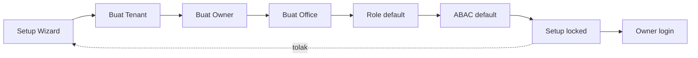
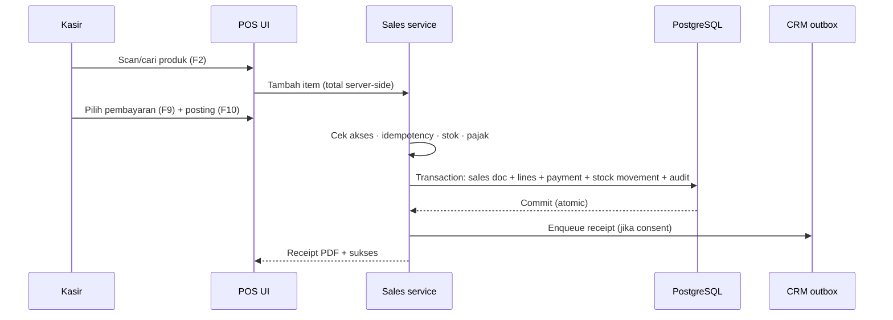
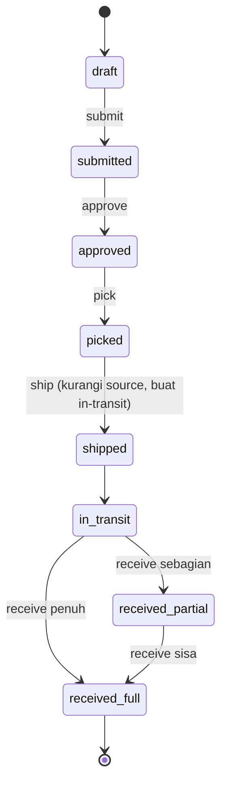
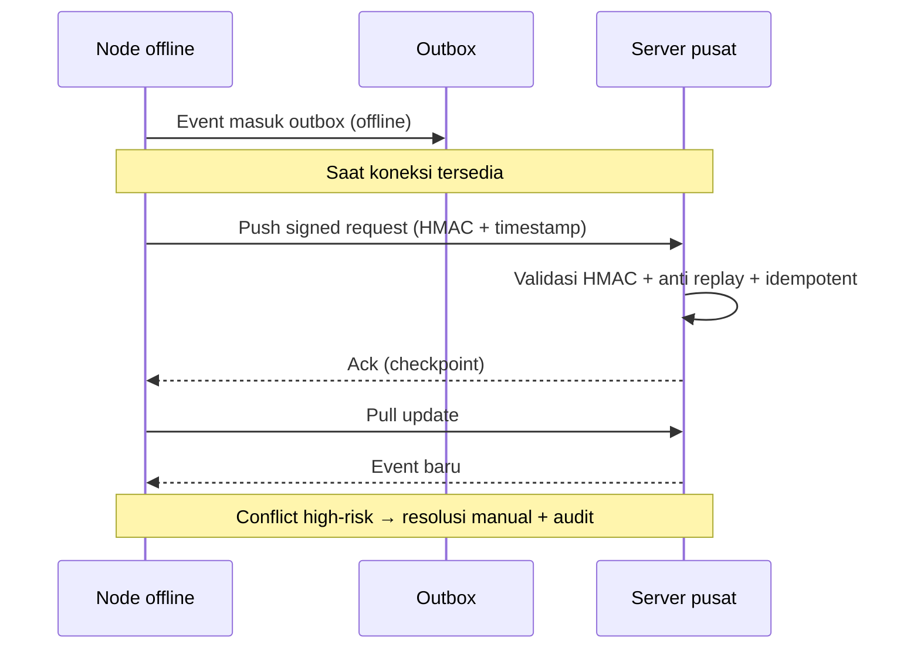
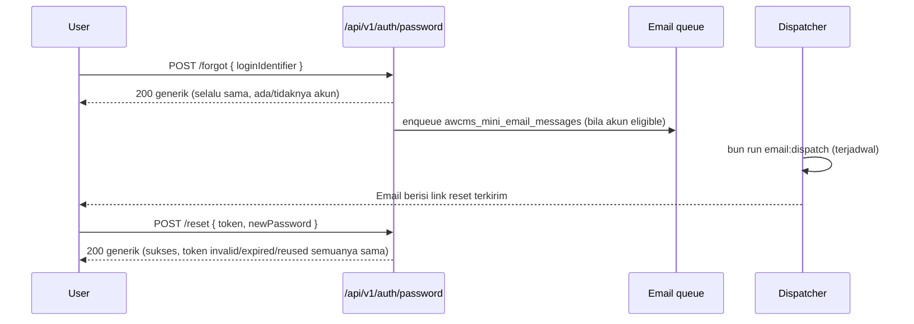

# Bagian 8 — SOP Operasional dan User Guide

> **Contoh domain (ilustratif).** Dokumen ini memakai domain retail/POS bergaya AWPOS sebagai contoh berjalan. **Pola & standar**-nya reusable untuk base AWCMS-Mini; **entitas, endpoint, layar, dan istilah domain** (produk, POS, gudang, pajak, CRM, AI, dsb.) adalah ilustrasi yang **diganti** oleh aplikasi turunan. Lihat [README paket dokumen](README.md) §Reusable vs domain turunan.

## Tujuan

Dokumen ini menjadi panduan operasional AWCMS-Mini untuk admin, owner, operator, petugas gudang, tax officer, CRM staff, customer, dan admin teknis.

## Prinsip operasional

1. Semua user memakai akun masing-masing.
2. Akun tidak boleh dipakai bersama.
3. Transaksi posted tidak diedit langsung.
4. Koreksi melalui cancel, retur, reversal, atau adjustment.
5. Aktivitas penting tercatat audit log.
6. Aktivitas high-risk membutuhkan approval.
7. Data customer/tax sensitif dimasking sesuai role.
8. Hapus master data memakai arsip/soft delete; restore/purge hanya untuk role berizin.
9. Backup harus diuji restore.
10. POS dapat berjalan offline.
11. Sync berjalan saat koneksi tersedia.

## SOP Instalasi awal

### Prasyarat minimum

| Komponen | Minimum             |
| -------- | ------------------- |
| CPU      | 2 core              |
| RAM      | 4 GB                |
| Storage  | 80 GB SSD           |
| OS       | Linux Mint / Ubuntu |
| Database | PostgreSQL          |
| Runtime  | Bun                 |

### Langkah development/local

```bash
git clone <repo-awcms-mini>
cd awcms-mini
bun install
cp .env.example .env
docker compose up -d postgres
bun run db:migrate
bun run api:spec:check
bun run build
bun run dev
```

### Checklist instalasi

- Repository berhasil di-clone.
- Bun terinstall.
- PostgreSQL aktif.
- `DATABASE_URL` benar.
- `.env` tidak masuk Git.
- Migration berhasil.
- Build berhasil.
- Health endpoint aktif.
- Log tidak menampilkan secret.

## SOP Setup Tenant Awal

Data yang disiapkan:

- Kode tenant.
- Nama tenant.
- Nama legal.
- Bahasa default.
- Theme default.
- Nama owner.
- Email owner.
- Password owner.
- Kode office.
- Nama office.
- Tipe office.

Alur:

```text
Setup Wizard → Tenant → Owner → Office → Role default → ABAC default → Setup locked → Owner login
```



Checklist:

- Tenant dibuat.
- Owner dibuat.
- Office dibuat.
- Role default dibuat.
- ABAC default dibuat.
- Setup locked.
- Owner login berhasil.

## SOP User, Role, dan Akses

### Role standar

| Role             | Fungsi                               |
| ---------------- | ------------------------------------ |
| Owner            | Akses penuh dan approval utama       |
| Admin            | Kelola sistem, produk, user, laporan |
| Kasir            | Transaksi POS                        |
| Manager          | Approval transaksi/stok/operasional  |
| Petugas Gudang   | Transfer, receiving, cycle count     |
| Inventory Staff  | Produk, stok, adjustment terbatas    |
| Tax Officer      | Pajak dan Coretax                    |
| CRM Staff        | Kontak dan receipt delivery          |
| Business Analyst | Laporan agregat dan AI analyst       |
| Auditor          | Audit trail read-only                |

### Tambah user

1. Login owner/admin.
2. Buka User & Access.
3. Tambah user.
4. Isi nama, email/username, nomor HP jika perlu, office default.
5. Pilih role.
6. Simpan.
7. Sistem membuat profile, identity, tenant user, assignment, audit log.

### Nonaktifkan user

1. Buka detail user.
2. Klik nonaktifkan.
3. Isi alasan.
4. Sistem menolak login user tersebut.
5. Token dapat dicabut sesuai kebijakan.
6. Audit log tercatat.

### Arsipkan dan pulihkan master data

Gunakan arsip/soft delete untuk produk, office/lokasi, profile/contact, channel, atau bin yang tidak dipakai. Jangan menghapus fisik data operasional harian.

1. Buka detail resource.
2. Pilih arsipkan/hapus.
3. Isi alasan.
4. Sistem menyembunyikan resource dari list default dan transaksi baru.
5. Sistem mencatat `deleted_at`, actor, alasan, dan audit log.
6. Untuk pulihkan, buka tampilan arsip, pilih restore, lalu sistem memvalidasi konflik kode/SKU/barcode dan permission.
7. Purge/anonymize hanya dilakukan untuk retention/legal oleh role berizin, biasanya melalui approval.

Larangan: jangan arsipkan transaksi posted, stock movement posted, audit log, security event, atau batch pajak exported; gunakan cancel/return/reversal/adjustment/status lifecycle.

## SOP Central Profile

### Resolve customer dari POS

1. Kasir memilih customer.
2. Masukkan WhatsApp/email.
3. Sistem normalisasi identifier.
4. Jika profile ada, gunakan existing.
5. Jika tidak ada, buat profile baru.
6. Transaksi memakai `customer_profile_id`.

### Merge profile duplikat

1. Admin buka Profile Governance.
2. Pilih source dan target profile.
3. Review identifier/transaksi/tax/CRM.
4. Buat merge request.
5. Supervisor approve.
6. Entity links dipindahkan ke profile canonical.
7. Source menjadi `merged`.
8. Audit tercatat.

Larangan: jangan merge hanya karena nama mirip; jangan merge tax-sensitive tanpa review.

## SOP Input Produk

Data yang disiapkan:

- SKU.
- Barcode.
- Nama produk.
- Kategori.
- Brand.
- Satuan dasar.
- Harga jual.
- Tracking type: none/lot/serial/lot_serial.
- Status.
- Profil pajak.

Langkah:

1. Login admin/inventory.
2. Buka Inventory → Produk.
3. Tambah produk.
4. Isi data.
5. Pilih tracking type.
6. Isi profil pajak jika perlu.
7. Simpan.
8. Audit tercatat.

### Arsipkan produk

- Produk yang diarsipkan tidak muncul di search/list default dan tidak bisa dijual.
- Produk yang pernah dipakai transaksi tetap ada untuk histori receipt/report.
- Restore produk wajib dicek konflik SKU/barcode dan profil pajak.

## SOP Input Stok Awal

### Tanpa WMS

1. Buka Inventory → Stok Awal.
2. Pilih office.
3. Pilih produk.
4. Isi quantity.
5. Alasan: saldo awal implementasi.
6. Sistem membuat stock balance dan movement `opening_balance`.

### Dengan WMS/bin

1. Buka Warehouse → Bin Balance.
2. Pilih warehouse, zone, bin.
3. Pilih produk.
4. Pilih lot/serial jika perlu.
5. Isi quantity.
6. Sistem memperbarui bin balance dan stock summary.

## SOP Transaksi Kasir

### Shortcut

| Shortcut | Fungsi               |
| -------- | -------------------- |
| F2       | Fokus search/barcode |
| F4       | Ubah quantity        |
| F6       | Diskon sesuai izin   |
| F8       | Hold transaksi       |
| F9       | Pembayaran           |
| F10      | Posting transaksi    |
| Esc      | Tutup dialog         |

### Alur transaksi operasional



### Transaksi normal

1. Login operator.
2. Buka POS.
3. Pastikan tenant/office/operator benar.
4. Scan/cari produk.
5. Ubah qty jika perlu.
6. Pilih customer jika perlu.
7. Pilih pembayaran.
8. Input nominal.
9. Posting.
10. Sistem validasi akses, stok, total, idempotency, pajak.
11. Sistem membuat transaksi, mengurangi stok, membuat receipt PDF.
12. Kirim receipt jika consent aktif.

### Jika stok tidak cukup

- Kurangi quantity.
- Hapus item.
- Hubungi admin/gudang.
- Jangan paksa stok minus tanpa policy/approval.

## SOP Hold, Cancel, Retur

### Hold

- Tekan F8.
- Isi catatan jika perlu.
- Checkout status `held`.
- Stok belum dikurangi.

### Cancel transaksi posted

1. Buka detail transaksi.
2. Request cancel.
3. Isi alasan.
4. Workflow dibuat.
5. Manager/owner approve/reject.
6. Jika approve, reversal/cancel record dibuat dan stok dikoreksi.

### Retur

1. Cari transaksi asal.
2. Pilih item retur.
3. Isi quantity.
4. Pilih kondisi: good/damaged/expired/wrong item.
5. Pilih lokasi/bin tujuan.
6. Sistem membuat return document dan movement `return_in`.

## SOP Warehouse Transfer

Status:

```text
draft → submitted → approved → picked → shipped → in_transit → received_partial/received_full
```



Langkah:

1. Buat transfer dari source ke destination warehouse.
2. Tambah produk, lot/bin, quantity.
3. Submit.
4. Approver review dan approve.
5. Petugas source ship.
6. Sistem mengurangi source dan membuat in-transit.
7. Destination receive.
8. Good masuk bin normal; damaged/expired masuk quarantine.
9. Sistem menambah stock destination dan audit.

## SOP Cycle Count dan Adjustment

1. Buat cycle count plan.
2. Pilih warehouse/zone/bin/product.
3. Assign petugas.
4. Petugas input counted qty.
5. Sistem hitung variance.
6. Variance menghasilkan adjustment request.
7. Manager approve/reject.
8. Jika approve, movement `adjustment` dibuat.

## SOP Receipt WhatsApp/Email

Prasyarat:

- Receipt PDF ada.
- Customer profile ada.
- Channel WhatsApp/email valid.
- Consent aktif.
- Provider configured.
- Jika provider butuh URL, PDF sudah online/R2.

Jika gagal:

- Cek channel.
- Cek consent.
- Cek file PDF/URL.
- Cek API key provider.
- Retry dari message outbox jika layak.

## SOP Customer Portal

Customer dapat:

- Buka receipt link.
- Lihat ringkasan transaksi.
- Download PDF.
- Update consent WhatsApp/email.

Jika link invalid, tampilkan pesan sederhana tanpa detail teknis.

## SOP Sync Offline-Online



Alur:

1. Node offline membuat event.
2. Event masuk outbox.
3. Saat online, node push signed request.
4. Server validasi HMAC.
5. Server process event dan ack.
6. Node update checkpoint.
7. Node pull update dari server.

Conflict high-risk diselesaikan manual dengan reason dan audit.

Soft delete disinkronkan sebagai tombstone event. Node offline harus menyembunyikan resource yang sudah menerima tombstone, tetapi tidak melakukan physical delete sebelum retention terpenuhi.

## SOP Pajak/Coretax

1. Setup tax profile tenant.
2. Setup NITKU/ID TKU office.
3. Setup party tax profile.
4. Setup product tax profile.
5. Generate VAT invoice dari sales posted.
6. Validate invoice.
7. Buat Coretax batch.
8. Approval jika policy aktif.
9. Generate XML dan checksum.
10. Audit export.

Catatan: AWCMS-Mini bersifat Coretax-ready/XML-ready, tidak mengasumsikan API upload resmi.

## SOP Modul Email (base, epic #492)

Berbeda dari §SOP Receipt WhatsApp/Email di atas (contoh domain retail/POS
"kirim struk", historical issue #390) — bagian ini adalah modul base
generik (`src/modules/email/README.md`) untuk password reset, system
announcement, dan workflow notification. Belum ada UI admin khusus;
seluruh alur ini API-only (`/api/v1/email/*`, `/api/v1/auth/password/*`,
`/api/v1/reports/email-health`).

### Password reset (end-user)



Catatan operasional: respons `POST /forgot` dan `POST /reset` **selalu**
identik terlepas hasil internalnya (anti-enumeration, Issue #496) — jangan
menyimpulkan "akun tidak ada" dari respons publik; gunakan audit log
(`password_reset_requested`/`_failed`/`_completed`) untuk diagnosis
internal oleh admin/support, bukan respons API publik. Token reset
berlaku `AUTH_PASSWORD_RESET_TOKEN_TTL_MIN` menit (default 30), sekali
pakai, dan sesi identity **dicabut penuh** setelah reset berhasil.

### Mengirim announcement/notification (admin)

1. (Opsional) Preview dulu: `POST /api/v1/email/announcements/preview`
   dengan `templateKey`/`variables`/`target` yang sama — mengembalikan
   `matchedCount` + sample render, **tidak pernah** daftar penerima nyata,
   tidak menulis apa pun ke antrean.
2. Kirim: `POST /api/v1/email/announcements` dengan header
   `Idempotency-Key` (wajib) — `target.type: "users"` untuk daftar
   eksplisit (butuh `email.notification.create`), `"role"`/`"tenant"`
   untuk bulk (butuh **tambahan** `email.announcement.create` — two-tier
   ABAC, Issue #497).
3. Setiap kirim tercatat di audit trail (`announcement_sent`) dengan
   `targetType`/`templateKey`/`recipientCount`/`correlationId` —
   tidak pernah daftar penerima.

### Memantau pengiriman dan menangani kegagalan (admin/operator)

1. **Kesehatan antrean**: `GET /api/v1/reports/email-health` —
   `queuedCount`/`retryWaitCount`/`failedCount`/`suppressedCount`,
   `isHealthy`. Jalankan berkala atau setelah insiden provider.
2. **Detail pesan gagal/tertunda**: `GET /api/v1/email/messages?status=failed`
   (atau `retry_wait`) — daftar per-pesan (kategori, `lastError`,
   `retryCount`, `toAddressMasked` — tidak pernah alamat mentah).
3. **Batalkan pengiriman yang belum terkirim** (mis. announcement salah
   target/template): `POST /api/v1/email/messages/{id}/cancel` untuk
   setiap baris `queued`/`retry_wait` dengan `correlationId` yang sama
   dengan hasil `POST /email/announcements` — baris yang sudah
   `sending`/`sent` tidak bisa dibatalkan (`409`).
4. **Kelola suppression list** (bounce/complaint/unsubscribe/manual):
   `GET /api/v1/email/suppressions` untuk melihat,
   `POST /api/v1/email/suppressions` untuk menambah manual (mis. permintaan
   opt-out lewat kanal lain), `DELETE /api/v1/email/suppressions/{id}`
   untuk mencabut. Penerima yang tersuppress otomatis dikecualikan dari
   target announcement berikutnya, dan dicek ulang oleh dispatcher tepat
   sebelum kirim (bila baru disuppress setelah enqueue).
5. **Provider outage**: dispatcher berhenti otomatis (circuit breaker,
   `email.dispatch.breaker_open` log) — tidak perlu intervensi manual,
   pesan tetap `queued`/`retry_wait` dan terkirim otomatis setelah
   provider pulih. Cek `bun run email:provider:health` untuk verifikasi
   cepat. Lihat `src/modules/email/README.md` §Incident response untuk
   runbook lengkap (provider outage, rotasi kredensial, accidental bulk
   send).

## SOP Modul Manajemen Modul (epic #510, Issue #511-#521)

Registry modul database-backed, tenant-aware (`src/modules/module-management/README.md`) — infrastruktur generik untuk mengelola modul lain, bukan fitur domain. Belum ada tabel "aksi eksekusi command" — job registry murni dokumentasi (lihat §Inspeksi job registry di bawah), sesuai batasan out-of-scope epic (tidak ada marketplace/instalasi plugin runtime).

### Sinkronisasi descriptor modul

1. `POST /api/v1/modules/sync` (butuh `module_management.modules.sync`) — menyamakan `awcms_mini_modules`/`_dependencies`/`_navigation`/`_jobs` dengan `listModules()` code saat ini. Idempoten — jalankan berulang aman, hasil kedua kali `unchanged`.
2. Modul yang hilang dari code (di-uninstall/dihapus) **ditandai** `lifecycle_status = 'disabled'`, tidak pernah dihapus — riwayat dependency/navigation/jobs tetap ada sebagai catatan historis.
3. Beberapa aksi lain (enable/disable modul, update settings, trigger health check) otomatis menjalankan sync ini lebih dulu di dalam transaction yang sama (FK ke `awcms_mini_modules`) — operator **tidak wajib** menjalankan sync manual sebelum aksi tersebut.

### Enable/disable modul untuk tenant

1. Cek status: `GET /api/v1/tenant/modules` (butuh `module_management.tenant_modules.read`) — daftar semua modul + status aktif/nonaktif untuk tenant pemanggil. Baris tanpa state eksplisit berarti aktif (default backward-compatible).
2. Aktifkan: `POST /api/v1/tenant/modules/{moduleKey}/enable` (butuh `.enable`).
3. Nonaktifkan: `POST /api/v1/tenant/modules/{moduleKey}/disable` (butuh `.disable`) dengan body `{ "reason": "..." }` — **wajib** diisi, tercatat di `disable_reason`.
4. Modul core (`isCore: true`, mis. `module_management` sendiri) **tidak bisa** dinonaktifkan — selalu `409 CORE_MODULE_CANNOT_BE_DISABLED`.
5. Menonaktifkan modul **tidak pernah menghapus data tenant** — hanya menulis baris `awcms_mini_tenant_modules`. Data modul yang dinonaktifkan tetap utuh, siap dipakai lagi begitu diaktifkan kembali.
6. Setiap enable/disable tercatat di audit trail (`tenant_module_enabled`/`tenant_module_disabled`, `resource_type: tenant_module`, `resource_id: moduleKey`).
7. **Efeknya nyata di seluruh endpoint modul tersebut**, bukan cuma status di halaman ini — guard bersama (`authorizeInTransaction`) menolak `403 MODULE_DISABLED` untuk request apa pun ke modul yang dinonaktifkan tenant tsb (lihat `src/modules/identity-access/README.md` §"Enforcement modul disabled").

### Update pengaturan modul (tenant)

1. `GET /api/v1/tenant/modules/{moduleKey}/settings` (butuh `.settings.read`) — mengembalikan `defaults` (bawaan code), `tenantOverride` (yang sudah diset tenant ini), dan `effective` (gabungan, override menang).
2. `PATCH /api/v1/tenant/modules/{moduleKey}/settings` (butuh `.settings.update`) — body JSON di-**merge dangkal** ke override yang ada (key yang tidak disebut tetap tidak berubah); **tidak** mengganti seluruh objek.
3. Key berbentuk secret (mengandung `password`/`token`/`secret`/`credential`/dll., daftar sama dengan redaksi log/audit) **ditolak** `400 SETTINGS_SENSITIVE_KEY_REJECTED` — secret provider selalu lewat environment variable/secret manager, tidak pernah lewat settings tenant. **Value** yang berbentuk credential (JWT, blok PEM private key, AWS access key id, header `Bearer`/`Basic` mentah, connection string dengan `user:pass@`) juga ditolak `400 SETTINGS_SECRET_SHAPED_VALUE_REJECTED` walau nama key-nya sendiri tidak mencurigakan (mis. `publicLabel`) — cek nama key saja tidak cukup kalau isinya tetap credential.
4. Setiap update tercatat di audit trail (`settings_updated`) dengan **diff key yang berubah saja** (`addedKeys`/`changedKeys`/`removedKeys`) — tidak pernah nilai settings itu sendiri.

### Inspeksi kesehatan modul

1. `GET /api/v1/modules/{moduleKey}/health` (butuh `.health.read`) — cepat, read-only, **tidak pernah** memanggil provider eksternal. Status `healthy`/`degraded`/`failed`/`unknown` dari sekumpulan sinyal (registry ter-sync, migrasi diterapkan, permission katalog sinkron, settings valid, jobs terdokumentasi, OpenAPI/AsyncAPI terdokumentasi).
2. `POST /api/v1/modules/{moduleKey}/health/check` (butuh `.health.check`) — sinyal sama seperti di atas **plus** live check ke provider eksternal bila modul punya satu (hanya `email` saat ini, timeout-bounded, tidak pernah memblokir transaksi bisnis normal). Hasilnya dicatat di `awcms_mini_module_health_checks` (riwayat instance-level) dan diaudit (`health_checked`).
3. Setiap `detail` sinyal adalah teks generik tetap — **tidak pernah** pesan error mentah, stack trace, atau nilai `DATABASE_URL`/secret.

### Interpretasi error validasi dependency

Kode error dari `POST .../enable` atau `.../disable` (semua `409` kecuali disebutkan lain):

| Kode                               | Arti                                                          | Tindakan                                                        |
| ---------------------------------- | ------------------------------------------------------------- | --------------------------------------------------------------- |
| `MODULE_NOT_FOUND` (`404`)         | Module key tidak terdaftar atau dinonaktifkan global (code)   | Cek ejaan/`GET /modules` untuk daftar valid                     |
| `MODULE_ALREADY_ENABLED`           | Sudah aktif untuk tenant ini                                  | Tidak perlu aksi                                                |
| `MODULE_ALREADY_DISABLED`          | Sudah nonaktif untuk tenant ini                               | Tidak perlu aksi                                                |
| `MODULE_DEPENDENCY_MISSING`        | Modul yang dibutuhkan tidak terdaftar sama sekali             | Periksa `dependencies` descriptor; kemungkinan bug authoring    |
| `MODULE_DEPENDENCY_DISABLED`       | Modul yang dibutuhkan nonaktif (global atau untuk tenant ini) | Aktifkan dependency-nya dulu, baru modul ini                    |
| `MODULE_REVERSE_DEPENDENCY_ACTIVE` | Modul lain yang masih aktif bergantung pada modul ini         | Nonaktifkan modul dependent dulu, atau batalkan rencana disable |
| `MODULE_DEPENDENCY_CYCLE`          | Terdeteksi circular dependency pada graph                     | Bug authoring descriptor — laporkan ke tim modul terkait        |
| `MODULE_VERSION_INCOMPATIBLE`      | `minAppVersion` modul lebih tinggi dari versi app saat ini    | Upgrade aplikasi dulu sebelum mengaktifkan modul ini            |
| `CORE_MODULE_CANNOT_BE_DISABLED`   | Modul core (`isCore: true`)                                   | Tidak bisa dinonaktifkan — ini bukan bug                        |

### Inspeksi job registry

1. `GET /api/v1/modules/{moduleKey}/jobs` (butuh `.jobs.read`) — daftar command operasional modul (`command`, `purpose`, `recommendedSchedule`, `environmentNotes`, `safeInOfflineLan`). **Dokumentasi murni** — tidak ada endpoint untuk menjalankan command dari sini, dan tidak akan pernah ada (lihat §Batasan keamanan epic ini di doc 20).
2. Untuk menjadwalkan command yang muncul di sini (mis. `bun run sync:objects:dispatch`, `bun run logs:audit:purge`), lihat `docs/awcms-mini/deployment-profiles.md` §Job registry lainnya.

### Insiden misconfiguration modul

1. **Modul tampak "degraded"/"failed" di health check**: baca `signals[].detail` untuk tahu sinyal mana yang gagal (mis. `db_registry_synced` gagal → jalankan `POST /modules/sync`; `permission_catalog_synced` gagal → migrasi permission belum diterapkan, cek migration terbaru).
2. **Tenant tidak sengaja menonaktifkan modul yang dibutuhkan modul lain**: dependency graph mencegah ini di sisi enable (`MODULE_DEPENDENCY_DISABLED`) — tapi jika sudah terlanjur (mis. dinonaktifkan sebelum dependent-nya ada), aktifkan kembali lewat `POST .../enable`, tidak ada data yang hilang.
3. **Tenant tidak sengaja mengisi settings dengan nilai salah**: `PATCH .../settings` dengan value yang benar untuk key yang sama — merge dangkal berarti hanya key tsb yang berubah.
4. **Curiga ada secret ter-input ke settings**: request akan **ditolak** di request time (`SETTINGS_SENSITIVE_KEY_REJECTED` untuk key bernama secret, `SETTINGS_SECRET_SHAPED_VALUE_REJECTED` untuk value berbentuk credential walau key-nya tidak — lihat §Update pengaturan modul di atas) — bila ada kebocoran nilai lewat jalur lain, audit `settings_updated` hanya berisi nama key (bukan nilai), jadi cek langsung baris `awcms_mini_module_settings` (admin DB) sebagai langkah forensik, lalu rotasi kredensial yang bersangkutan di environment variable/secret manager.
5. **Modul core ter-disable secara tidak sengaja**: tidak mungkin — enforced server-side (`CORE_MODULE_CANNOT_BE_DISABLED`), bukan cuma UI hint.

## SOP Modul Blog Content (epic #536, Issue #537-#543)

Modul domain pertama yang didaftarkan langsung di repo base ini, bukan aplikasi turunan (ADR-0009, `src/modules/blog-content/README.md`). Admin UI penuh di `/admin/blog` (Issue #543), API admin di `/api/v1/blog/*` (Issue #538-#542), rute publik anonim di `/blog/{tenantCode}/*` (Issue #540).

### Mengelola konten lewat admin UI

1. Buka `/admin/blog` — dasbor menampilkan ringkasan post/draft/scheduled/pages dan tautan cepat. Menu ini hanya tampil di sidebar untuk role yang punya `blog_content.posts.read`.
2. **Post baru**: `/admin/blog/posts/new` — isi title/slug/excerpt/content/visibility/SEO/kategori/tag/locale, simpan (status awal selalu `draft`). Slug bentrok (`409 SLUG_CONFLICT`) ditampilkan langsung di banner aksi.
3. **Menerbitkan post**: dari `/admin/blog/posts/{id}`, tombol "Publish"/"Schedule"/"Archive" hanya muncul kalau transisi status itu valid dari status saat ini **dan** role pemanggil punya permission aksi tsb (`blog_content.posts.publish`/`.schedule`/`.archive`) — semuanya minta konfirmasi dulu lalu mengirim `Idempotency-Key` baru, aman dari klik ganda.
4. **Riwayat revisi**: panel "Revision history" di editor post (bukan page — lihat §Keterbatasan di bawah) menampilkan setiap perubahan konten signifikan; tombol "Restore" (butuh `blog_content.revisions.restore` eksplisit — kepemilikan post tidak otomatis memberi izin ini) menulis kembali konten revisi lama **dan** menambah satu revisi baru mencatat pemulihan itu — riwayat tidak pernah hilang.
5. **Kategori vs tag**: `/admin/blog/categories` (boleh hierarki satu level) dan `/admin/blog/tags` (dua layar terpisah — layar tag secara struktural tidak punya field parent sama sekali, bukan disembunyikan).
6. **Pengaturan blog**: `/admin/blog/settings` — judul/deskripsi blog, jumlah post per halaman, aktif/nonaktifkan RSS dan sitemap, locale/visibility default, template judul SEO default, dan mode tema (override tenant, `light`/`dark`/`system`).
7. **Halaman statis**: `/admin/blog/pages` — CRUD saja, **tidak ada** tombol publish/schedule/archive (lihat §Keterbatasan). Visibilitas/status halaman diatur manual lewat field `visibility` yang ada, bukan lifecycle action.
8. **Layar lanjutan (opsional, aktif karena Issue #542 sudah masuk)**: `/admin/blog/templates`/`/widgets`/`/menus`/`/ads` — CRUD master data presentasi/monetisasi. `items` menu dan `placements` iklan diedit lewat textarea JSON berlabel (bukan editor visual) — baca teks bantuan di bawah tiap field sebelum menyimpan.

### Menonaktifkan RSS/sitemap per tenant

1. `/admin/blog/settings` — matikan centang "Enable RSS feed"/"Enable sitemap", simpan.
2. Verifikasi: `GET /blog/{tenantCode}/feed.xml` atau `.../sitemap-blog.xml` mengembalikan `404` yang identik dengan tenant tidak dikenal — tidak ada sinyal "fitur ada tapi dimatikan" yang bocor ke pengunjung publik.

### Menjadwalkan publikasi terjadwal (scheduled publishing)

1. `bun run blog:publish:scheduled` (`scripts/blog-scheduled-publish.ts`) — worker internal, **bukan** endpoint HTTP dan **bukan** dipicu dari tombol UI mana pun. Publikasikan setiap post `status='scheduled'` yang `scheduled_at` sudah lewat, per tenant aktif.
2. Jadwalkan lewat cron/systemd timer setiap 1-5 menit (lihat `docs/awcms-mini/deployment-profiles.md` §Job registry lainnya, sama pola `sync:objects:dispatch`/`logs:audit:purge`) — job ini juga muncul di `GET /api/v1/modules/blog_content/jobs` (Module Management job registry, dokumentasi murni, Issue #519) untuk operator yang memeriksa lewat API.
3. Idempoten by construction — run berulang di waktu yang sama adalah no-op murni (post yang sudah `published` atau `scheduled_at` masih di masa depan tidak match kondisi job).

### Keterbatasan yang perlu diketahui operator/editor

1. **Halaman statis (pages) tidak punya lifecycle action** — tidak ada tombol publish/schedule/archive/restore/purge untuk page, berbeda dari post. Permission-nya sudah diseed di database tapi belum ada endpoint yang memakainya (backlog terbuka, bukan bug).
2. **Tidak ada rute publik untuk halaman statis** — hanya post yang tampil di `/blog/{tenantCode}/...`; page yang sudah dibuat lewat admin UI belum bisa diakses lewat URL publik.
3. **Tidak ada rute publik untuk widget/iklan** — CRUD-nya sudah berfungsi penuh di admin UI, tapi belum ada placement nyata di halaman publik manapun yang menampilkannya.
4. **Editor konten memakai textarea JSON berlabel**, bukan editor visual/WYSIWYG — field "Content blocks (JSON)" mengharuskan format `{ "blocks": [...] }` valid (paragraph/heading/list/quote/gallery). Salah format ditolak sebelum submit (validasi klien) maupun di server.

## SOP Backup/Restore

Backup:

```bash
pg_dump --format=custom --file=/backup/awcms_mini_$(date +%Y%m%d_%H%M%S).dump "$DATABASE_URL"
```

Restore test:

```bash
createdb awcms_mini_restore_test
pg_restore --dbname=awcms_mini_restore_test --clean --if-exists /backup/awcms_mini_YYYYMMDD_HHMMSS.dump
```

Validasi restore:

- Tenant/user/produk/stok/transaksi terbaca.
- Login test.
- POS smoke test.
- Report smoke test.

## Troubleshooting ringkas

### Aplikasi tidak bisa dibuka

- `systemctl status awcms-mini`
- `journalctl -u awcms-mini -n 100`
- Cek `.env`, database, disk, port.

### Database tidak terkoneksi

- `bun run db:pool:health`
- Cek PostgreSQL, DATABASE_URL, firewall, max connection, PgBouncer.

### Transaksi lambat

- Cek pool health.
- Cek slow query.
- Cek reporting berat.
- Cek sync batch besar.
- Cek disk I/O.

### Sync gagal

- Cek node ID.
- Cek HMAC secret.
- Cek jam server.
- Cek endpoint online.
- Cek conflict.

## Handover checklist

- README.
- Architecture guide.
- Deployment guide.
- Env guide.
- Migration guide.
- Backup restore SOP.
- Admin guide.
- Cashier guide.
- Warehouse guide.
- Tax guide.
- CRM guide.
- Security guide.
- Troubleshooting guide.
- API docs.
- Production readiness report.
