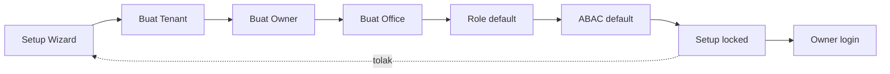
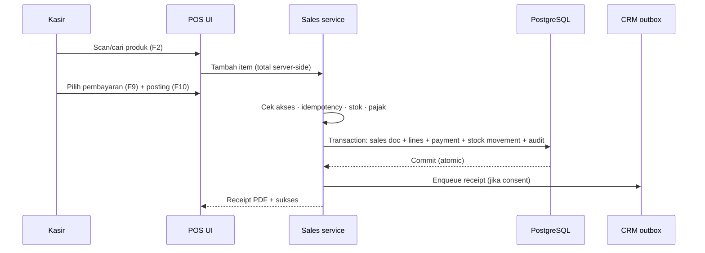
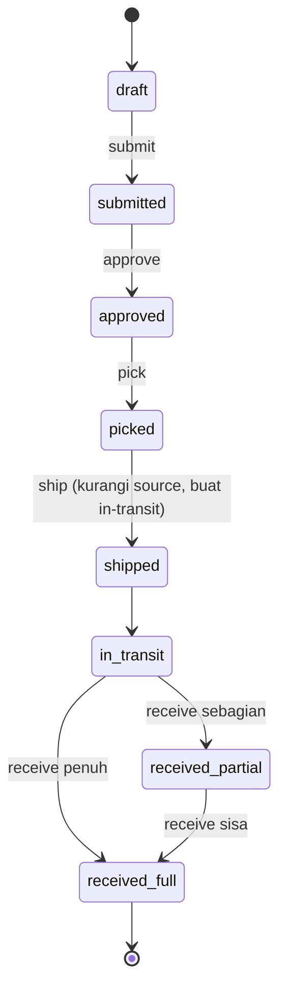
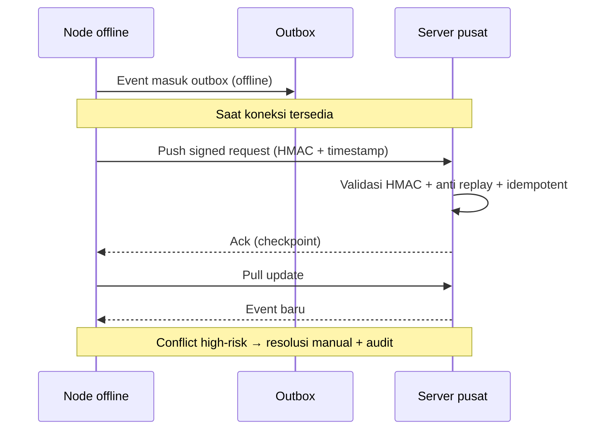

# Bagian 8 — SOP Operasional dan User Guide

> **Contoh domain (ilustratif).** Dokumen ini memakai domain retail/POS bergaya AWPOS sebagai contoh berjalan. **Pola & standar**-nya reusable untuk base AWCMS-Mini; **entitas, endpoint, layar, dan istilah domain** (produk, POS, gudang, pajak, CRM, AI, dsb.) adalah ilustrasi yang **diganti** oleh aplikasi turunan. Lihat [README paket dokumen](README.md) §Reusable vs domain turunan.

## Tujuan

Dokumen ini menjadi panduan operasional AWCMS-Mini untuk admin, owner, operator, petugas gudang, tax officer, CRM staff, customer, dan admin teknis.

## Prinsip operasional

1. Semua user memakai akun masing-masing.
2. Akun tidak boleh dipakai bersama.
3. Transaksi posted tidak diedit langsung.
4. Koreksi melalui cancel, retur, reversal, atau adjustment.
5. Aktivitas penting tercatat audit log.
6. Aktivitas high-risk membutuhkan approval.
7. Data customer/tax sensitif dimasking sesuai role.
8. Hapus master data memakai arsip/soft delete; restore/purge hanya untuk role berizin.
9. Backup harus diuji restore.
10. POS dapat berjalan offline.
11. Sync berjalan saat koneksi tersedia.

## SOP Instalasi awal

### Prasyarat minimum

| Komponen | Minimum             |
| -------- | ------------------- |
| CPU      | 2 core              |
| RAM      | 4 GB                |
| Storage  | 80 GB SSD           |
| OS       | Linux Mint / Ubuntu |
| Database | PostgreSQL          |
| Runtime  | Bun                 |

### Langkah development/local

```bash
git clone <repo-awcms-mini>
cd awcms-mini
bun install
cp .env.example .env
docker compose up -d postgres
bun run db:migrate
bun run api:spec:check
bun run build
bun run dev
```

### Checklist instalasi

- Repository berhasil di-clone.
- Bun terinstall.
- PostgreSQL aktif.
- `DATABASE_URL` benar.
- `.env` tidak masuk Git.
- Migration berhasil.
- Build berhasil.
- Health endpoint aktif.
- Log tidak menampilkan secret.

## SOP Setup Tenant Awal

Data yang disiapkan:

- Kode tenant.
- Nama tenant.
- Nama legal.
- Bahasa default.
- Theme default.
- Nama owner.
- Email owner.
- Password owner.
- Kode office.
- Nama office.
- Tipe office.

Alur:

```text
Setup Wizard → Tenant → Owner → Office → Role default → ABAC default → Setup locked → Owner login
```



Checklist:

- Tenant dibuat.
- Owner dibuat.
- Office dibuat.
- Role default dibuat.
- ABAC default dibuat.
- Setup locked.
- Owner login berhasil.

## SOP User, Role, dan Akses

### Role standar

| Role             | Fungsi                               |
| ---------------- | ------------------------------------ |
| Owner            | Akses penuh dan approval utama       |
| Admin            | Kelola sistem, produk, user, laporan |
| Kasir            | Transaksi POS                        |
| Manager          | Approval transaksi/stok/operasional  |
| Petugas Gudang   | Transfer, receiving, cycle count     |
| Inventory Staff  | Produk, stok, adjustment terbatas    |
| Tax Officer      | Pajak dan Coretax                    |
| CRM Staff        | Kontak dan receipt delivery          |
| Business Analyst | Laporan agregat dan AI analyst       |
| Auditor          | Audit trail read-only                |

### Tambah user

1. Login owner/admin.
2. Buka User & Access.
3. Tambah user.
4. Isi nama, email/username, nomor HP jika perlu, office default.
5. Pilih role.
6. Simpan.
7. Sistem membuat profile, identity, tenant user, assignment, audit log.

### Nonaktifkan user

1. Buka detail user.
2. Klik nonaktifkan.
3. Isi alasan.
4. Sistem menolak login user tersebut.
5. Token dapat dicabut sesuai kebijakan.
6. Audit log tercatat.

### Arsipkan dan pulihkan master data

Gunakan arsip/soft delete untuk produk, office/lokasi, profile/contact, channel, atau bin yang tidak dipakai. Jangan menghapus fisik data operasional harian.

1. Buka detail resource.
2. Pilih arsipkan/hapus.
3. Isi alasan.
4. Sistem menyembunyikan resource dari list default dan transaksi baru.
5. Sistem mencatat `deleted_at`, actor, alasan, dan audit log.
6. Untuk pulihkan, buka tampilan arsip, pilih restore, lalu sistem memvalidasi konflik kode/SKU/barcode dan permission.
7. Purge/anonymize hanya dilakukan untuk retention/legal oleh role berizin, biasanya melalui approval.

Larangan: jangan arsipkan transaksi posted, stock movement posted, audit log, security event, atau batch pajak exported; gunakan cancel/return/reversal/adjustment/status lifecycle.

## SOP Central Profile

### Resolve customer dari POS

1. Kasir memilih customer.
2. Masukkan WhatsApp/email.
3. Sistem normalisasi identifier.
4. Jika profile ada, gunakan existing.
5. Jika tidak ada, buat profile baru.
6. Transaksi memakai `customer_profile_id`.

### Merge profile duplikat

1. Admin buka Profile Governance.
2. Pilih source dan target profile.
3. Review identifier/transaksi/tax/CRM.
4. Buat merge request.
5. Supervisor approve.
6. Entity links dipindahkan ke profile canonical.
7. Source menjadi `merged`.
8. Audit tercatat.

Larangan: jangan merge hanya karena nama mirip; jangan merge tax-sensitive tanpa review.

## SOP Input Produk

Data yang disiapkan:

- SKU.
- Barcode.
- Nama produk.
- Kategori.
- Brand.
- Satuan dasar.
- Harga jual.
- Tracking type: none/lot/serial/lot_serial.
- Status.
- Profil pajak.

Langkah:

1. Login admin/inventory.
2. Buka Inventory → Produk.
3. Tambah produk.
4. Isi data.
5. Pilih tracking type.
6. Isi profil pajak jika perlu.
7. Simpan.
8. Audit tercatat.

### Arsipkan produk

- Produk yang diarsipkan tidak muncul di search/list default dan tidak bisa dijual.
- Produk yang pernah dipakai transaksi tetap ada untuk histori receipt/report.
- Restore produk wajib dicek konflik SKU/barcode dan profil pajak.

## SOP Input Stok Awal

### Tanpa WMS

1. Buka Inventory → Stok Awal.
2. Pilih office.
3. Pilih produk.
4. Isi quantity.
5. Alasan: saldo awal implementasi.
6. Sistem membuat stock balance dan movement `opening_balance`.

### Dengan WMS/bin

1. Buka Warehouse → Bin Balance.
2. Pilih warehouse, zone, bin.
3. Pilih produk.
4. Pilih lot/serial jika perlu.
5. Isi quantity.
6. Sistem memperbarui bin balance dan stock summary.

## SOP Transaksi Kasir

### Shortcut

| Shortcut | Fungsi               |
| -------- | -------------------- |
| F2       | Fokus search/barcode |
| F4       | Ubah quantity        |
| F6       | Diskon sesuai izin   |
| F8       | Hold transaksi       |
| F9       | Pembayaran           |
| F10      | Posting transaksi    |
| Esc      | Tutup dialog         |

### Alur transaksi operasional



### Transaksi normal

1. Login operator.
2. Buka POS.
3. Pastikan tenant/office/operator benar.
4. Scan/cari produk.
5. Ubah qty jika perlu.
6. Pilih customer jika perlu.
7. Pilih pembayaran.
8. Input nominal.
9. Posting.
10. Sistem validasi akses, stok, total, idempotency, pajak.
11. Sistem membuat transaksi, mengurangi stok, membuat receipt PDF.
12. Kirim receipt jika consent aktif.

### Jika stok tidak cukup

- Kurangi quantity.
- Hapus item.
- Hubungi admin/gudang.
- Jangan paksa stok minus tanpa policy/approval.

## SOP Hold, Cancel, Retur

### Hold

- Tekan F8.
- Isi catatan jika perlu.
- Checkout status `held`.
- Stok belum dikurangi.

### Cancel transaksi posted

1. Buka detail transaksi.
2. Request cancel.
3. Isi alasan.
4. Workflow dibuat.
5. Manager/owner approve/reject.
6. Jika approve, reversal/cancel record dibuat dan stok dikoreksi.

### Retur

1. Cari transaksi asal.
2. Pilih item retur.
3. Isi quantity.
4. Pilih kondisi: good/damaged/expired/wrong item.
5. Pilih lokasi/bin tujuan.
6. Sistem membuat return document dan movement `return_in`.

## SOP Warehouse Transfer

Status:

```text
draft → submitted → approved → picked → shipped → in_transit → received_partial/received_full
```



Langkah:

1. Buat transfer dari source ke destination warehouse.
2. Tambah produk, lot/bin, quantity.
3. Submit.
4. Approver review dan approve.
5. Petugas source ship.
6. Sistem mengurangi source dan membuat in-transit.
7. Destination receive.
8. Good masuk bin normal; damaged/expired masuk quarantine.
9. Sistem menambah stock destination dan audit.

## SOP Cycle Count dan Adjustment

1. Buat cycle count plan.
2. Pilih warehouse/zone/bin/product.
3. Assign petugas.
4. Petugas input counted qty.
5. Sistem hitung variance.
6. Variance menghasilkan adjustment request.
7. Manager approve/reject.
8. Jika approve, movement `adjustment` dibuat.

## SOP Receipt WhatsApp/Email

Prasyarat:

- Receipt PDF ada.
- Customer profile ada.
- Channel WhatsApp/email valid.
- Consent aktif.
- Provider configured.
- Jika provider butuh URL, PDF sudah online/R2.

Jika gagal:

- Cek channel.
- Cek consent.
- Cek file PDF/URL.
- Cek API key provider.
- Retry dari message outbox jika layak.

## SOP Customer Portal

Customer dapat:

- Buka receipt link.
- Lihat ringkasan transaksi.
- Download PDF.
- Update consent WhatsApp/email.

Jika link invalid, tampilkan pesan sederhana tanpa detail teknis.

## SOP Sync Offline-Online



Alur:

1. Node offline membuat event.
2. Event masuk outbox.
3. Saat online, node push signed request.
4. Server validasi HMAC.
5. Server process event dan ack.
6. Node update checkpoint.
7. Node pull update dari server.

Conflict high-risk diselesaikan manual dengan reason dan audit.

Soft delete disinkronkan sebagai tombstone event. Node offline harus menyembunyikan resource yang sudah menerima tombstone, tetapi tidak melakukan physical delete sebelum retention terpenuhi.

## SOP Pajak/Coretax

1. Setup tax profile tenant.
2. Setup NITKU/ID TKU office.
3. Setup party tax profile.
4. Setup product tax profile.
5. Generate VAT invoice dari sales posted.
6. Validate invoice.
7. Buat Coretax batch.
8. Approval jika policy aktif.
9. Generate XML dan checksum.
10. Audit export.

Catatan: AWCMS-Mini bersifat Coretax-ready/XML-ready, tidak mengasumsikan API upload resmi.

## SOP Backup/Restore

Backup:

```bash
pg_dump --format=custom --file=/backup/awcms_mini_$(date +%Y%m%d_%H%M%S).dump "$DATABASE_URL"
```

Restore test:

```bash
createdb awcms_mini_restore_test
pg_restore --dbname=awcms_mini_restore_test --clean --if-exists /backup/awcms_mini_YYYYMMDD_HHMMSS.dump
```

Validasi restore:

- Tenant/user/produk/stok/transaksi terbaca.
- Login test.
- POS smoke test.
- Report smoke test.

## Troubleshooting ringkas

### Aplikasi tidak bisa dibuka

- `systemctl status awcms-mini`
- `journalctl -u awcms-mini -n 100`
- Cek `.env`, database, disk, port.

### Database tidak terkoneksi

- `bun run db:pool:health`
- Cek PostgreSQL, DATABASE_URL, firewall, max connection, PgBouncer.

### Transaksi lambat

- Cek pool health.
- Cek slow query.
- Cek reporting berat.
- Cek sync batch besar.
- Cek disk I/O.

### Sync gagal

- Cek node ID.
- Cek HMAC secret.
- Cek jam server.
- Cek endpoint online.
- Cek conflict.

## Handover checklist

- README.
- Architecture guide.
- Deployment guide.
- Env guide.
- Migration guide.
- Backup restore SOP.
- Admin guide.
- Cashier guide.
- Warehouse guide.
- Tax guide.
- CRM guide.
- Security guide.
- Troubleshooting guide.
- API docs.
- Production readiness report.
